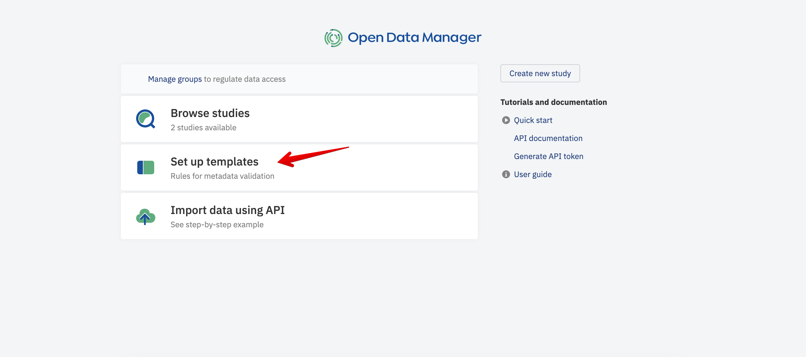
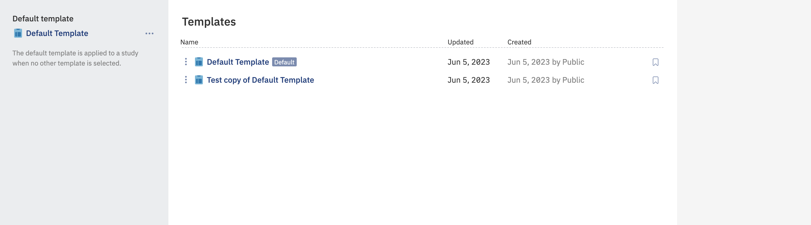
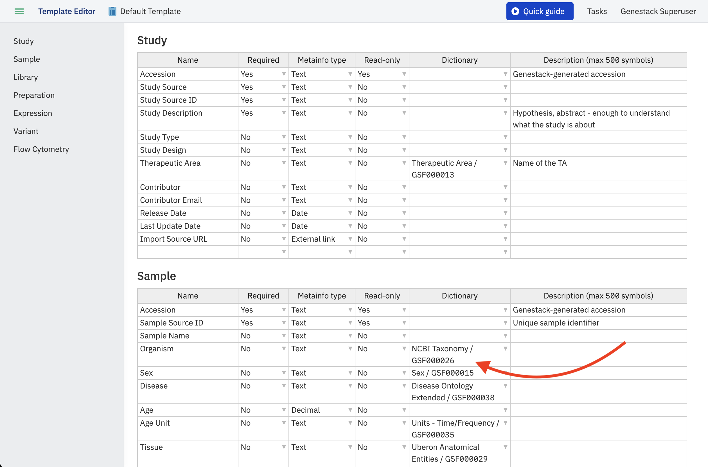
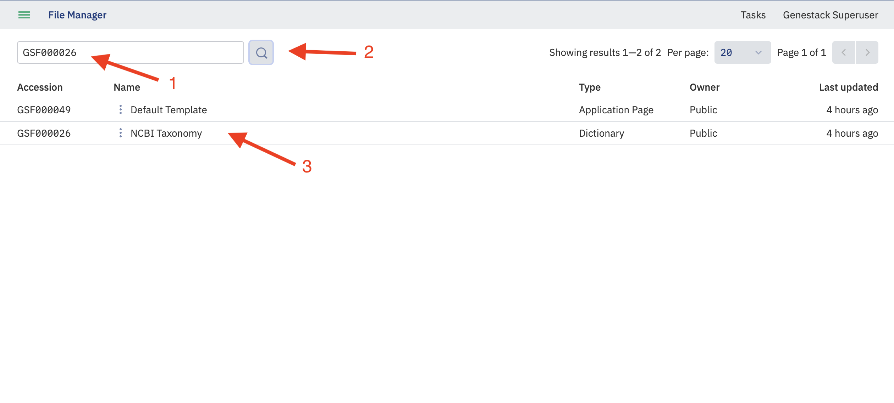
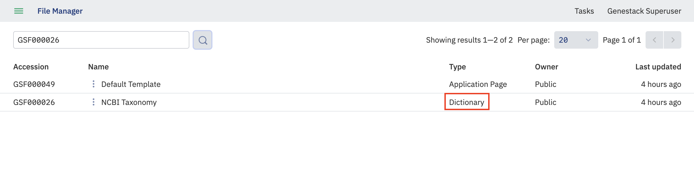
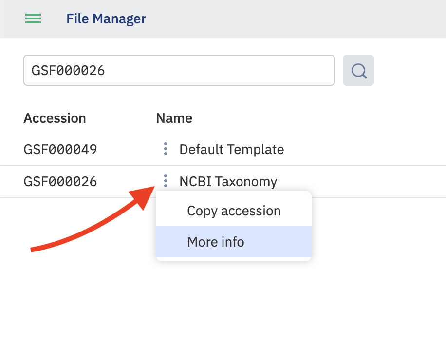
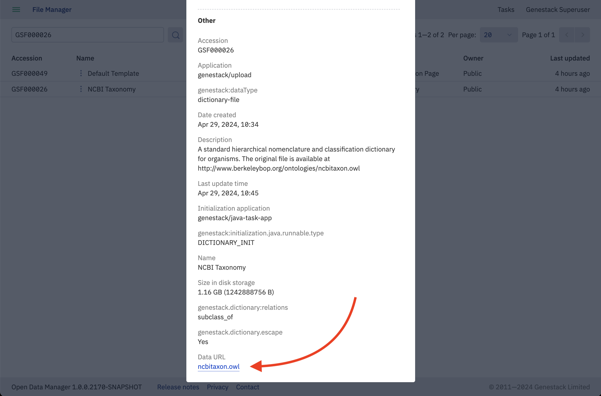
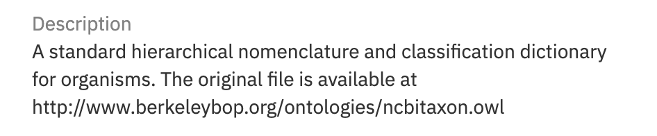

# Export an ontology from ODM

This guide explains how to retrieve the source file of an ontology (dictionary) that is loaded in ODM.

## Steps

1. From the Dashboard, open the Template Editor.

   

2. You will see all available templates.

   

3. To review the ontologies associated with a particular template, open it by clicking on its title.

   

4. You will see all attributes in the template, including those linked to dictionaries. Note the accession of the dictionary you want to export (for example, `GSF000026`).

5. Navigate to the File Manager using the direct link `[your_host]/ui/files`.

6. Enter the dictionary accession in the search field and click the search button. The results include both templates that use the dictionary and the dictionary file itself.

   

   To find the dictionary file specifically, look at the **Type** column and identify the row with type **Dictionary**.

   

7. Click the more menu on the dictionary row to open the context menu, then click **More info**.

   

8. In the details panel, click the link in the **Data URL** attribute to download the source file.

   

   Alternatively, follow the link in the description to go to the original source.

   

## Related

- [About dictionaries and ontologies](about-dictionaries.md)
