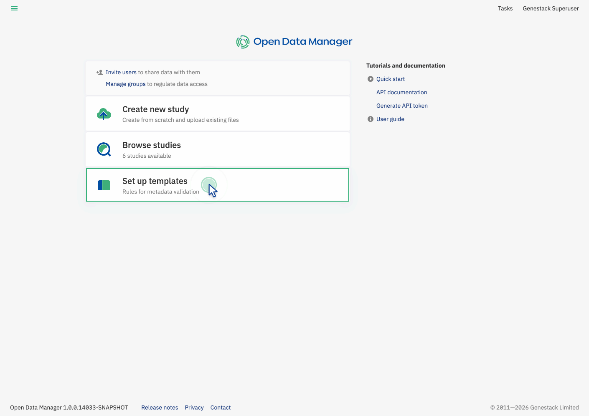
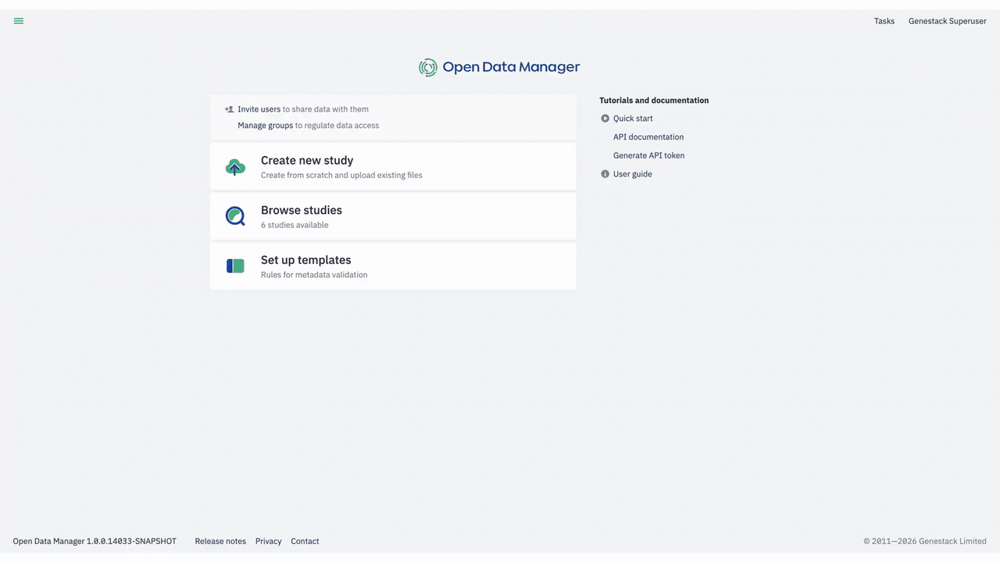
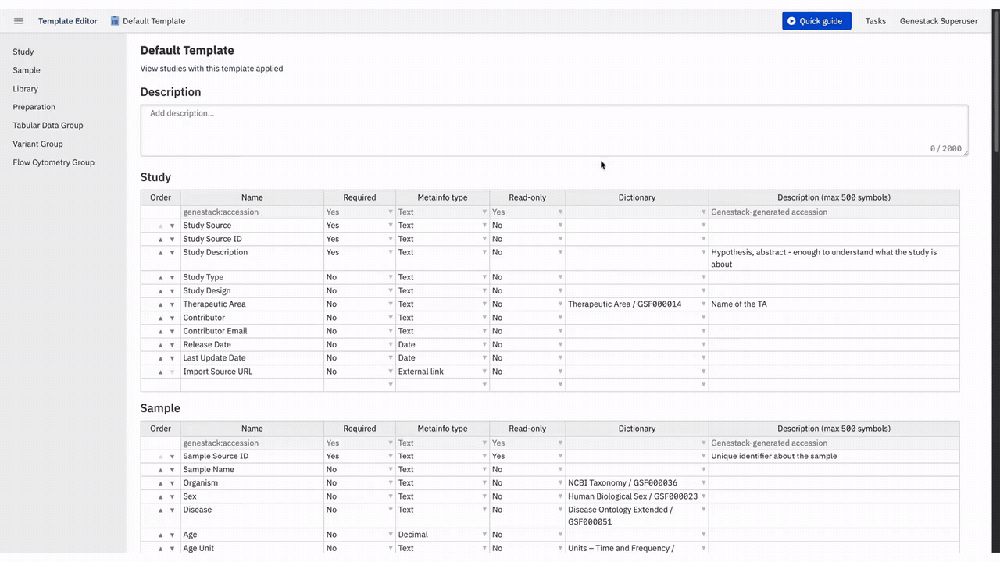
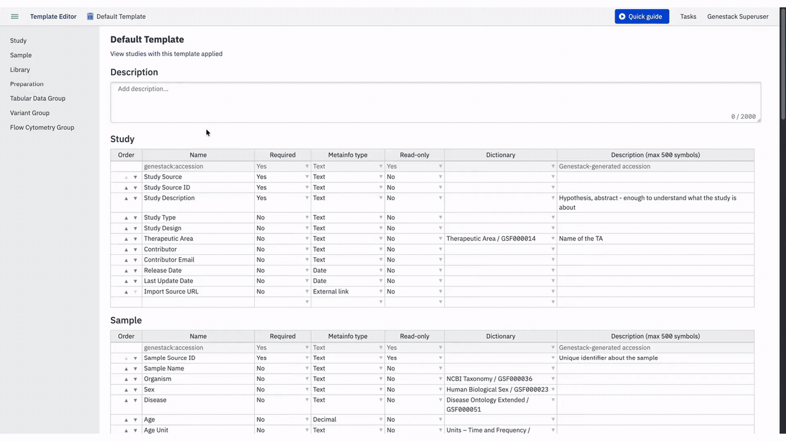
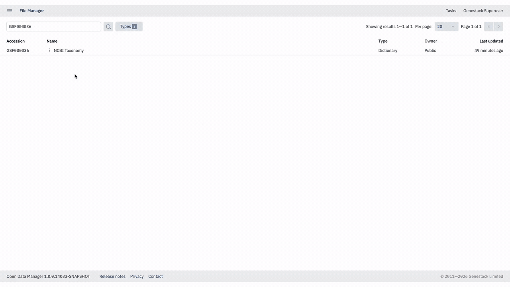

# Export an ontology from ODM

This guide explains how to retrieve the source file of an ontology (dictionary) that is loaded in ODM.

## Steps

1. From the Dashboard, open the Template Editor.

    {width=800}

2. You will see all available templates.

3. To review the ontologies associated with a particular template, open it by clicking on its title.

    {width=800}

4. You will see all attributes in the template, including those linked to dictionaries. Note the accession of the dictionary you want to export.

    {width=800}

5. Navigate to the File Manager.

6. Enter the dictionary accession in the search field and click the search button. Make sure that the Dictionary filter type is applied before searching.

    {width=800}

7. Click the more menu on the dictionary row to open the context menu, then click **More info**.

8. In the details panel, click the link in the **Data URL** attribute to download the source file. Alternatively, follow the link in the description to go to the original source.

    {width=800}

## Related

- [About dictionaries and ontologies](about-dictionaries.md)
