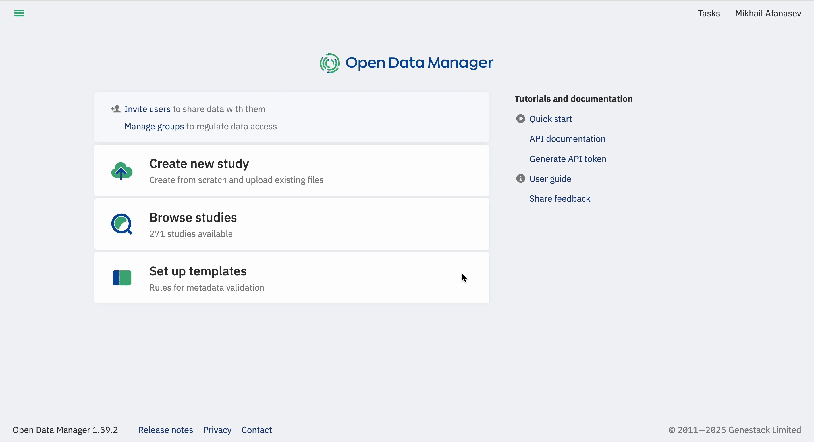
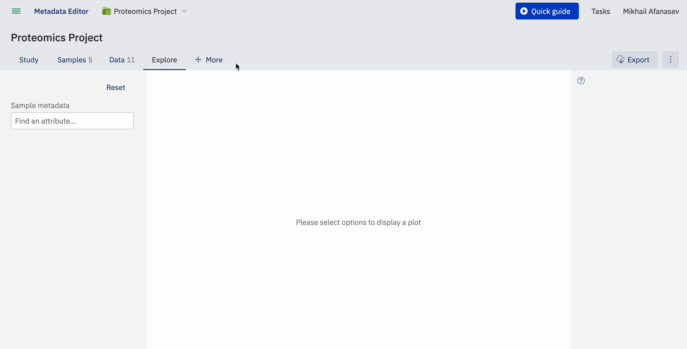
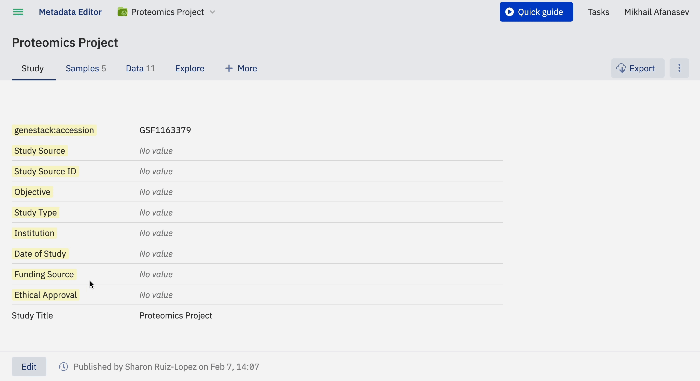

# Create a study

!!! info "Prerequisites"
    Creating and editing studies requires membership in the Curator group. See [Groups and roles](../overview/access-control/groups-and-roles.md).

## Create a study

1. Click **Create new study** on the main dashboard, or open the top-left menu and select **Create New Study**.

2. Assign a descriptive name to your study.

3. Select a template. Templates define the metadata structure and validation rules for the study. You can create your own template, and there is no limit on the number of templates you can use.

    !!! tip "Understanding templates"
        For background on what a template is and how it works, see [About templates](templates/about-templates.md). For a full reference of template fields and options, see [Template reference](templates/template-reference.md).

4. Click **Create**.

## After creation

Once you click **Create**, ODM generates the study and opens it in the Metadata Editor, ready for you to start adding metadata. For an orientation to the editor (its tabs and what each one holds), see [Metadata Editor](../overview/navigating-the-ui/metadata-editor.md).

## Accession number

ODM automatically generates a unique accession number for every study (for example, `GSF1102568`). You use this accession number to identify the study and reference it in API operations.

## Edit study metadata

1. Select the tab containing the field you want to update and click **Edit** at the bottom left of the page.
2. Select the field you want to modify and type the new value.
3. Click **Publish** to save the changes. When the publish dialog appears, you can customise the version label before confirming.

---

To import data into your study, see [Import data](import-data/index.md). To use the API instead, see [ODM API > Contribute](../odm-api/contribute/index.md).
