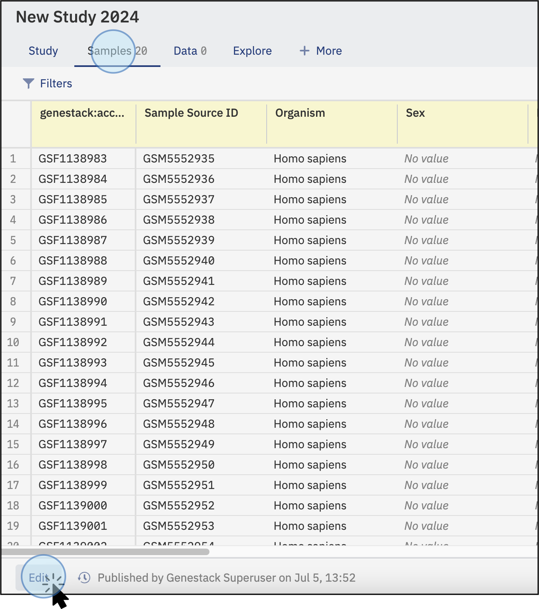
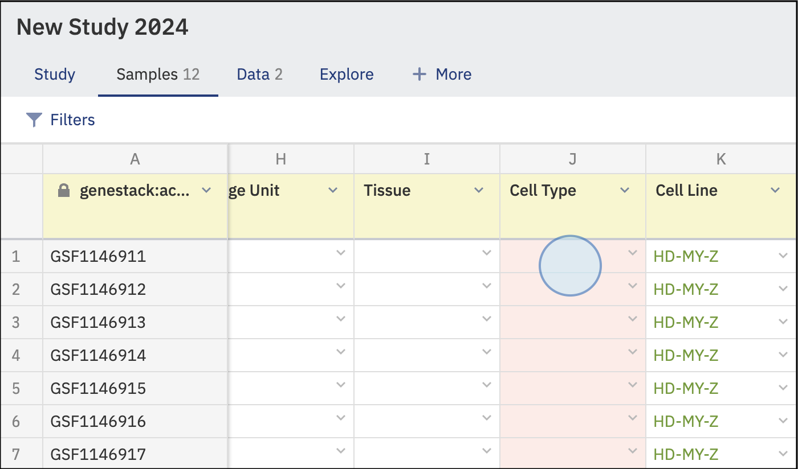
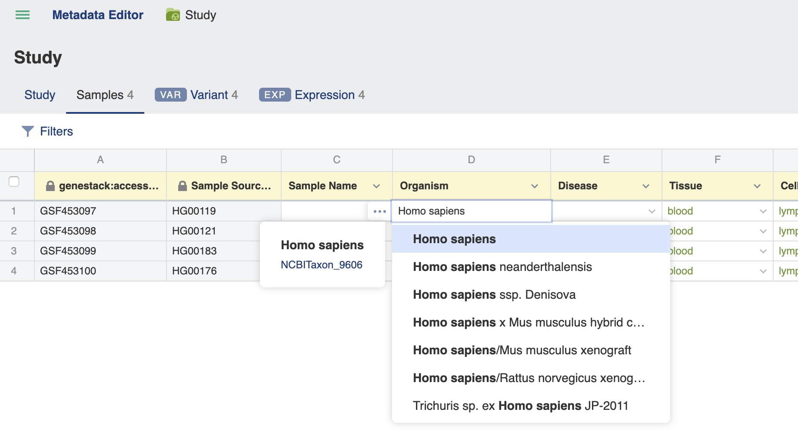
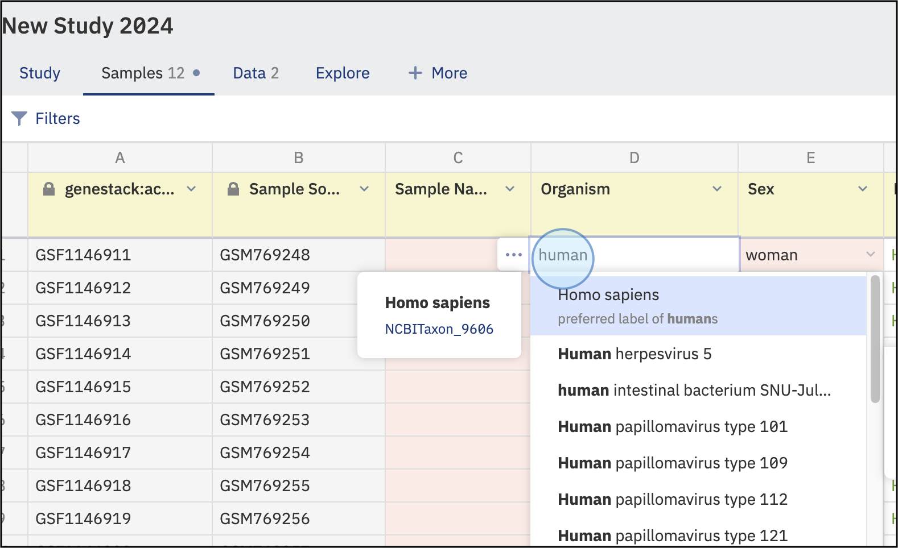
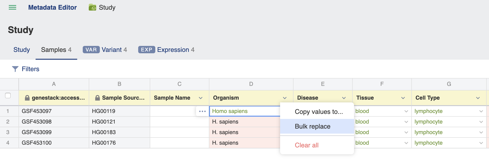
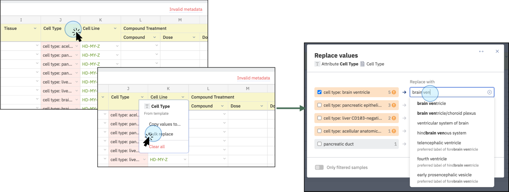
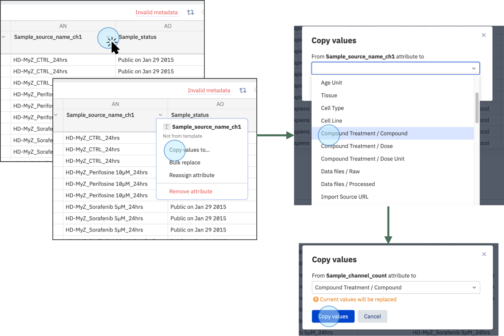
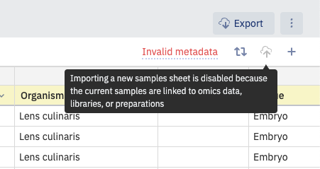
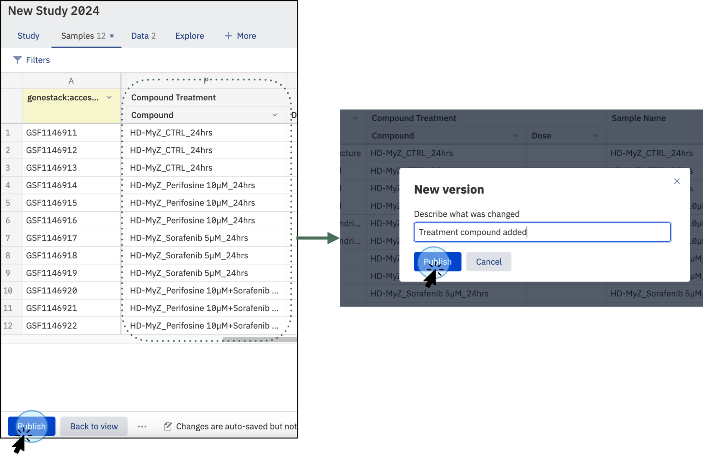

# Edit and validate metadata

This guide walks you through editing sample metadata in the Samples tab and resolving validation issues flagged by an applied template. For background on how validation works and what templates enforce, see [About validation and curation](about-validation-and-curation.md). For a description of the Metadata Editor interface itself, see [Navigating the UI: Metadata Editor](../../overview/navigating-the-ui/metadata-editor.md).

## Prerequisites

- You are a member of the Curator group.
- The study has metadata imported and an applied template.

## Steps

### 1. Open the study and enter Edit mode

Navigate to the study in the Study Browser and open it in the Metadata Editor. Click the **Samples** tab to view sample metadata.

To make changes, click **Edit** in the bottom-left corner of the window.

<figure markdown="span">

<figcaption>Navigate to the <strong>Samples</strong> tab and click <strong>Edit</strong> at the bottom of the screen to begin curation.</figcaption>
</figure>

Once in Edit mode, invalid fields are highlighted in red. Data will be highlighted in green only if the column is linked to a dictionary and the value is recognised as matching a dictionary term; in all other cases, valid data is not highlighted.

<figure markdown="span">

<figcaption>Invalid data that does not follow the template rules is highlighted in red. Values matching a dictionary term are highlighted in green.</figcaption>
</figure>

### 2. Correct a field manually

Click the field you want to change and type a new value. When all fields in a tab have been corrected, the **Invalid metadata** flag in the upper-right corner is replaced with a green **Metadata is valid** flag.

### 3. Use autocomplete for dictionary-controlled fields

For fields that have a dictionary or ontology specified in the template, click the arrow next to the field or start typing, and autocomplete suggestions from the associated dictionary appear. Selecting a recognised term turns it green.

<figure markdown="span">

<figcaption>Type a corrected value. Preferred labels based on dictionaries are suggested. For example, the preferred label for <strong>human</strong> is <strong>Homo sapiens</strong>.</figcaption>
</figure>

### 4. Propagate a value across multiple cells

To fill a range of cells with the same value, drag the bottom-right corner of a cell downward across the rows you want to populate.

### 5. Bulk replace values in a column

To replace multiple values at once, click a column header and select **Bulk replace** from the drop-down list.

The **Replace values** window opens. Type or select the new value. If the field is controlled by a dictionary, autocomplete suggestions appear. Click **Replace in…** to apply.

If a filter is active (see step 7), you can choose to replace values only for the samples that match the filter rather than all samples in the tab.

<figure markdown="span">

<figcaption>Correct values in bulk by selecting the new name (suggested values from the dictionary will display). Select and apply changes to replace values in the selected cells. For example, change <strong>cell type: brain ventricle</strong> to <strong>brain ventricle</strong>. The change applies to all cells where the values are found.</figcaption>
</figure>

### 6. Copy values to another column

To copy values from one column into another, click the source column header and select **Copy values to…**. Choose the target column and click **Copy values**. If the target column already contains data, a confirmation prompt appears before overwriting.

<figure markdown="span">

<figcaption>Click <strong>Copy values to...</strong>, select the target column, then click <strong>Copy values</strong>. If the column already contains data, a notification will appear.</figcaption>
</figure>

### 7. Filter samples by metadata

To narrow the list of samples shown (for example, to work only with samples from a particular organism), click **Filters** in the upper-left corner. A metadata summary appears listing each field, its distinct values, and the count of samples per value. You can start typing a value to narrow the suggestions. Click **Apply** to apply the filter.

Only samples matching the filter are shown in the Samples tab. With a filter active, bulk replace operations can be scoped to the filtered samples only.

### 8. Use special values

The values "Not applicable" and "Not recorded" always pass validation regardless of template rules. When entered, they are displayed in italics to distinguish them from ordinary metadata values.

### 9. Resolve invalid metadata via the Validation Summary

If the **Invalid Metadata** flag is shown in the upper-right corner, click it to open the **Validation Summary** pop-up. The summary lists every invalid field and its current value. Click any value in the list to open the **Replace values** window directly for that field, so you can type the corrected value and apply it.

### 10. Import metadata from a spreadsheet

Instead of editing field by field, you can import updated metadata from a TSV file. In the Samples tab, click the **Import** icon in the upper-right corner and select a local TSV file containing the metadata you want to associate with the imported files.

!!! abstract "Import blocked by existing links"
    You cannot import a new sample sheet if the current samples are linked to omics data, libraries, or preparations.

    

### 11. Publish your changes

When you are satisfied with the edits, click **Publish** at the bottom-left of the page to save the current state as a new version. You can customise the version name at this point.

<figure markdown="span">

<figcaption>Click <strong>Publish</strong> to save your edits as a new version. Customise the version name in the dialog.</figcaption>
</figure>

For more on working with versions, see [Manage metadata versions](../version-metadata/manage-metadata-versions.md).
