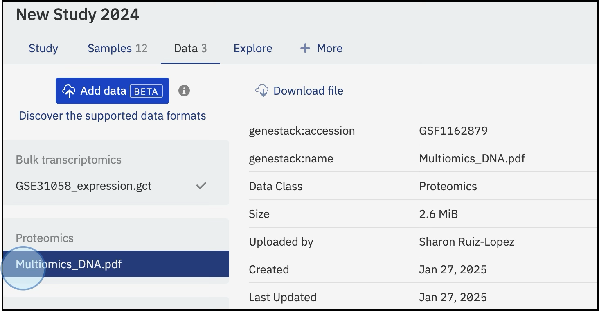

# Attach supplementary files to a study

You can supplement a study with additional research materials (PDFs, XLSX, DOCX, PPTX files, images, and more) by attaching them directly to the study. Attachments differ from imported or linked data: they are not associated with sample metadata or experimental data, and their contents are not indexed for search. Attached files are searchable only by their metadata and Data Class. They serve as a home for complementary materials such as budget reports, manuscripts, presentations, and logos, keeping all your research in one place.

For a full description of what counts as an attached file and which formats are supported, see [Attached files](../../overview/supported-data-formats/attached-files.md). To understand how attaching a file differs from importing experimental data, see [Attached files vs. imported data](attached-vs-imported-data.md).

For the API equivalent of this workflow, see [Import attached files via API](../../odm-api/contribute/import-data/import-attached-files.md).

## Steps

1. Open the study and navigate to the **Data** tab.
2. Click **Add data** and select **Attach a file**.
3. Select a **Data class** for the file from the list. If your preferred class is not listed, choose **Other**. For a reference of available Data Classes, see [Data Classes reference](../../overview/data-model/data-classes-reference.md).
4. You can attach any file format, such as PDF, PNG, DOCX, and so on.
5. Click **Select file...** and choose the file from your local computer.

Once you select the file, the upload begins automatically. The upload time depends on the size of the file.

<figure markdown="span">

<figcaption>Assign a Data class to the attached files. The files will be uploaded (upload time will depend on the size of the files)</figcaption>
</figure>

## After the upload

Once the upload completes, the file appears on the **Data** tab under its Data Class section (for example, under *Proteomics* if you selected that class).

<figure markdown="span">

<figcaption>Once attached or linked, files will be shown on the Data tab under their specific category, e.g., <strong>Proteomics</strong></figcaption>
</figure>
