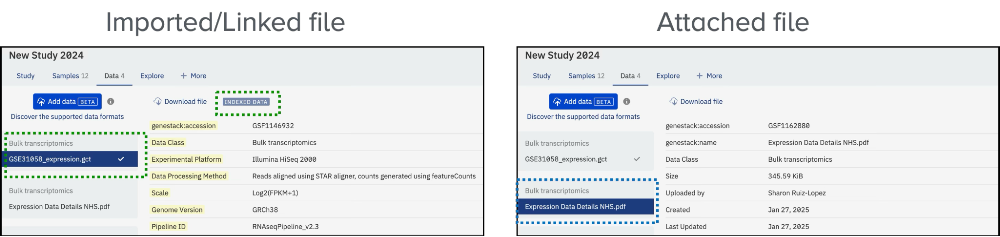

# Attached files vs. imported data

Attached files and imported experimental data both appear on a study's **Data** tab, but ODM treats them very differently. Understanding the distinction helps you decide which route to use when you add material to a study.

When you import a file as experimental data, ODM indexes its contents and makes them searchable within the platform. The file appears under the relevant data type tab with a tick symbol and the **Indexed Data** legend to indicate successful indexing.

Attached files, by contrast, are not indexed or searchable by content. They appear in the same Data tab under the relevant section with their associated metadata, but without the indexing indicators. For example, a GCT file imported as experimental data will be listed under **Bulk Transcriptomics** as indexed data; a manuscript in PDF format attached to the same study will appear under the **Bulk Transcriptomics** section as an attached file, with relevant metadata but no content indexing.

<figure markdown="span">

<figcaption>Users can specify the type of data they are attaching or importing. The files will be automatically recognised as <strong>Indexed data</strong> or <strong>Attached files</strong></figcaption>
</figure>
