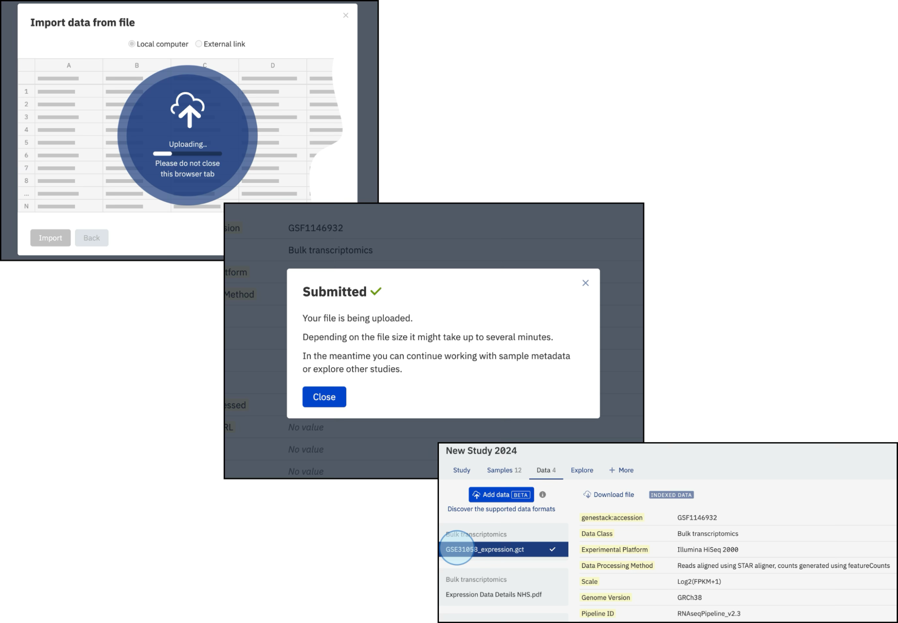

# Import experimental data

This page explains how to upload experimental data (such as bulk transcriptomics, proteomics, gene variants, and more) to a study in ODM via the UI.

!!! info "Before you begin"
    - Sample metadata must already be imported. See [Import sample metadata](import-sample-metadata.md).
    - Your data file must be in a supported format. See [Supported data formats](../../overview/supported-data-formats/index.md).
    - Know your data's Data Class. See [Data classes reference](../../overview/data-model/data-classes-reference.md).

## Steps

1. Open your study and click the **Data** tab.

    

2. Click **Add data**.

    

3. Select the **Data class** for your data, then click **Next**. If your data type isn't listed, select **Other**.

    

4. Select your data file from your local computer or external storage.

    

5. Confirm or adjust the linking attribute. By default, ODM links data to samples using the **Sample Source ID** column. You can select a different linking column (such as **Library ID** or **Preparation ID** for data linked to libraries or preparations), but only template attributes are valid as linking attributes.

    !!! warning "Only template attribute can be used as a custom linking attribute."

    

    The files are scanned for a matching link column and upload begins automatically.

    

## After upload

After uploading, you can populate the file metadata. Each uploaded data file has five mandatory read-only fields:

- `genestack:accession`
- `Data Class`
- `Features (string)`
- `Features (numeric)`
- `Value (numeric)`

These fields make the file content searchable. Do not edit them in the Template Editor. Doing so can make the files inaccessible.

## Important notes

!!! note "Multiple measurements per sample"
    If your file contains multiple measurements per sample (or library, or preparation), such as fold change and p-value, ODM recognises this automatically based on three criteria: each column name must contain a separator symbol that divides the sample name from the measurement type (for example, a dot in `Sample1.p-value`; if multiple separators are present, the first is used); that separator must be explicitly specified during upload via the UI or API; and all column names must include the separator. Measurement types must also be consistent across all samples. For example, if you have three samples each with intensity and quality-pass measurements, your file should contain columns such as `Sample1.Intensity`, `Sample1.QualityPass`, `Sample2.Intensity`, `Sample2.QualityPass`, and so on.

!!! note "Number of feature attributes"
    If your file has more than one feature column, specify the count during upload. See [TSV format](../../overview/supported-data-formats/tsv.md) for details.

!!! note "Allow re-importing the same file"
    This option lets you re-upload a file from external storage using the same link. It is only needed when uploading from external storage such as AWS S3; enabling it for local file uploads is unnecessary.

!!! warning "Failed uploads"
    If a file cannot be processed, ODM displays an error message describing the problem. Files with upload errors remain visible for seven days before automatic deletion.

For the API equivalent, see [Import expression data via API](../../odm-api/contribute/import-data/import-expression-data.md).
