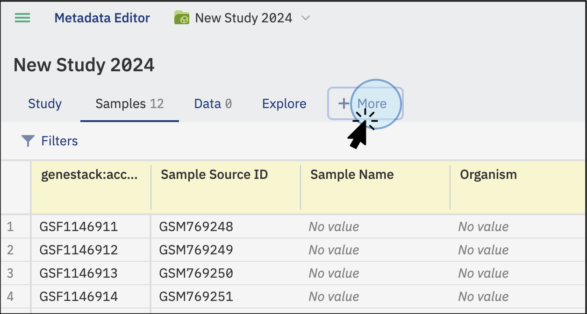

# Import libraries and preparations

In addition to sample metadata, you can import Libraries and Preparations metadata to enrich your study with experimental detail.

## Before you begin

Your sample metadata must already be imported into the study before you add libraries or preparations. See [Import sample metadata](import-sample-metadata.md) if you haven't done this yet.

Your library and preparation files must be in TSV format. See [TSV format](../../overview/supported-data-formats/tsv.md) for format requirements.

Each file must include the following linking columns for ODM to recognise and connect the data:

- **Sample Source ID**, required in all files (samples, libraries, and preparations)
- **Library ID**, required in library files
- **Preparation ID**, required in preparation files

## Steps

1. Open your study and click the **+More** tab to reveal the Libraries and Preparations options.

   

2. To add libraries, click **Libraries** and select your TSV file from your local computer. To add preparations, click **Preparations** and select your TSV file from your local computer.

   

   

3. ODM links the imported data to sample metadata via the **Sample Source ID** column. Once the data is recognised and linked, the new metadata tabs display the added data.

   

   

---

For the API equivalent, see [Import libraries metadata via API](../../odm-api/contribute/import-data/import-libraries-metadata.md) and [Import preparations metadata via API](../../odm-api/contribute/import-data/import-preparations-metadata.md).
