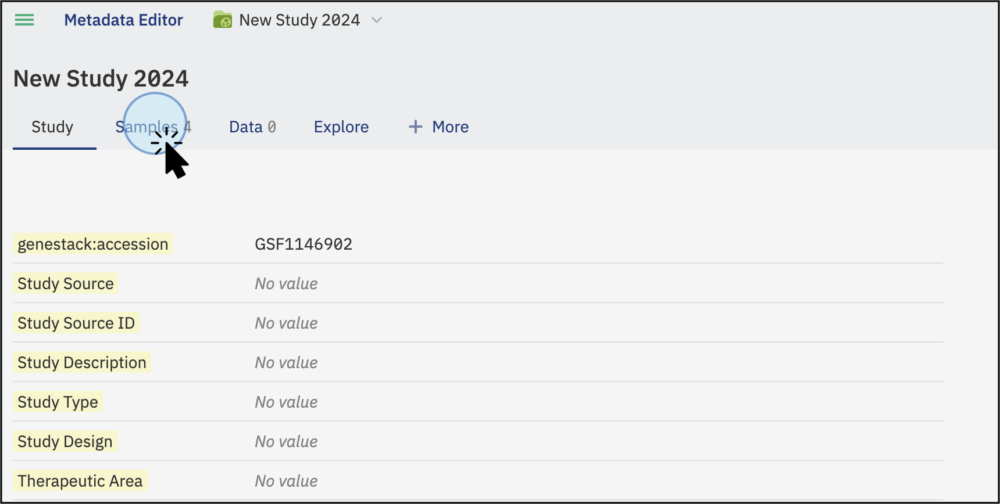
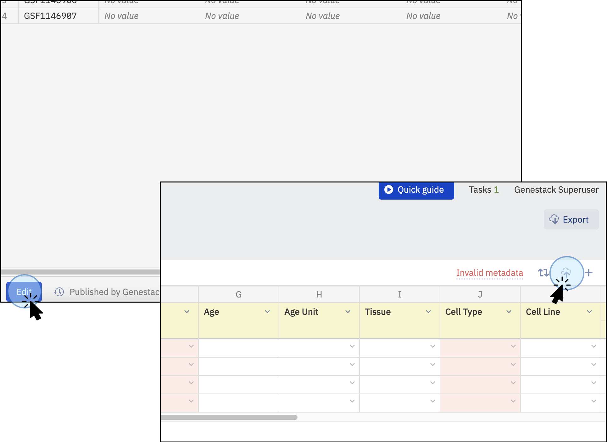
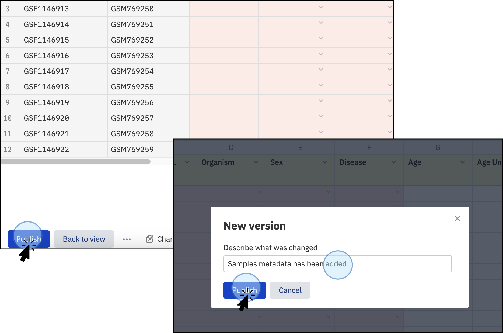
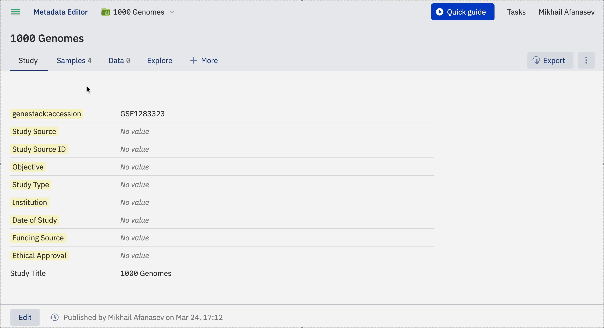

# Import sample metadata

This page explains how to import sample metadata into an existing study using the ODM UI.

!!! info "Before you begin"
    - You need a study. See [Create a study](../create-a-study.md).
    - The study should not have previously uploaded sample metadata linked to experimental data, because re-uploading creates an additional group. See [Objects and groups](../../overview/data-model/objects-and-groups.md) for details.
    - Your sample metadata must be in TSV format. See [TSV format](../../overview/supported-data-formats/tsv.md) for format requirements including mandatory columns (**Sample Source** and **Sample Source ID**).

## Example TSV file

[samples.tsv](../../assets/sample-data/samples.tsv) is a tab-delimited file of sample attributes that you can use as a reference.

| Sample Source ID | Sample Name       | Organism     | Disease                | Sex    | Age | Age Unit | Tissue         | Cell Line | Compound Treatment / Compound | Compound Treatment / Dose | Compound Treatment / Dose Unit | Replicate Number |
|------------------|-------------------|--------------|------------------------|--------|-----|----------|----------------|-----------|-------------------------------|---------------------------|--------------------------------|------------------|
| SMPL-001         | HeLa_Control_Rep1 | Homo sapiens | endocervical carcinoma | female | 31  | years    | uterine cervix | HeLa      | dimethyl sulfoxide            | 0.1                       | percent                        | 1                |
| SMPL-002         | HeLa_Control_Rep2 | Homo sapiens | endocervical carcinoma | female | 31  | years    | uterine cervix | HeLa      | dimethyl sulfoxide            | 0.1                       | percent                        | 2                |
| SMPL-003         | HeLa_Control_Rep3 | Homo sapiens | endocervical carcinoma | female | 31  | years    | uterine cervix | HeLa      | dimethyl sulfoxide            | 0.1                       | percent                        | 3                |
| SMPL-004         | HeLa_Doxo_Rep1    | Human        | endocervical carcinoma | female | 31  | years    | uterine cervix | HeLa      | doxorubicin                   | 1                         | microlitre                     | 1                |
| SMPL-005         | HeLa_Doxo_Rep2    | Homo sapiens | endocervical carcinoma | female | 31  | years    | uterine cervix | HeLa      | doxorubicin                   | 1                         | microlitre                     | 2                |
| SMPL-006         | HeLa_Doxo_Rep3    | Homo sapiens | endocervical carcinoma | female | 31  | years    | uterine cervix | HeLa      | doxorubicin                   | 1                         | microlitre                     | 3                |

## Steps

1. Open your study and click the **Samples** tab.

    

2. Click **Edit** at the bottom left of the sample table.

3. Click the cloud icon at the top right of the sample table to upload a tabular file. You can upload sample metadata from any experiment (flow cytometry, gene variant, transcriptomics) as long as the file is in TSV format.

    

4. In the popup, click **Select tsv file...** and choose your file. Alternatively, instead of browsing for the file, you can drag it from your file manager and drop it onto the popup.

5. Once the file is recognised, click **Import**.

    

6. Click **Publish** to save the changes.

7. In the popup, enter a description for this version, for example, "Sample metadata has been added."

    

---

To import libraries and preparations, see [Import libraries and preparations](import-libraries-and-preparations.md).

To import sample metadata via the API instead, see [Import sample metadata via API](../../odm-api/contribute/import-data/import-sample-metadata.md).
