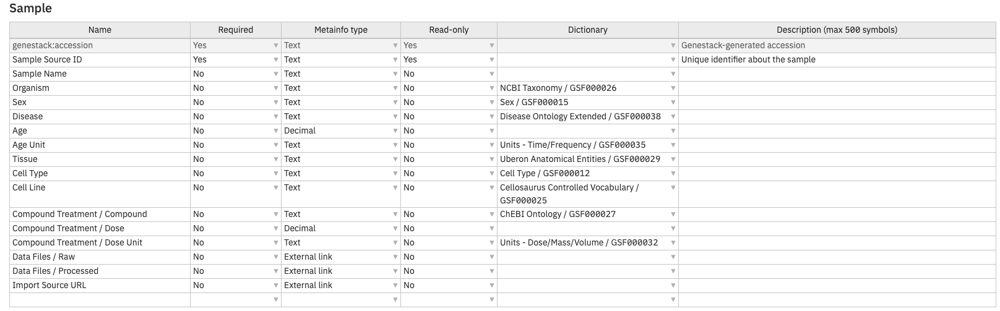

# About templates

A template controls the metadata attributes associated with a data object in ODM. A separate template applies to each object type: Study, Sample, Expression, Variant, and Flow cytometry. By defining which metadata fields exist, what values they accept, and which are mandatory, templates ensure that terms and values are harmonized and validated consistently across the platform.

## Template attributes

Each template is made up of metadata attribute definitions. Every attribute carries the following properties:

- **Name**: the name of the metadata field to be included in the metainfo (e.g., "Accession", "Organism").
- **Required**: determines whether the field is mandatory. If a required field is left blank or filled in incorrectly, it is highlighted in red.
- **Metainfo type**: the data type for the field: text, integer, decimal, date, yes/no, or external link.
- **Read-only**: represents editing permissions; when set to "yes", the metadata field cannot be edited.
- **Dictionary**: specifies a dictionary that provides standardized, unified terms for data curation, helping to validate and harmonize metadata values.
- **Description**: a description of the attribute shown during curation as a hint.

## Validation and data quality

In the context of data curation, validation refers to the process of ensuring that metadata fields conform to the predefined rules and standards set by a template. This process is essential for maintaining the integrity, consistency, and reliability of data within ODM. When a template enforces required fields and controlled vocabularies through dictionaries, it makes datasets more findable and supports consistent search and curation across the platform.

## Mandatory technical fields

Every template includes a set of mandatory technical fields that ODM requires regardless of how you configure the remaining attributes. See [Template file format reference](template-reference.md) for the full list.

---

**See also**

- [Template Editor](../../overview/navigating-the-ui/template-editor.md), UI orientation for the Template Editor.
- [Create and edit a template](create-and-edit-a-template.md), step-by-step instructions for building and modifying templates.
- [Change a study's template](change-a-studys-template.md), how to assign a different template to a study.
- [Template file format reference](template-reference.md), complete reference for the template file format and mandatory fields.
- [ODM SDK template how-tos](../../api-libraries/odm-sdk/templates/create-or-update-a-template.md), working with templates programmatically via the SDK.
