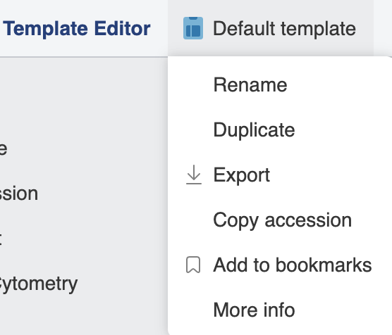
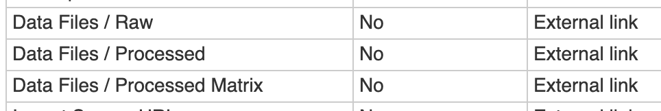

# Create and edit a template

This guide explains how to create a new template by duplicating an existing one and how to edit its attributes in the Template Editor.

## Prerequisites

You need the **Set up templates** permission to create or edit templates. See [Permissions](../../overview/access-control/permissions.md) for details.

## Open the Template Editor

From the Dashboard, click **Set up templates**, or click the three-line menu in the top-left corner and select **Template Editor**. See [Template Editor](../../overview/navigating-the-ui/template-editor.md) for orientation.

## Create a new template via duplicate

You cannot create a template from scratch, but you can duplicate any existing template to produce an editable copy.

1. In the Template Editor, click the name of the template you want to use as a starting point.
2. Select **Duplicate** from the dropdown menu.

    

3. Rename the duplicate to reflect its intended purpose.
4. Edit its attributes as needed (see the next section).

## Edit attributes

With a template open for editing, you can add, modify, or remove attributes. When specifying an attribute's dictionary, use the autocomplete feature to find the appropriate dictionary term. This ensures the attribute will validate correctly in the Metadata Editor.

When you have finished making changes, save the template.

## Group metadata fields under a common header

You can nest related attributes under a shared header by using the `/` character in the attribute name. Everything before the `/` becomes the group header; everything after becomes the field name within that group. For example, naming two attributes `Treatment/Compound` and `Treatment/Dose` groups them both under a **Treatment** header in the Metadata Editor.

## Mandatory technical fields

Some fields are grayed out and cannot be edited or removed. These are mandatory technical fields required by the platform. See [Template reference](template-reference.md) for the full list.

## Further reading

- For the JSON template file format used by the ODM SDK, see [Template reference](template-reference.md) and [Create or update a template](../../api-libraries/odm-sdk/templates/create-or-update-a-template.md).
