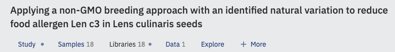

# About Metadata Versioning

Metadata versioning is a feature that tracks changes to metadata through a publish/draft model. When it is enabled on an ODM instance, every publish action creates a new, numbered version of the metadata for that tab, and the description you provide at publish time is preserved alongside it. This gives you a complete, auditable history of how a study's metadata has evolved.

## View mode and Edit mode

When versioning is enabled, the Metadata Editor operates in one of two modes: View and Edit.

View mode is the default. In this mode no changes to the metadata can be made, and the samples table displays more rows without pagination, making it easier to browse large datasets.

Edit mode is available to curators only. In Edit mode, curators can change metadata values freely. Changes are saved on the fly, but they are held in a draft (an unpublished copy) rather than immediately becoming the current version. A tab that contains unpublished metadata is marked with a blue dot, so it is easy to see at a glance which tabs have pending changes.

Only curators can see unpublished metadata. Non-curators continue to see the most recently published version until a curator explicitly publishes the draft. Curation work happens in Edit mode. See [About Validation and Curation](../curate-metadata/about-validation-and-curation.md) and [Edit and Validate Metadata](../curate-metadata/edit-and-validate-metadata.md) for details.

## When a version is created

Each publish action creates a new version. Publishing applies only to the tab that is currently open; Study, Samples, and so on are versioned independently. When you publish, ODM prompts you to enter a description of the changes; that description is stored with the version and visible in the change history.

## What versioning tracks

Versioning tracks metadata field values on a per-tab basis. It also tracks structural changes to sample objects: creating new samples, deleting sample rows, and importing a samples table from a local file all produce unpublished changes that must be published before non-curators can see them.

For the full set of actions available when working with versions (including viewing the change history, restoring a previous version, and discarding a draft), see [Manage Metadata Versions](manage-metadata-versions.md).
