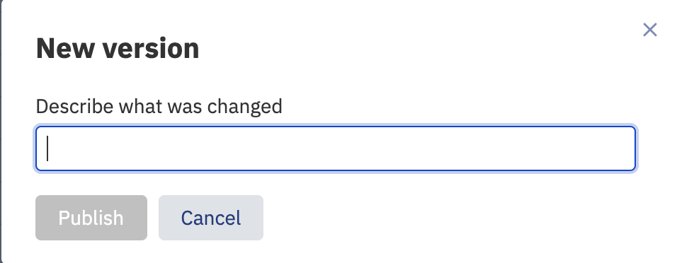
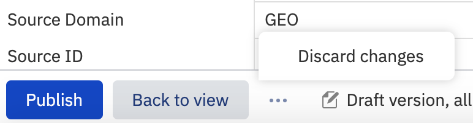
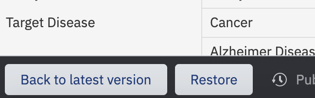

# Manage metadata versions

This page covers how to publish, discard, and restore metadata versions in the Metadata Editor. For background on how versioning works and what the draft/published states mean, see [About metadata versioning](about-metadata-versioning.md).

## Prerequisites

- You must be a member of the Curator group.
- The study must be open in the Metadata Editor with the relevant tab in Edit mode.

## Publish a new version

When you are ready to make your changes visible to other users, publish the current tab.

1. Make your changes in the Metadata Editor. ODM saves them automatically as a draft.
2. Click **Publish** at the bottom of the tab.
3. Enter a description of the changes in the dialog that appears.

Publishing affects only the tab you are currently on: Study, Samples, or another metadata tab. Changes on other tabs remain unpublished until you publish each one separately.

## Discard unpublished changes

If you want to abandon your draft before publishing, you can discard it.

1. Click the three-dot menu at the bottom of the screen.
2. Select **Discard changes**.

This removes all draft changes for the current tab. The tab reverts to the most recently published version.

## View change history

Both curators and non-curators can view the version history of a metadata tab.

1. Click the clock icon in the bottom-left of a metadata tab.

ODM displays a list of versions with their change descriptions and authors.

## Restore a previous version

Curators can restore any version from the history list as the new latest version.

1. Click a version in the history list. The Metadata Editor updates to show the metadata from that version.
2. Review the metadata to confirm it is the state you want to restore.
3. Click **Restore** to commit it as the new latest version.

If you decide not to restore, click **Back to latest version** to return to the current published version without making any changes.

Restoring a previous version does not delete the versions that came after it. ODM creates a new latest version as a copy of the version you selected, so the full history remains intact.

For guidance on editing and validating metadata during curation, see [Edit and validate metadata](../curate-metadata/edit-and-validate-metadata.md).
