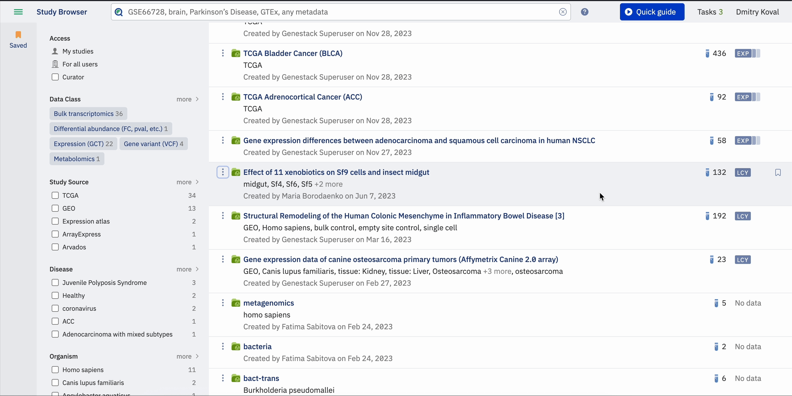
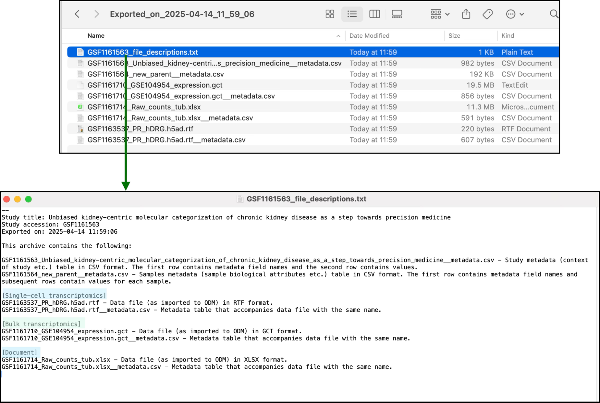
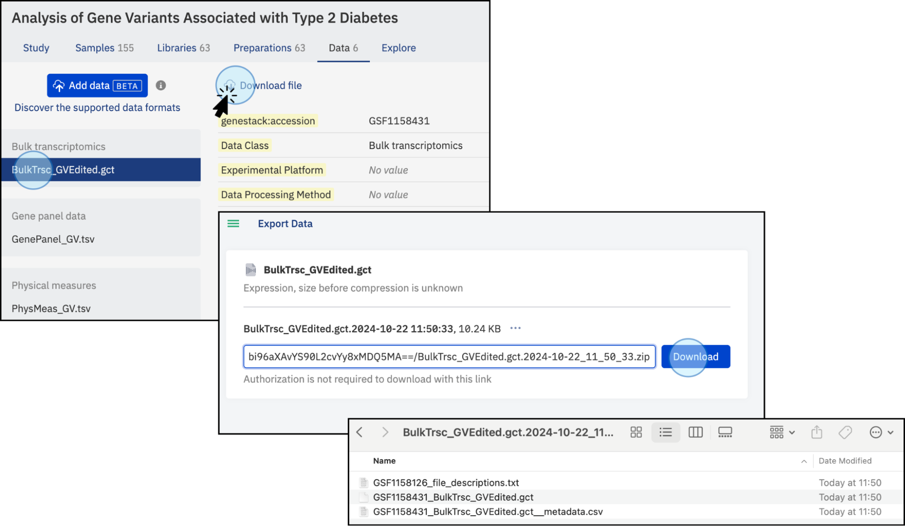

# Export your data

Download a full study or an individual dataset from ODM to your local computer.

## Export a full study

You can initiate an export from two places in the UI:

1. **Study Browser**: open the three-dot menu to the left of the study name and select **Export data**.

   

2. **Metadata Editor**: inside your study, click the **Export** button on the right side of the window. Alternatively, click the study title to reveal a dropdown menu containing the export option, or open the three-dot menu next to **Export** on the right side of the screen.

   

Clicking **Export data** opens a new window where all files associated with the study are compressed. Once compression is complete, the download button becomes active and you can download the files to your local computer. The link is pre-authenticated, so anyone with the link can download the study and its associated data. Previous export links are listed at the bottom of the window; these are archived versions that reflect the data at the time the link was generated, not necessarily the latest version.

!!! warning

    If some externally stored data is inaccessible due to its removal from the original external storage (the link to the storage is invalid), the study cannot be exported.

## Downloaded contents

The downloaded folder contains all linked and attached files related to the study. It also includes a plain text file named **file_descriptions** that summarises the information of the downloaded files.

## Export a specific dataset

This functionality is only available from the **Data** tab. Navigate to the Data tab containing the dataset you want, then click the **Download file** button. Note that it is not currently possible to export only sample metadata or study metadata separately. The dataset, along with its corresponding metadata and description, is compressed into an archive and made available via a download link.

