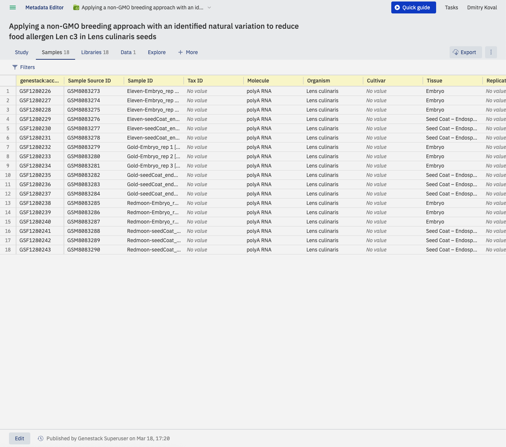
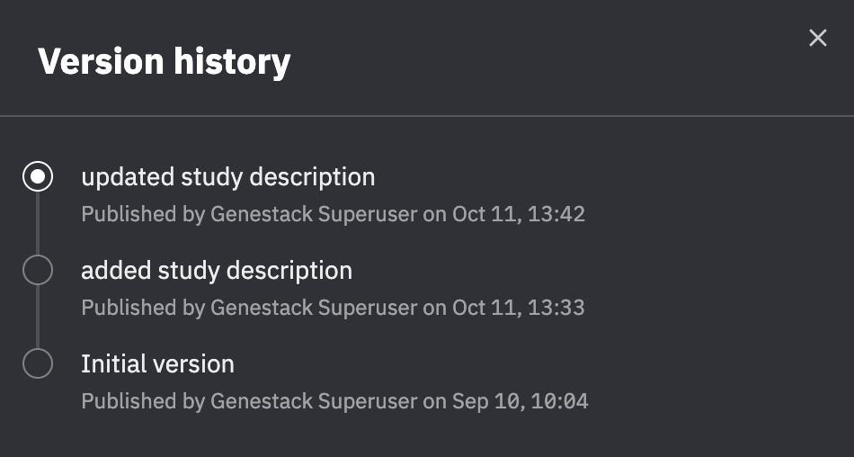

# Browse study metadata

View a study's metadata in the Metadata Editor without making any changes.

1. Open a study from the Study Browser. The Metadata Editor opens in View mode by default. In View mode you can browse the **Study**, **Samples**, and **Data** tabs but cannot edit metadata.

    

2. Navigate to the **Samples** tab to see the metadata describing each sample in the study, for example organism, cell line, or disease. Columns derived from the applied template are highlighted in yellow.

3. To filter the samples shown by a metadata value, click **Filters** in the upper-left corner. A panel appears showing each metadata field together with its available values and the number of samples for each value.

    

    Type a value to narrow the list of suggestions. For example, type "H. sapiens" to surface only that checkbox.

    

    Select the checkboxes you want, then click **Apply**.

    

    Only the matching samples are now shown in the Samples tab.

    

4. To browse previous published versions and view the change history, click the clock icon at the bottom of any metadata tab.

    

    A list of versions and their change descriptions appears.

    

!!! note

    Only curators can switch to Edit mode to modify metadata. For editing, see [Curate and validate metadata](../contribute/curate-metadata/edit-and-validate-metadata.md).
