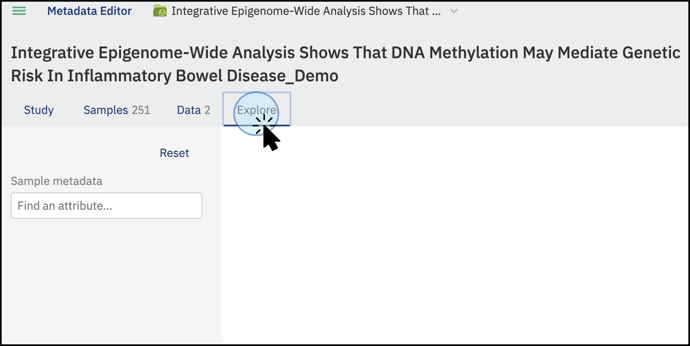
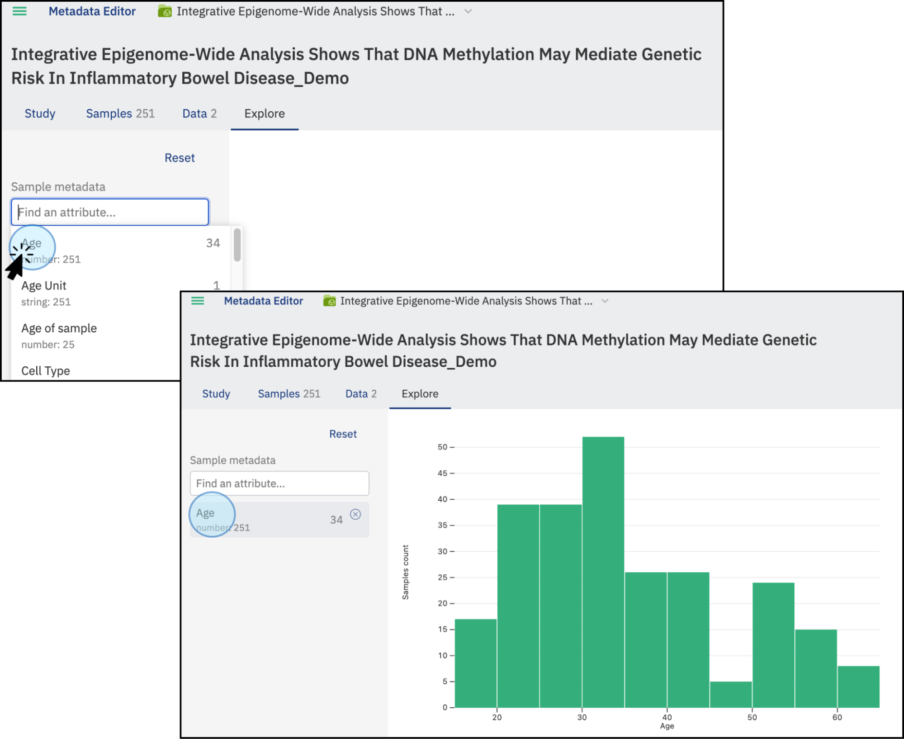
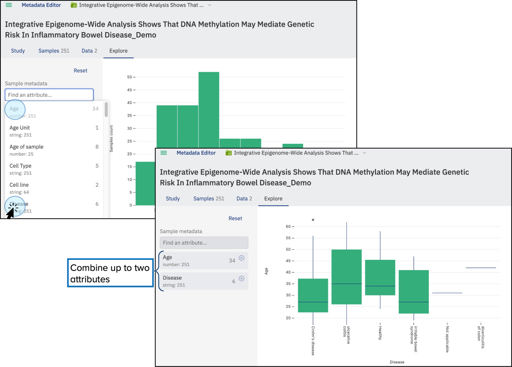
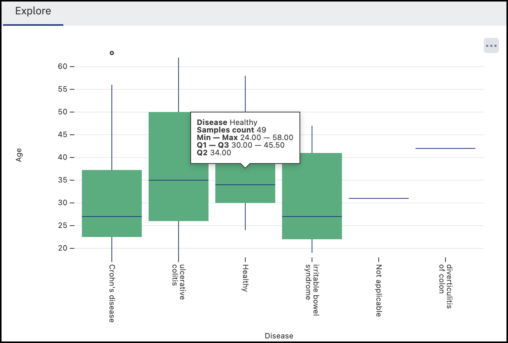
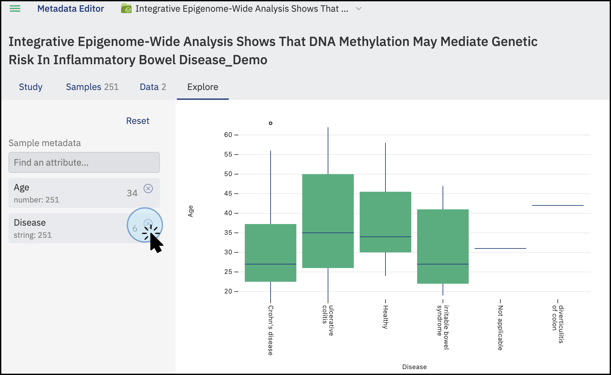
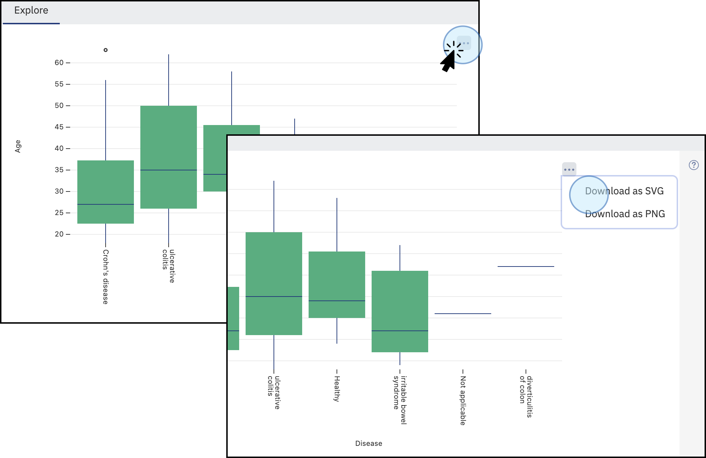

# Explore sample data visually

Visualise the sample metadata in a study to spot patterns and cross-examine attributes, all within the Explore tab.

The Explore tab generates different plot types depending on the attributes you select: bar plots and category plots for string (categorical) attributes, and histograms, scatter plots, and box plots for numeric (continuous) attributes. You can combine up to two attributes at a time to cross-examine your data.

1. Open a study and click **Explore**.

    

2. Select an attribute to display, for example **Age**. Each attribute in the list is labelled with its type (`string` or `numeric`) and the total number of unique values it contains. A plot appears showing the values for the selected attribute.

    

3. To combine a second attribute, select it from the menu. You can combine up to two attributes at a time. The combined plot displays additional information such as sample count and the minimum and maximum values.

    

    

4. To remove an attribute from the comparison, click the :material-window-close: at the top right corner of the attribute in the list. To remove all attributes at once, click **Reset**.

    

5. To export a plot, hover over the top right corner of the plot. A three-dots menu :material-dots-horizontal: appears. Select **SVG** or **PNG** to download the plot in your preferred format.

    

!!! note

    ODM automatically filters empty and invalid values from the visualisation based on validation rules, so only valid data points are shown in the plots.
