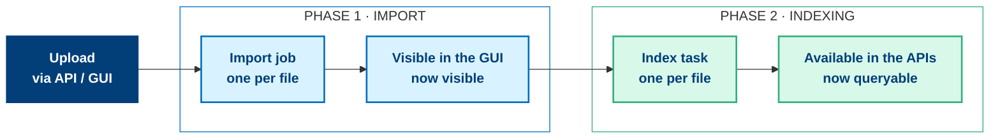
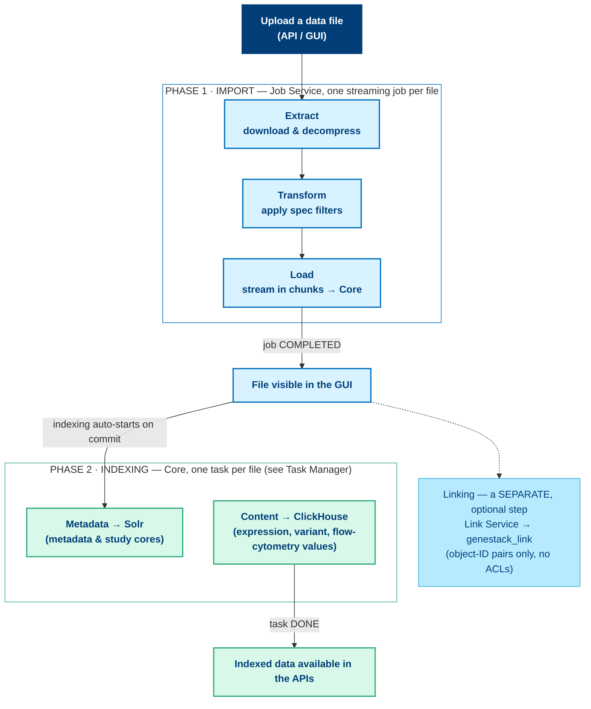

# How data files are uploaded, imported, and indexed in ODM

Getting a data file into ODM and making it usable is a two-phase process, and the
two phases are independent. This page explains what happens in the background when
you upload a data file, and why the distinction between the phases matters when
something goes wrong. 
## The one idea to take away first

Getting a data file into ODM is **two independent phases**, not one:

1. **Import**: the file is loaded into ODM and becomes **visible in the GUI**.
   This is driven by a **job**.
2. **Indexing**: the file's contents are processed so they become
   **searchable and queryable through the APIs**. This is driven by a **task**.

The consequence is the single most common point of confusion:

!!! warning "Visible in the GUI is not the same as available via the APIs"
    A file can be fully imported (you can see it in the GUI) while it is still
    indexing, or while its indexing has *failed*. Being visible does **not** mean
    it is searchable or queryable through the search and data APIs.

Each phase has its own progress, its own tracking surface, and, importantly,
its own definition of "failed". Keeping the two apart is the key to
understanding, and troubleshooting, the upload pipeline.

## Terminology: "job" vs "task"

These two words are not interchangeable in ODM. They refer to different objects,
managed by different components, with different lifecycles and status names.

| | **Job** | **Task** |
|---|---|---|
| **What it does** | Imports one data file (ETL load) | Indexes one data file (makes it searchable) |
| **Phase** | Phase 1 — Import | Phase 2 — Indexing |
| **Managed by** | Job Service (`func-job`) | Core |
| **Identified by** | `jobExecId` (a numeric execution ID) | Task accession |
| **Tracked via** | Jobs REST API endpoints | **Task Manager** in the GUI |
| **State stored in** | `func_job` database | Solr `tasks` core |
| **Status vocabulary** | `STARTING`, `RUNNING`, `COMPLETED`, `FAILED`, … | `QUEUED`, `RUNNING`, `DONE`, `FAILED`, … |

When the **Application** column in the Task Manager reads "Genestack jobs REST
API", that names the application that *initiated* the work; it does not mean the
rows you see are jobs. The rows are **indexing tasks**.

## Phase 1: Import (the job)

An import is initiated either by API users calling the ODM REST API or by GUI users working through the data import
screens in the web application. Both paths converge on the same mechanism: the
**Job Service** (`func-job`) creates one **job execution** to load the file.

### One job per file

Every data file you submit becomes its **own** job execution, with its **own**
`jobExecId`. If you import ten files, you get ten jobs that run and succeed or
fail independently.

!!! note "Linking is a separate process from import"
    Associating an imported file with a study or metadata object (say, an
    expression matrix with its samples) is **not** part of the import job. It is
    a separate call to the **Link Service**.

### What the job actually does: a streaming ETL pipeline

The import job is an **ETL (Extract → Transform → Load)** pipeline that processes
the file as a *stream of chunks* rather than loading it all into memory at once.
This is what lets ODM ingest very large files.

1. **Extract**: the source file is downloaded (via the Rclone storage gateway
   when it lives in external or object storage) and decompressed on the fly as it
   streams in.
2. **Transform**: each record is passed through the filters defined by the
   import specification.
3. **Load**: records are batched into chunks and delivered to the Applications
   container, which writes them into ODM through Core. Processing state is carried
   across chunks so the pipeline can pick up where it left off.

Because the work is chunked and streamed, a large import progresses
incrementally. A job sitting at `RUNNING` for a long time on a big file is
normal, not a sign of a hang.

### Tracking a job

API users poll a job by its `jobExecId`. Two endpoints carry everything you need;
they are documented in full in
[Manage import jobs](../../odm-api/contribute/import-data/manage-import-jobs.md).

| Endpoint | Returns |
|---|---|
| `GET /api/v1/jobs/{jobExecId}/info` | Job status, name, create/end times, exit status |
| `GET /api/v1/jobs/{jobExecId}/output` | The job result, plus any errors |

A job moves through the following lifecycle, the values you may see in the
`status` field. The full enumeration lives in the
[Job status codes reference](../../odm-api/reference/job-status-codes-reference.md).

| Status | Meaning |
|---|---|
| `STARTING` | Job is being prepared to run |
| `RUNNING` | ETL pipeline is actively processing the file |
| `STOPPING` / `STOPPED` | Job is being / has been stopped |
| `COMPLETED` | File was imported successfully |
| `FAILED` | The import did not complete (see *What "failed" means*) |
| `ABANDONED` | Job was left incomplete (for example, a server restart mid-run) |
| `UNKNOWN` | State could not be determined |

When a job reaches `COMPLETED`, the file object and its metadata have been written
into ODM (the `genestack` database) and the file is now **visible in the GUI**,
the milestone the diagrams mark at the end of Phase 1. At this moment the
file exists, but it is **not yet searchable or queryable through the data APIs**.
That is Phase 2.

## Phase 2: Indexing (the task)

Indexing is not something you trigger yourself. As soon as the import is
committed, Core automatically schedules indexing for the affected files.
Internally this happens on transaction commit, so indexing begins the moment the
imported data is durably saved.

### One task per file

Each data file is indexed under its **own background task**, and these tasks are
what appear in the **Task Manager** in the GUI, one row per file, each with its
own status.

Indexing is visible in the web interface through the **Task Manager**, reached
from the **Tasks** indicator next to your username in the top-right corner; its
badge counts the tasks that are in progress or need attention. For each task the
Task Manager shows:

| Column | Meaning |
|---|---|
| **Application** | The application that initiated the work (e.g. "Genestack jobs REST API") |
| **File** | The data file being indexed |
| **Accession** | The file's ODM accession (e.g. `GSF1030142`) |
| **Status** | The task's current state (see below) |

A task progresses through this lifecycle:

| Status | Terminal? | Meaning |
|---|---|---|
| `CREATED` | no | Task created, not yet started |
| `QUEUEING` / `QUEUED` | no | Waiting in the system queue / for dependencies |
| `STARTING` | no | Accepted by the system, not yet running |
| `RUNNING` | no | Actively indexing |
| `DONE` | **yes** | Indexing completed successfully |
| `FAILED` | **yes** | Indexing failed for this file |
| `BLOCKED_BY_DEPENDENCY_FAILURE` | **yes** | Did not run because a task it depended on failed |
| `KILLED` | **yes** | Stopped by an external cause (e.g. an administrator) |

A task is finished only when it reaches a **terminal** status. The "Failed" rows
in the Task Manager are tasks that ended in `FAILED`.

### Where the data actually goes

"Indexing" is not a single destination. What gets written where depends on the
file type:

- **Metadata → Solr.** Every file's high-level metadata is indexed into the Solr
  `metadata` core, and study-centric metadata into the Solr `study` core. This is
  what powers search, filtering, and faceting across files and studies.
- **Expression / variant / flow-cytometry *content* → ClickHouse.** Some data
  types contain large numeric matrices: expression matrices (e.g. GCT files),
  variant calls (VCF), and flow-cytometry data. For these, the actual values are
  streamed into **ClickHouse** (the `genestack` ClickHouse database, which is a
  *different* store from the MySQL database of the same name). These uploads run
  asynchronously and only proceed once a ClickHouse write permission is granted,
  so Core controls the write rate.
- The Solr `data` core supports field-level search *within* certain data files,
  and the `tasks` and `dictionary` cores back the Task Manager and metadata term
  suggestions respectively.

This split is why expression-heavy files are the ones you most often see taking
time, or failing, at the indexing stage: their content is being written to
ClickHouse, not just having a few metadata fields indexed in Solr.

When a file's indexing task reaches `DONE`, the file is fully indexed and its
contents are now **available through the APIs**: searchable in Solr-backed
queries and, for expression data, streamable from ClickHouse for export (after
Core authorises the request).

## What "failed" means

Because there are two phases, there are two distinct kinds of failure. They mean
different things and are diagnosed in different places.

### A failed **job** (Phase 1: import)

A job ends in `FAILED` when a step of the ETL pipeline does not complete
successfully: for example, the file could not be parsed, a row did not match the
expected format, or the source could not be read.

You see it through the jobs REST API: `GET /api/v1/jobs/{jobExecId}/info` shows
`status = FAILED` and an exit status, while `GET /api/v1/jobs/{jobExecId}/output`
returns the captured errors, each with the **stage** (which step failed), the
**reason** (an error code or message), and the underlying exception **stack**. A
failed job means the file was **not** imported: it will not appear in the GUI, and
there is nothing to index.

One special case looks alarming but is benign. If the Job Service is restarted
while a job is running, that job is marked `FAILED` with an exit status of
`INCOMPLETE` and a reason such as *"Abandoned due to Server Restart."* This
indicates an interrupted run, not a problem with your file.

The pipeline does **not** silently retry a failed import step. There is a small
automatic retry only at the moment of *starting* a job, to ride out transient
concurrency conflicts; a genuinely failed job has to be **restarted explicitly**.

### A failed **task** (Phase 2: indexing)

A task ends in `FAILED` when indexing a file does not complete: for example, the
content could not be written to ClickHouse, or metadata extraction errored.

You see it in the **Task Manager** (the "Failed" status on the file's row), and
each task carries **stdout** and **stderr** output streams that hold the failure
detail. A failed task means the file **was imported** (it is visible in the GUI)
but it is **not** fully searchable or queryable through the APIs. Searches may
return it with incomplete data, or its expression data may be unavailable for
export.

A task shown as `BLOCKED_BY_DEPENDENCY_FAILURE` never ran, because something it
depended on failed first; the fix belongs upstream, not on this task. Indexing is
otherwise fairly resilient: the low-level Solr metadata indexing retries
transient errors internally, with backoff, before a task is considered failed, so
a `FAILED` indexing task usually reflects a real, persistent problem with that
file rather than a momentary glitch.

### Why the distinction matters

When a user reports *"my data is missing / not showing up in search"*, the first
question is **which phase failed**:

- **Not visible in the GUI at all** → the **import job** failed (Phase 1). Look at
  the job via the jobs REST API.
- **Visible in the GUI but missing or incomplete in search or export** → the
  **indexing task** failed (Phase 2). Look at the file's task in the Task Manager.

## End-to-end summary

In sequence: an import is initiated via the API or GUI; the **Job Service** runs
**one streaming ETL job per file**, tracked through
`GET /api/v1/jobs/{jobExecId}/info` and `…/output`; on `COMPLETED` the **file is
visible in the GUI** (linking to metadata or study objects, if needed, is a
**separate** call to the **Link Service**); Core then **automatically** schedules
**one indexing task per file**; indexing writes **metadata to Solr** and
**expression / variant / flow-cytometry content to ClickHouse**, tracked in the
**Task Manager**; and on task `DONE` the **data is available through the APIs**.

## Quick reference

### Reading the system by symptom

| You observe | Phase | Where to look |
|---|---|---|
| File never appears in the GUI | Import (job) | Jobs REST API: `…/info` for status, `…/output` for errors |
| Import seems stuck | Import (job) | Job `status` — `RUNNING` on a large file is normal (streamed in chunks) |
| File visible, but missing from search results | Indexing (task) | Task Manager — find the file's task status |
| Expression data won't export / is empty | Indexing (task) | Task Manager + ClickHouse-bound indexing task for that file |
| Task shows `BLOCKED_BY_DEPENDENCY_FAILURE` | Indexing (task) | Find and fix the upstream failed task |
| Link between objects not resolving | (separate) | Link Service / `genestack_link` — not part of import or indexing |

### Status cheat-sheet

- **Job (import):** `STARTING` → `RUNNING` → `COMPLETED` (success) or `FAILED` /
  `ABANDONED` (problem).
- **Task (indexing):** `CREATED` → `QUEUED` → `RUNNING` → `DONE` (success) or
  `FAILED` / `BLOCKED_BY_DEPENDENCY_FAILURE` / `KILLED` (problem).

## Related pages

- [About the import workflow](../../odm-api/contribute/import-data/about-the-import-workflow.md),
  the import-then-link pattern, by entity type, via the REST API.
- [Importing data in the web interface](../../contribute/import-data/index.md),
  the GUI path through the same pipeline.
- [Manage import jobs](../../odm-api/contribute/import-data/manage-import-jobs.md)
  and the
  [Job status codes reference](../../odm-api/reference/job-status-codes-reference.md).
