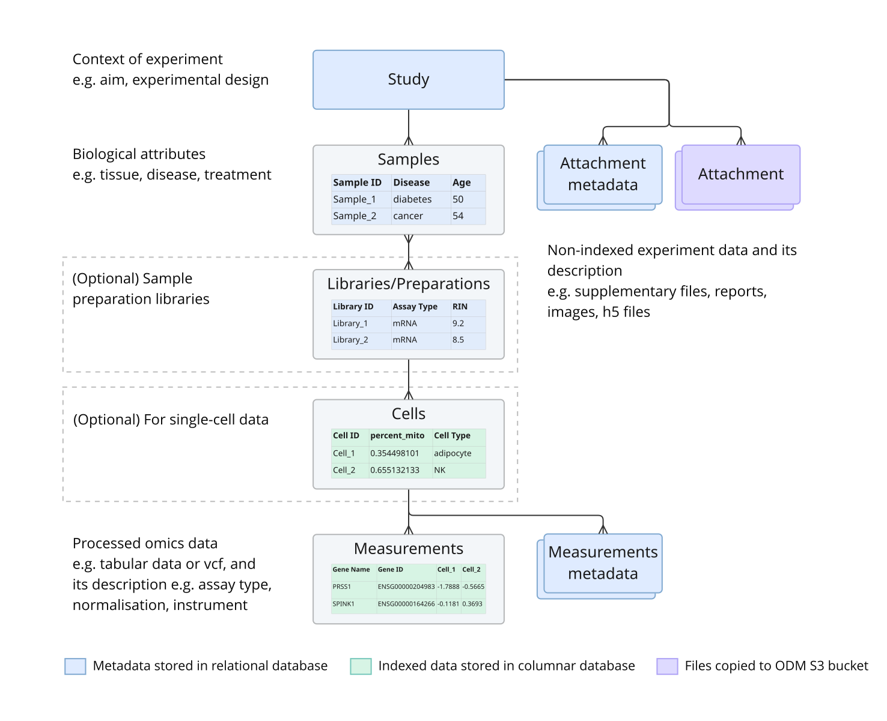

# Data model

ODM organises omics data around a hierarchy of entities. Each entity captures a distinct layer of experimental context, from the overall study design down to individual measurements. Understanding the model is the prerequisite for importing, querying, and sharing data in ODM.

## Entities

**Study** is the starting point. It captures the context of an experiment: the aim, the statistical design, and the overall experimental conditions.

**Samples** hold the biological attributes of the samples in a study: tissue type, disease status, treatment conditions, and any other per-sample annotations. Samples are the only entity that links directly to a Study, making data searchable within ODM.

**Libraries** (optional) describe the sequencing library preparation. When a study involves library preparation as a distinct experimental step, library-level metadata is captured here. Libraries link to Samples.

**Preparations** (optional) describe sample preparation steps (for example, the protein digestion and fractionation steps used in proteomics). Preparations link to Samples.

**Cell metadata** applies to single-cell datasets. It captures per-cell annotations for individual cells in a Cell Group. Each Cell Group belongs to a single parent entity: a Sample, Library, or Preparation (collectively referred to as an SLP entity). Cell metadata can be imported via the job endpoints or the import script.

**Data metadata** describes how experimental data was processed: normalisation techniques, instrumentation, and the types of processed data files (for example, TSV, VCF, GCT).

**Data** (also referred to as Expression Groups, Variant Groups, or FACS Groups depending on the data type) holds the actual omics data generated from a study. Expression data can be linked to Samples, Libraries, Preparations, or Cell metadata. Only expression data can be linked to Libraries and Preparations.

For single-cell data, each **Expression Group** represents a gene-by-cell expression matrix compressed for efficient retrieval. An Expression Group is always linked to a Cell Group, and through the Cell Group to the parent SLP entity.

**Attachments** are files associated with a study that are not omics data: PDFs, presentations, supplementary materials. They link directly to a Study and each receives a unique accession number, but they are not indexed for metadata search.

**Cross-reference mapping** maps transcripts to gene identifiers, enabling queries that span different identifier spaces. Mappings are associated with expression data files, though all mapping files can also be queried globally via API.

## Linking rules

Importing data in ODM has two stages: first upload each entity separately, then link them together. Unlinked files are accessible via API but do not appear in the ODM interface.

The linking order follows the system logic:

- **Samples** link to a **Study**
- **Libraries** and **Preparations** link to **Samples**
- **Cell metadata** links to **Samples**, **Libraries**, or **Preparations**
- **Omics data** links to **Samples**, or to **Libraries/Preparations**, or to **Cell metadata** depending on the data type
- **Attached files** link directly to a **Study**

The **Sample Source ID** is the default linking key used to match entities at import time. You can choose a different attribute from the study template as the linking key.

## Entity linking patterns

The entities you create for a given study depend on your experimental design. ODM supports three main variants:

!!! variant "Minimal: Study → Samples → Omics data"
    The baseline variant, used when no library or preparation grouping is needed.

!!! variant "With library or preparation grouping: Study → Samples → Libraries / Preparations → Omics data"
    Used when library or preparation metadata is a meaningful experimental layer. Only expression data can be linked to Libraries or Preparations.

!!! variant "Single-cell: Study → Samples → (Libraries / Preparations) → Cell metadata → Omics data"
    Used for single-cell experiments. A Cell Group links to a parent SLP entity; an Expression Group links to the Cell Group.

## See also

- __[Objects and groups](objects-and-groups.md)__

    ---

    The distinction between object types and group types in the data model.

- __[Data classes reference](data-classes-reference.md)__

    ---

    The full enumeration of data class values used in import and search.

- __[Access control](../access-control/index.md)__

    ---

    How permissions apply to studies and data.

- __[Supported data formats](../supported-data-formats/index.md)__

    ---

    File formats accepted for each entity type.

