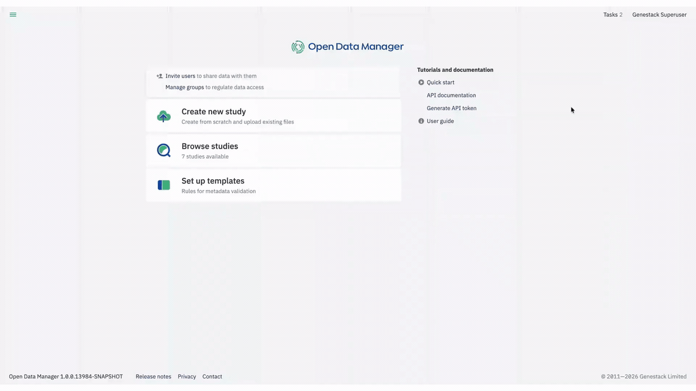
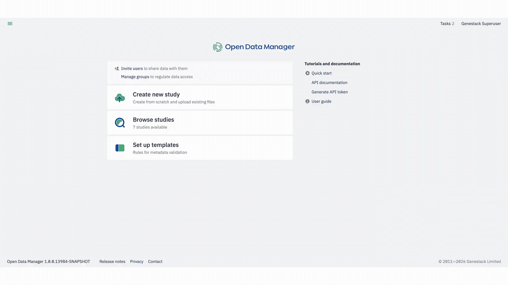
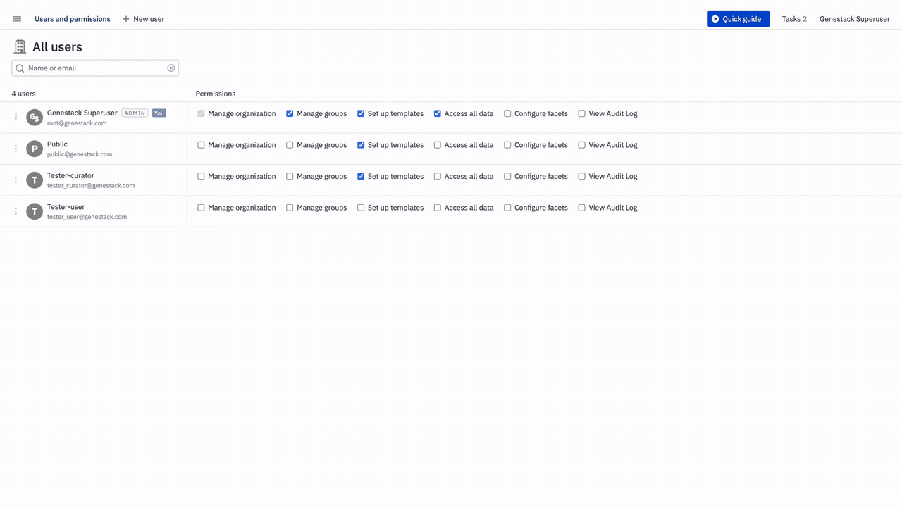
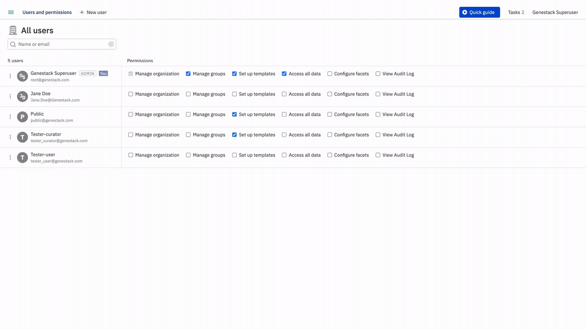
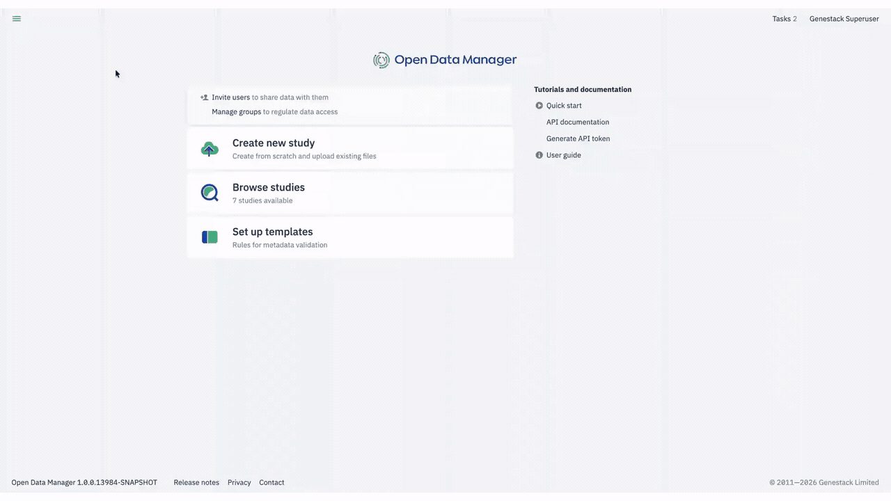
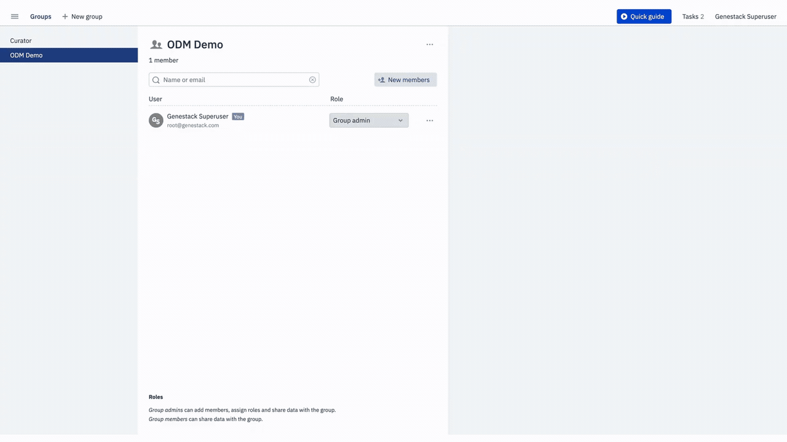

# Getting started: administering users and groups

In this tutorial you will add a new user to ODM, configure their permissions, manage their account status and password, and organise users into groups. By the end, you will have completed a full administrative cycle, from onboarding a user to managing the groups they belong to.

## Before you begin

You need an account with the **Manage organisation** permission to manage users and their permissions. To work with groups, you also need the **Manage groups** permission. See [Permissions](../access-control/permissions.md) for a full description of what each permission enables.

Every action in this tutorial is performed through the ODM UI, but that interface is not the only way to administer users. You can manage accounts programmatically through the [user management endpoints](../../odm-api/admin/manage-user-accounts-via-api.md), which suits automation scripts and system integrations. You can also hand user and group provisioning to your identity provider through [SCIM integration](../../admin/scim-integration.md), which is the recommended approach whenever your identity provider supports SCIM 2.0.

## Step 1: Confirm your admin status

Click your profile icon at the top-right of the Dashboard. Your profile view shows the **Admin** label alongside your permissions list: the groups you belong to, your capabilities (admin, curator), and your active API tokens. If you see this label, you are ready to proceed.

<figure markdown="span">

</figure>

## Step 2: Access Users and Permissions

Click the three-line menu at the top-left of the Dashboard and select **Users and permissions**. A window opens listing all users on your ODM instance. This section is also accessible directly from the main Dashboard if you have the relevant permissions.

<figure markdown="span">

</figure>

## Step 3: Add a new user

In the Users and Permissions view, click **+ New user**. A form opens where you enter the new user's details. The system automatically detects whether the email address already belongs to an existing account. When you are satisfied with the details, click **Add**. You will see the new user appear in the user list.

<figure markdown="span">

</figure>

## Step 4: Grant or revoke permissions

From the Users and Permissions view, find the user you want to configure. Use the search bar if the list is long. Tick or untick the checkboxes for each permission: **Manage organisation**, **Manage groups**, **Set up templates**, **Access all data**, and **Configure facets**. Hover over any checkbox to read a brief description of what that permission enables. Changes take effect as soon as you toggle the checkbox.

<figure markdown="span">

</figure>

See [Permissions](../access-control/permissions.md) for full descriptions of each permission and its scope.

## Step 5: Create a group

Click the three-line menu at the top-left of the Dashboard and select **Groups**. In the Groups view, click **+ New Group**, enter a name, and click **Create**. The group is created and you are automatically assigned as Group Admin. Each group requires at least one admin at all times.

<figure markdown="span">

</figure>

## Step 6: Add the user to the group

Open the group you just created, then click **New members**. Search for the user you added in Step 3, select them, and click **Add member**. The user appears in the group immediately.

<figure markdown="span">

</figure>

## What you accomplished

You have completed the core administrative workflow in ODM: confirmed your admin status, added a new user, configured their permissions, created a group, and added that user to it. For account management tasks such as changing passwords, activating or deactivating users, managing group roles, and deleting groups, see the how-to guides in the [Admin](../../admin/index.md) tab.
