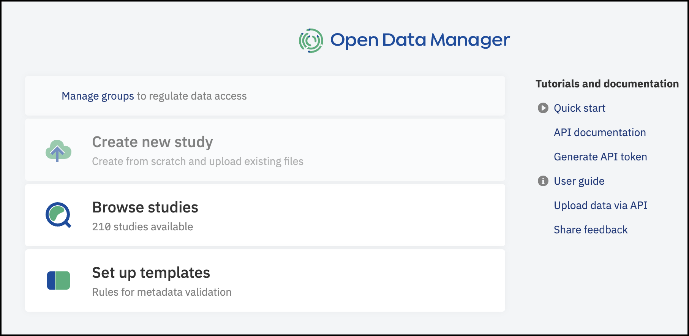
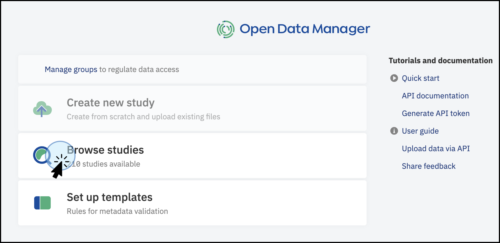
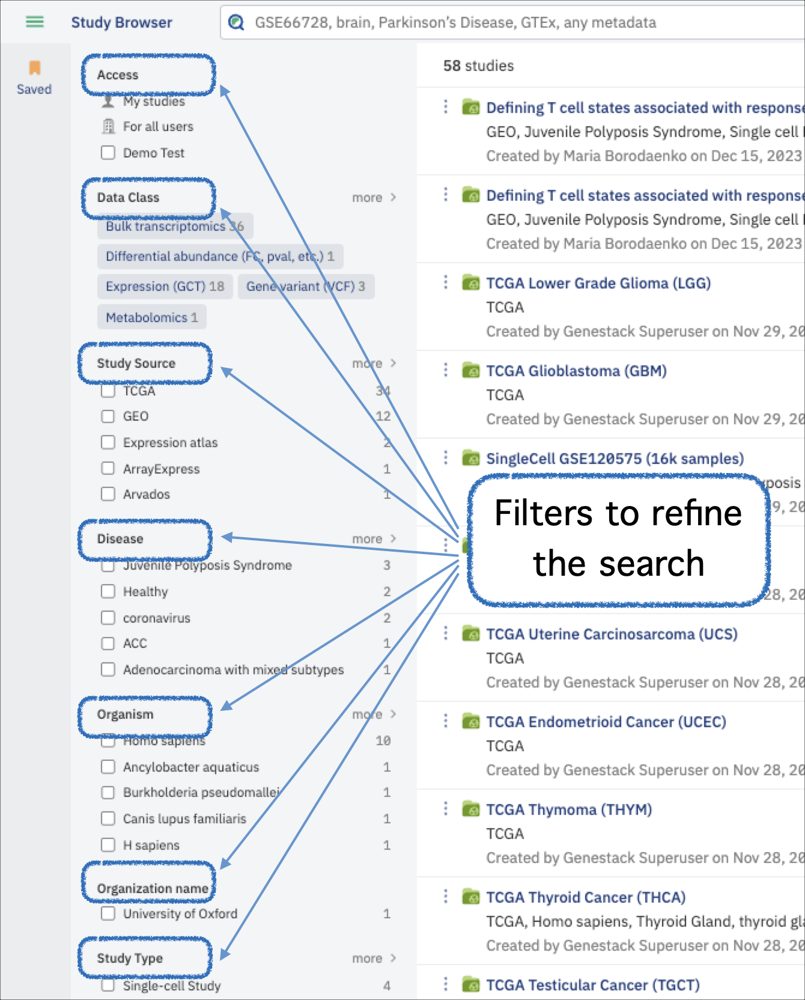
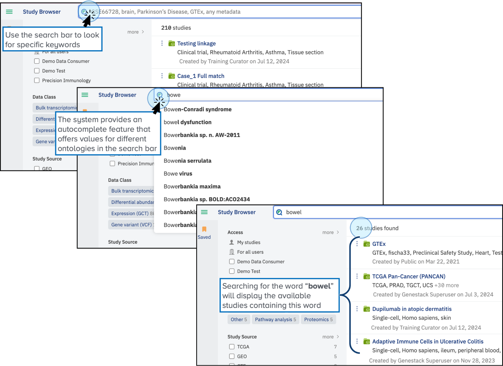
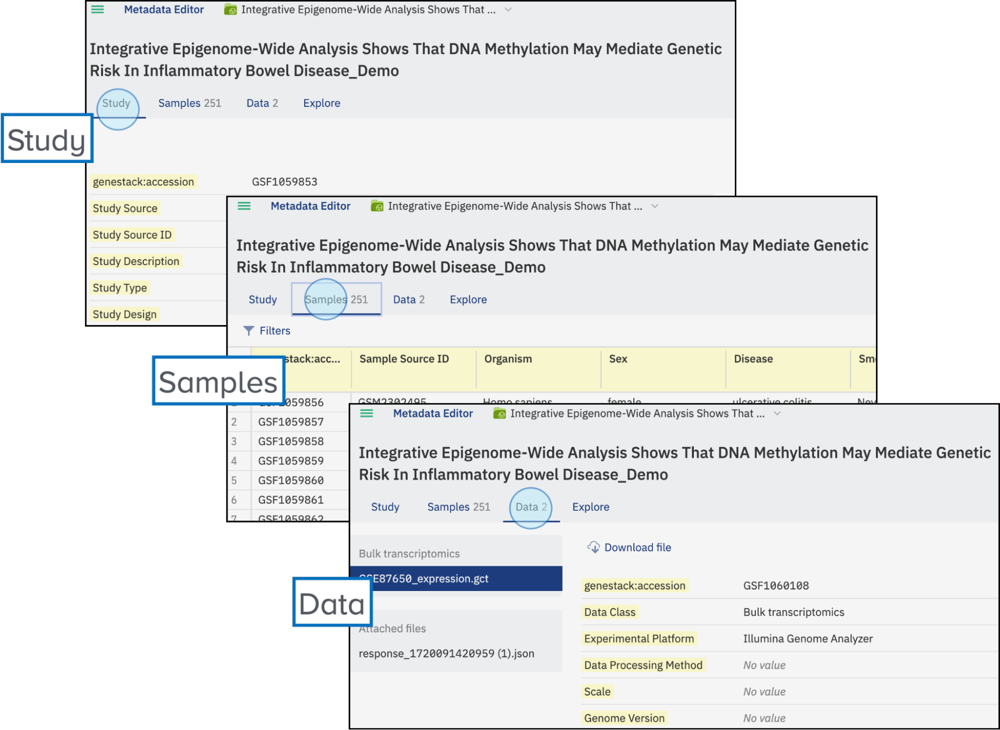
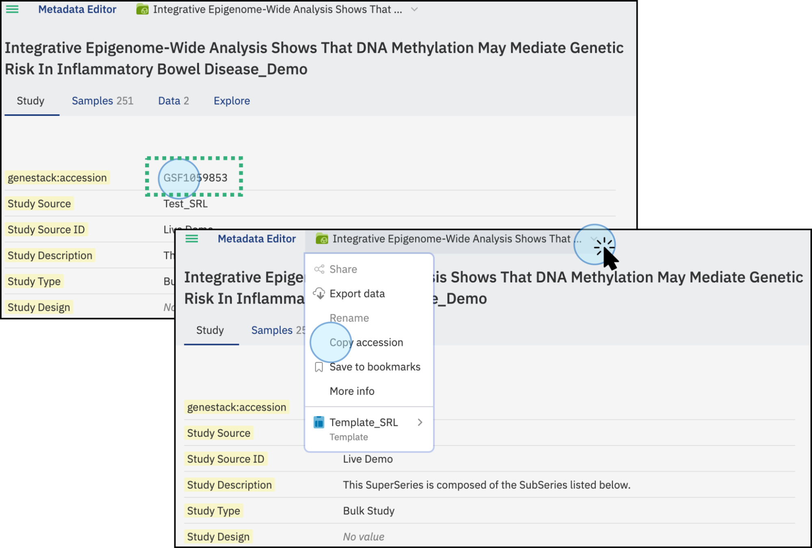
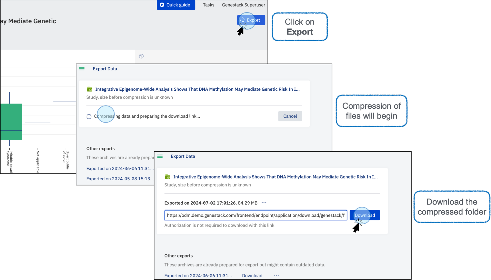

# Getting started: exploring data as a consumer

In this tutorial you will log in to ODM, find a study using search and filters, inspect its metadata, visualise sample attributes, and export the study. By the end you will have a working mental model of the core consumer workflow and know where to go for deeper guidance.

## Before you begin

You need an ODM account to follow this tutorial. All users have consumer access by default. No additional permissions are required. See [Users and accounts](../access-control/users-and-accounts.md) if you need help obtaining an account or understanding access levels.

## Step 1: Open the Dashboard

When you log in to ODM, you land on the Dashboard. The Dashboard is your starting point: it surfaces links to Quick Start examples, User Guides, and API documentation, and it presents a **Browse studies** button at the centre. You will use that button next.

## Step 2: Browse studies

Click **Browse studies**. ODM takes you to the Study Browser, the main interface for finding and opening studies. You will see a list of all studies currently visible to your account, a search bar running along the top, and a filter panel on the left side of the screen.

Take a moment to orient yourself before searching. The list shows every study you have access to; the filter panel lets you narrow it down by criteria such as Data Class or Organism.

## Step 3: Search and filter

In the filter panel on the left, select a **Data Class** value that interests you. The list immediately narrows to studies matching that class. Note that the exact filters available depend on the data in your ODM instance and the facets your administrator has enabled. Your panel may look different from the screenshot below.

Next, type a search term relevant to your data (for example, a tissue type or disease name) into the search bar at the top. As you type, ODM's autocomplete feature suggests matching values drawn from ontologies, helping you land on precise terms. The study list updates to show only results that match both your filter selection and the search term.

## Step 4: Open a study

Click on any study in the results list. ODM opens the study in the Metadata Editor. You will see three tabs across the top of the page:

- **Study**, the study-level metadata.
- **Samples**, per-sample metadata for every sample in the study.
- **Data**, files linked or attached to the study.

Each study has a unique accession number that ODM generates automatically. You can see it on the **Study** tab, or copy it at any time by clicking the study title in the top bar and selecting **Copy accession**. The accession number is what you will use to reference this study when working with the API.

## Step 5: Visualise sample data

Click the **Explore** tab. You are now in ODM's interactive visualisation view.

Select an attribute from the menu, for example, **Age** (the attributes available depend on the metadata in the study you opened). ODM immediately generates a plot of the values for that attribute across all samples in the study.

Now select a second attribute, for example, **Disease**. ODM combines both attributes into a single plot that shows sample count alongside value ranges, giving you a richer view of the data.

To remove an attribute, click the **X** icon next to it in the attribute list. To clear all attributes at once, click **Reset**.

When you are ready to save the plot, hover over the top-right corner of the plot area. A three-dot menu appears; click it and choose **SVG** or **PNG** to download the image.

## Step 6: Export the study

To download everything (all data files and metadata) from the study, click **Export** from the study title drop-down in the top bar, or use the Export button in the top-right corner of the screen. ODM compresses the study contents; once the archive is ready, you can download it to your local machine.

!!! warning
    If a study links to data stored in an external system that has since become unavailable, ODM cannot include that data in the export and the operation will fail. This is a limitation of externally referenced data, not of the study itself.

## What you accomplished

You have now completed the full consumer workflow: opened the Dashboard, navigated to the Study Browser, applied filters and a keyword search to locate a study, explored its metadata across the Study, Samples, and Data tabs, visualised sample attributes in the Explore view, and exported the study archive. These are the core actions you will repeat, in varying combinations, each time you work with ODM as a consumer.

For deeper guidance on each of these steps, see [Search and filter studies](../../explore/search-and-filter-studies.md), [Visualise sample data](../../explore/visualise-sample-data.md), and [Export data](../../explore/export-data.md) in the Explore tab.
