# Getting started: contributing data as a data contributor

In this tutorial you will create a study from scratch in the ODM web interface. By the end, you will have a published study with sample metadata, optional library and preparation metadata, experimental data, and an attached supplementary file. You will also have performed a first round of metadata curation to bring it into compliance with your template.

## Before you begin

You must be a member of the Curator group to create and edit studies. See [Groups and roles](../access-control/groups-and-roles.md) for how group membership works and how to request access if you do not have it. All actions in this tutorial are performed through the ODM web interface; no API token is required.

## Step 1: Understand the data model

ODM organises a study as a hierarchy: a **study** defines the context and statistical design; **sample metadata** documents the biological attributes of each sample; **libraries and preparations** capture sample preparation details where applicable; and **experimental data** holds the actual measurements linked back to those samples. Before you create anything, take a moment to read [The ODM data model](../data-model/index.md). Understanding how these layers relate to each other will make every subsequent step easier.

## Step 2: Create a new study

On the main dashboard, click **Create new study**. You can also reach this option from the menu in the top-left corner of the interface.

<figure markdown="span">
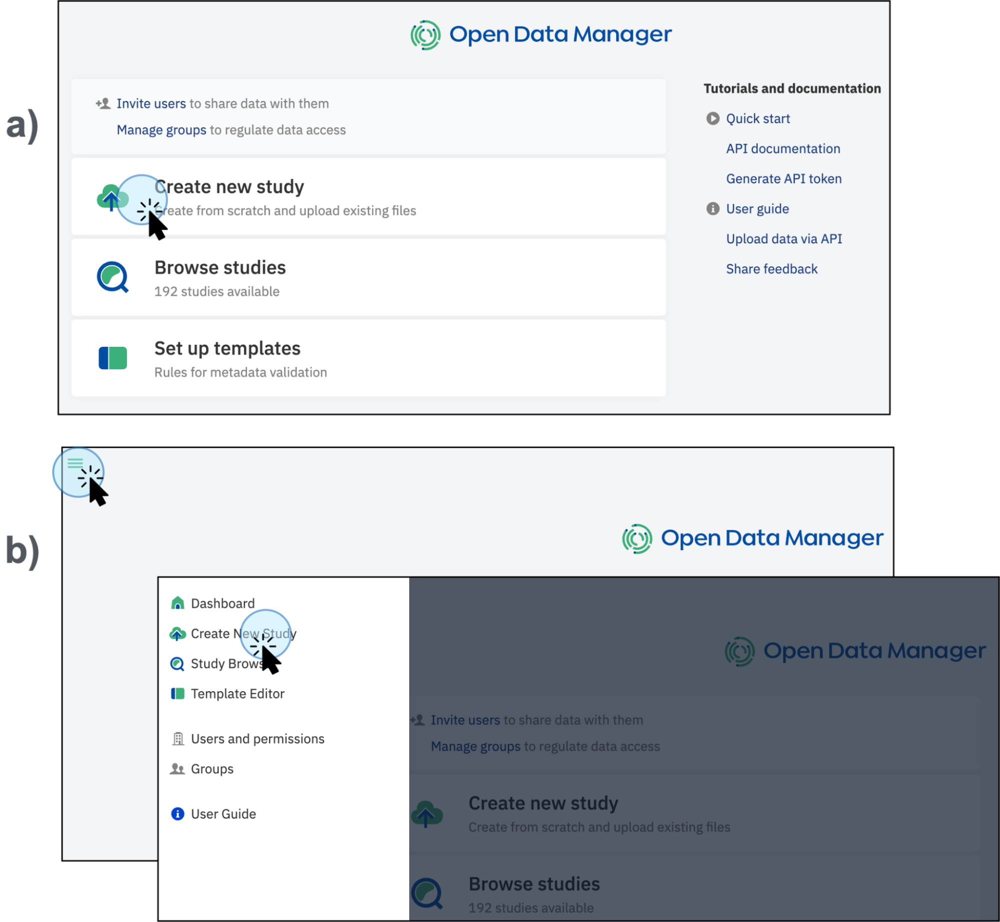
<figcaption>Two routes to create a new study: directly from the dashboard (a) or via the top-left panel menu (b)</figcaption>
</figure>

Give the study a descriptive name so you and your colleagues can identify it at a glance. Then select a **template**. Templates define the metadata structure and validation rules that govern your study: they determine which attributes are expected, which are mandatory, and which dictionaries drive autocomplete and validation. For this tutorial, select the **Default** template. You can create your own templates, and there is no limit on how many you can apply. For a full explanation of what templates are and how they work, see [About templates](../../contribute/templates/about-templates.md).

<figure markdown="span">
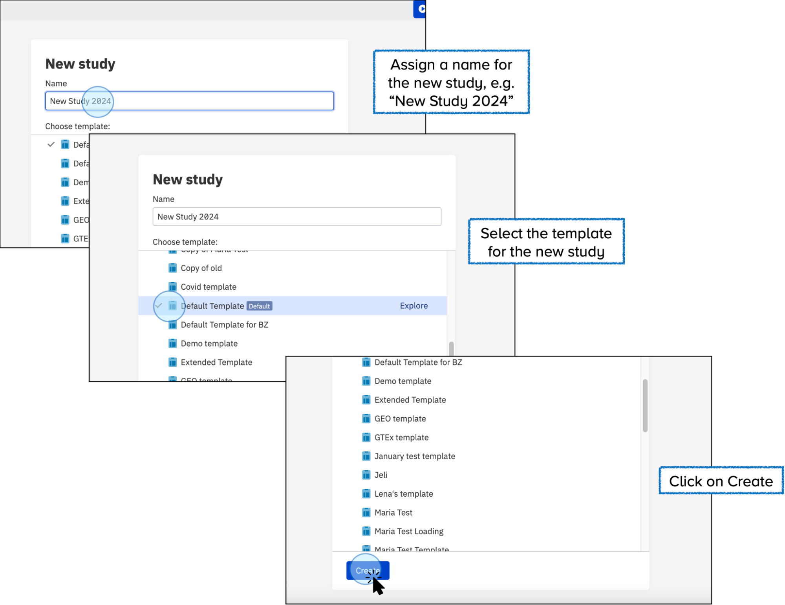
<figcaption>Assign a name and select a template to create the study</figcaption>
</figure>

Click **Create**. ODM immediately redirects you to the new study. You will see a unique accession number has been generated automatically. This number identifies the study and is used when working with it via the API.

<figure markdown="span">
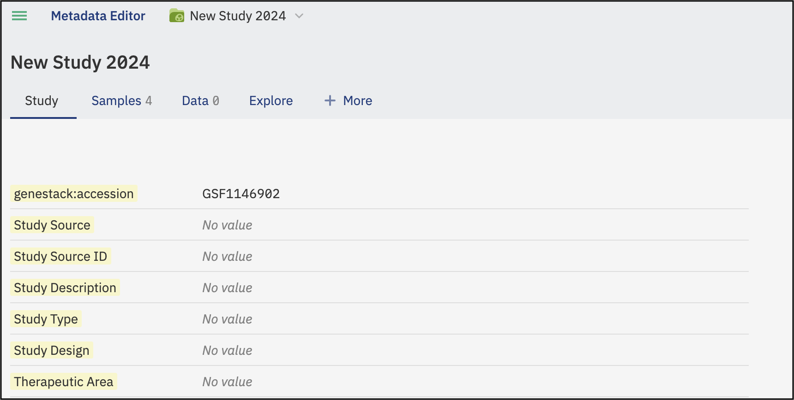
<figcaption>The newly created study, showing its accession number and available tabs</figcaption>
</figure>

## Step 3: Edit study details

1. On the Study tab, click **Edit** at the bottom of the page.

    <figure markdown="span">
    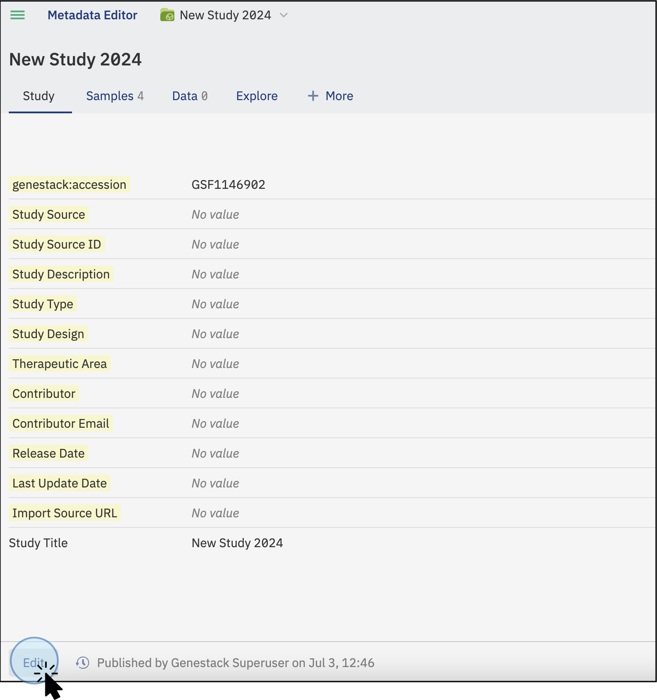
    <figcaption>Click Edit to make the Study tab fields editable</figcaption>
    </figure>

2. Click a field you want to fill in (for example, **Study Source**) and type the new value.

    <figure markdown="span">
    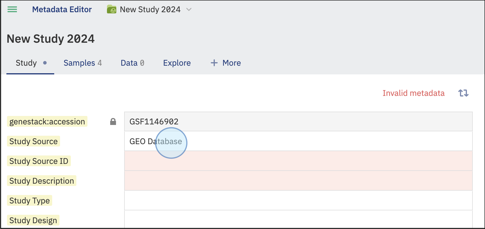
    <figcaption>Click a field and type the value directly</figcaption>
    </figure>

3. Click **Publish** at the bottom of the screen. A pop-up appears where you can name this version, for example, "Study Source was changed." Giving versions meaningful names makes the history easier to read later.

    <figure markdown="span">
    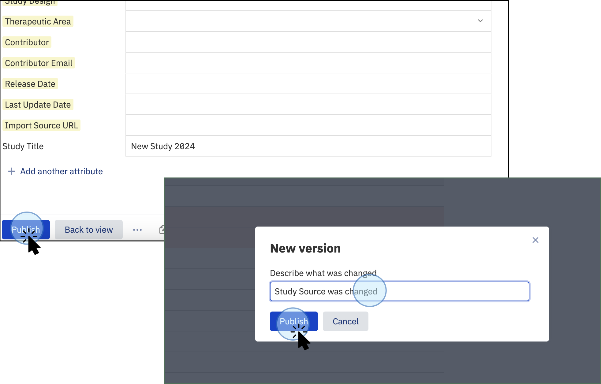
    <figcaption>Name the version before publishing to keep a clear audit trail</figcaption>
    </figure>

## Step 4: Upload sample metadata

Sample metadata is the backbone of your study. Until you upload it, there is no Samples tab. Instead, the study shows an **Add samples** button in the tab bar.

!!! tip "Tutorial file"
    Download [samples.tsv](../../assets/sample-data/samples.tsv) before continuing. You will use this file again in Step 8.

1. Click **Add samples** in the tab bar at the top of the study. The import dialog opens immediately.

2. Click **Select tsv file...**, select `samples.tsv`, and click **Import**.

    <figure markdown="span">
    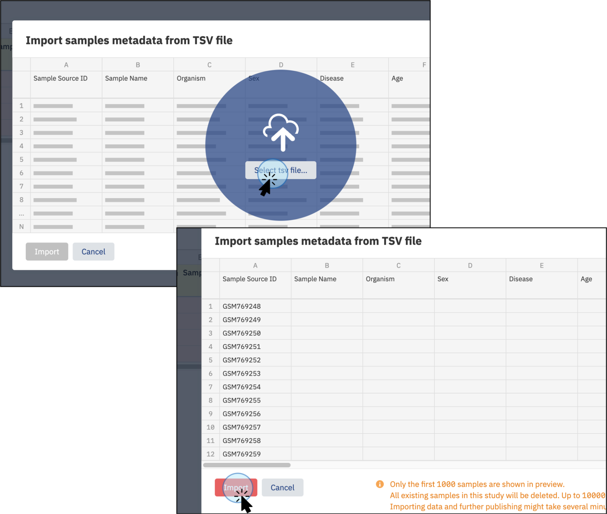
    <figcaption>Select your file and click Import to load the sample metadata</figcaption>
    </figure>

Once the import completes, the **Samples** tab appears in the tab bar.

## Step 5: Upload libraries and preparations (optional)

If your study involves library preparation or sample preparation steps, you can add that metadata alongside the sample metadata.

!!! tip "Tutorial files"
    Download [libraries.tsv](../../assets/sample-data/libraries.tsv) and [preparations.tsv](../../assets/sample-data/preparations.tsv) before continuing.

Click the **+More** tab on the study screen. You will see options for **Libraries** and **Preparations**. Click either option and select the corresponding TSV file from your computer.

<figure markdown="span">
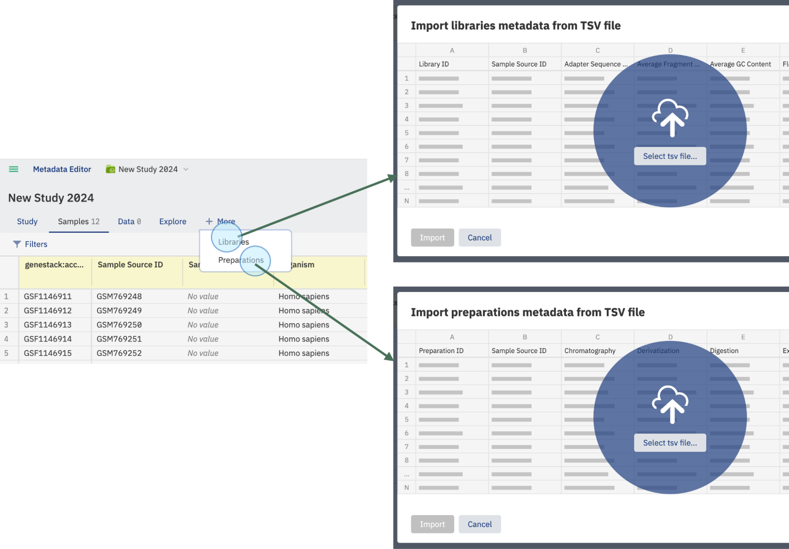
<figcaption>The +More tab exposes the Libraries and Preparations import options</figcaption>
</figure>

Both files link to the sample metadata via the **Sample Source ID** column. Make sure this column is present in your files. In addition, library files must include a **Library ID** column and preparation files must include a **Preparation ID** column so ODM can recognise and link them correctly.

<figure markdown="span">
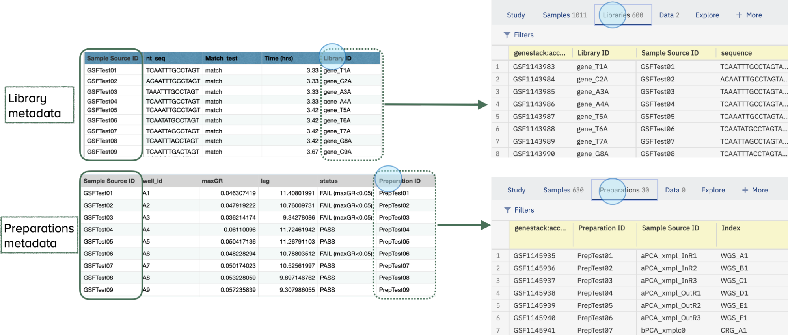
<figcaption>The required linking columns ensure libraries and preparations are associated with the correct samples</figcaption>
</figure>

## Step 6: Upload experimental data

Experimental data (bulk transcriptomics, gene variants, proteomics, lipidomics, single-cell data, and more) is imported via the **Data** tab and linked back to your sample metadata.

!!! tip "Tutorial file"
    Download [expression_data.gct](../../assets/sample-data/expression_data.gct) before continuing.

1. Click the **Data** tab on the main study screen.

    <figure markdown="span">
    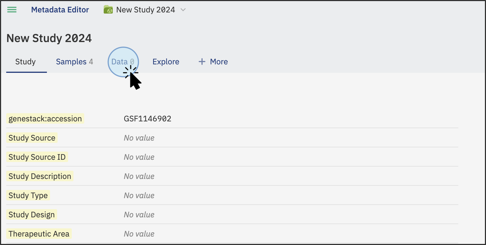
    <figcaption>The Data tab is where you import experimental data and attach supplementary files</figcaption>
    </figure>

2. Click **Add data**. In the window that opens, select a **Data class**. This tells ODM the type of data you are importing (for example, Bulk Transcriptomics). If your data type is not listed, choose **Other**.

    <figure markdown="span">
    
    <figcaption>Choose the Data class that best describes your experimental data</figcaption>
    </figure>

3. Click **Next**. Select your data file. ODM accepts TSV, GCT, VCF, and FACS formats. The file will be scanned for a linking column.

    <figure markdown="span">
    
    <figcaption>Choose the file to import from your computer or an external storage system</figcaption>
    </figure>

4. By default, ODM links the experimental data to your sample metadata via the **Sample Source ID** column. If you need to use a different column, select it as a custom linking attribute, but note that only template attributes can be used as custom linking attributes. You can also link data to library or preparation metadata via **Library ID** or **Preparation ID**.

    <figure markdown="span">
    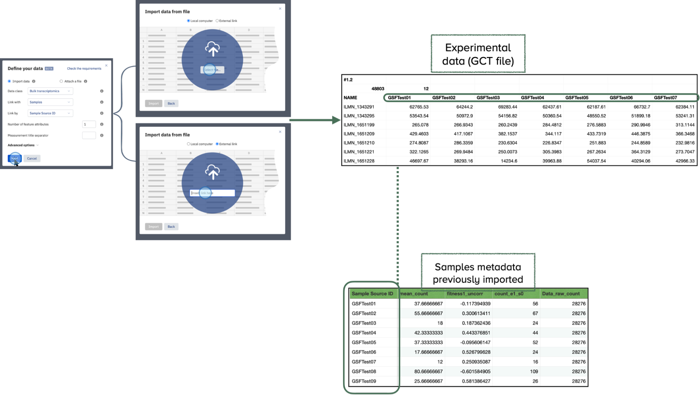
    <figcaption>Confirm the linking column before ODM begins indexing</figcaption>
    </figure>

Once the file is recognised and the linking column is confirmed, the upload and indexing begin automatically. Imported experimental data is indexed and searchable within the platform.

## Step 7: Attach a file

You can supplement a study with any supporting material (manuscripts, budget reports, presentation slides, images, and so on) by attaching it rather than importing it.

Click **Add data**, then select **Attach a file**. Choose a Data class (or **Other** if none fits). Click **Select file...** and choose your file. ODM accepts any format: PDF, PNG, DOCX, PPTX, and more. The file uploads and appears on the Data tab under its assigned category.

> **Note:** The contents of attached files are not indexed or made searchable. If you need the data in a file to be queryable, import it as experimental data instead.

<figure markdown="span">
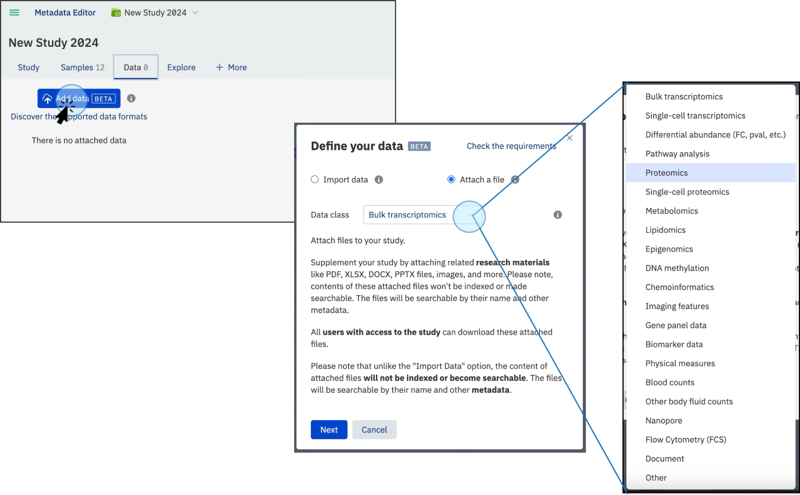
<figcaption>Attached files appear alongside imported data on the Data tab, distinguished by their visual indicators</figcaption>
</figure>

## Step 8: Curate metadata

With data uploaded, you can now validate and correct the metadata across the Samples, Libraries, and Preparations tabs. Each file you uploaded contains issues to resolve. Work through each tab in turn.

### Curate sample metadata

1. Click the **Samples** tab, then click **Edit** at the bottom-left of the screen.

    <!-- TODO: screenshot — Samples tab in edit mode, Edit button visible at bottom-left -->

2. Scan the table for fields highlighted in **red**: these are values that do not conform to the template's validation rules. Columns governed by the template appear with a yellow header. To get a full list of all issues at once, click **Invalid Metadata** at the top-right of the table. A validation summary opens, explaining which attributes are invalid and why.

    <!-- TODO: screenshot — Samples table showing red cells in the Organism and Age Unit columns -->

    <!-- TODO: screenshot — Invalid Metadata summary panel listing all validation issues -->

3. **Fix an individual cell.** Click the invalid field to select it, then start typing the corrected value. Autocomplete surfaces dictionary-based preferred labels as you type. The **Organism** field in the row for `HeLa_Doxo_Rep1` contains the value `Human`. Click it, type `Homo`, and select **Homo sapiens** from the autocomplete list. Once you accept a valid value, the cell turns **green**.

    <!-- TODO: screenshot — Organism cell for HeLa_Doxo_Rep1 selected, autocomplete showing "Homo sapiens" suggestion -->

4. **Bulk replace a column.** When all cells in a column share the same wrong value, it is faster to fix them all at once. The **Age Unit** column contains `years` for every row, but the template expects `year`. Click the **Age Unit** column header, click **Bulk replace**, type `year`, and click **Replace**. All cells in the column are updated simultaneously.

    <!-- TODO: screenshot — Bulk replace dialog open on Age Unit column, "year" entered as replacement value -->

5. When all red cells are resolved, click **Publish** and name the version.

    <!-- TODO: screenshot — Publish dialog with version name field, all cells now green -->

**Versioning note.** To view the full history of changes to this metadata, click the **clock icon** at the bottom of the page. You will see each published version, when it was created, the label you gave it, and who made the change. To revert to an earlier version, select it in the list and click **Restore**. To return to the latest version without restoring, click **Back to the latest version**. For a deeper explanation of how versioning works, see [About metadata versioning](../../contribute/version-metadata/about-metadata-versioning.md).

<!-- TODO: screenshot — Version history panel showing published versions of the sample metadata -->

### Curate library metadata

The `libraries.tsv` file contains a non-template column, **Laboratory**, that duplicates information already belonging in the template's **Experiment Site** column. You need to copy the values across and then remove the non-template column.

1. Click the **Libraries** tab, then click **Edit**.

2. Click the **Laboratory** column header, then click **Copy values to...**, select **Experiment Site** as the target, and click **Copy values**. Confirm the overwrite when prompted.

    <!-- TODO: screenshot — Copy values to dialog, Laboratory selected as source and Experiment Site as target -->

3. With the values safely copied, click the **Laboratory** column header again and select **Delete column**. Because **Laboratory** is not a template attribute, ODM allows it to be removed.

    <!-- TODO: screenshot — Delete column confirmation for the Laboratory column -->

4. Click **Publish** and name the version.

### Curate preparation metadata

The `preparations.tsv` file has the same pattern as the libraries file. Open the **Preparations** tab in edit mode and spot the duplicated non-template column, then copy its values to the corresponding template attribute and delete it, exactly as you did with **Laboratory** above. Publish when done.

!!! tip
    Use the **Invalid Metadata** summary to identify which column is non-template and which template attribute it corresponds to.

## What you accomplished

You have created a complete study: a named study with a template, published study details, uploaded sample metadata, optional library and preparation metadata, imported experimental data linked to your samples, an attached supplementary file, and a curated metadata set validated against your template. To go further, explore how to [import data in more detail](../../contribute/import-data/index.md), how to [edit and validate metadata](../../contribute/curate-metadata/edit-and-validate-metadata.md), and how to [share a study with colleagues](../../contribute/sharing/share-a-study.md).
