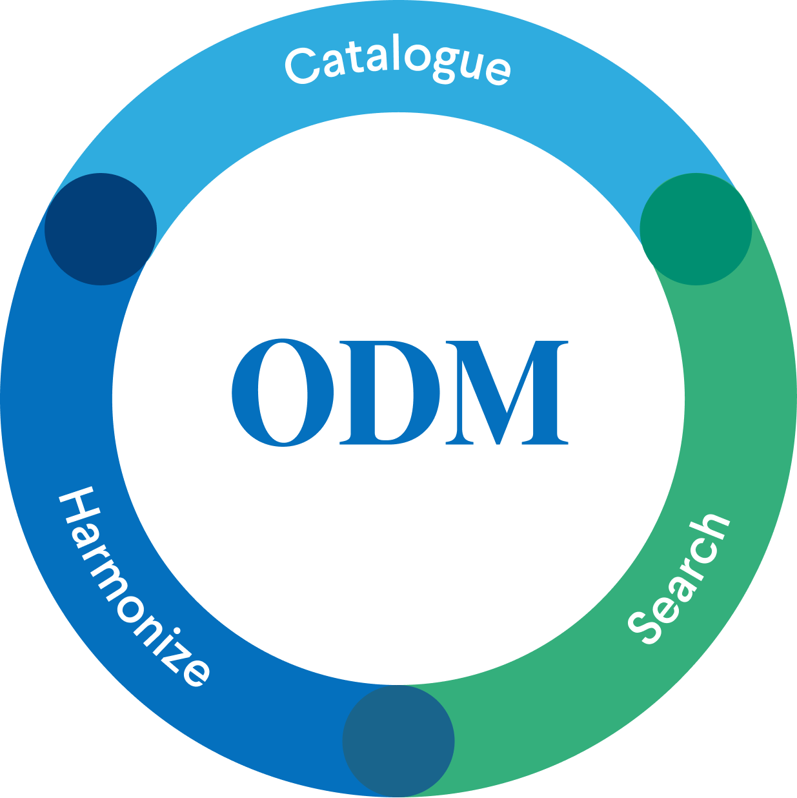

# Overview

ODM (Open Data Manager) is a bioinformatics product developed by Genestack for managing, exploring, contributing to, and administering omics datasets. You can interact with ODM through a web UI, a REST API, and Python and R API client libraries. The documentation here assumes biological background knowledge; ODM-specific concepts are explained where they arise.

## Why ODM

Scientific data presents challenges that generic file management cannot address. File management is prevalent across many industries, but in life sciences it is often insufficient for the specific requirements of omics data. ODM is purpose-built for **Data Management** (structured, queryable, and annotated) rather than file storage. For a detailed look at the distinction, see [our article on data management in life sciences](https://genestack.com/news/blog/data-management-in-life-sciences-key-concepts/).

## Who uses ODM

ODM is built for three kinds of users. **Data consumers** search, filter, visualise, and export existing datasets. **Data contributors** create and manage studies, import experimental data, and curate metadata. **Platform administrators** govern users, groups, and organisation-level settings. Each role has its own getting-started path and dedicated task tab.

## New to ODM?

Start with the foundational topics in this section. The [getting-started tutorials](getting-started/index.md) walk you through the core workflow for your role, while the data model and access control pages give you the conceptual grounding to make sense of everything else.

- **[Getting Started](getting-started/index.md)**

    ---

    Guided tutorials for data consumers, contributors, and administrators.

- **[Data model](data-model/index.md)**

    ---

    How ODM organises studies, samples, libraries, preparations, and signal data.

- **[Access control](access-control/index.md)**

    ---

    Users, roles, permissions, groups, sharing, governance, and platform security.

- **[Supported data formats](supported-data-formats/index.md)**

    ---

    TSV, GCT, VCF, HDF5, FACS, and attached files: what ODM accepts and how.

- **[Navigating the UI](navigating-the-ui/index.md)**

    ---

    Orientation to the Study Browser, Metadata Editor, and Template Editor.

## Already familiar with ODM?

Jump straight to the task tab for your role.

- **[Explore data](../explore/index.md)**

    ---

    Search, filter, visualise, and export data via the UI.

- **[Contribute data](../contribute/index.md)**

    ---

    Create studies, import data, curate metadata, and manage access via the UI.

- **[Admin](../admin/index.md)**

    ---

    Manage users, groups, facets, and platform configuration via the UI.

- **[ODM API](../odm-api/index.md)**

    ---

    REST API usage: authentication, exploration, contribution, and administration.

- **[API Libraries](../api-libraries/index.md)**

    ---

    ODM SDK, Python API Client, and R API Client.

