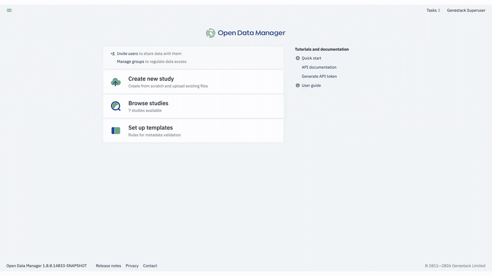
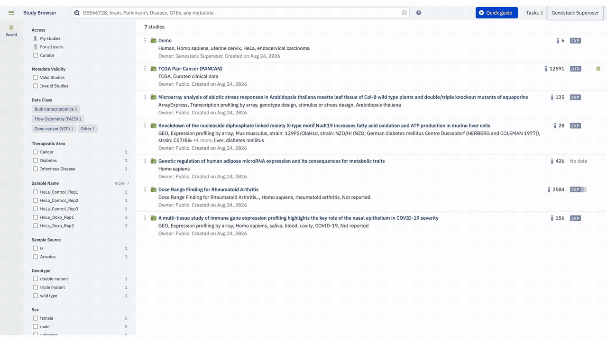

# Study Browser

The Study Browser is the main interface for finding and discovering studies in ODM. Every study you have permission to see appears here, giving you a single place to orient yourself before you dig into any particular dataset.

## Getting there

From the Dashboard, click **Browse Studies** to open the Study Browser directly. Alternatively, click the menu in the top-left corner of any window and select **Study Browser**.

## Layout

The centre of the page shows a list of studies. Under each study title, ODM displays a metadata summary (organism, tissue, cell type, disease, and similar fields) drawn directly from the sample metadata associated with that study. Hovering over any value in the summary reveals the name of the metadata field it comes from. The study entry also shows who imported the study and when.

To the right of each study title you can see how many samples the study contains and which Data Classes are linked to it.

The left panel contains facets: groupings of metadata values that let you narrow down the list based on what is present in your results. Above the study list, a search bar accepts queries by study name, accession number, or any metadata value. The search is ontology-aware: it expands results to include synonyms and, optionally, child terms, so non-standard terminology is less likely to cause you to miss relevant studies.

## Access

By default, the Study Browser shows only the studies you have permission to observe: those created by you or shared with a group you belong to. Users who have been granted the **Access all data** permission can see all studies in the system. For a full explanation of how access is governed, see [Sharing and ownership](../access-control/sharing-and-ownership.md).

## Navigation aids

The three-line menu in the top-left corner of any window takes you back to the Dashboard. In the top-right, the **Quick Guide** button opens reference materials and examples for working with ODM. On the right side of the screen you can access your account details and check the status of any running tasks. The question-mark icon next to the search bar opens the search help panel, which covers advanced search syntax in detail.

## Where to go next

Once you are oriented in the Study Browser, you can start working with what it surfaces. To learn how to run searches and apply facets to narrow your results, see [Search and filter studies](../../explore/search-and-filter-studies.md). If you want to save studies for quick access later, see [Bookmark studies](../../explore/bookmark-studies.md). If you are an administrator and need to control which facets appear in the left panel, see [Configure facets](../../admin/configure-facets.md).
