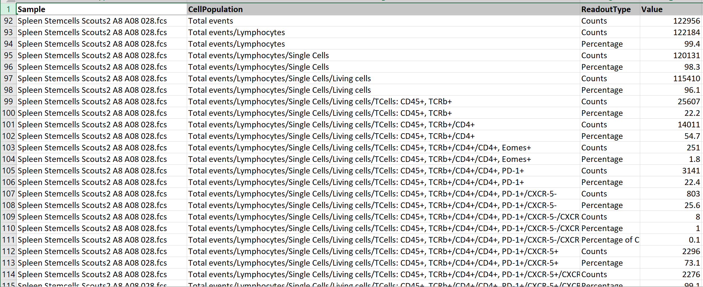

# FACS (Flow Cytometry)

FACS files represent processed (post-gating) flow cytometry data in tab-delimited format. ODM indexes FACS files, making their data searchable and filterable.

## Key columns

**Sample**, a string representing the sample name.

**CellPopulation**: describes cell subtypes in a hierarchical, path-like structure. For example: `CD45+, live/CD45+, CD3+/CD4`. Counts at parent levels equal the sum of their children for simple cell counts, but marker-specific counts may not add up because cells can express multiple markers simultaneously.

**ReadoutType**, the type of value recorded:

- **Median**, median intensity of a fluorophore (decimal).
- **Count**, number of cells (integer).
- **Percentage**, proportion of cells relative to the parent population.

**Marker**: identifies proteins or fluorophores on the cell surface (for example, `PD-1`, `GZB`, `BV786`). The same biological entity may appear under different marker names in different datasets.

## Considerations

Cell populations are hierarchical. Cells can carry multiple markers simultaneously, which means marker counts do not fully represent the total parent population. Plan queries accordingly.

## Searching FACS data in ODM

FACS files are indexed and searchable. Via API endpoints you can:

- Find FACS objects and groups by metadata and data: Run, Readout Type, Population, Marker, Value.
- Find objects and groups by Genestack accession.
- Find objects and groups by linked entities: Study, Samples.
- Update FACS group metadata by object ID.

For query examples, see [Search imported data](../../odm-api/explore/search-imported-data.md).
