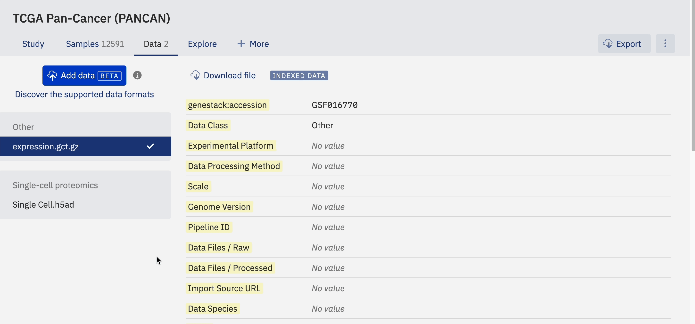

# HDF5

HDF5 (Hierarchical Data Format version 5) is widely used in genomic research, particularly for single-cell data. It stores large, complex datasets efficiently and is a common format for gene expression matrices and associated metadata.

!!! info "Limitation"
    HDF5 content is searchable by file structure (groups and datasets) only. Full data parsing, content search, and filtering are not yet supported.

## Supported variants

- `.h5`, `.h5ad`: standard HDF5 files
- `.h5.gz`, `.h5ad.zip`: compressed versions

## File contents and structure parsing

ODM detects HDF5 files during import by their `.h5` or `.h5ad` extension. File contents (groups and datasets) are stored and displayed in the ODM interface.

**UI**: The Metadata Editor shows a sidebar panel with an interactive tree structure of the file's groups and datasets. Groups are collapsed by default and can be expanded to reveal datasets and nested groups. Use the "Expand all" and "Collapse all" buttons to navigate. Hover over any dataset or group to see a "Copy path" icon.

If content parsing fails, the "Contents" button is disabled and a hover message reads: "The contents could not be parsed."

**API**: File contents are retrievable for a list of files or by Genestack accession using these endpoints:

- `GET /api/v1/as-curator/files`
- `GET /api/v1/as-user/files`

Add `includeContents=true` to include the parsed structure in the response. If parsing fails, the response includes `"contents": {"error": "The contents could not be parsed."}`.

## Search by file structure

You can search for HDF5 files by the following criteria (via Study Browser or API):

- Full path (e.g., `/obs/__categories/integrated_snn_res.0.5`)
- Partial path (e.g., `__categories/integrated_snn_res.0.5`)
- Dataset name (e.g., `seurat_clusters`)
- Group name (e.g., `obsm`)

Search for Studies by linked HDF5 file structure:

- `GET /api/v1/as-curator/integration/link/studies/by/files`
- `GET /api/v1/as-user/integration/link/studies/by/files`

Supported query parameters: `full path`, `partial path`, `group`, `dataset`.

## Single-cell HDF5 transformation

ODM provides a transformation pipeline that converts H5AD or 10x H5 files into ODM-indexed Cell Group and Expression Group objects. See [Single-cell HDF5 transformations](../../odm-api/contribute/transformations/single-cell/about-single-cell-transformations.md) for full details.

## See also

- [Attached files](attached-files.md), HDF5 files uploaded as attachments
- [Search by HDF5 contents](../../odm-api/explore/search-by-hdf5-contents.md), API query patterns
