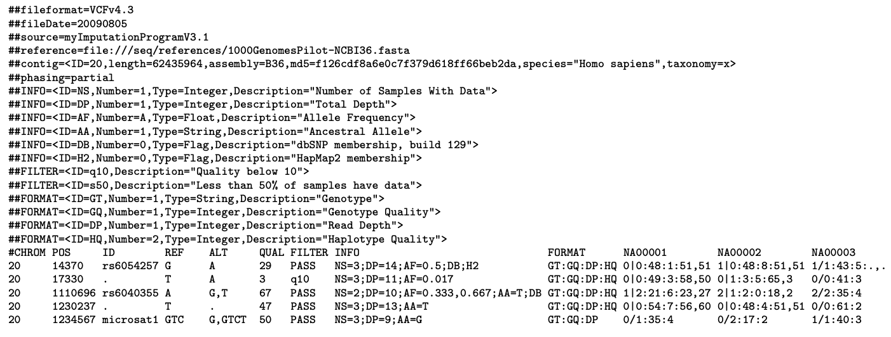

# VCF (Variants)

VCF (Variant Call Format) files store genetic variation data: SNPs, insertions, deletions, and structural variants. VCF files are tab-delimited and typically produced as output from variant calling pipelines.

Example files:

- [Test_1000g.vcf](https://s3.amazonaws.com/bio-test-data/odm/Test_1000g/Test_1000g.vcf)
- [Test_1000g.vcf.tsv](https://s3.amazonaws.com/bio-test-data/odm/Test_1000g/Test_1000g.vcf.tsv) (variant metadata)

## Supported variants

- `.vcf`: standard uncompressed VCF file
- `.vcf.gz`, `.vcf.zip`: compressed versions (available via API)

## File structure

A VCF file contains three main parts:

- **Meta-information lines** (marked with `##`): include the VCF format version (`##fileformat=VCFv4.3`), FILTER lines (e.g., `##FILTER=<ID=LowQual,Description="Low quality">`), FORMAT lines, and INFO lines.
- **Header line** (marked with `#`): the final metadata line defining eight mandatory column names.
- **Data lines**: one row per variant, tab-delimited.



## Eight mandatory columns

All data lines are tab-delimited. Missing values are specified with a dot (`.`).

| Column | Type | Description |
|---|---|---|
| CHROM | String (no whitespace) | Chromosome identifier from the reference genome or an angle-bracketed ID string. The colon (`:`) must be absent from chromosome names. All entries for a CHROM must form a contiguous block. |
| POS | Integer | Reference position; 1-based. Positions are sorted numerically in increasing order within each CHROM. Multiple records at the same POS are permitted. |
| ID | String (no whitespace or semicolons) | Semicolon-separated list of unique identifiers. Use the missing value if no identifier is available. |
| REF | String | Reference base(s). Each base must be one of A, C, G, T, N (case-insensitive). |
| ALT | String | Comma-separated list of alternate non-reference alleles, or `.` if none. |
| QUAL | Numeric | Phred-scaled quality score for the ALT assertion. |
| FILTER | String (no whitespace or semicolons) | `PASS` if the site passed all filters; otherwise a semicolon-separated list of failed filter codes. Use missing value if filters have not been applied. |
| INFO | String | Semicolon-separated key=value pairs. Keys without values are permitted. |

## INFO sub-fields

Standard reserved INFO sub-fields:

| Key | Description |
|---|---|
| AA | Ancestral allele |
| AC | Allele count in genotypes, for each ALT allele in listed order |
| AF | Allele frequency for each ALT allele in listed order |
| AN | Total number of alleles in called genotypes |
| BQ | RMS base quality at this position |
| CIGAR | Cigar string describing how to align an alternate allele to the reference allele |
| DB | dbSNP membership |
| DP | Combined read depth across samples (e.g., `DP=154`) |
| EFF | Functional effect of the genomic variant (see EFF format below) |
| END | End position of the variant described in this record (for symbolic alleles) |
| H2 | Membership in HapMap 2 |
| H3 | Membership in HapMap 3 |
| MQ | RMS mapping quality (e.g., `MQ=52`) |
| MQ0 | Number of MAPQ == 0 reads covering this record |
| NS | Number of samples with data |
| SB | Strand bias at this position |
| SOMATIC | Indicates a somatic mutation (cancer genomics) |
| VALIDATED | Validated by follow-up experiment |
| 1000G | Membership in 1000 Genomes |

## EFF sub-field format

Each piece of data in the EFF field is separated by `|`. Missing data is marked with `||`. Components appear in this order (enclosed in parentheses after the Variant Effect):

Variant Effect, Effect Impact (HIGH/MODERATE/LOW/MODIFIER), Functional Class (NONE/SILENT/MISSENSE/NONSENSE), Codon Change/Distance, Amino Acid Change, Amino Acid Length, Gene Name, Transcript BioType, Gene Coding, Transcript ID, Exon/Intron Rank, Genotype Number.

Examples:

```
EFF=INTRON(MODIFIER|||||HPS4|retained_intron|CODING|ENST00000485842|4|1)
EFF=STOP_GAINED(HIGH|NONSENSE|Cga/Tga|R241*|721|HPS4|protein_coding|CODING|ENST00000398141|8|1)
EFF=STOP_GAINED(HIGH|NONSENSE|Cag/Tag|Q236*|749|NOC2L||CODING|NM_015658||)
```

## Genotype FORMAT fields

If genotype data is present, a FORMAT column precedes the sample columns, specifying the data types and order as a colon-separated string. The GT field must be first if present. Standard reserved FORMAT sub-fields:

| Key | Type | Description |
|---|---|---|
| GT | String | Genotype, encoded as allele values separated by `/` (unphased) or `\|` (phased). `0` = reference allele; `1` = first ALT allele; etc. Use `.` for missing alleles. |
| DP | Integer | Read depth at this position for this sample |
| FT | String | Sample genotype filter (same values as the FILTER field) |
| GL | Floats | Comma-separated genotype likelihoods (log10-scaled) |
| GLE | String | Genotype likelihoods for heterogeneous ploidy |
| PL | Integers | Phred-scaled genotype likelihoods (rounded) |
| GP | Floats | Phred-scaled genotype posterior probabilities |
| GQ | Integer | Conditional genotype quality |
| HQ | Integers | Haplotype qualities (two values) |
| PS | Integer | Phase set identifier |
| PQ | Integer | Phasing quality |
| EC | Integers | Expected alternate allele counts |
| MQ | Integer | RMS mapping quality |

Missing fields are replaced with the missing value. Trailing fields may be dropped (except GT, which must be present if specified in FORMAT).

## Querying VCF in ODM

For search and filtering of variant data (including `referenceGenome`, `variantFeature`, `variantInfo`, and `vxQuery` parameters), see [Search imported data](../../odm-api/explore/search-imported-data.md).

## External reference

For the full VCF specification, see the [VCF/BCF specification](https://samtools.github.io/hts-specs/).
