# Release notes

!!!info "Target users"

    **Curators** - users who add new data into ODM and are responsible for the data harmonization and curation. That includes creating and defining metadata templates, mapping metadata and temples, and data updates.

    **Researchers** - users who access ODM to identify a batch of data suitable for further research and analysis. That includes search, data browsing and export.

    **Advanced** - users who can utilize advanced API functionalities for user management and data management.

    **Admins** - users who manage organization in ODM, its user and groups.

## 1.56 Open Data Manager 2024 February Release

### New Features

- **[Advanced] Usage Tracking**: this feature allows to collect metrics and statistics organised in dashboards on Genestack side. Information for particular instance can be requested from Genestack. Currently available metrics are:
    - Number of users with “Activated” status.
    - Number of API calls broken down by API labels.
    - Average length of UI sessions.
    - Number of Studies.
    - Number of metadata objects and groups for Samples, Libraries, and Preparations.
    - Number of data objects broken down by Data Classes.
- **Data Class labels** per Study are reintroduces from Study Browser view.
- **[Curators] Data upload via GUI**: gct/generic data/vcf/facs data can be associated with any sample metadata attribute from template (except the key genestack:accession) when uploading data via Metadata Editor. This prevents users from need to edit original data to meet the rules of ODM data model.
- **Templates**: Ability to rename template when duplicating it.

### Fixed Major Issues

- **GUI Issues**:
    - Fixed error message when linking data to Sample metadata attribute with empty values in Study.

### Other Changes

- **Tasks Page**: redesigned Task Manager is available from GUI.
- **Python SDK, R SDK** are not published in the release.

## 1.55 Open Data Manager 2023 Winter Release

### New Features

- **[Curators, Advanced, Admin] Manage Data**
    - **New Swagger Page**: Introducing new endpoints for managing detached objects and deleting objects in ODM.
        - `GET/detached-objects`: Identifies detached data objects (Samples, Libraries, Preparations, Tabular Data, VCF, and Flow Cytometry data) that are not linked to other objects, aiding in clean-up after incomplete data uploads or deletions.
        - `DELETE/data`: Facilitates cascade deletion of selected objects from ODM. For instance, deleting a Study also removes all linked objects (Samples, Libraries, Tabular Data, VCF, etc.). Access restricted to users with `MANAGE_ORGANIZATION` and `ACCESS_ALL_DATA` permissions.
- **[Curators] Data Uploading Enhancements in GUI**
    - **Enhanced Tabular Data Handling**: Supports specifying a separator character in file column headers for distinguishing between sample names and measurement types.
    - **Advanced Options**:
        - **Skip Zeroes (Sparse Data Matrix)**: Option to ignore cells with '0' values to optimize performance for datasets common in single-cell technologies.
    - **Pre-validation**: All data files uploaded from the local computer undergo a formatting compliance check before uploading.
    - **File Attachment Updates**: If an attached file already exists in ODM, the system offers options to overwrite or rename the file.

### Fixed Major Issues

- **GUI Issues**:

    - [Curators] Fixed the issue where Bulk Replace doesn't replace some empty values in the Metadata Editor.
    - [Curators] Resolved incorrect behavior when copying/reassigning string values to integer/decimal types.
    - [Curators] Addressed the issue preventing the import of Sample Metadata to a Study with existing attached files or failed tabular data uploads.
    - [Users] Corrected the issue with incorrect data file names in export archives.

- **Scripts and API Issues**:
    - [Curators, Advanced] Fixed the error occurring during the simultaneous upload of multiple files with over 2000 samples.
    - [Curators, Advanced] Resolved the issue where the curation script does not publish changes.
    - [Curators, Advanced] Aligned the behavior of the curation script with GUI functionality, particularly for the "Re-assign" feature.
    - [Advanced] Addressed issues with streaming data endpoints, including excessive log entries, incomplete results under high demand, and malfunctioning with custom attribute-linked Tabular Data.
    - [Advanced] Fixed errors related to long IP addresses and unexpected errors with Access Token requests.

### Other Changes

- **Data Archive Removal**: All export data archives previously generated in the ODM GUI will be deleted. New export archives can be generated on demand.
- **Custom SSE-KMS Key**: Introduced the ability to specify a custom SSE-KMS key for data uploading in the ODM GUI.

## 1.54 Open Data Manager 2023 Summer Release

ODM – renamed to **Open** Data Manager.

### [All users] Expanded Data Capabilities

ODM now supports TSV-formatted data frames. This expansion beyond GCT 1.2, VCF, and FACS formats enables the upload of diverse data types such as proteomics, metabolomics, epigenomics, and analysis results. This requires adherence to the data frame specifications provided in the [Usage](https://odm-user-guide.readthedocs.io/en/latest/doc-odm-user-guide/supported-formats.html#tabular-data) section.

Simply put, your data file can now accommodate multiple columns defining the measured feature and more than one measurement column per sample.

Example of Mass Spectrometry data: Feature columns can encompass: `Gene Name`, `Protein Name`, `Peptide sequence`, `PTM site`, `M/Z ratio`, `Retention time`, etc. Measurements per sample may include: `Signal intensity`, `Signal quality`, etc.

Data upload is possible via the GUI/API, and querying can be executed via the API (see details below).

### [Curators] Enhanced Data Uploading

The revised data uploading function is available as a **BETA** version in both the API and GUI. This feature will be improved in upcoming releases.

### [Advanced] API Improvements

At present, uploading of TSV-formatted data is executed through Expression endpoints, with future releases introducing new endpoints for this operation.

Utilize the following endpoints to upload TSV or bulk transcriptomics data in GCT 1.2:

`post/expression/gct`

`post/import/expression`

We've added two new parameters for these endpoints (detailed descriptions available on corresponding Swagger pages):

- `numberOfFeatureAttributes` - to specify the number of feature columns in the file.
- `dataClass` - to denote the data type (e.g., proteomics, metabolomics, etc.).

### [Curators] GUI Adjustments

The `Create new study` button has been relocated to the center of the screen.

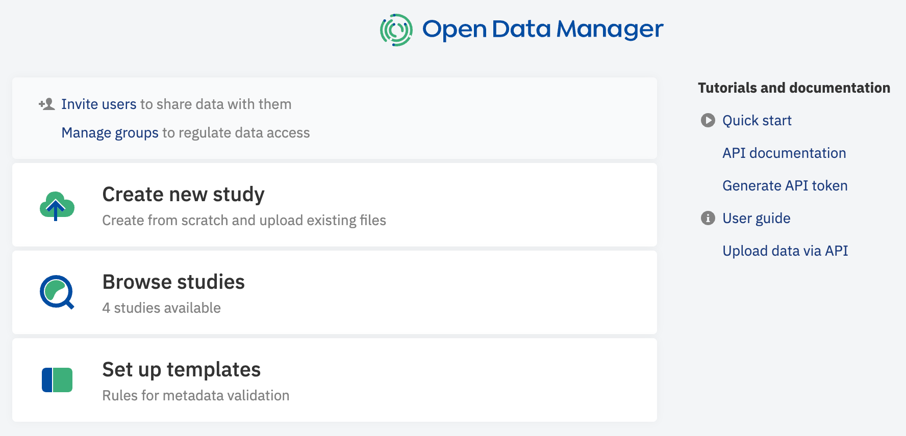

The `Add Data (BETA)` button has been incorporated into the new Data tab (further details about the tab below).

<figure markdown>
  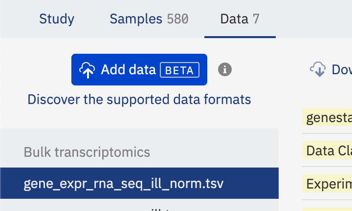{width=360}
</figure>

You now have the ability to import TSV, GCT, VCF, or FACS data from your local computer or via a direct link.

<figure markdown>
  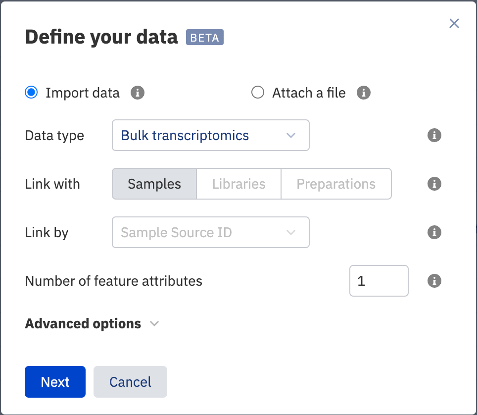{width=480}
</figure>

Moreover, this button can also be used to attach any file to the study.

<figure markdown>
  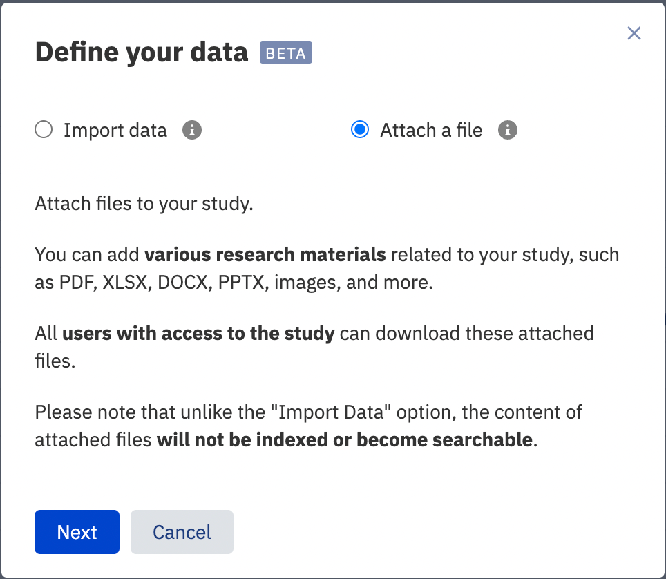{width=480}
</figure>

Please refer to the [Usage](https://odm-user-guide.readthedocs.io/en/latest/doc-odm-user-guide/import-samples-spreadsheet.html#import-data-beta) section for more information on these functionalities.

The Metadata Editor now includes an option to add new custom fields for Study and Data metadata.

<figure markdown>
  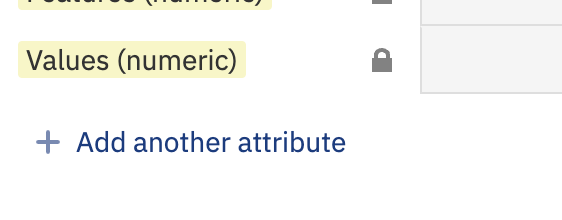{width=280}
</figure>

### [Researchers] Enhanced Data Browsing and Export

The `Signal Type` filter has been replaced with the Data Class filter, which represents all available data types across studies.

<figure markdown>
  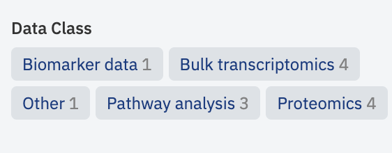{width=320}
</figure>

The `Signal Type` column has been removed from the main study browser panel.

The Expression/Variant/Flow Cytometry tabs have been removed from the Metadata Editor page.

A new `Data` tab has been added to the Metadata Editor page. This tab displays a list of all data files uploaded for the study, organized by their respective `Data Class` parameter (selected during file upload) on the left panel.

<figure markdown>
  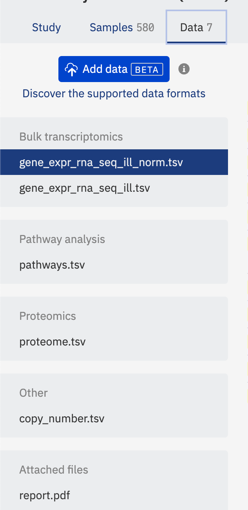{width=320}
</figure>

Clicking on a file enables metadata editing [Curators only] and browsing.

The metadata now includes four mandatory read-only fields that are auto-generated:

- Data Class - the data type selected during file upload.
- Features (string) - string feature column names present in the file (e.g., `Gene Name`).
- Features (numeric) - numeric feature column names present in the file (e.g., `M/Z ratio`).
- Value (numeric) - measurement types if more than one measurement is available per sample/library/preparation (e.g., `Fold Change`, `p-value`).
     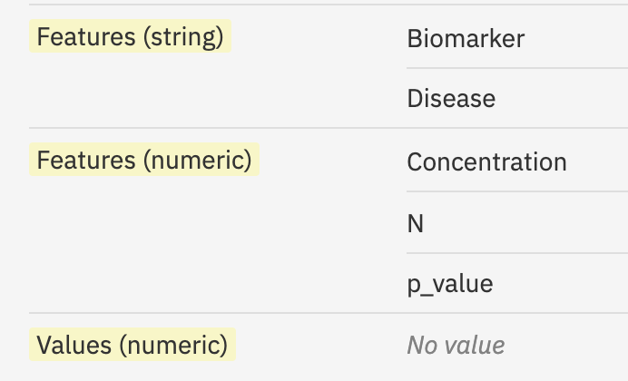{width=300}

These fields are implemented to make the content of these files visible and searchable for data science users. We strongly advise against editing these fields in the template editor, as it could make these files inaccessible. If data is uploaded in the GCT format, `Features (string)`, `Features (numeric)`, and `Value (numeric)` fields are left empty (due to the standard structure of GCT files).

### [Advanced] API Retrieval Improvements

The uploaded data can be searched and extracted using the API endpoint. Similar to the uploading process, data retrieval is performed through Expression parameters of Omics queries (Integration group), with future releases set to introduce new endpoints for this operation.

<figure markdown>
  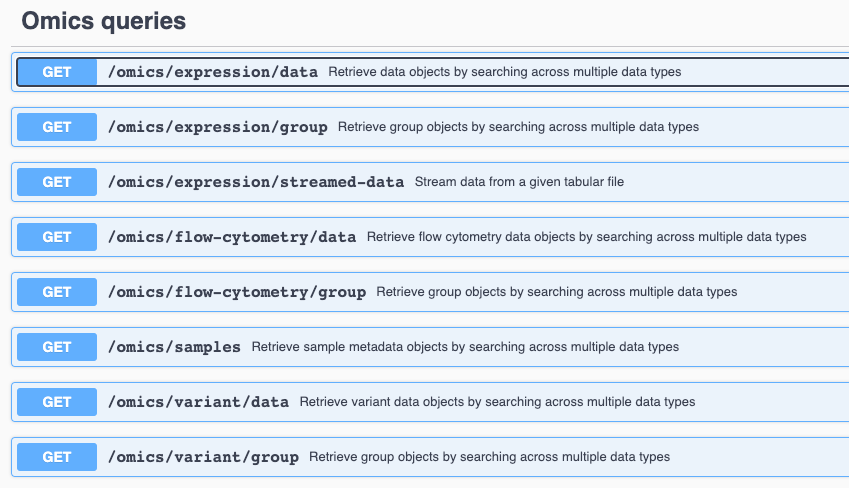{width=640}
</figure>

Each endpoint of Omics queries now has two updated parameters:

- In the `responseFormat` parameter, use the `multi_values` value to extract data in the new format. If your data has multiple features/measurements, they will be extracted in full. If the parameter is unspecified, the output returns only the first feature column and the first measurement per sample. This modification was introduced to maintain backward compatibility for applications built for GCT data extraction.
- `exQuery` has been enhanced and now supports flexible searches across files of any content. Search parameters in `exQuery` include options for feature and measurement filtering:
    - To search by feature (feature keyword), specify the required column name, e.g., `feature.Genes="ZNF814"`.
    - To search by measurement type (value keyword), specify the required column name, e.g., `value.intensity > A`.

New search capabilities include exact matches, multiple matches, range filtering, substring search, search by missing values, and more. Please refer to the corresponding endpoint descriptions in Swagger for details.

### Known Issue

If more than one file with the same name and extension is imported or attached via `Add Data (BETA)` button, then `Export` of the entire Study in one archive does not work.

Do not import/attach files with exactly the same name (and extension) to avoid this issue.
In case, two files with the same names were uploaded, you need to download them one by one.

<figure markdown>
  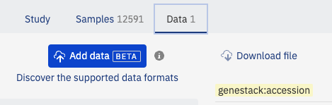{width=420}
</figure>

## 1.52

### GUI features

#### [Curators] Revoking access to a study

Added an ability to unshare a study (revoke access to a study) from a certain user group in Metadata Editor. The feature is available only to the study owner.

<figure markdown>
  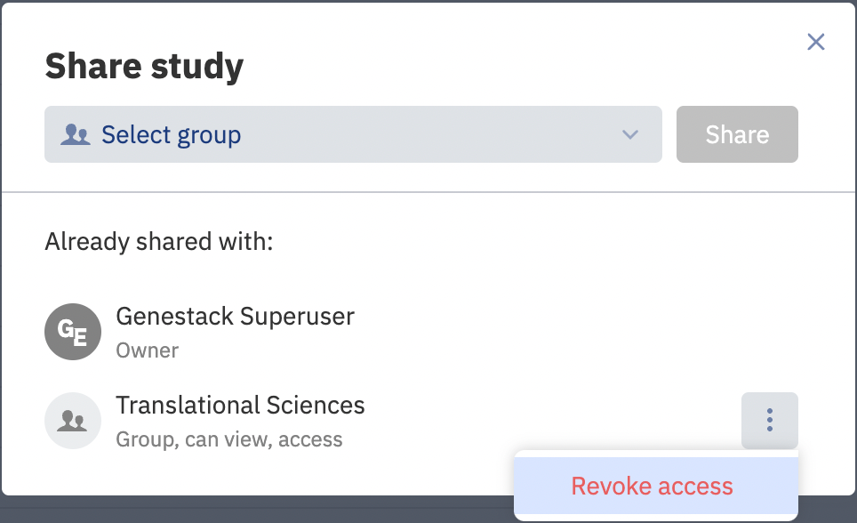{width=400}
</figure>

#### [Curators] Removing a multivalue while editing samples in Metadata Editor

Users can manually remove one of the values in a row with multiple values while editing a metadata sample in Metadata Editor. Previously, multi-valued "No Value" rows were automatically removed only after a new version of the sample metadata was published.

<figure markdown>
  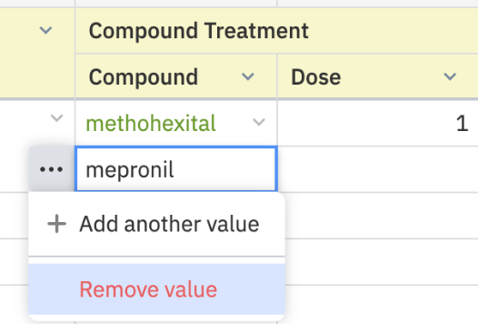{width=320}
</figure>

#### Fixed issues

[Curators].[Metadata Editor] Sometimes sample attributes (with attached dictionaries) with empty values are marked in Metadata Editor as invalid.

[Curators].[Metadata Editor] When multi-value rows in the composite sample attributes have no value, they are merged and not shown in Metadata Editor. In the example, there are "Compound Treatment/Compound", "Compound Treatment/Dose", and "Compound Treatment/Unit"; it is impossible to determine which "Dose" values correspond to a proper "Compound".

<figure markdown>
  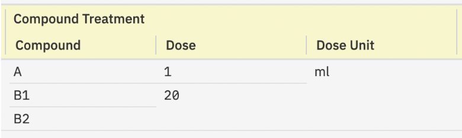{width=420}
  <figcaption>Before fixing the issue</figcaption>
</figure>

<figure markdown>
  {width=420}
  <figcaption>After fixing the issue</figcaption>
</figure>

[Curators].[Metadata Editor] The default dictionary "Cell type" can not be used during the validation of the samples in Metadata Editor. Also, this dictionary cannot be reloaded into ODM.

[Curators].[Metadata Editor] Incorrect sample count is shown on the bulk replace attribute editor dialogue.

[Curators].[Template Editor] The exported json file with template attributes contains only the fields visible in the Template Editor. We have removed the outdated "isSingle" attribute from the file, which could lead to errors when reloading the template to ODM.

### API Changes

#### Fixed issues

[Advanced users] An issue with more than one AND operator in the omics metadata filters.

## 1.51

### New/updated features in this release

**API. Updating the feature of the data upload via NFS** [Curators, Advanced].

??? example "Click here to expand"

    Сurators can import study files from a locally mounted Network File Storage (NFS) to ODM with "write" OR "read-only" access permission. There is no need to configure the “write” permission for the files, as it was before.

**Authentication in API via access token of an identity provider** [Curators, Advanced].

??? example "Click here to expand"

    ODM API and the "import_ODM_data.py" script allow authentication with a Genestack API token OR with an access token of another identity provider. To specify a custom access token, use the "Authorization" header; to set the Genestack API token, use the "Genestack-Api-Token" header.

    Note: access token takes precedence, meaning that if both tokens are supplied, the access token will be used for processing the request. The expansion fully supports Azure Active Directory access tokens. For a different custom Identity Provider, please test ODM API beforehand.

**Linking samples and omics data by any custom key via API** [Curators, Advanced].

??? example "Click here to expand"

    Previously: samples from metadata and omics data files could be linked only using the "Sample Source Id" attribute as a reference. Now curators can choose any sample metadata attribute (column) as a reference to link samples.

    Notes: only template attributes can be used for the linkage; if the value of the sample attribute for the linking changes, the relationship between samples and omics data is not updated automatically. More details about this feature you can find in the swagger, the endpoint `POST/integration/link/expression/group/{sourceId}/to/sample/group/{targetId}`, `linkingAttribute` parameter.

### Fixed issues in the metadata curation process

[Curators] Fixed: a template attribute with invalid metadata is marked as "non-template" when a curator is editing sample metadata in Metadata Editor via the bulk replace.

[Curators] Fixed: a formatting error appears for the study metadata view-only mode when the text in an attribute is not transferred to the next row.

[Curators] Fixed: other minor bugs in Template Editor and Metadata Editor.

### Fixed issues in API

[Advanced] Fixed: the API endpoint GET/omics/expression/streamed-data does not return a proper error when a user specifies a wrong accession of the signal group in the groupAccession parameter. Now the endpoint returns an error 404 Not Found with the message `"Group 'N' could not be found"`.

## 1.50

### New/updated features in this release

**SCIM API for managing users and groups in ODM via Azure Active Directory** [Admins].

??? example "Click here to expand"

    We have added SCIM API endpoints that allow the organization admin to manage users and user groups in ODM via Azure Active Directory. You can find all information about these endpoints and their limitations in Swagger in the "Manage Organization" section. Active Directory and ODM integration via SCIM endpoints instruction is located in the admin guides.

    Since the API endpoints have been developed according to the SCIM 2.0 specification, you can use them with any identity provider that supports working with SCIM. But since each identity provider has custom specifications, we recommend the solution pre-testing.

    We recommend calling user and group synchronization in Active Directory on behalf of the user with the "Manage Groups" permission so that the user can see and edit all groups on the instance, regardless of whether the user is a member of the groups or not.

**Quick start guide videos are added across ODM** [Curators, Researchers].

??? example "Click here to expand"

    Each page contains a button that leads to a video explaining how to work with the page and the related main concepts. In addition, a welcome pop-up appears after the first login. The pop-up contains a link to the Quick Start Guide help page and all videos. Now users can get acquainted with the possibilities of ODM even faster and more conveniently on their own.

### Fixed issues

[Curators] The import_ODM_data.py script incorrectly handled unexpected server responses from URL provided with `--server`: server is down for any reason or a user mistake. Now the script returns an error with clear instructions.

