<!-- markdownlint-disable --> 
# Release notes

!!!info "Target users"

    **Curators** - users responsible for adding new data to ODM and ensuring data harmonization and curation. While curators typically do not have permission to define, create, or edit metadata templates, they can select existing templates to use for their data. Their responsibilities include mapping metadata, associating data with templates, and performing data updates.

    **Researchers** - users who access ODM to identify and retrieve data suitable for further research and analysis. Their activities include searching, browsing, and exporting data.

    **Advanced** - users with access to advanced API functionalities, such as user management and data management operations.

    **Admins** - users who manage the organization in ODM, including overseeing users, groups, and permissions. They are also responsible for creating, defining, and editing metadata templates as needed.

## 1.59 Open Data Manager 2024 Winter Release

This release focuses on optimizing workflows with expanded filtering options for VCF files, streamlined reference genome management, and improved API-based file management, all of which increase flexibility and precision in data handling.

### New Features

#### Enhancements for VCF functionality

1. **[Researchers] Filtering variant data based on genes: variantFeature**

    Starting with release 1.59, ODM streamlines the process of retrieving gene variants within a specified gene region
by introducing the `variantFeature` parameter. Instead of manually specifying chromosome and interval information from
the original VCF file, users can now simply provide a gene name. The system automatically references the associated
genome to determine the intervals, reads the file, and returns the relevant data, making the process faster and more
user-friendly.

    ??? info "variantFeature considerations"

        * Multiple values are provided as a string array.
        * Gene(s) should be supplied (e.g. `TP53`).
        * The system searches for **exact matches** for the supplied gene(s) in the reference genomes.
        * Each gene is resolved to a region for each Reference genome in the system.

    ??? success "Affected endpoints (for both as-curator and as-users) that include `variantFeature` or `vxQuery` parameter"
        The feature search capability using `variantFeature` is added, aiding targeted
        gene searches.

        `variantFeature`:

        * GET `/api/v1/as-user/variants`
        * GET `/api/v1/as-curator/variants`

        `vxQuery`:

        * GET `/api/v1/as-curator/omics/expression/data`
        * GET `/api/v1/as-curator/omics/expression/group`
        * GET `/api/v1/as-curator/omics/flow-cytometry/data`
        * GET `/api/v1/as-curator/omics/flow-cytometry/group`
        * GET `/api/v1/as-curator/omics/samples`
        * GET `/api/v1/as-curator/omics/variant/data`
        * GET `/api/v1/as-curator/omics/variant/group`
        * GET `/api/v1/as-curator/omics/variant/streamed-data`
        === "variantFeature"
            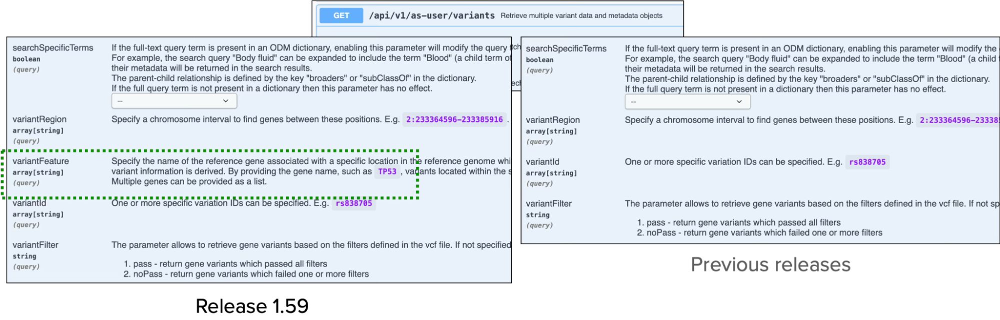
        === "vxQuery"
            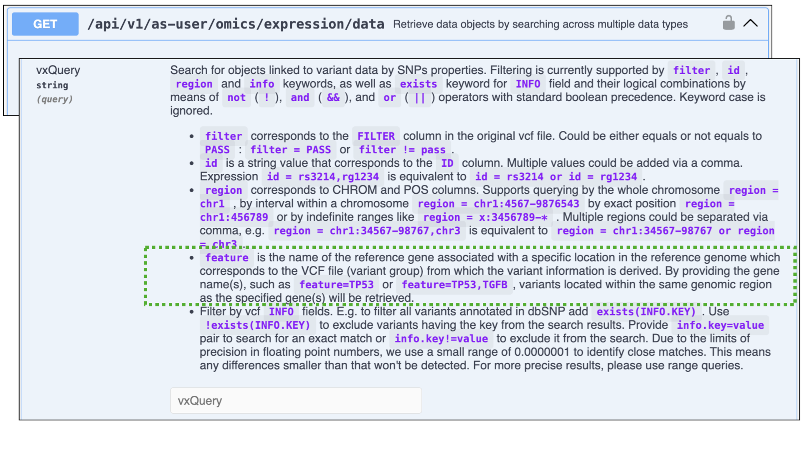

2. **[Researchers] Filtering by the exact match of key values in INFO fields**

    Starting with this release, ODM enhances the precision of filtering variant data by supporting
exact matches in **INFO** fields, improving search specificity. This functionality allows variant data to be
retrieved from studies primarily associated with different data types (e.g., transcriptomics), based on exact
**INFO** field matches.

    This feature is now available across all omics endpoints utilizing this parameter and is fully supported
in `vxQuery`, which introduces a slightly different syntax for this operation.

    ??? abstract "INFO fields considerations"

        * `info.key=value` returns all variants with matching values for the specified INFO field.
        * `info.key\!=value` excludes the variants with the value from the search results.
        * `exists(INFO.KEY)` returns all variants having the KEY among INFO fields
        * `!exists(INFO.KEY)` returns all variants without the KEY
        * Multiple values can be provided for a key, separated by a comma. Equal to `OR` operator.

    ??? success "Affected endpoints (for both as-curator and as-users) that include `variantInfo` or `vxQuery` parameter"
        The parameter `INFO` allows retrieval of data by exact match and is included
        in the GET `/api/v1/as-curator/omics/...` and GET `/api/v1/as-user/omics/...` endpoints.

        `variantInfo`:

        * GET `/api/v1/as-curator/variants`

        `vxQuery`:

        * GET `/api/v1/as-curator/omics/expression/data`
        * GET `/api/v1/as-curator/omics/expression/group`
        * GET `/api/v1/as-curator/omics/flow-cytometry/data`
        * GET `/api/v1/as-curator/omics/flow-cytometry/group`
        * GET `/api/v1/as-curator/omics/samples`
        * GET `/api/v1/as-curator/omics/variant/data`
        * GET `/api/v1/as-curator/omics/variant/group`
        * GET `/api/v1/as-curator/omics/variant/streamed-data`
        === "variantInfo"
            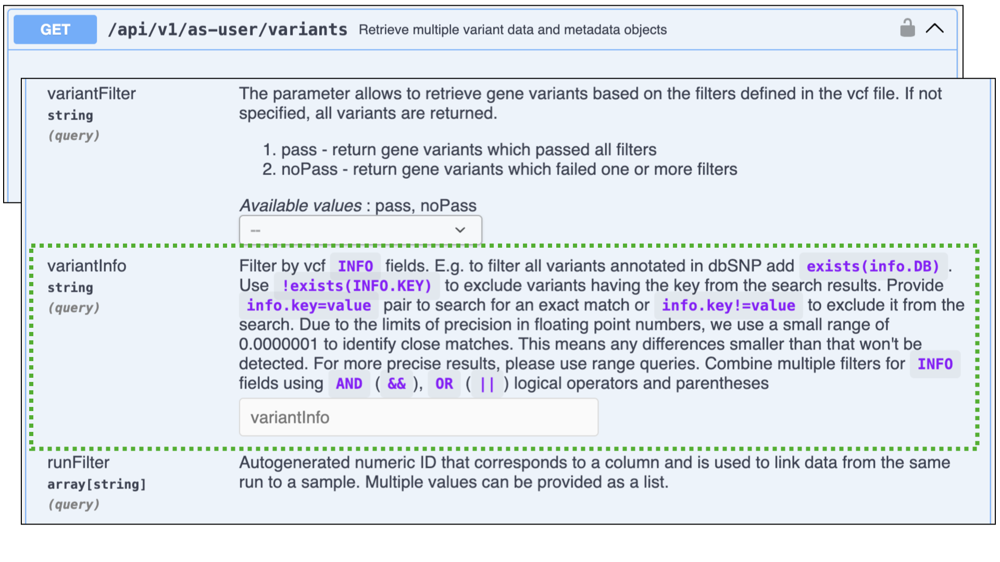
        === "vxQuery"
            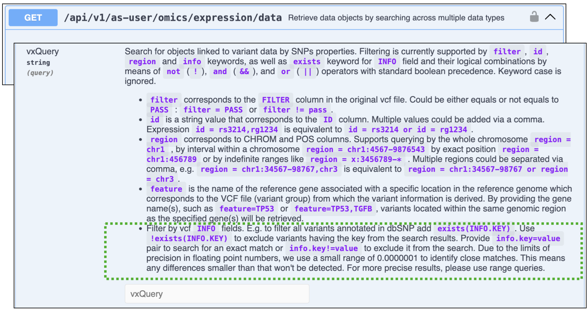

3. **[Researchers] Adding exQuery to variant streaming endpoint**

    With this release, ODM enhances its GET endpoints capabilities, allowing users to retrieve variant data
specifically for samples that are linked to expression data meeting specified filter criteria.
This ensures that variant data is only retrieved for samples with matching linked expression data,
facilitating integrated analysis between expression and variant datasets.

    ??? success "Affected endpoints (for both as-curator and as-users) that include `exQuery` parameter"
        The following endpoints now support streaming expression data:

        * GET `/api/v1/as-curator/omics/variant/streamed-data`
        * GET `/api/v1/as-user/omics/variant/streamed-data`
        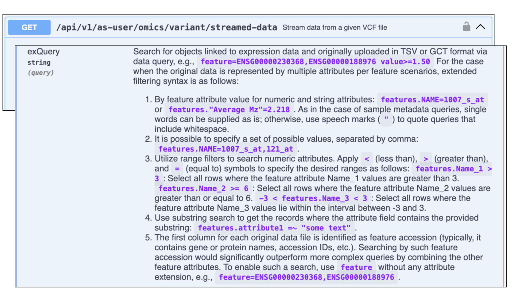

4. **[Researchers] Reference Genome section added to the response**

    To enhance the usability of VCF-related endpoints, the reference genome used for initialising the file in
ODM is retrieved as a part response. The section `referenceGenome` is now displayed in the selected endpoints.

    ??? success "Affected endpoints (for both as-curator and as-users) that include `referenceGenome`"

        * GET `/api/v1/as-user/variants/group`
        * GET `/api/v1/as-curator/variants/group`
        * GET `/api/v1/as-user/variants/group/by/run/{id}`
        * GET `/api/v1/as-curator/variants/group/by/run/{id}`
        * GET `/api/v1/as-user/variants/group/{id}`
        * GET `/api/v1/as-curator/variants/group/{id}`
        * GET `/api/v1/as-user/omics/variant/group`
        * GET `/api/v1/as-curator/omics/variant/group`
        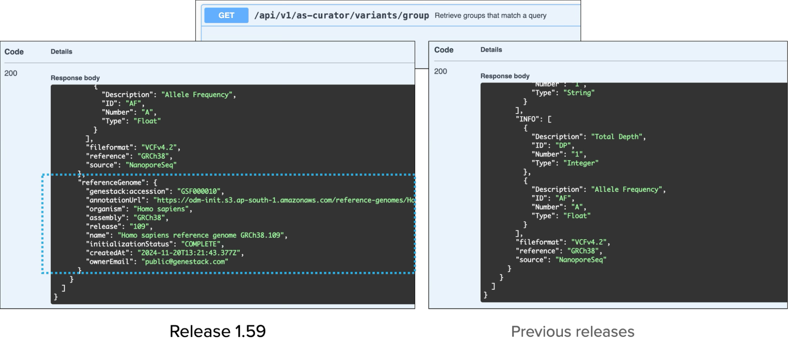
        <figcaption>Each response now includes a <strong>referenceGenome</strong> section that provides details about
        the associated reference genome</figcaption>

5. **[Researchers] New Filtering Parameter: referenceGenomeId**

    A new query parameter, `referenceGenomeId` has been added to the omics endpoints to enable filtering Variant Groups by
Reference Genome ID.

    ??? success "Affected endpoints"  
        The parameter `referenceGenomeId` has been added to selected endpoints, to allow
        retrieval of variant data filtering for specific Reference Genome ID.

        * GET `/api/v1/as-user/omics/variant/group`
        * GET `/api/v1/as-curator/omics/variant/group`
        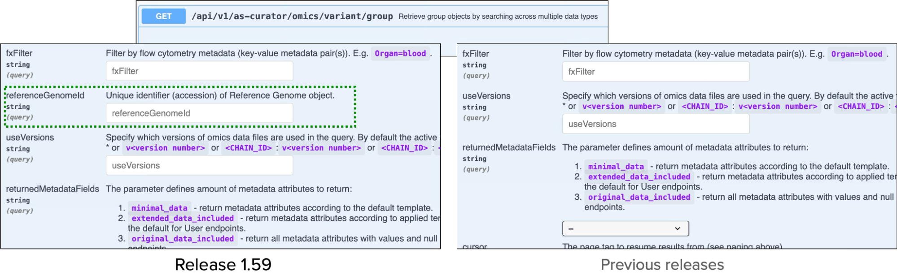

#### Reference Genome functionality

1. **[Curators] New endpoints for importing, and retrieving Reference Genomes**

    Users can now import different versions and builds of reference genomes. Uploading reference genomes is now
available via a new API endpoint: POST `api/v1/reference-genomes`, part of the new definition `referenceGenome`.

    ??? abstract "Important considerations of the Reference Genome endpoints"
        * Only users that are part of the Curator Group can execute the endpoint <code>api/v1/reference-genomes</code> to upload and query reference genomes
        * Each uploaded reference genome should be unique according to a combination of mandatory fields specified in a request body
        * Reference genome requests should include the following parameters:

          | Field Name    | Required | Description                                                                                                                                                                                                                                                                        |
          |:--------------| :---- |:-----------------------------------------------------------------------------------------------------------------------------------------------------------------------------------------------------------------------------------------------------------------------------------|
          | annotationUrl | No | link to the non-vertebrae organism or any custom reference genome in .gtf format, archived in \`.gz\` format. Note: if any of the parameters below do not correspond to the available Ensembl data (for example, organism name or assembly is changed), the link must be provided. |
          | organism      | Yes | Scientific name with the first uppercase letter and underscore as a delimiter (e.g. Homo sapiens).                                                                                                                                                                                 |
          | assembly      | Yes | Major version (e.g. \`GRCh38\`)                                                                                                                                                                                                                                                    |
          | release       | Yes | Ensembl reference genome minor version (for example, \`75\` or \`109\`)                                                                                                                                                                                                            |
          | name          | No | Customized reference genome title that is used for linkage variant files. By default is combined from species, assembly, and release parameters: \`{species} reference genome {assembly}.{release}\`                                                                               |

    ??? success "New Endpoints to retrieve and import Reference Genomes"
        The definition **referenceGenome** has been created. This definition includes endpoints
        to retrieve and upload reference genomes.
        
        * POST `/api/v1/reference-genomes`
        * GET `/api/v1/reference-genomes`
        * GET `/api/v1/reference-genomes/{id}`
        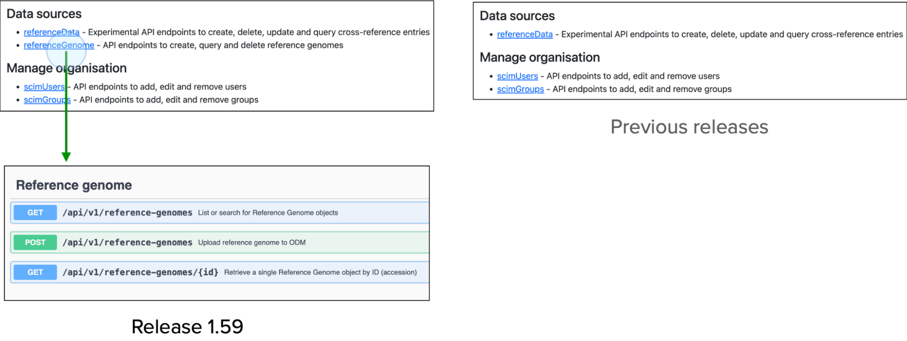

2. **[Admins] Delete Reference Genome**

    !!! warning "**Manage organization** AND **Access all data** permissions are required."

    Release 1.59 introduces the ability to delete both reference genomes and imported files via the 
DELETE `/api/v1/manage-data/data` endpoint.

    ??? abstract "Important considerations to delete Reference Genomes"

        * As a reference genome is required for filtering by genes, variantFeature parameter is expected to not work for the VCF group 
          without a reference genome.
        * If a Reference Genome is linked to any other data and the Reference Genome is deleted, then searching for variant by variantFeature (genes) won't be available 
          for linked VCF groups.

    ??? success "Delete Reference Genomes via manageData"

        * DELETE /api/v1/manage-data/data
        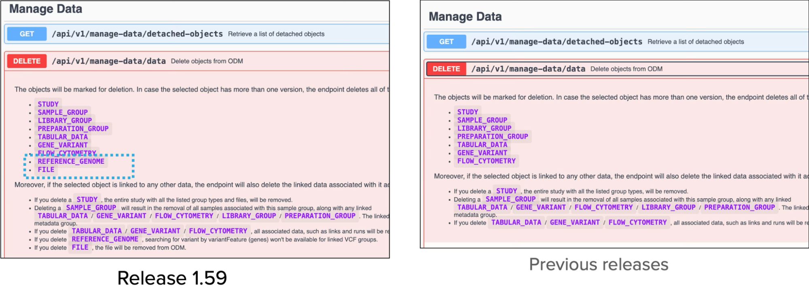
        <figcaption>The endpoint <code>DELETE /api/v1/manage-data/data</code> has been enhanced, allowing the deletion of (attached) files and Reference Genomes from ODM</figcaption>

#### Improved Files Management (formerly known as Attachments)

1. **[Curators] Import Files and assign Data Class upon import via API**

    !!! warning "This feature is only available to customers with a configured S3 bucket for storage"

    On this release, the endpoint POST `/api/v1/jobs/import/file`, which allows the importing of Files (attachments) 
    via API, has been incorporated to import file jobs efficiently.

    In addition, curators now have the flexibility to assign a **Data Class** to uploaded files via API endpoints. 
    This improvement enables better organization of files, making it easier to locate and categorize them for downstream analysis.

    ??? abstract "Important considerations"

        * Upon calling the endpoint
            * An attachment object is created in ODM.
            * The reference between the specified study and the created object is created.
        * Request body:
            * The <code>source</code> field is optional. If no source is provided, the default value is used. 
              Allowed values for source are `S3`, `HTTP`, and `LOCAL`.
            * The <code>dataLink</code> field is mandatory and must contain the link to the file to be attached.
            * The <code>dataClass</code> field is mandatory and it contains the data type (e.g. Bulk Transcriptomics, Lipidomics, etc.).
            * The <code>metadataLink</code> field is optional and allows users to provide a metadata file to add context, which will also be loaded into ODM.
            * The <code>studyAccession</code> field is mandatory and must specify the ID of the study to which the 
              file will be attached.

    ??? success "Endpoint to import Files"
        
        * POST /api/v1/jobs/import/file
        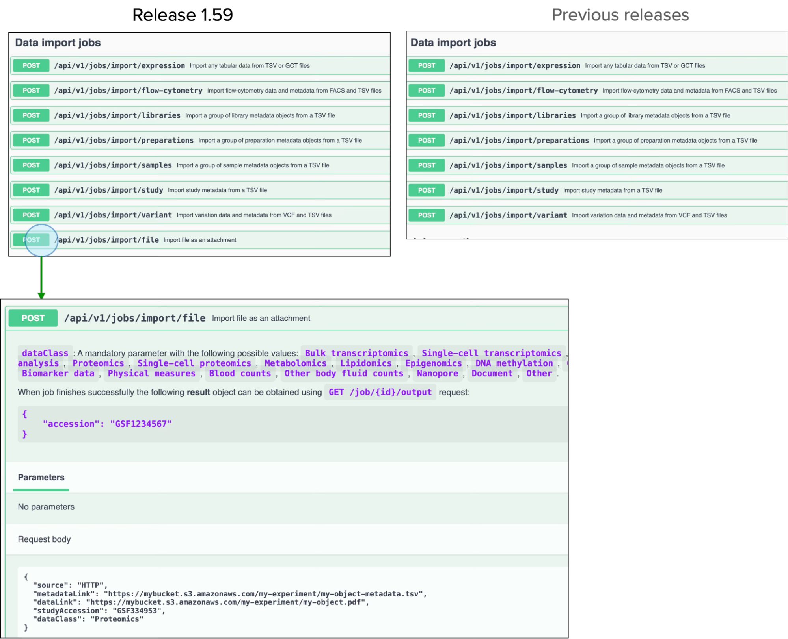{width=800}
        <figcaption>The newly introduced <code>POST /api/v1/jobs/import/file</code> endpoint, users can efficiently import file attachments via APIs</figcaption>

2. **[Curators] Import Files and assign Data Class via User Interface**

    To complement the API improvements, the graphical user interface (GUI) now supports assigning a **Data Class** 
when uploading files. This enhancement ensures that non-technical users can achieve the same level of organization 
without relying on APIs.

    * Enhancements in the GUI:
        * A Data Class dropdown has been added to the file attachment window.  
        * Updated tooltip for the **Attach a file** button:  
        * Add various research materials related to your study, such as PDFs, XLSX, DOCX, PPTX, images, and more.

    ??? abstract "Important considerations"  
        * All users with access to the study can download the attached files.  
        * Unlike the **Import Data** option, the attached files’ content will not be indexed for search but can be located using their name and metadata.  
        * The attached files are grouped by their Data Class and now include a **unique identifier (accession number)** for easier retrieval.
        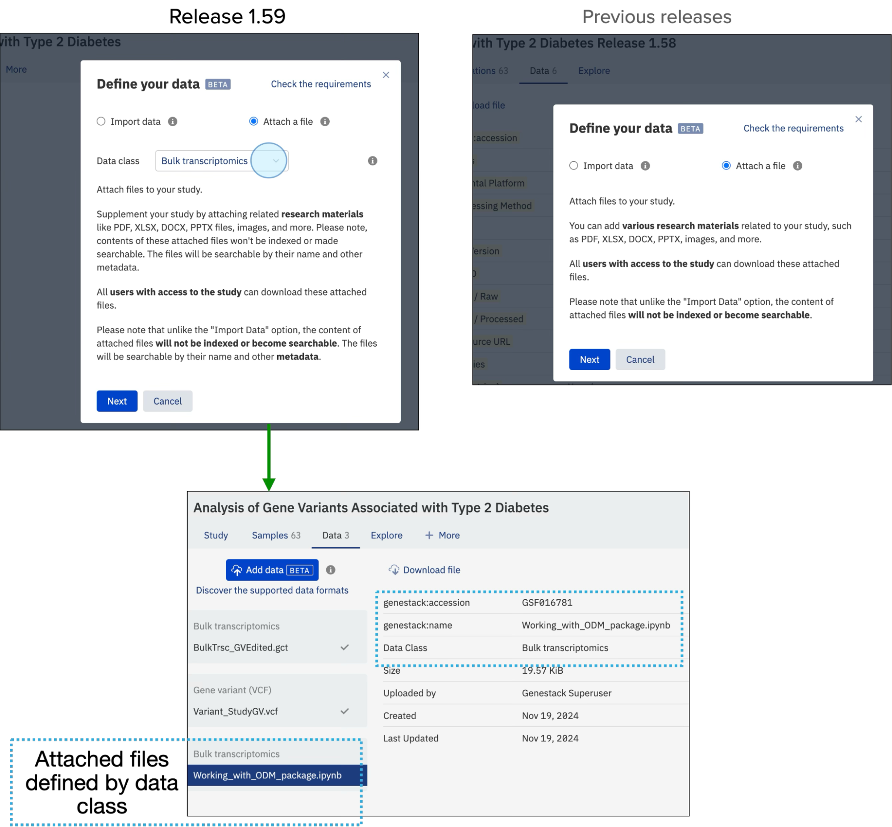{width=700}
        <figcaption>Import files via GUI, assign a data class, and view attached files in the Data tab, complete with their type and accession number</figcaption>

3. **[Curators] Metadata Management for Attached Files**

    Managing metadata for attached files is now as straightforward as managing metadata for other entities in the system. 
This includes capabilities for browsing, updating, and searching metadata.

    ??? abstract "Important considerations"

        * Metadata can be imported via API from a File.
        * Each file is assigned a label (e.g., Bulk transcriptomics) and a unique **accession number**.
        * File metadata is indexed and can be searched in the **Study Browser** (and later through APIs).
        * Curators can erit Metadata. However, restoring previous versions is not allowed in current release.

    ??? success "Displayed Metadata in GUI"
          
          Technical Fields (view-only):
   
           * Accession number
           * Data Class
           * Name
           * Size
           * Uploaded by
           * Created/Last Updated
   
          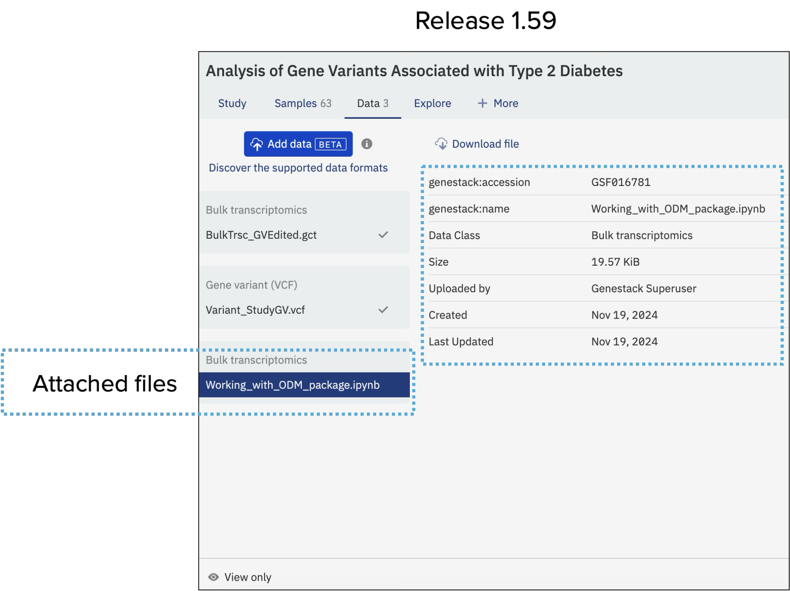{width=800}
          <figcaption>Attached files’ metadata can now be managed efficiently in the GUI</figcaption>

4. **[Researchers] Retrieving File Metadata**

    We introduce the new definitions **File User** and **File Curator.** These APIs allow users to programmatically retrieve files and their metadata, enhancing integration with automated workflows and external tools

    ??? success "New endpoints to retrieve File's metadata"
        * GET/api/v1/as-user/files/{id}  
        * GET/api/v1/as-user/files  
        * GET/api/v1/as-user/integration/link/files/by/study/{id}
        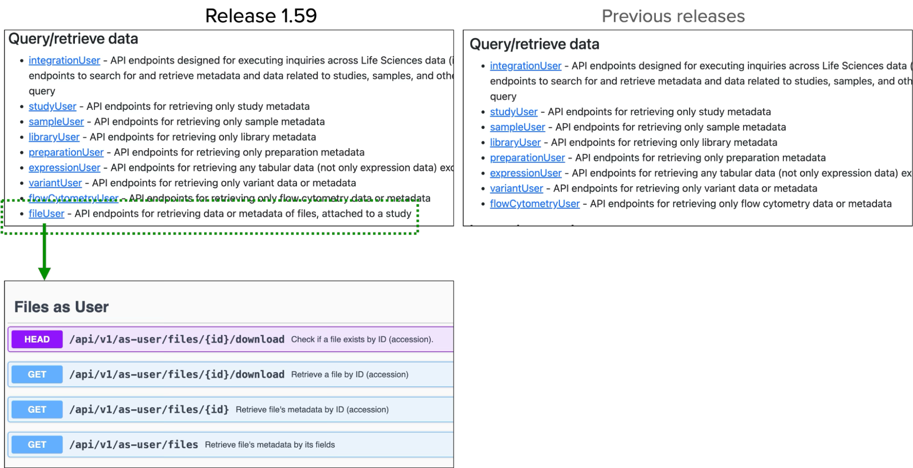{width=800}
        <figcaption>File retrieval endpoints simplify metadata access and system integration</figcaption>

5. **[Researchers] Retrieve Studies by Files’ Metadata**
    From this release, attached files metadata are fully indexed and searchable in the Study Browser and APIs.
Users can now retrieve studies that contain specific files based on their metadata.

    ??? success "Endpoints for Study by Files' metadata retrieval"
        * GET /api/v1/as-user/integration/link/study/by/file/{id}
        * GET /api/v1/as-user/integration/link/studies/by/files
        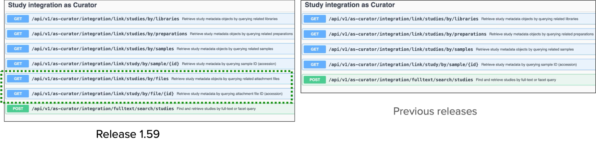
        <figcaption>Retrieve studies related to specific files via API using metadata, enabling efficient navigation of complex datasets</figcaption>

6. **[Researchers] Download attached files via APIs**

    From release 1.59, downloading attached files is no longer limited to the GUI. Users can now retrieve files via API, enabling automated access and integration with external workflows

    ??? abstract "Important considerations"
        * To download, users must provide the file’s unique **accession ID**.
        * The file is fetched from its storage (S3) and returned as a downloadable response, provided the user has the appropriate permissions

    ??? success "Endpoints to Download files"  
        
        Download File by its ID:

        * GET `/api/v1/as-user/files/{id}/download`
        * GET `/api/v1/as-curator/files/{id}/download`

        Download Files in batches:

        * HEAD `/api/v1/as-user/files/{id}/download`
        * HEAD `/api/v1/as-curator/files/{id}/download`

        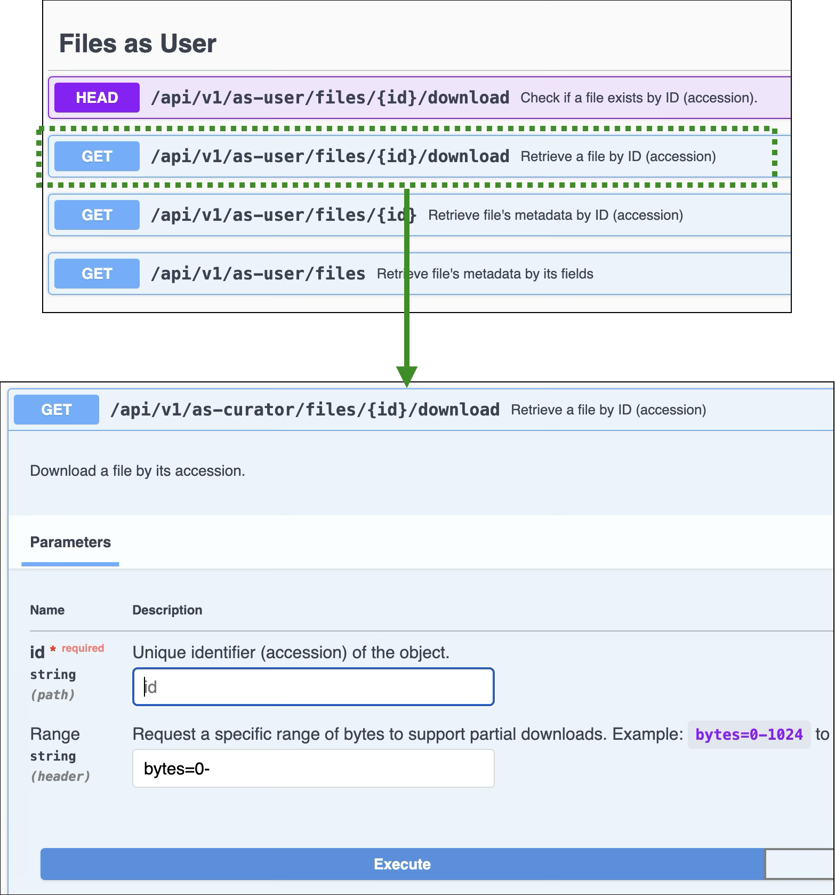{width=800}
        <figcaption>GET `/api/v1/as-user/files/{id}/download` and HEAD GET `/api/v1/as-user/files/{id}/download` allow users to retrieve attached files by indicating the accession number</figcaption>

7. **[Admins] Delete Files**

    !!! warning "**Manage organization** AND **Access all data** permissions are required"

     Release 1.59 introduces the ability to delete imported files via the DELETE `/api/v1/manage-data/data` endpoint, 
streamlining data lifecycle management and ensuring project relevance, accuracy, and compliance.

#### [All Users]

1. **Study Menu was duplicated**

    The Study Menu now offers enhanced access options, making it easier to navigate ODM. 
Users can access the menu from both the top and right sides of the metadata editor, streamlining data management workflows.

    ??? abstract "Study Menu"
        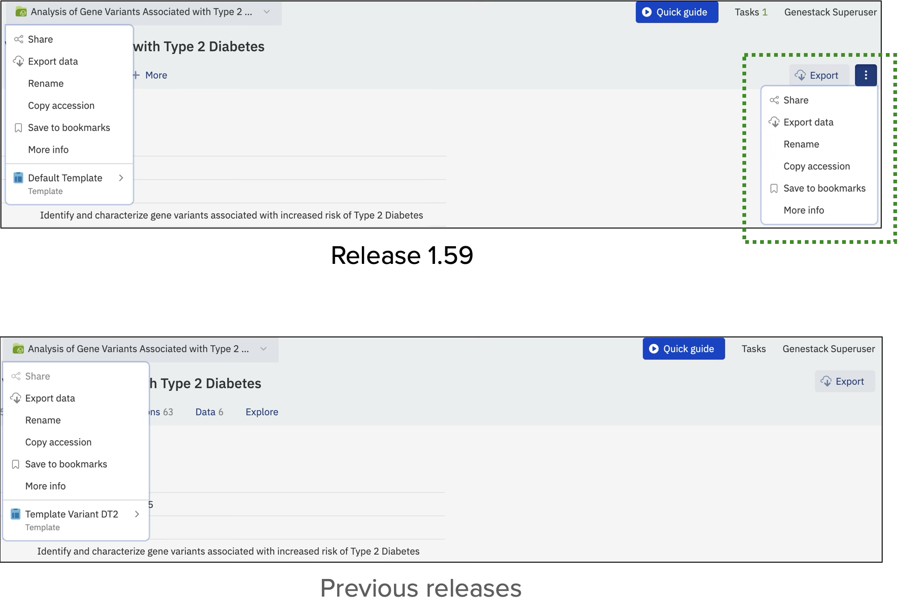{width=800}
        <figcaption>Updated view of the metadata editor. The menu can easily be accessed from the top part of the study, or by clicking on the right side, next to the Export button</figcaption>

2. **New “File Manager” app on the Dashboard Menu**

    The dashboard now includes a dedicated File Manager accessible from the sidebar menu. This feature lets users view and filter files by type, such as Reference Genome, Flow Cytometry group, Library, and Sample Metadata.

    ??? abstract "Important considerations"
        * Filters will be displayed in alphabetic order.
        * If no filters are applied, all types will be displayed; however, Reference Genomes and Dictionaries are selected by default.

        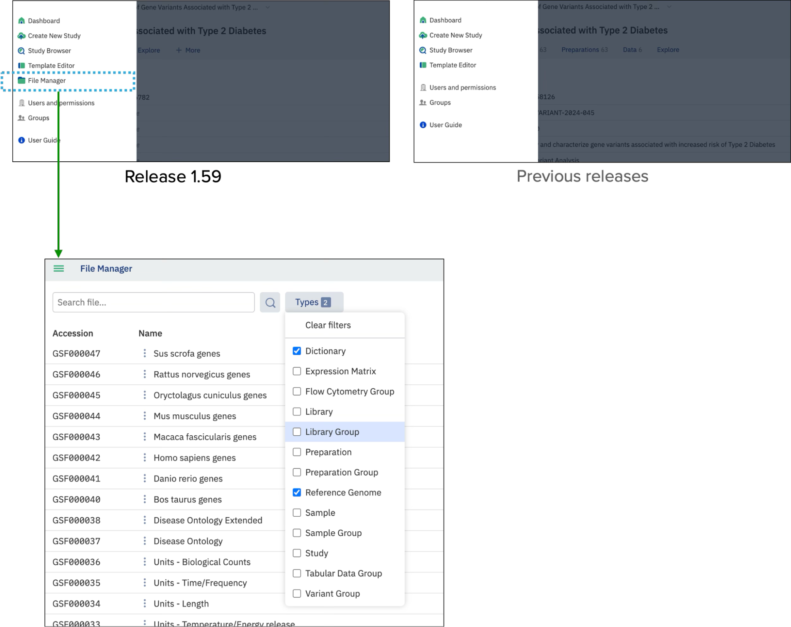{width=800}
        <figcaption>Access the File Manager section by clicking on the top left menu</figcaption>

3. **Mark Indexed Data Files on GUI**

    * Indexed Data Files display the label **Indexed Data** and a checkmark icon.
    * Non-indexed files are differentiated, helping users identify files that require additional processing.
    * **Tooltip:** Hovering over the label or icon displays the message: 
      *The entire content of this file is available for search and data exploration via API*

    ??? abstract "Indexed Data label"
        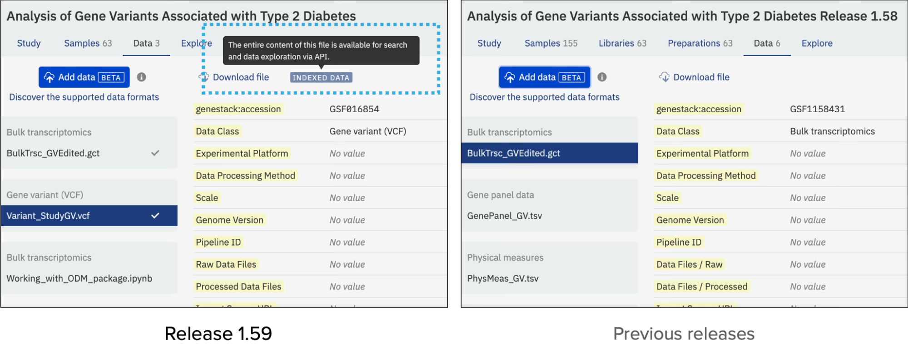
        <figcaption>Visual indicators clarify file indexing status in the GUI, ensuring better user awareness and efficiency</figcaption>

4. **New "Document" and "Flow Cytometry (FCS)" Data Classes**

    * New **Document** and **Flow Cytometry (FCS)** data classes are available for selection during the upload of Files.
       These new classes are integrated within the Metadata Editor and Study Browser.
    * Old **Flow Cytometry** data class was renamed to **Flow Cytometry (FACS)**.

### Fixed Issues

1. **Remove outdated endpoints: Eliminating sync POST and DELETE endpoints**

    Release 1.59 refines the ODM APIs by removing outdated and less efficient endpoints, making the API functionality more reliable, streamlined, and user-friendly. While permissions for posting data remain unchanged and available to all curators, administrative permissions are still required for <code>manageData</code> operations. These updates simplify the API and enhance usability for all users.

    ??? abstract "Important considerations"
        * To import data, users need to use the **job** endpoints (POST `/api/v1/jobs/import/...`)
        * To delete data, users need to access the **manageData** endpoints (DELETE `/api/v1/manage-data/data`)
        * Deletion of data is exclusively available to users classified as Administrators

    ??? failure "Endpoints removed"

        Expression:

        * POST `/api/v1/as-curator/expressions/group/{id}`
        * DELETE `/api/v1/as-curator/expressions/gct`

        Variants:

        * POST `/api/v1/as-curator/variants/vcf`
        * DELETE `/api/v1/as-curator/variants/group/{id}`
        
        Flow Cytometry:
   
        * POST `/api/v1/as-curator/flow-cytometries/facs`
        * DELETE `/api/v1/as-curator/flow-cytometries/group/{id}`
        
        Preparations:

        * POST `/api/v1/as-curator/preparations`
        * DELETE `/api/v1/as-curator/preparations/{id}`
        * DELETE `/api/v1/as-curator/preparations/group/{id}`
        
        Libraries:

        * POST `/api/v1/as-curator/libraries`
        * DELETE `/api/v1/as-curator/libraries/{id}`
        * DELETE `/api/v1/as-curator/libraries/group/{id}`

        Samples:
        
        * POST `/api/v1/as-curator/samples`
        * DELETE `/api/v1/as-curator/samples/{id}`

        Studies:

        * POST `/api/v1/as-curator/studies`
        * DELETE `/api/v1/as-curator/studies/{id}`

2. **Performance Optimization for Sample Search API Endpoint**

    Release 1.59 addresses a performance bottleneck reported by clients when using the <code>/integration/link/samples/by/study/</code> endpoint to search samples by study accession.  
The bottleneck was identified as the method making individual calls to the core container for each sample. This approach has been optimized to process samples in batches, significantly improving response times.

    Response times for the <code>/integration/link/samples/by/study/</code> endpoint are now substantially faster, ensuring a more efficient and seamless user experience.

    Genestack ODM Version 1.59 is designed to enhance user experience, providing comprehensive tools for managing omics data with precision and flexibility. These updates ensure that customers have access to improved data management capabilities, enabling more effective data integration and retrieval processes.

## 1.58 Open Data Manager 2024 Summer Release: VCF functionality

### New Features

We've completely overhauled the support for variant data in VCF files to enhance performance with larger files.

!!! tip "Previously uploaded VCF data will be automatically migrated to the new output formats only if the source link is still valid and data can be accessible via it."

#### [Curators]

**Support now includes the ability to upload compressed VCF files**.
We have also increased the speed of file uploading and indexing for these large files at the following API endpoints:

* POST `/api/v1/jobs/import/variant`
* POST `/api/v1/as-curator/variants/vcf`

Additionally, the system can now handle up to ten VCF files being uploaded simultaneously.

#### [Researchers]

1. **Enhanced parsing functionality:**
Uploading new VCF files now ensures that the INFO and Genotype fields are correctly split and
parsed based on the data types (String and Numeric) specified in the VCF file header.** This enhancement aids in
constructing more detailed filters for variant identification.
2. **Enhanced vxQuery Parameter:**
The vxQuery parameter has been enhanced to support variant filtering based on `filter`, `id`, and `region` keywords,
along with their logical combinations using `not (!)`, `and (&&)`, and `or (||)` operators, respecting standard
Boolean precedence.

    ??? abstract "vxQuery Parameter abilities"
        * `filter` corresponds to the `FILTER` column in the original vcf file. Could be either equals or not equals
        to `PASS` : `filter = PASS` or `filter != PASS`.
        * `id` is a string value that corresponds to the `ID` column. Multiple values could be added via a comma.
         Expression `id = rs3214,rg1234` is equivalent to `id = rs3214 or id = rg1234`.
        * `region` corresponds to CHROM and POS columns. Supports querying by the whole chromosome `region = chr1`,
        by interval within a chromosome `region = chr1:4567-9876543` by exact position `region = chr1:456789` or by
        indefinite ranges like `region = x:3456789-*` . Multiple regions could be separated via comma,
        e.g. `region = chr1:34567-98767,chr3` is equivalent to `region = chr1:34567-98767 or region = chr3`.
  
    ??? danger "Affected endpoints (for both as-curator and as-users) that include vxQuery parameter"  
        * GET `/api/v1/as-curator/omics/expression/data`
        * GET `/api/v1/as-curator/omics/expression/group`
        * GET `/api/v1/as-curator/omics/flow-cytometry/data`  
        * GET `/api/v1/as-curator/omics/flow-cytometry/group`  
        * GET `/api/v1/as-curator/omics/samples`  
        * GET `/api/v1/as-curator/omics/variant/data`  
        * GET `/api/v1/as-curator/omics/variant/group`

3. **Retrieving Original VCF Annotation Data**
When a new VCF file is uploaded, the format and descriptions from the VCF header are stored and available for query.
This allows users to understand available fields for filtering. Annotation details are added under the “metadata”
section in the response for relevant endpoints.

    ??? danger "Affected endpoints (for both as-curator and as-users)"
        * GET `/api/v1/as-user/variants/group`  
        * GET `/api/v1/as-user/variants/group/by/run/{id}`  
        * GET `/api/v1/as-user/variants/group/{id}`  
        * GET `/api/v1/as-user/omics/variants/group`

4. **Data Export in VCF Format**
    1. Users can now stream data from a specific VCF file group, applying:
        1. Variant filters to export only the required set of variants.
        2. Metadata filter to export only the samples corresponding to the specified metadata attribute values.
    2. Unfiltered requests will export the complete dataset.
    3. Endpoints introduced:
        * GET `/api/v1/as-curator/omics/variant/streamed-data`
        * GET `/api/v1/as-user/omics/variant/streamed-data`

5. **Changed response format for all data types (Variants, Expression, and Flow cytometry)**

    We are implementing updates to our API product to provide a more consistent and efficient experience.
The updates include changes to the response format, the addition of a new parameter, and the deprecation of outdated
features.
The response format changes affect the response format only for the GET endpoints for Tabular
(including Gene Expression), Variant, and Flow Cytometry data that provide output in a JSON-like format.
Streaming GET endpoints that provide output in a tabular format are not affected.
Please review the documentation, as these changes may impact your integrations.

    1. **Common changes for all data types**

        ??? abstract "Introduced changes to all data types"
            | Introduced change                                   | Changes Description         |
            |:----------------------------------------------------|:----------------------------|
            | New “**itemOrigin**” section in the response format | A new section **“itemOrigin”** is introduced in the response body to store information regarding the origin of the data item: **runSourceId** - run id from the original file, **runId** - Genestack run id generated upon import, **groupId** - id of the original file. |
            ||“**Run Source ID**” is moved from the metadata section to “itemOrigin” and renamed to “runSourceId”. In the OMICS Endpoints (integrationCurator, integrationUser) **sampleFilter**, **libraryFilter** or **preparationFilter** can be used for retrieving an individual run.|
            | New “**runSourceFilter**” parameter                 | A new parameter allows filtering data by the Run IDs from the original files.  |
            | “**runFilter**” parameter takes list of strings     | “**runFilter**” parameter which is taking the auto generated internal id for runs takes list of strings |
            | Deprecated filter option                            | FIltering by “**Run Source ID**” in the metadata filter is not available.     |

        ??? example "Response example"
    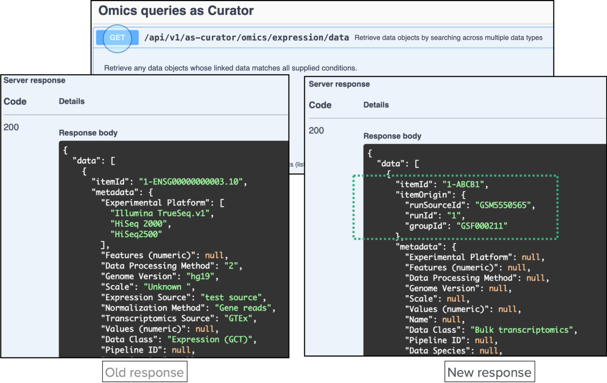

        ??? danger "Affected endpoints (for both as-curator and as-users)"
               | Endpoint Group       | Endpoints Affected                                                                                                                      |
               |:---------------------|:----------------------------------------------------------------------------------------------------------------------------------------|
               | expressionUser       | GET `/api/v1/as-user/expressions` GET `/api/v1/as-user/expressions/{id}`                                                                    |
               | expressionCurator    | GET `/api/v1/as-curator/expressions` GET `/api/v1/as-curator/expressions/{id}`                                                              |
               | variantUser          | GET `/api/v1/as-user/variants` GET `/api/v1/as-user/variants/{id}`                                                                          |
               | variantCurator       | GET `/api/v1/as-curator/variants` GET `/api/v1/as-curator/variants/{id}`                                                                    |
               | flowCytometryUser    | GET `/api/v1/as-user/flow-cytometries` GET `/api/v1/as-user/flow-cytometries/{id}`                                                          |
               | flowCytometryCurator | GET `/api/v1/as-curator/flow-cytometries` GET `/api/v1/as-curator/flow-cytometries/{id}`                                                    |
               | integrationUser      | GET `/api/v1/as-user/omics/expression/data` GET `/api/v1/as-user/omics/variant/data` GET `/api/v1/as-user/omics/flow-cytometry/data`          |
               | integrationCurator   | GET `/api/v1/as-curator/omics/expression/data` GET `/api/v1/as-curator/omics/variant/data` GET `/api/v1/as-curator/omics/flow-cytometry/data` |

    1. **Tabular Data Endpoint Changes**

          * ??? abstract "Introduced changes to Tabular Data"

              | Introduced change                                   | Changes Description                                                                                                                                                                                                                                                                                                                                                                                                                                                                                                                                       |
              |:----------------------------------------------------|:----------------------------------------------------------------------------------------------------------------------------------------------------------------------------------------------------------------------------------------------------------------------------------------------------------------------------------------------------------------------------------------------------------------------------------------------------------------------------------------------------------------------------------------------------------|
              | Deprecating old response format | The old response format for tabular data will be deprecated. The **"multi_value"** response format (introduced in July 2023) will be the default option. It allows retrieval of data with one or more features and suits any type of tabular data, including **.gct** files. |
              | Changing field name | The **“gene”** field is renamed to **“feature”** and incorporates all the feature attributes. The **“expression”** field with the measurement value for the **“feature”** was renamed to **“value”** and placed in the new **“value”** section. |

        ??? example "Response example"
      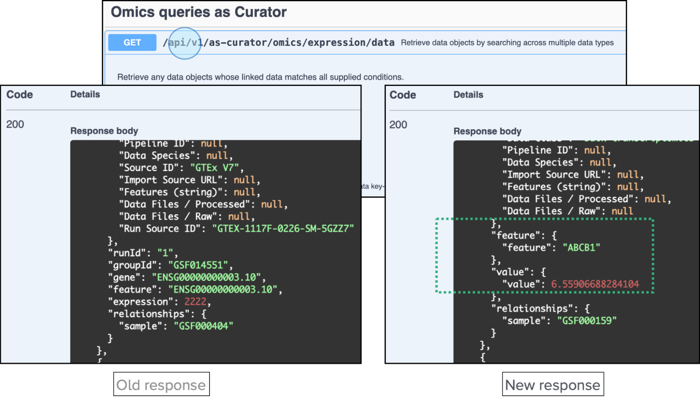

          * ??? danger "Affected endpoints (for both as-curator and as-users)"

              | Endpoint Group       | Endpoints Affected                                                                                                                      |
              |:---------------------|:----------------------------------------------------------------------------------------------------------------------------------------|
              | expressionUser       | GET `/api/v1/as-user/expressions` GET `/api/v1/as-user/expressions/{id}`                                                                    |
              | expressionCurator    | GET `/api/v1/as-curator/expressions` GET `/api/v1/as-curator/expressions/{id}`                                                              |
              | integrationUser      | GET `/api/v1/as-user/omics/expression/data`  |
              | integrationCurator   | GET `/api/v1/as-curator/omics/expression/data` |

    2. **Variants Endpoint Changes**

          * ??? abstract "Introduced changes to Variants"

              | Introduced change                                   | Changes Description                                                                                                                                                                                                                                                                                                                                                                                                                                                                                                                                       |
              |:----------------------------------------------------|:----------------------------------------------------------------------------------------------------------------------------------------------------------------------------------------------------------------------------------------------------------------------------------------------------------------------------------------------------------------------------------------------------------------------------------------------------------------------------------------------------------------------------------------------------------|
              | Introducing **“variant”** section | A new section **“variant”** contains all fields related to a specific variation from the original VCF file: CHROM, POS, ID, REF, ALT, QUAL, FILTER, INFO. |

        ??? example "Response example"
      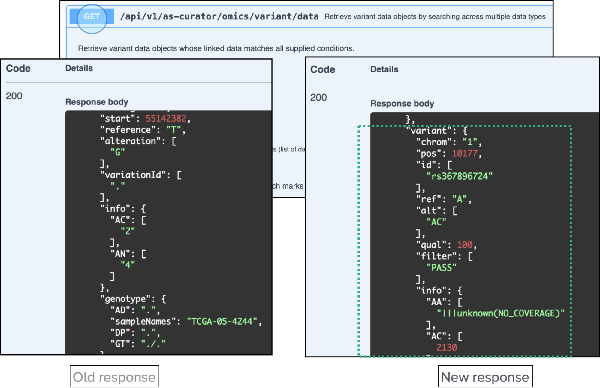

          * ??? danger "Affected endpoints (for both as-curator and as-users)"

              | Endpoint Group       | Endpoints Affected                                                                                                                      |
              |:---------------------|:----------------------------------------------------------------------------------------------------------------------------------------|
              | variantUser          | GET `/api/v1/as-user/variants` GET `/api/v1/as-user/variants/{id}`                                                                          |
              | variantCurator       | GET `/api/v1/as-curator/variants` GET `/api/v1/as-curator/variants/{id}`                                                                    |
              | integrationUser      | GET `/api/v1/as-user/omics/variant/data`   |
              | integrationCurator   | GET `/api/v1/as-curator/omics/variant/data`|

    3. **Flow Cytometry Endpoint Changes**

          * ??? abstract "Introduced changes to Flow Cytometry"

              | Introduced change                                   | Changes Description                                                                                                                                                                                                                                                                                                                                                                                                                                                                                                                                       |
              |:----------------------------------------------------|:----------------------------------------------------------------------------------------------------------------------------------------------------------------------------------------------------------------------------------------------------------------------------------------------------------------------------------------------------------------------------------------------------------------------------------------------------------------------------------------------------------------------------------------------------------|
              | Introducing **“feature”** and **“value”** sections | Flow-cytometry data response now has section **“feature”** including **"readoutType"**, **"cellPopulation"** and **"marker"** fields. **“Value”** section contains the expression field which is renamed to **“value”**.|
              | Changing field name             | The old **“expression”** field with the measurement for the **“feature”** was renamed to **“value”** and placed into the new “value” section. |

        ??? example "Response example"
      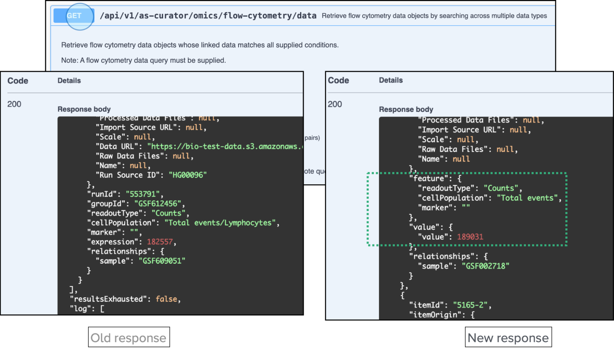

          * ??? danger "Affected endpoints (for both as-curator and as-users)"

              | Endpoint Group       | Endpoints Affected                                                                                                                      |
              |:---------------------|:----------------------------------------------------------------------------------------------------------------------------------------|
              | flowCytometryUser    | GET `/api/v1/as-user/flow-cytometries` GET `/api/v1/as-user/flow-cytometries/{id}`                                                          |
              | flowCytometryCurator | GET `/api/v1/as-curator/flow-cytometries` GET `/api/v1/as-curator/flow-cytometries/{id}`                                                    |
              | integrationUser      | GET `/api/v1/as-user/omics/flow-cytometry/data`          |
              | integrationCurator   | GET `/api/v1/as-curator/omics/flow-cytometry/data` |

#### [All Users]

1. **User Guide Update**: A revised user guide is now available, featuring a series of new quick start guide articles.
    * [Quick Start Guide](../user-guide/quick-start/index.md) - introduction to User Interface and API documentation.
      * [Advanced User Interface Guide](../user-guide/index.md)
      
    !!! note "We are working on making our guide better. Please reach us in case of any inconsistency."

2. **Lipidomics Data Class**: A new **Lipidomics** data class is available for selection during the upload of tabular data files.
This new class is integrated within the metadata editor and study browser.
    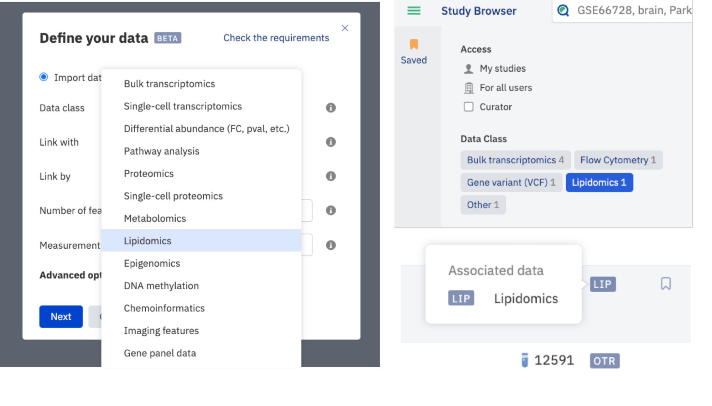

### Fixed Issues

#### [Curators]

1. **Data Curation in Metadata Editor**: It's now possible to delete a sub-attribute value, which will remove the
entire compound attribute value.
2. **Data Deletion**: Fixed an issue where the deletion of a related tabular data file could make an entire study
unavailable.

#### [Researchers]

1. **Data Exploration**: Attribute count will now recalculate upon more then one attribute selection for plot creation.
2. **Data Export**: An error message will now display when attempting to export a data file that has been deleted
from the original AWS S3 storage, prompting users to contact the study owner.

## 1.57 Open Data Manager 2024 Spring Release

### New Features

**[Curators]** Samples Import via the User Interface:

* Support for importing up to 10 000 samples.
* The preview pop-up now allows checking for 1 000 samples before uploading.
  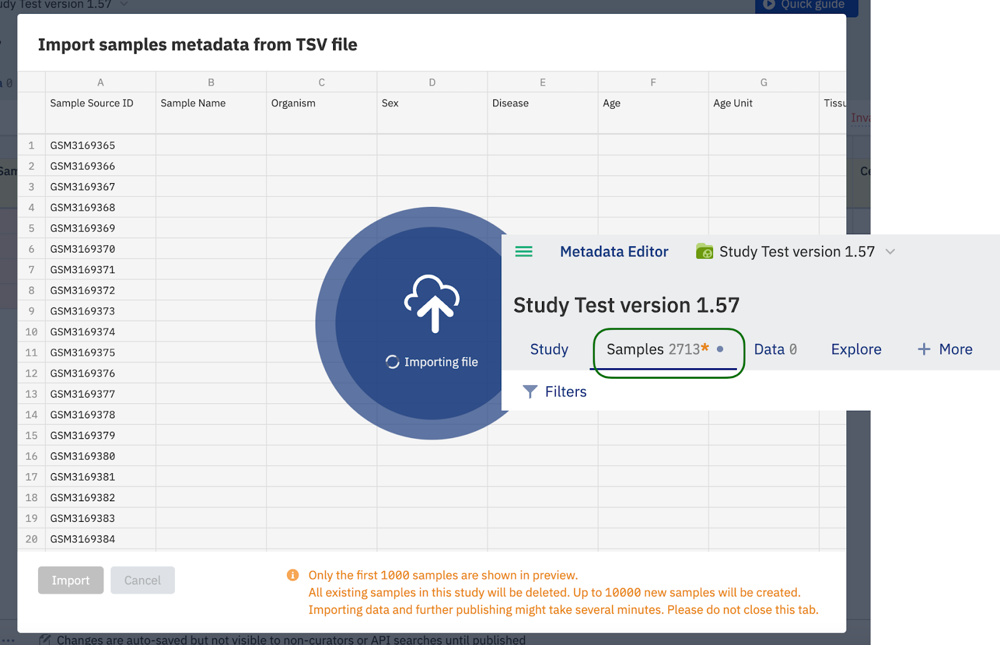

An example of a Sample uploading preview pop-up. The file contains 2713 samples, while preview allows browsing the
first 1000 rows of the file prior to uploading.

**[Curators]** Libraries and Preparation Import via the User Interface (previously available only in the API):

* Added a "+More" button to select the uploading of Libraries and Preparation.
* Increased import limit for a Libraries and Preparations files to 128 MB.
  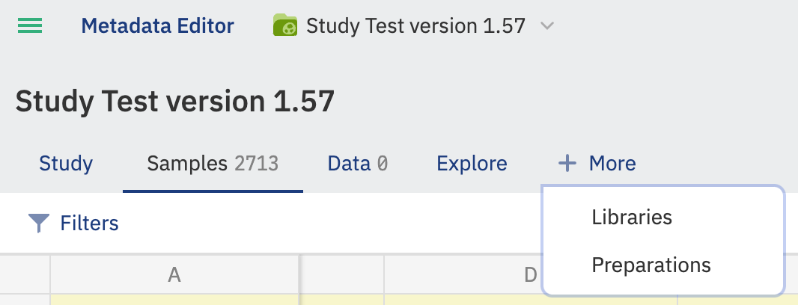

Libraries/Preparations file requirements: all Sample IDs mentioned in the file must match Sample IDs previously
uploaded in the Samples tab for the selected Study

**[Researchers]** Data Exploration for Samples metadata:

* A new ‘Explore’ button on the Study page launches sample data visualization.
* Explore view enriched with:
    * Sample attribute selection capabilities. Each attribute is associated with the total number of unique values
  and the nature of the attribute: "string" for categorical and "numeric" for continuous attributes.
    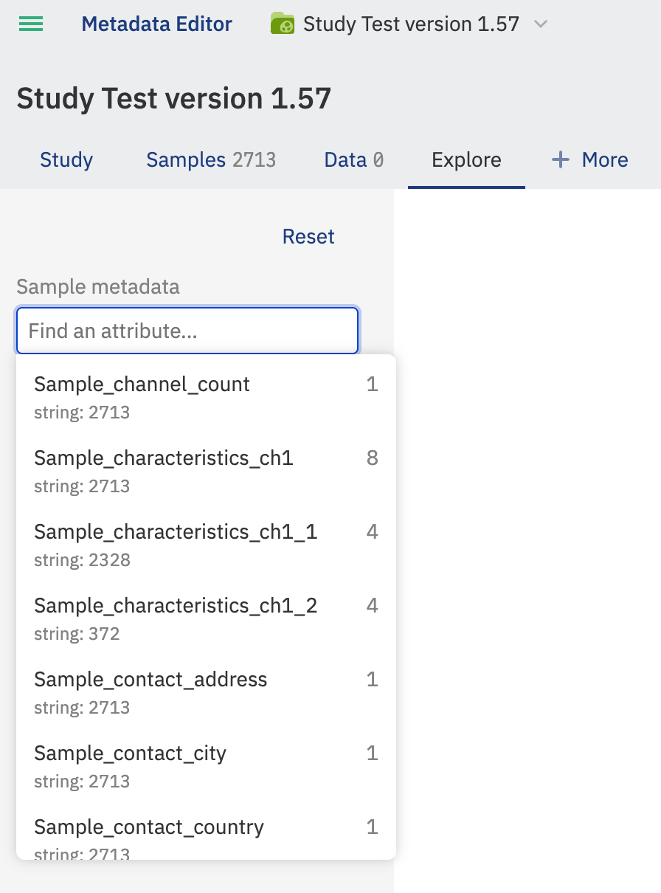
    * Various plot types, including Bar plot, Histogram, Scatter plot, Category plot, and Box plot, are available
  based on the selected attribute type.
    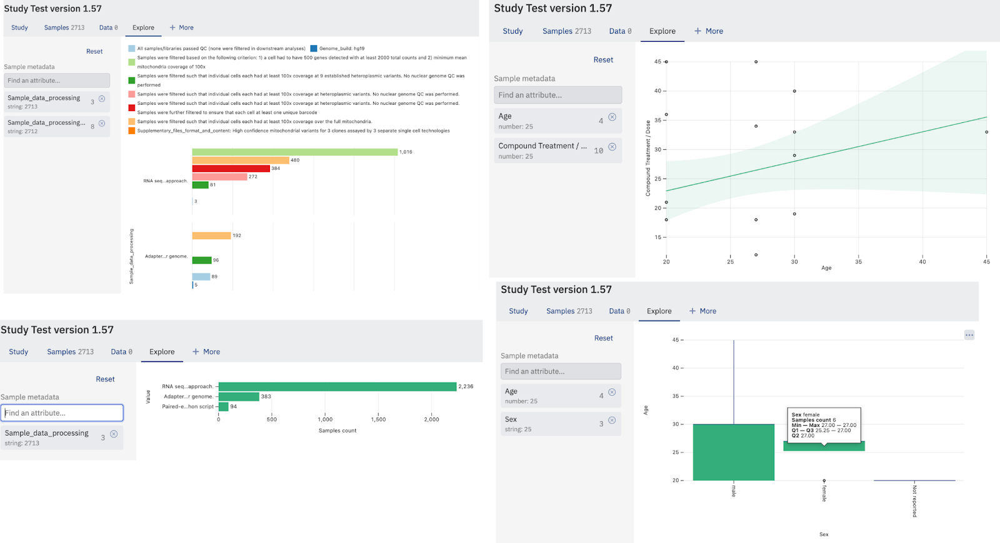
    * Automatic data filtering based on validation rules (removes empty and invalid values from visualization).
    * Export function for plots available in PNG or SVG format.
    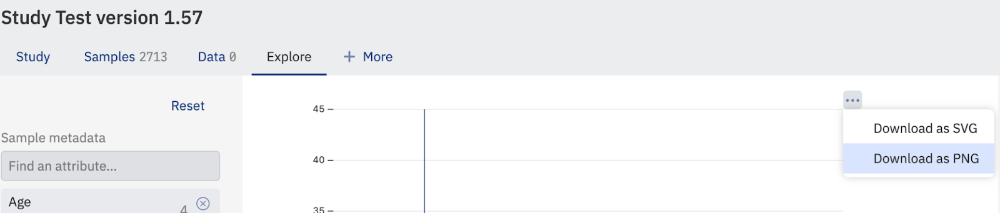
    * Instructions for Working with Data Exploration. Included comprehensive guidelines for utilizing Data Exploration
  features effectively.
    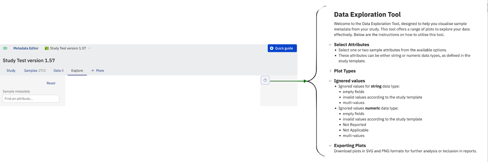

### Fixed Issues

**Improved Dictionaries:**

* **[Curators/Researchers]** The original dictionary details info appears while hovering over values in the Sample
Data Tab.
  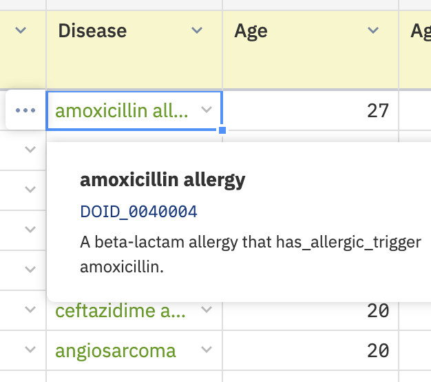
* **[Curators]** Fixed the ability to replace an old dictionary with a new one via the script.

## 1.56 Open Data Manager 2024 February Release

### New Features

* **[Advanced] Usage Tracking**: this feature allows to collect metrics and statistics organised in dashboards on Genestack side. Information for particular instance can be requested from Genestack. Currently available metrics are:
    * Number of users with “Activated” status.
    * Number of API calls broken down by API labels.
    * Average length of UI sessions.
    * Number of Studies.
    * Number of metadata objects and groups for Samples, Libraries, and Preparations.
    * Number of data objects broken down by Data Classes.
* **Data Class labels** per Study are reintroduces from Study Browser view.
* **[Curators] Data upload via GUI**: gct/generic data/vcf/facs data can be associated with any sample metadata attribute from template (except the key genestack:accession) when uploading data via Metadata Editor. This prevents users from need to edit original data to meet the rules of ODM data model.
* **Templates**: Ability to rename template when duplicating it.

### Fixed Major Issues

* **GUI Issues**:
    * Fixed error message when linking data to Sample metadata attribute with empty values in Study.

### Other Changes

* **Tasks Page**: redesigned Task Manager is available from GUI.
* **Python SDK, R SDK** are not published in the release.

## 1.55 Open Data Manager 2023 Winter Release

### New Features

* **[Curators, Advanced, Admin] Manage Data**
    * **New Swagger Page**: Introducing new endpoints for managing detached objects and deleting objects in ODM.
        * `GET/detached-objects`: Identifies detached data objects (Samples, Libraries, Preparations, Tabular Data, VCF, and Flow Cytometry data) that are not linked to other objects, aiding in clean-up after incomplete data uploads or deletions.
        * `DELETE/data`: Facilitates cascade deletion of selected objects from ODM. For instance, deleting a Study also removes all linked objects (Samples, Libraries, Tabular Data, VCF, etc.). Access restricted to users with `MANAGE_ORGANIZATION` and `ACCESS_ALL_DATA` permissions.
* **[Curators] Data Uploading Enhancements in GUI**
    * **Enhanced Tabular Data Handling**: Supports specifying a separator character in file column headers for distinguishing between sample names and measurement types.
    * **Advanced Options**:
        * **Skip Zeroes (Sparse Data Matrix)**: Option to ignore cells with '0' values to optimize performance for datasets common in single-cell technologies.
    * **Pre-validation**: All data files uploaded from the local computer undergo a formatting compliance check before uploading.
    * **File Attachment Updates**: If an attached file already exists in ODM, the system offers options to overwrite or rename the file.

### Fixed Major Issues

* **GUI Issues**:

    * [Curators] Fixed the issue where Bulk Replace doesn't replace some empty values in the Metadata Editor.
    * [Curators] Resolved incorrect behavior when copying/reassigning string values to integer/decimal types.
    * [Curators] Addressed the issue preventing the import of Sample Metadata to a Study with existing attached files or failed tabular data uploads.
    * [Users] Corrected the issue with incorrect data file names in export archives.

* **Scripts and API Issues**:
    * [Curators, Advanced] Fixed the error occurring during the simultaneous upload of multiple files with over 2000 samples.
    * [Curators, Advanced] Resolved the issue where the curation script does not publish changes.
    * [Curators, Advanced] Aligned the behavior of the curation script with GUI functionality, particularly for the "Re-assign" feature.
    * [Advanced] Addressed issues with streaming data endpoints, including excessive log entries, incomplete results under high demand, and malfunctioning with custom attribute-linked Tabular Data.
    * [Advanced] Fixed errors related to long IP addresses and unexpected errors with Access Token requests.

### Other Changes

* **Data Archive Removal**: All export data archives previously generated in the ODM GUI will be deleted. New export archives can be generated on demand.
* **Custom SSE-KMS Key**: Introduced the ability to specify a custom SSE-KMS key for data uploading in the ODM GUI.

## 1.54 Open Data Manager 2023 Summer Release

ODM – renamed to **Open** Data Manager.

### [All users] Expanded Data Capabilities

ODM now supports TSV-formatted data frames. This expansion beyond GCT 1.2, VCF, and FACS formats enables the upload of diverse data types such as proteomics, metabolomics, epigenomics, and analysis results. This requires adherence to the data frame specifications provided in the [Usage](../user-guide/doc-odm-user-guide/supported-formats.md#tabular-data) section.

Simply put, your data file can now accommodate multiple columns defining the measured feature and more than one measurement column per sample.

Example of Mass Spectrometry data: Feature columns can encompass: `Gene Name`, `Protein Name`, `Peptide sequence`, `PTM site`, `M/Z ratio`, `Retention time`, etc. Measurements per sample may include: `Signal intensity`, `Signal quality`, etc.

Data upload is possible via the GUI/API, and querying can be executed via the API (see details below).

### [Curators] Enhanced Data Uploading

The revised data uploading function is available as a **BETA** version in both the API and GUI. This feature will be improved in upcoming releases.

### [Advanced] API Improvements

At present, uploading of TSV-formatted data is executed through Expression endpoints, with future releases introducing new endpoints for this operation.

Utilize the following endpoints to upload TSV or bulk transcriptomics data in GCT 1.2:

`post/expression/gct`

`post/import/expression`

We've added two new parameters for these endpoints (detailed descriptions available on corresponding Swagger pages):

* `numberOfFeatureAttributes` - to specify the number of feature columns in the file.
* `dataClass` - to denote the data type (e.g., proteomics, metabolomics, etc.).

### [Curators] GUI Adjustments

The `Create new study` button has been relocated to the center of the screen.

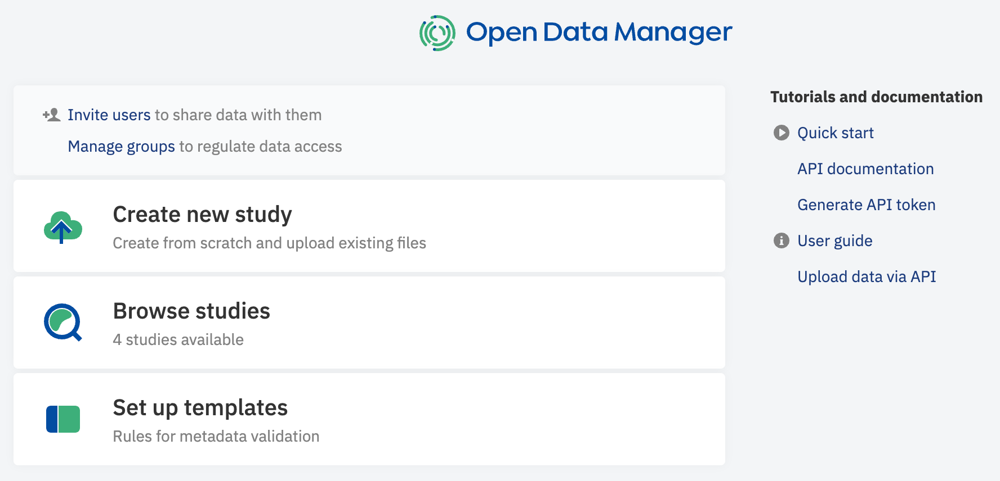

The `Add Data (BETA)` button has been incorporated into the new Data tab (further details about the tab below).

<figure markdown>
  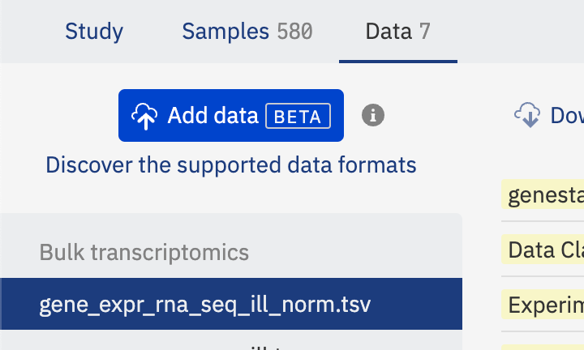{width=360}
</figure>

You now have the ability to import TSV, GCT, VCF, or FACS data from your local computer or via a direct link.

<figure markdown>
  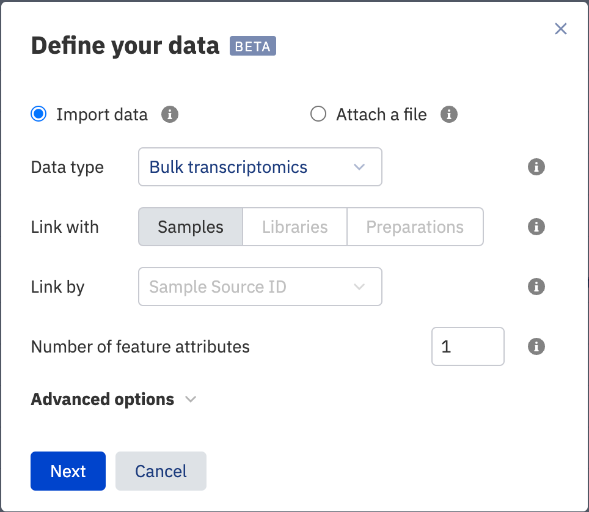{width=480}
</figure>

Moreover, this button can also be used to attach any file to the study.

<figure markdown>
  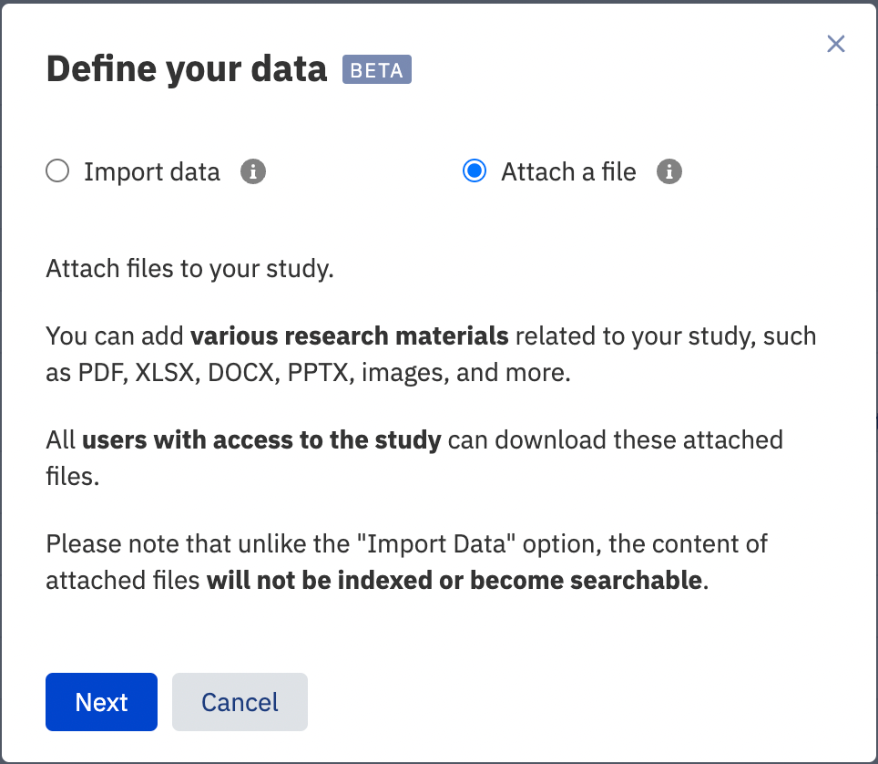{width=480}
</figure>

Please refer to the [Usage](../user-guide/doc-odm-user-guide/import-data-in-odm.md#import-data-beta) section for more information on these functionalities.

The Metadata Editor now includes an option to add new custom fields for Study and Data metadata.

<figure markdown>
  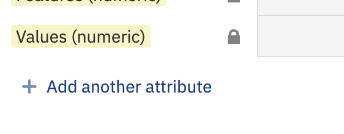{width=280}
</figure>

### [Researchers] Enhanced Data Browsing and Export

The `Signal Type` filter has been replaced with the Data Class filter, which represents all available data types across studies.

<figure markdown>
  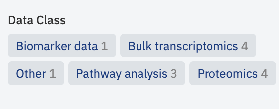{width=320}
</figure>

The `Signal Type` column has been removed from the main study browser panel.

The Expression/Variant/Flow Cytometry tabs have been removed from the Metadata Editor page.

A new `Data` tab has been added to the Metadata Editor page. This tab displays a list of all data files uploaded for the study, organized by their respective `Data Class` parameter (selected during file upload) on the left panel.

<figure markdown>
  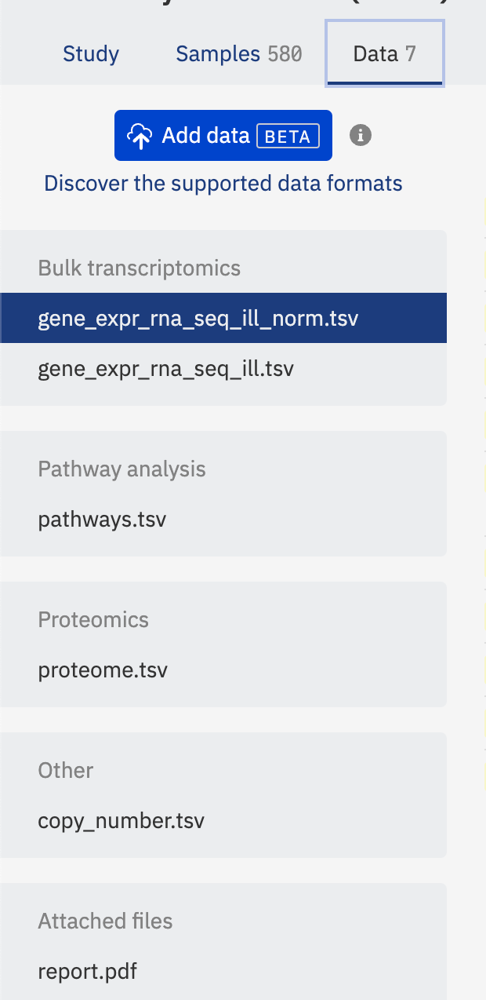{width=320}
</figure>

Clicking on a file enables metadata editing [Curators only] and browsing.

The metadata now includes four mandatory read-only fields that are auto-generated:

* Data Class - the data type selected during file upload.
* Features (string) - string feature column names present in the file (e.g., `Gene Name`).
* Features (numeric) - numeric feature column names present in the file (e.g., `M/Z ratio`).
* Value (numeric) - measurement types if more than one measurement is available per sample/library/preparation (e.g., `Fold Change`, `p-value`).
     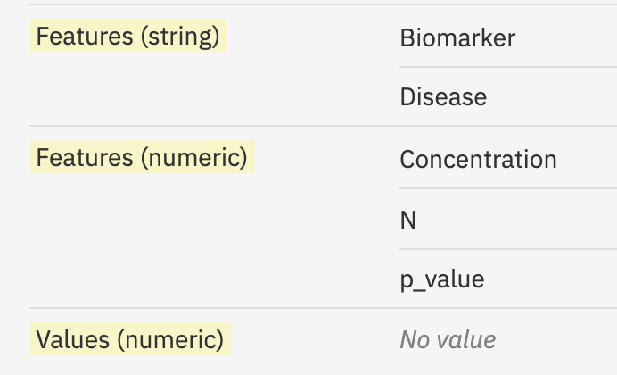{width=300}

These fields are implemented to make the content of these files visible and searchable for data science users. We strongly advise against editing these fields in the template editor, as it could make these files inaccessible. If data is uploaded in the GCT format, `Features (string)`, `Features (numeric)`, and `Value (numeric)` fields are left empty (due to the standard structure of GCT files).

### [Advanced] API Retrieval Improvements

The uploaded data can be searched and extracted using the API endpoint. Similar to the uploading process, data retrieval is performed through Expression parameters of Omics queries (Integration group), with future releases set to introduce new endpoints for this operation.

<figure markdown>
  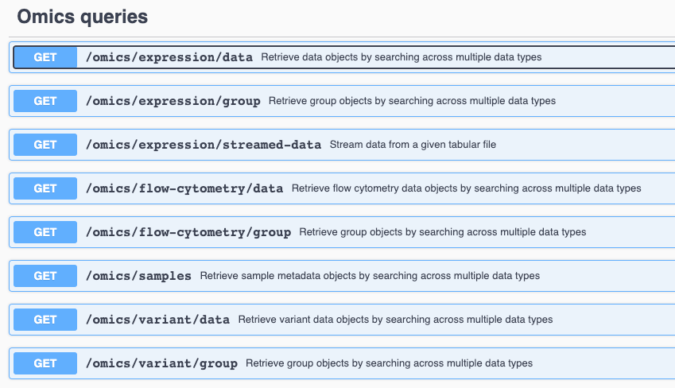{width=640}
</figure>

Each endpoint of Omics queries now has two updated parameters:

* In the `responseFormat` parameter, use the `multi_values` value to extract data in the new format. If your data has multiple features/measurements, they will be extracted in full. If the parameter is unspecified, the output returns only the first feature column and the first measurement per sample. This modification was introduced to maintain backward compatibility for applications built for GCT data extraction.
* `exQuery` has been enhanced and now supports flexible searches across files of any content. Search parameters in `exQuery` include options for feature and measurement filtering:
    * To search by feature (feature keyword), specify the required column name, e.g., `feature.Genes="ZNF814"`.
    * To search by measurement type (value keyword), specify the required column name, e.g., `value.intensity > A`.

New search capabilities include exact matches, multiple matches, range filtering, substring search, search by missing values, and more. Please refer to the corresponding endpoint descriptions in Swagger for details.

### Known Issue

If more than one file with the same name and extension is imported or attached via `Add Data (BETA)` button, then `Export` of the entire Study in one archive does not work.

Do not import/attach files with exactly the same name (and extension) to avoid this issue.
In case, two files with the same names were uploaded, you need to download them one by one.

<figure markdown>
  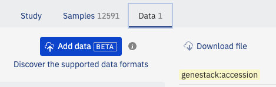{width=420}
</figure>

## 1.52

### GUI features

#### [Curators] Revoking access to a study

Added an ability to unshare a study (revoke access to a study) from a certain user group in Metadata Editor. The feature is available only to the study owner.

<figure markdown>
  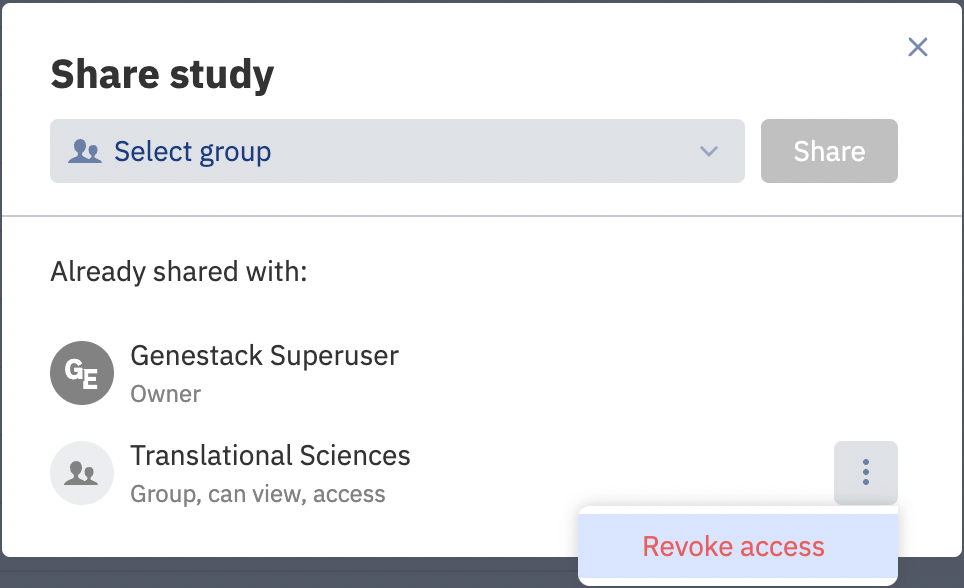{width=400}
</figure>

#### [Curators] Removing a multivalue while editing samples in Metadata Editor

Users can manually remove one of the values in a row with multiple values while editing a metadata sample in Metadata Editor. Previously, multi-valued "No Value" rows were automatically removed only after a new version of the sample metadata was published.

<figure markdown>
  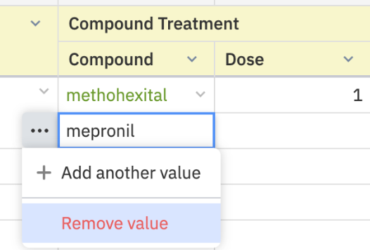{width=320}
</figure>

#### Fixed issues

[Curators].[Metadata Editor] Sometimes sample attributes (with attached dictionaries) with empty values are marked in Metadata Editor as invalid.

[Curators].[Metadata Editor] When multi-value rows in the composite sample attributes have no value, they are merged and not shown in Metadata Editor. In the example, there are "Compound Treatment/Compound", "Compound Treatment/Dose", and "Compound Treatment/Unit"; it is impossible to determine which "Dose" values correspond to a proper "Compound".

<figure markdown>
  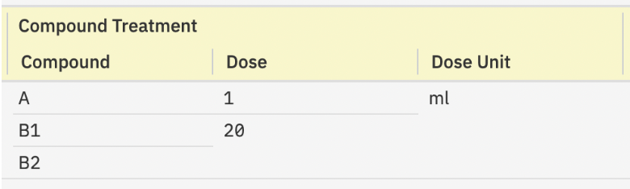{width=420}
  <figcaption>Before fixing the issue</figcaption>
</figure>

<figure markdown>
  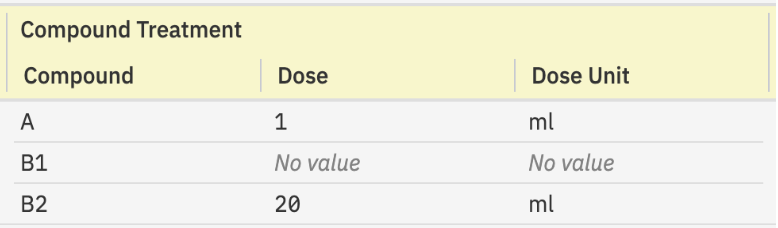{width=420}
  <figcaption>After fixing the issue</figcaption>
</figure>

[Curators].[Metadata Editor] The default dictionary "Cell type" can not be used during the validation of the samples in Metadata Editor. Also, this dictionary cannot be reloaded into ODM.

[Curators].[Metadata Editor] Incorrect sample count is shown on the bulk replace attribute editor dialogue.

[Curators].[Template Editor] The exported json file with template attributes contains only the fields visible in the Template Editor. We have removed the outdated "isSingle" attribute from the file, which could lead to errors when reloading the template to ODM.

### API Changes

#### Fixed issues

[Advanced users] An issue with more than one AND operator in the omics metadata filters.

## 1.51

### New/updated features in this release

**API. Updating the feature of the data upload via NFS** [Curators, Advanced].

??? example "Click here to expand"

    Сurators can import study files from a locally mounted Network File Storage (NFS) to ODM with "write" OR "read-only" access permission. There is no need to configure the “write” permission for the files, as it was before.

**Authentication in API via access token of an identity provider** [Curators, Advanced].

??? example "Click here to expand"

    ODM API and the "import_ODM_data.py" script allow authentication with a Genestack API token OR with an access token of another identity provider. To specify a custom access token, use the "Authorization" header; to set the Genestack API token, use the "Genestack-Api-Token" header.

    Note: access token takes precedence, meaning that if both tokens are supplied, the access token will be used for processing the request. The expansion fully supports Azure Active Directory access tokens. For a different custom Identity Provider, please test ODM API beforehand.

**Linking samples and omics data by any custom key via API** [Curators, Advanced].

??? example "Click here to expand"

    Previously: samples from metadata and omics data files could be linked only using the "Sample Source Id" attribute as a reference. Now curators can choose any sample metadata attribute (column) as a reference to link samples.

    Notes: only template attributes can be used for the linkage; if the value of the sample attribute for the linking changes, the relationship between samples and omics data is not updated automatically. More details about this feature you can find in the swagger, the endpoint `POST/integration/link/expression/group/{sourceId}/to/sample/group/{targetId}`, `linkingAttribute` parameter.

### Fixed issues in the metadata curation process

[Curators] Fixed: a template attribute with invalid metadata is marked as "non-template" when a curator is editing sample metadata in Metadata Editor via the bulk replace.

[Curators] Fixed: a formatting error appears for the study metadata view-only mode when the text in an attribute is not transferred to the next row.

[Curators] Fixed: other minor bugs in Template Editor and Metadata Editor.

### Fixed issues in API

[Advanced] Fixed: the API endpoint GET/omics/expression/streamed-data does not return a proper error when a user specifies a wrong accession of the signal group in the groupAccession parameter. Now the endpoint returns an error 404 Not Found with the message `"Group 'N' could not be found"`.

## 1.50

### New/updated features in this release

**SCIM API for managing users and groups in ODM via Azure Active Directory** [Admins].

??? example "Click here to expand"

    We have added SCIM API endpoints that allow the organization admin to manage users and user groups in ODM via Azure Active Directory. You can find all information about these endpoints and their limitations in Swagger in the "Manage Organization" section. Active Directory and ODM integration via SCIM endpoints instruction is located in the admin guides.

    Since the API endpoints have been developed according to the SCIM 2.0 specification, you can use them with any identity provider that supports working with SCIM. But since each identity provider has custom specifications, we recommend the solution pre-testing.

    We recommend calling user and group synchronization in Active Directory on behalf of the user with the "Manage Groups" permission so that the user can see and edit all groups on the instance, regardless of whether the user is a member of the groups or not.

**Quick start guide videos are added across ODM** [Curators, Researchers].

??? example "Click here to expand"

    Each page contains a button that leads to a video explaining how to work with the page and the related main concepts. In addition, a welcome pop-up appears after the first login. The pop-up contains a link to the Quick Start Guide help page and all videos. Now users can get acquainted with the possibilities of ODM even faster and more conveniently on their own.

### Fixed issues

[Curators] The import_ODM_data.py script incorrectly handled unexpected server responses from URL provided with `--server`: server is down for any reason or a user mistake. Now the script returns an error with clear instructions.

