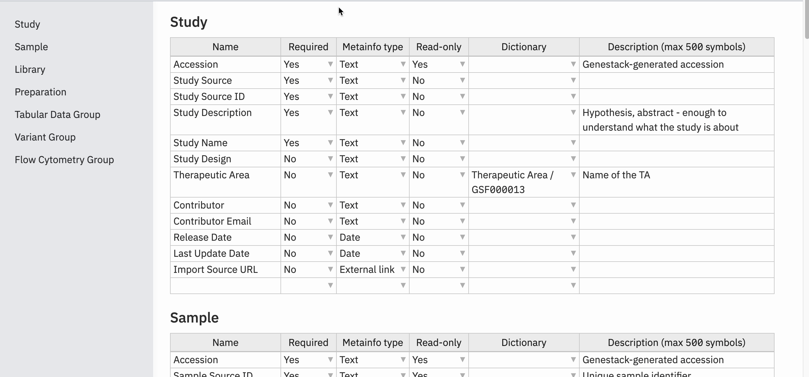

# Release notes

!!!info "Target users"

    **Curators** - users responsible for adding new data to ODM and ensuring data harmonization and curation. 
    While curators typically do not have permission to define, create, or edit metadata templates, they can select 
    existing templates to use for their data. Their responsibilities include mapping metadata, associating data with 
    templates, and performing data updates.

    **Researchers** - users who access ODM to identify and retrieve data suitable for further research and analysis. 
    Their activities include searching, browsing, and exporting data.

    **Advanced** - users with access to advanced API functionalities, such as user management and data 
    management operations.

    **Admins** - users who manage the organization in ODM, including overseeing users, groups, and permissions. 
    They are also responsible for creating, defining, and editing metadata templates as needed.

## 1.61

### Study Ownership Transfer via GUI

Historically, changing the owner of a Study required a manual MySQL script. The new GUI workflow enables safe,
auditable ownership transfer directly in the application.

#### 1. What’s New

* Transfer Study ownership from within the UI.
* Bulk propagation: ownership cascades to all Study‑scoped objects (Study, Samples, Libraries, Preparations, and all associated data objects).
* Automatic permission realignment (new owner gets full access; previous owner’s access reevaluated).
* Full audit trail (Audit Logs + Version History entry; see Section 2).

#### 2. Who Can Transfer Ownership

Ownership transfer can be initiated under the following rules:

| Initiator                                                    | Conditions                      | Allowed? | Notes                                               |
|--------------------------------------------------------------|---------------------------------|:--------:| --------------------------------------------------- |
| Current Study Owner                                          | Always                          |   Yes    | Owner can transfer regardless of other permissions. |
| User with **Manage organisation** *and* **Access all data**  | Study is *not* shared with user |   Yes    | Designed for super‑admin use cases.                 |
| User with **Manage organisation** (with access to the Study) | Study is shared with user       |   Yes    | Covers org‑level admins who can see the Study.      |
| Any other user                                               | —                               |    No    | Not permitted.                                      |

Additional rules:

* Target must be **another active user** (cannot transfer to deactivated accounts).
* Transfers are one‑Study‑at‑a‑time in this release (no bulk multi‑Study transfer UI).

#### 3. Transfer Workflow (UI)

1. Navigate to the Study menu.
2. Hover on Owner option in the Study menu.
3. Select **Transfer ownership** (visible if you meet transfer criteria above).
4. Choose the new owner from the active‑user list (searchable dropdown).
5. Review confirmation dialog showing:
    * Current owner
    * New owner
    * Access impact summary (new owner gains full access; previous owner loses unless shared)
    * Cascade notice: applies to all Study objects & versions.
6. Confirm to execute transfer.
7. Owner field updates immediately.

#### 4. Access Changes After Transfer

* **New owner** receives full access to the Study and all related objects (all versions).
* **Previous owner** loses access *unless* the Study is explicitly shared back to them.

#### 5. Ownership Transfer History in Metadata Versioning

Each transfer generates a Changing Ownership historical entry, similar to entries in Study’s metadata Version History:

**Captured:** Previous Owner • New Owner • Initiating User • Date & Time.

**Display Examples:**

* *Ownership transferred — From `User A` to `User B` by `User C` on 2025‑07‑18 14:32 UTC.*
* *Ownership transferred — `User A` transferred ownership to `User B` on 2025‑07‑18 14:32 UTC.* (transfer by current owner)

!!! note "Ownership Version History entries are **informational only**; you cannot roll back to a prior owner from the Version History window. To change again, perform a new transfer."

### Disable editing and removal of technical fields in Templates

#### Accession field

* Renamed to `genestack:accession` across the system.
* Editing and deletion of this field is disabled in the Template Editor (TE).
* Field is automatically added by script for the following entities:

    * `study`
    * `genestack:sampleObject`
    * `genestack:libraryObject`
    * `genestack:preparationObject`
    * `genestack:facsParent`
    * `genestack:genomicsParent`
    * `genestack:transcriptomicsParent`

If a user attempts to manually add or edit this field, the script responds accordingly:

* **If added manually:**

> *Template field "genestack\:accession" of type "{data\_type}" is predefined and can be omitted.*
> *(Script continues)*

* **If edited:**

> *Template field "genestack\:accession" of type "{data\_type}" is predefined and cannot be edited.*
> *(Script stops)*

#### Rules for Technical Fields

The following fields are now predefined, read-only, and cannot be modified or added manually:

* `Features (string)`
* `Features (numeric)`
* `Values (numeric)`
* `Data Class`

**Script responses for these fields:**

* **If added manually:**

  > *Template field "{field\_name}" of type "{data\_type}" is predefined and can be omitted.*
  > *(Script continues)*

* **If edited:**

  > *Template field "{field\_name}" of type "{data\_type}" is predefined and cannot be edited.*
  > *(Script stops)*

#### Export Functionality Update

Exported files now reflect the updated field name: field previously named `Accession` is now `genestack:accession`.

## 1.60

This release focuses on supporting structure (contents) parsing for HDF5 files.

### HDF5 file structure (contents) parsing support

1. **HDF5 File Parsing and Search Capabilities:**
    * Added support to identify and parse HDF5 files during the import process (detected by `.h5` and `.h5ad` extensions).
    * File contents (groups and datasets) are now stored in the ODM and displayed in the GUI.
    * Users can search for HDF5 files based on:
        * Full path (e.g., `/obs/__categories/integrated_snn_res.0.5`)
        * Partial path (e.g., `__categories/integrated_snn_res.0.5`)
        * Dataset name (e.g., `seurat_clusters`)
        * Group name (e.g., `obsm`)

2. **Enhanced GUI for File Contents Visualization:**
    * Added a new Metadata Editor panel to display HDF5 and archive contents:
        * Shown in the sidebar with an interactive tree structure.
        * Groups are collapsed by default and can be expanded to reveal datasets and nested groups.
        * "Expand all" and "Collapse all" buttons are available.
        * Users can copy dataset or group paths via a "Copy path" icon on hover.
    * If content parsing fails, the "Contents" button is disabled and a hover message displays: "The contents could not be parsed."

      

3. **API Support for HDF5 and Archive Content Search:**
    * Introduced new and updated API endpoints:
        * **Find HDF5 files by structure (contents):**
            * `GET /api/v1/as-curator/files`
            * `GET /api/v1/as-user/files`
        * **Find Studies by linked HDF5 files structure (contents):**
            * `GET /api/v1/as-curator/integration/link/studies/by/files`
            * `GET /api/v1/as-user/integration/link/studies/by/files`
    * Query parameters supported:
        * `full path`, `partial path`, `group`, `dataset`
        * New parameter `includeContents` added to include file contents in the response.
        * If parsing fails, the response includes: `"contents": {"error": "The contents could not be parsed."}`
        * Default behavior excludes the "Contents" section unless `includeContents=true` is specified.
    * Response structure includes metadata and parsed contents (group, dataset, file, folder, h5 pairs).

### Attached files

1. **Attach Files to Studies Without Samples**

      Users can now attach files to a study even if no samples have been added. This allows curators to store and
manage files related to an experiment during the early stages, such as experiment design documents.

      **Key Changes:**

      * The "Add data" button is now available for users even when a study has no samples.
      * Upon clicking "Add data," a loading window opens with the focus set to "Attach a file."

2. **Support for Compressed Files and Archives**

     Users can now attach compressed files and archives without the need to decompress them manually.
ODM recognizes and processes the contents of these archives.

      **Supported Formats:**

      * `.zip`
      * `.gz`

      **Behavior:**

      * **Single File Archive:**
        * The file is loaded as an attachment.

      * **Multiple File Archive:**

        * The archive itself is loaded as an attachment.
        * Its structure (contents) is parsed, stored, and displayed in the original file structure.
        * Any HDF5 file's structure inside the archive is also parsed, stored, and displayed.

3. **Attach Files via External Links**

    Users can now attach files by providing a link to an external storage location.

      **Key Changes:**

      * Users can switch between `Local computer` and `External link` when selecting **Attach a file**.
      * When an external link is provided, the file is automatically fetched and uploaded to the configured S3 bucket.
      * An attached file is created in ODM from the provided external link.

4. **Known limitations for Attached files:**
    1. S3 bucket is mandatory to upload and work with Attached files functionality in the ODM.
    2. **Export:** If attachment's metadata was updated and got a new version, attached file cannot be exported itself from the ODM.
       **Workaround:** export is available from exporting whole Study. We are working on improvements for this functionality in `1.61` release.

### Search by published metadata

   Previously, the Study Browser and API displayed draft (staging) metadata. This could result in
   discrepancies and display unverified information. With this update, only the latest **published** metadata will be
   visible, improving data consistency and trustworthiness.

   **Key Updates:**

   1. **Study Browser Display:**
      * Metadata shown under study titles (study descriptions) will now reflect only the **latest published** version.

   2. **Advanced Search Functionality:**
      * All advanced search queries will return results based on **published** metadata, including:
         * Full-text search
         * Search by wildcards
         * Search with logical operators
         * Ontology-based search
         * Facet search

   3. **User and Curator API Endpoints:**
      * Both User and Curator APIs now return metadata exclusively from the latest **published** version,
ensuring external integrations access validated information.

### Templates

1. **Restrict default template deletion**

    * Updated `wipeStudy` method to prevent the deletion of a template marked as the default.
    * If an attempt is made to delete the default template, the following error message is shown:
    *Default template could not be deleted from the system. Please, set another template as default and try again.*

2. **Save Template**

    Starting from this version, after editing template fields, users must click either the **"Save changes"** or
**"Cancel"** button. This ensures that unwanted changes are prevented.

    

### Delete Data files from S3 when deleted from ODM

When a data file imported from a local computer is deleted, the corresponding file on S3 is now automatically removed.

This applies to direct deletions resulting removing file from related entities (study, sample group,
library group, or preparation group).

Existing attachments have been migrated to ensure accurate linking between data files and their S3 counterparts.
