# Release notes

!!!info "Target users"

    **Curators** - users responsible for adding new data to ODM and ensuring data harmonization and curation. 
    While curators typically do not have permission to define, create, or edit metadata templates, they can select 
    existing templates to use for their data. Their responsibilities include mapping metadata, associating data with 
    templates, and performing data updates.

    **Researchers** - users who access ODM to identify and retrieve data suitable for further research and analysis. 
    Their activities include searching, browsing, and exporting data.

    **Advanced** - users with access to advanced API functionalities, such as user management and data 
    management operations.

    **Admins** - users who manage the organization in ODM, including overseeing users, groups, and permissions. 
    They are also responsible for creating, defining, and editing metadata templates as needed.

## 1.63

### Single-cell performance

The gene summary `POST /api/v1/as-curator/omics/cells/analytics/gene-summary` endpoint's performance has been
significantly improved. Average response time dropped from several minutes to well under half a second.
A reduction of roughly 99% on average.

### Attachments transformation/processors-controller

#### Changes in jobs

Processors Controller jobs now live in persistent storage, improving traceability and reproducibility.
Job metadata and logs are retained permanently instead of being purged after two weeks, and can always be retrieved
via the API, so that logs are no longer separately imported as ODM attachments.

Jobs can no longer be deleted; in-progress jobs can be cancelled, but finished jobs remain available for reference.

#### Changes in configurations

Configurations can no longer be deleted either: they can be archived instead,
which hides them from the default listing while keeping them retrievable and still usable by existing or new transformation jobs.

Configurations are now versioned updating one creates a new version rather than overwriting it,
so earlier versions stay retrievable.

#### API changes

* **Endpoints removed**
    * DELETE `/api/v1/transformations/configurations/{id}` — permanent configuration deletion is no longer available.
    * POST `/api/v1/transformations/jobs/{id}/stop` — stop a running transformation job endpoint is no longer available.

* **Endpoints added**
    * POST `/api/v1/transformations/configurations/{id}/archive` — archives a configuration (and all its versions) in place of deletion.
    * GET `/api/v1/transformations/configurations/{id}/versions` — lists all versions of a transformation configuration.
    * GET `/api/v1/transformations/configurations/{id}/versions/{version}` — retrieves a specific version of a transformation configuration.
    * POST `/api/v1/transformations/jobs/{id}/cancel` — cancel a running transformation job.

* **Parameter changes**
    * GET `/api/v1/transformations/configurations` and `GET /api/v1/transformations/jobs` both gained an `include_archived` boolean query parameter (default false) to optionally include archived items in listings.

#### Error handling

Error handling across the Processors Controller endpoints has been improved.
Errors now return appropriate HTTP status codes and include clearer messages that explain exactly what went wrong.

#### User guide and OpenAPI documentation

The user guide is now expanded with the **Transformations** section that documents the attachments and single-cell
transformation workflows end to end. New pages explain the underlying images, configurations, and jobs model,
walk through running a transformation and tracking its job from submission to archival, and show how to create
and reuse configurations. A dedicated Single-cell set of guides covers ingesting cell and expression data, curating biosample metadata, iterating with dry runs, and processing 10x Genomics H5 files, alongside configuration,
process, and attribute-mapping references.

Here you can find **[Transformation guide](../user-guide/doc-odm-user-guide/transformations/about-processors-controller.md)** and Processors Controller **[OpenAPI specification](/swagger/?urls.primaryName=processorsController)**.

### Description for template

Templates now support a description field in the Template Editor, making it easier to document what a template
is for and how it should be used (up to 2,000 characters). Note that this field is currently UI-only:
it isn't available via the SDK, and the description won't be included if the template is exported.

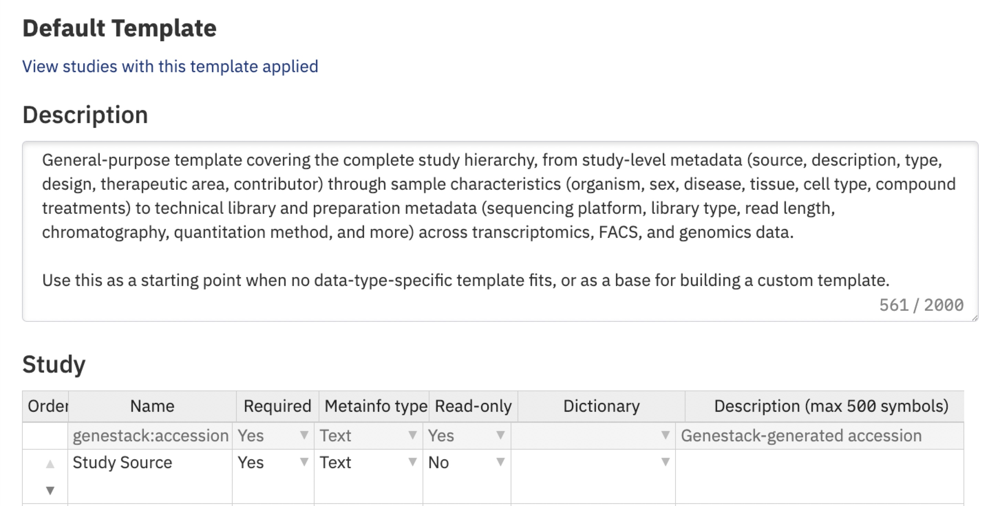

### Reorder template attributes

Template attributes can now be reordered directly in the Template Editor using the up/down arrows next to each row.
The new order is reflected in the corresponding columns in the Metadata Editor, and applies to every study using that template.

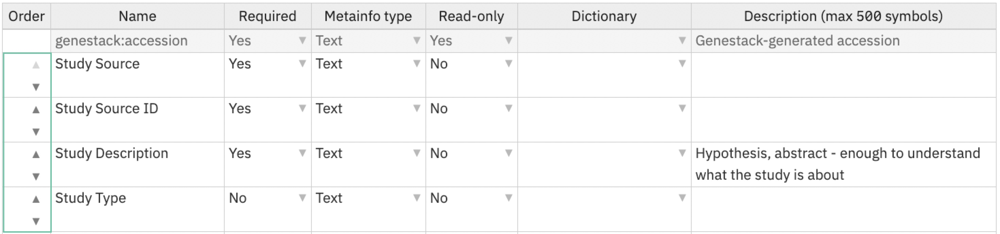

### Load metadata file in .tsv

You can now import metadata from a TSV file directly in the Metadata Editor, using the new **Import metadata** button
available in edit mode on the Study tab, as well as for Data files and Attached files on the Data tab.

The file should list attribute names in the first row and their corresponding values in the second row,
with multiple values for a single attribute separated by `|`. Importing will overwrite existing values.
Technical/read-only keys like `genestack:accession` are automatically ignored.

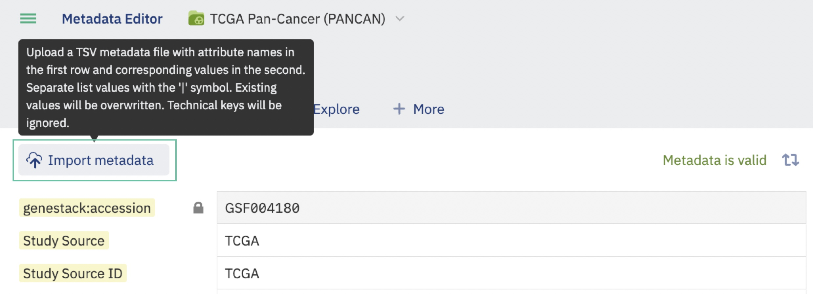
<figcaption>Upload study metadata from Study tab in edit mode</figcaption>

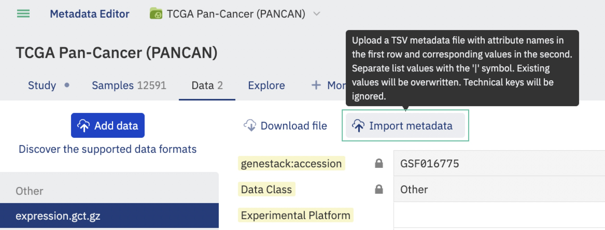
<figcaption>Upload metadata for data files from Data tab in edit mode</figcaption>

### Observe group ID

The Metadata Editor now displays the group ID for a Sample, Library, or Preparation group right next to its name.
This makes it easy to reference the correct group when working with the API or SDK, without having to look it up separately.

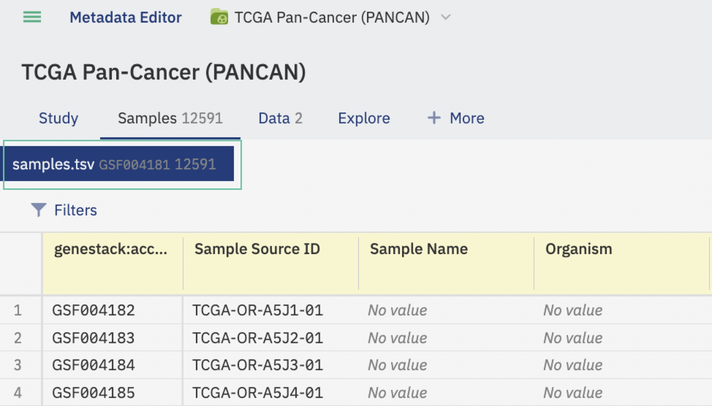

### Adjust the width of columns

Column widths in the Metadata Editor can now be adjusted in edit mode as well as view mode.
Just hover over the border between two column headers and drag to resize.

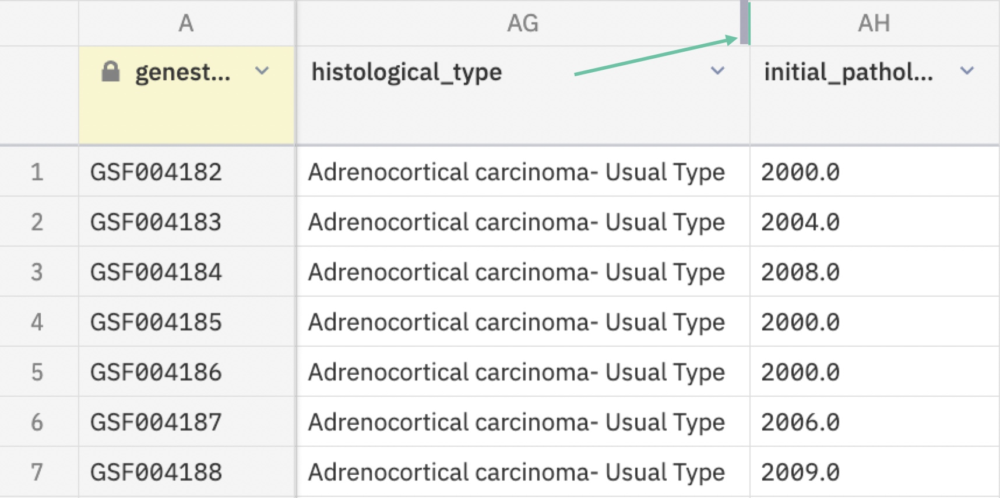

### Drag and drop for import

When importing metadata or data files, you can now drag and drop a file directly onto the upload dialog instead of browsing for it
making it faster and more convenient to import straight from your local machine.

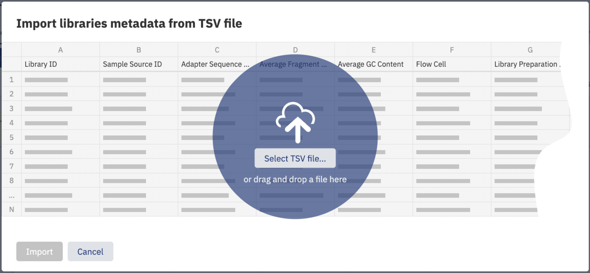

### Other fixes

#### `Uploaded by` attribute

Fixed an issue where the `Uploaded by` attribute for an attachment could change to reflect the user last edited its metadata.
It now correctly preserves the name of the user who originally uploaded the file, regardless of who edits the metadata afterward.

#### Performance improvements for Libraries/Preparations retrival by group ID

Performance has been significantly improved for the GET `/api/v1/as-user/libraries/by/group/{id}`
and GET `/api/v1/as-user/preparations/by/group/{id}` endpoints.
Retrieving large sets of libraries or preparations by group ID, which previously could take several minutes,
now completes in a fraction of a second.

#### Allow duplicates for attached files uploaded via multipart endpoints

Fixed an issue where re-uploading a file with the same name to the same study via multipart upload endpoints would fail.
Each multipart upload now stores its files in a unique subfolder within the study, consistent with how the UI already
handles local file uploads, so files with matching names no longer conflict.

#### Study Title can no longer be left blank

Fixed an issue where clearing the Study Title in the Metadata Editor could cause the attribute to disappear entirely after refreshing the page.
The Study Title can no longer be left blank.

#### Empty name for attribute is no longer available

Fixed an issue in the Metadata Editor where a new attribute could be added without a name.
The `Add` button is now disabled until a name is entered with the empty field highlighted.

#### Linking to large sample groups fix

Fixed an issue where linking a Library/Preparation group to a Sample group with more than 1000 samples would fail with a duplicate key error,
leaving the library/preparation with no sample links at all. This affected Library/Preparation group imports and links made either through
the Metadata Editor or the corresponding API endpoint.

#### Incorrect status code for link/unlink endpoints fix

Fixed an issue where link and unlink integration endpoints (covering samples, libraries, preparations, expression data,
flow cytometry, and variant data) were incorrectly returning status code 200 instead of the 204.
All affected endpoints now return the correct 204 status.

#### `publish-versions` endpoint is marked as deprecated

The POST `/api/v1/tasks/publish-versions` endpoint is now deprecated and will be removed in release 1.64.
This endpoint allows users with **Access all data** permission to publish pending metadata changes across all studies at once.
Initially this endpoint was used to publish all unpublished data automatically after turning on versioning on the instance.
It's being removed as part of an upcoming permissions rework that will prevent changes from being published across studies
without approval from each study's owner.

### Key security improvements

* Fixed a potential SQL-injection vulnerability where a query parameter was being concatenated directly into a database query.
    It's now handled safely using parameter binding.
* Dependency and library updates across the platform resolved a number of other previously flagged security vulnerabilities.

## 1.62

### Single-Cell functionality

* **New `Cell` entity**: ODM now supports storing and managing **per-cell metadata and expression** for single-cell datasets.
* **Cell Groups**: Each Cell record belongs to a **Cell Group**, representing a single-cell table/group.
* **Cell metadata import (TSV only)**: Import cell metadata via **Jobs API** (`/api/v1/jobs/import/cells` or `/api/v1/jobs/import/cells/multipart`) or the **`odm-import-data` script** (`--cells/-c`) and link to Samples/Libraries/Preparations.
* **Cell expression import**: Import expression via **Jobs API** (`/api/v1/jobs/import/expression` or `/api/v1/jobs/import/expression/multipart`); `.br` / `.lz4` archives recommended. Link expression to a Cell metadata group (1:1).
* **Validation**: Enforces required fields (e.g., `barcode`, `batch`) and rejects duplicate barcodes within a group; invalid types are ignored with warnings.
* **[BETA] Analytics**: New endpoints for **Cell Ratio**, **Gene Summary**, and **Differential Expression** calculations over filtered single-cell populations.
* **Deletion**: Remove Cell metadata or expression groups via the **manage-data/data** endpoint.

    Read more on **[Working with Single Cell Data page](../user-guide/doc-odm-user-guide/single-cell.md)**.

    

### Multipart/form-data job endpoints

We have added **multipart form-data upload endpoints** to the `jobs` import API, enabling **direct file uploads** (no `dataLink` required) for common ODM import flows:

* `POST /api/v1/jobs/import/samples/multipart` — upload **Sample metadata** (TSV)
* `POST /api/v1/jobs/import/libraries/multipart` — upload **Library metadata** (TSV)
* `POST /api/v1/jobs/import/preparations/multipart` — upload **Preparation metadata** (TSV)
* `POST /api/v1/jobs/import/cells/multipart` — upload **Cell metadata** (TSV)
* `POST /api/v1/jobs/import/expression/multipart` — upload **tabular expression** data (TSV, GCT)
* `POST /api/v1/jobs/import/variant/multipart` — upload **variation data/metadata** (VCF, TSV)
* `POST /api/v1/jobs/import/flow-cytometry/multipart` — upload **flow cytometry data/metadata** (FACS, TSV)
* `POST /api/v1/jobs/import/file/multipart` — upload a **file attachment** via Jobs import

### Attachments transformation

ODM now supports an **attachment transformation workflow** that converts uploaded attachments into **ODM-indexable formats** and can automatically kick off the relevant **jobs import** flow.

* **Transform attachments into supported formats**

    Use transformations to convert files ODM can’t ingest directly (e.g., **CSV**) into formats it can index (e.g., **TSV** for metadata imports).

* **Image + configuration model**

    Each transformation uses:

    * a **transformation image** (script) defining how to convert input → output, and
    * a **configuration** defining the **destination** (e.g., Samples, Libraries, Preparations, Cells, Expression, Variants).

* **Discover available transformation images**
  
    New API to list available images via **Processors Controller**:
  `GET /transformations/images`.

* **Create and manage transformation configurations**
  
    Define reusable configs via:
  `POST /transformations/configurations` (and retrieve via `GET /transformations/configurations`)
  Example: config to route **csv → samples**.

* **Run transformations as jobs**
  
    Trigger a transformation run using an **attachment accession**, **configuration**, and **image reference**:
  `POST /transformations/jobs`
  Track progress via: `GET /transformations/jobs/{id}`.

* **Automatic import after conversion**
  
    On successful transformation, ODM **automatically uploads the converted file** and triggers the corresponding **Jobs import multipart endpoint** (e.g., CSV → TSV → `POST /api/v1/jobs/import/samples/multipart`), creating a new metadata group in the same Study where the original attachment was stored.

    Read more on **[Attachments transformation page](../user-guide/doc-odm-user-guide/transformations/how-to-run-a-transformation.md)**.

    

### API search by latest committed (published) data

* **Updated search behavior across all endpoints**: Metadata search endpoints now query against the **latest committed metadata**, ensuring results reflect the most up-to-date committed changes.
* **Filters and queries remain supported**: All existing **filter and query parameters** continue to work as before, but are now applied to the **latest committed dataset**.

### New Data Classes

New Data classes were introduced:

* Spatial transcriptomics `SPT`
* Phenomics `PHE`
* Copy number alterations `CNA`
* Microbiome / Metagenomics `MIC`
* Immune repertoire `IMR`
* Genetic screens (CRISPR / RNAi) `GSC`
* Cell imaging `CIM`
* Nanopore data class was renamed to Long-read sequencing (Nanopore, PacBio) `LRS`
* `MTX` label for Metabolomics was renamed to `MTB`

### Samples

* Starting with this release, creating a Study no longer automatically creates four empty Sample entries. Instead, use the **Add Samples** button to upload a Samples metadata file.

* Sample deletion is no longer available via the GUI. Instead, a new option is available to delete a single Sample object via the **manageData** endpoint.

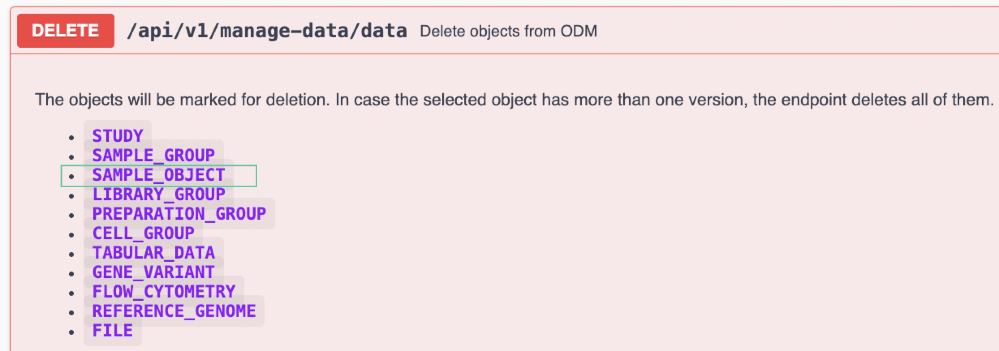

### Templates

Starting with this release, the Template Editor includes a new feature to view the list of Studies that use the template you’re viewing. In the new Study Browser window, you’ll see the list of Studies available to you.

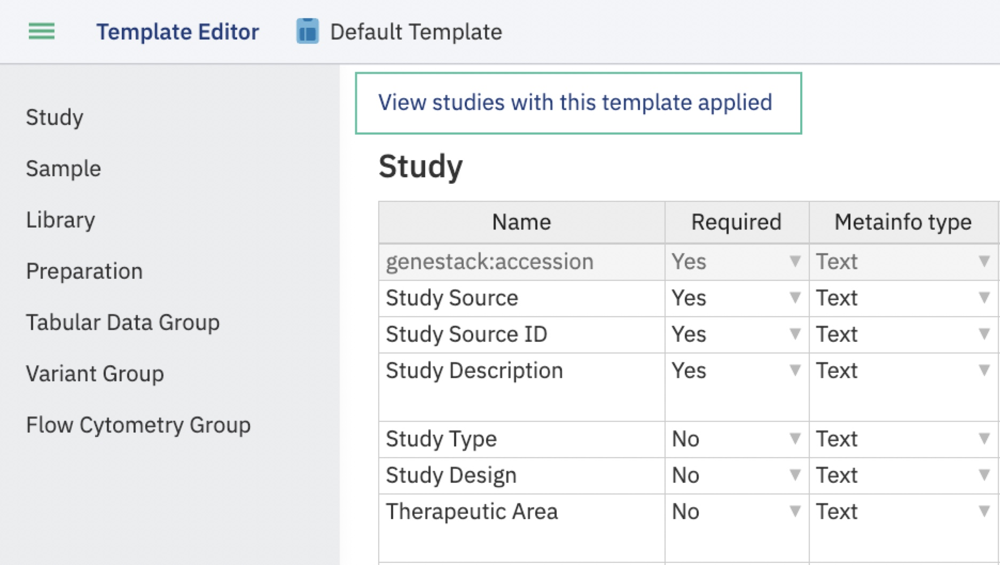

### Preview PDF attachments

* **Preview PDFs directly from ME**: Attachments with filenames ending in **`.pdf`** can now be previewed from the attachment list.
* **One-click preview**: A **Preview** action/button is available for PDF attachments.
* **Opens in a new browser tab**: Clicking **Preview** opens the file in a **new tab** using the browser’s built-in PDF viewer.

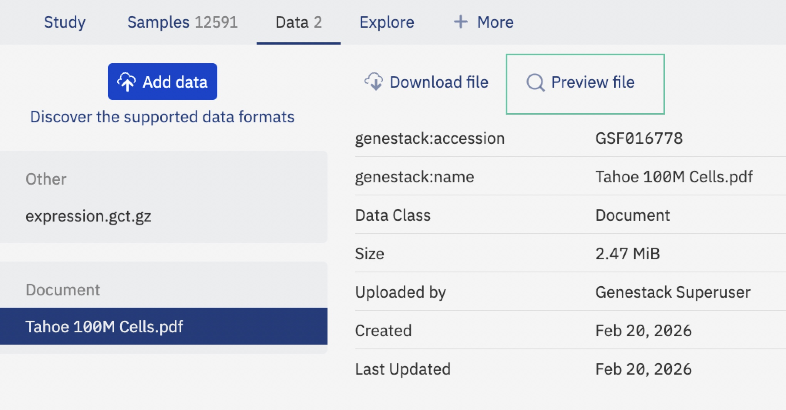

### Permanent tokens

* **Instant token display**: When creating an ODM personal access token from the Profile page, the **token value is now shown immediately** after the user confirms creation (and enters their password, if prompted).
* **Email step removed**: Token creation no longer requires an email with a secure link/code exchange.

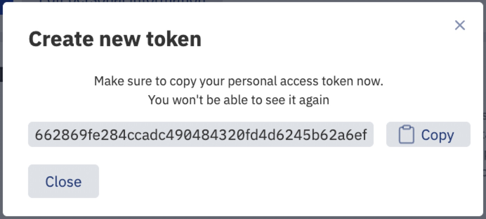

### Access (Bearer) tokens

1. The user identifier for Azure token authentication was changed from `subject` to `oid`, enabling login without defining an Azure app scope.
2. As a result, all users registered in ODM via Azure SSO will need to log in via the UI once again to have their records updated in the database.

### Metadata validity facet

A new default facet has been added to filter Studies by **valid** or **invalid** metadata, validated against the applied template. Metadata is considered **invalid** if at least one field is invalid in any Study entity.

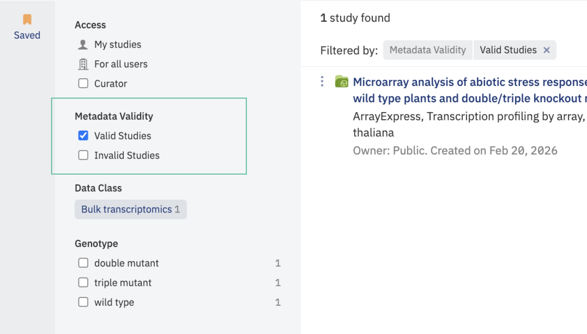

### Key security improvements

1. Removing the email-based token delivery flow to eliminate a potential attack vector.
2. Spring Boot upgrade to v4 with updated transitive dependencies resolved plenty of security vulnerabilities.
3. Three vulnerabilities (SQL injection, path traversal, log injection) identified and fixed by code analysis tools.

## 1.61

Release 1.61 introduces powerful enhancements focused on improving data governance and preventing common user errors.
With the new ability to transfer study ownership directly through the GUI and safeguards around technical metadata
fields, this release helps organizations maintain cleaner data, clearer responsibilities, and greater platform stability.

### Study Ownership Transfer via GUI

Historically, changing the owner of a Study required a manual MySQL script. The new GUI workflow enables safe,
auditable ownership transfer directly in the application.

#### 1. What’s New

* Transfer Study ownership from within the UI.
* Bulk propagation: ownership cascades to all Study‑scoped objects (Study, Samples, Libraries, Preparations, and all associated data objects).
* Automatic permission realignment (new owner gets full access; previous owner’s access reevaluated).
* Full audit trail (Audit Logs + Version History entry; see Section 2).

#### 2. Who Can Transfer Ownership

Ownership transfer can be initiated under the following rules:

| Initiator                                                    | Conditions                      | Allowed? | Notes                                               |
|--------------------------------------------------------------|---------------------------------|:--------:| --------------------------------------------------- |
| Current Study Owner                                          | Always                          |   Yes    | Owner can transfer regardless of other permissions. |
| User with **Manage organisation** *and* **Access all data**  | Study is *not* shared with user |   Yes    | Designed for super‑admin use cases.                 |
| User with **Manage organisation** (with access to the Study) | Study is shared with user       |   Yes    | Covers org‑level admins who can see the Study.      |
| Any other user                                               | —                               |    No    | Not permitted.                                      |

Additional rules:

* Target must be **another active user** (cannot transfer to deactivated accounts).
* Transfers are one‑Study‑at‑a‑time in this release (no bulk multi‑Study transfer UI).

#### 3. Transfer Workflow (UI)

1. Navigate to the Study menu.
2. Hover on Owner option in the Study menu.
3. Select **Transfer ownership** (visible if you meet transfer criteria above).
4. Choose the new owner from the active‑user list (searchable dropdown).
5. Review confirmation dialog showing:
    * Current owner
    * New owner
    * Access impact summary (new owner gains full access; previous owner loses unless shared)
    * Cascade notice: applies to all Study objects & versions.
6. Confirm to execute transfer.
7. Owner field updates immediately.

#### 4. Access Changes After Transfer

* **New owner** receives full access to the Study and all related objects (all versions).
* **Previous owner** loses access *unless* the Study is explicitly shared back to them.

#### 5. Ownership Transfer History in Metadata Versioning

Each transfer generates a Changing Ownership historical entry, similar to entries in Study’s metadata Version History:

**Captured:** Previous Owner • New Owner • Initiating User • Date & Time.

**Display Examples:**

* *Ownership transferred — From `User A` to `User B` by `User C` on 2025‑07‑18 14:32 UTC.*
* *Ownership transferred — `User A` transferred ownership to `User B` on 2025‑07‑18 14:32 UTC.* (transfer by current owner)

!!! note "Ownership Version History entries are **informational only**; you cannot roll back to a prior owner from the Version History window. To change again, perform a new transfer."

### Disable editing and removal of technical fields in Templates

#### Accession field

* Renamed to `genestack:accession` across the system.
* Editing and deletion of this field is disabled in the Template Editor (TE).
* Field is automatically added by script for the following entities:

    * `study`
    * `genestack:sampleObject`
    * `genestack:libraryObject`
    * `genestack:preparationObject`
    * `genestack:facsParent`
    * `genestack:genomicsParent`
    * `genestack:transcriptomicsParent`

If a user attempts to manually add or edit this field, the script responds accordingly:

* **If added manually:**

> *Template field "genestack\:accession" of type "{data\_type}" is predefined and can be omitted.*
> *(Script continues)*

* **If edited:**

> *Template field "genestack\:accession" of type "{data\_type}" is predefined and cannot be edited.*
> *(Script stops)*

#### Rules for Technical Fields

The following fields are now predefined, read-only, and cannot be modified or added manually:

* `Features (string)`
* `Features (numeric)`
* `Values (numeric)`
* `Data Class`

**Script responses for these fields:**

* **If added manually:**

  > *Template field "{field\_name}" of type "{data\_type}" is predefined and can be omitted.*
  > *(Script continues)*

* **If edited:**

  > *Template field "{field\_name}" of type "{data\_type}" is predefined and cannot be edited.*
  > *(Script stops)*

#### Export Functionality Update

Exported files now reflect the updated field name: field previously named `Accession` is now `genestack:accession`.

These updates not only reduce the risk of accidental metadata issues but also streamline collaboration and oversight across teams.

## 1.60

This release focuses on supporting structure (contents) parsing for HDF5 files.

### HDF5 file structure (contents) parsing support

1. **HDF5 File Parsing and Search Capabilities:**
    * Added support to identify and parse HDF5 files during the import process (detected by `.h5` and `.h5ad` extensions).
    * File contents (groups and datasets) are now stored in the ODM and displayed in the GUI.
    * Users can search for HDF5 files based on:
        * Full path (e.g., `/obs/__categories/integrated_snn_res.0.5`)
        * Partial path (e.g., `__categories/integrated_snn_res.0.5`)
        * Dataset name (e.g., `seurat_clusters`)
        * Group name (e.g., `obsm`)

2. **Enhanced GUI for File Contents Visualization:**
    * Added a new Metadata Editor panel to display HDF5 and archive contents:
        * Shown in the sidebar with an interactive tree structure.
        * Groups are collapsed by default and can be expanded to reveal datasets and nested groups.
        * "Expand all" and "Collapse all" buttons are available.
        * Users can copy dataset or group paths via a "Copy path" icon on hover.
    * If content parsing fails, the "Contents" button is disabled and a hover message displays: "The contents could not be parsed."

      

3. **API Support for HDF5 and Archive Content Search:**
    * Introduced new and updated API endpoints:
        * **Find HDF5 files by structure (contents):**
            * `GET /api/v1/as-curator/files`
            * `GET /api/v1/as-user/files`
        * **Find Studies by linked HDF5 files structure (contents):**
            * `GET /api/v1/as-curator/integration/link/studies/by/files`
            * `GET /api/v1/as-user/integration/link/studies/by/files`
    * Query parameters supported:
        * `full path`, `partial path`, `group`, `dataset`
        * New parameter `includeContents` added to include file contents in the response.
        * If parsing fails, the response includes: `"contents": {"error": "The contents could not be parsed."}`
        * Default behavior excludes the "Contents" section unless `includeContents=true` is specified.
    * Response structure includes metadata and parsed contents (group, dataset, file, folder, h5 pairs).

### Attached files

1. **Attach Files to Studies Without Samples**

      Users can now attach files to a study even if no samples have been added. This allows curators to store and
manage files related to an experiment during the early stages, such as experiment design documents.

      **Key Changes:**

      * The "Add data" button is now available for users even when a study has no samples.
      * Upon clicking "Add data," a loading window opens with the focus set to "Attach a file."

2. **Support for Compressed Files and Archives**

     Users can now attach compressed files and archives without the need to decompress them manually.
ODM recognizes and processes the contents of these archives.

      **Supported Formats:**

      * `.zip`
      * `.gz`

      **Behavior:**

      * **Single File Archive:**
        * The file is loaded as an attachment.

      * **Multiple File Archive:**

        * The archive itself is loaded as an attachment.
        * Its structure (contents) is parsed, stored, and displayed in the original file structure.
        * Any HDF5 file's structure inside the archive is also parsed, stored, and displayed.

3. **Attach Files via External Links**

    Users can now attach files by providing a link to an external storage location.

      **Key Changes:**

      * Users can switch between `Local computer` and `External link` when selecting **Attach a file**.
      * When an external link is provided, the file is automatically fetched and uploaded to the configured S3 bucket.
      * An attached file is created in ODM from the provided external link.

4. **Known limitations for Attached files:**
    1. S3 bucket is mandatory to upload and work with Attached files functionality in the ODM.
    2. **Export:** If attachment's metadata was updated and got a new version, attached file cannot be exported itself from the ODM.
       **Workaround:** export is available from exporting whole Study. We are working on improvements for this functionality in `1.61` release.

### Search by published metadata

   Previously, the Study Browser and API displayed draft (staging) metadata. This could result in
   discrepancies and display unverified information. With this update, only the latest **published** metadata will be
   visible, improving data consistency and trustworthiness.

   **Key Updates:**

   1. **Study Browser Display:**
      * Metadata shown under study titles (study descriptions) will now reflect only the **latest published** version.

   2. **Advanced Search Functionality:**
      * All advanced search queries will return results based on **published** metadata, including:
         * Full-text search
         * Search by wildcards
         * Search with logical operators
         * Ontology-based search
         * Facet search

   3. **User and Curator API Endpoints:**
      * Both User and Curator APIs now return metadata exclusively from the latest **published** version,
ensuring external integrations access validated information.

### Templates

1. **Restrict default template deletion**

    * Updated `wipeStudy` method to prevent the deletion of a template marked as the default.
    * If an attempt is made to delete the default template, the following error message is shown:
    *Default template could not be deleted from the system. Please, set another template as default and try again.*

2. **Save Template**

    Starting from this version, after editing template fields, users must click either the **"Save changes"** or
**"Cancel"** button. This ensures that unwanted changes are prevented.

    

### Delete Data files from S3 when deleted from ODM

When a data file imported from a local computer is deleted, the corresponding file on S3 is now automatically removed.

This applies to direct deletions resulting removing file from related entities (study, sample group,
library group, or preparation group).

Existing attachments have been migrated to ensure accurate linking between data files and their S3 counterparts.
