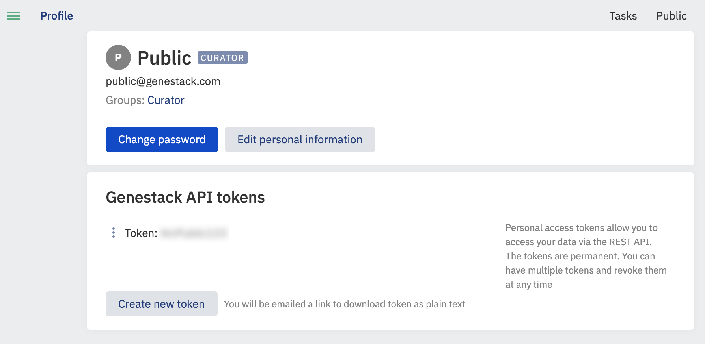

# Initial configuration of odm-sdk

## Requirements

- Installed odm-sdk. See [Installation odm-sdk](./installation.md)

## Instructions

### Configure

1. Retrieve an Access (Bearer) Token, or obtain an API token by logging into ODM and clicking the profile link under
    the username.

    See an example for Public user below:

    

    You need to click on the "Create new token" button, so you will receive an email with a link to your token.
    Please open the link in the email and save the token for future needs.

2. Set up your account with the Genestack Python client from a console

    ```shell
    odm-user-setup -H https://domain_name/
    ```

3. Type ‘add’ to enter a new user, enter an alias for the user.
4. Enter the host name, which should be of the format: https://domain_name/.
5. Then select suitable authentication method (1 or 2) and input the content of the token you received in step 1:

    ```shell
    1) by token
    2) by access token
    3) by email and password
    Select authentication: 1
    Host: https://domain_name/
    Please specify Genestack API token for "my_user":
    ```

6. Type ‘quit' to exit the user-setup.
