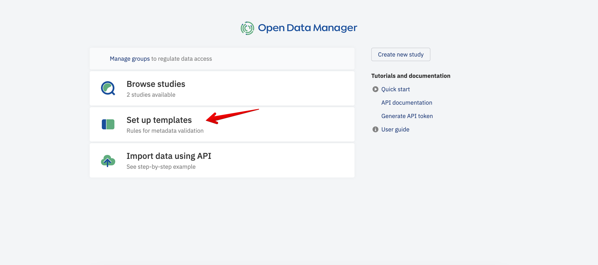
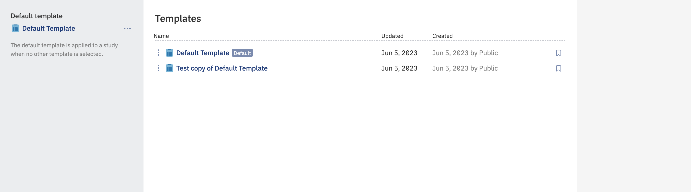
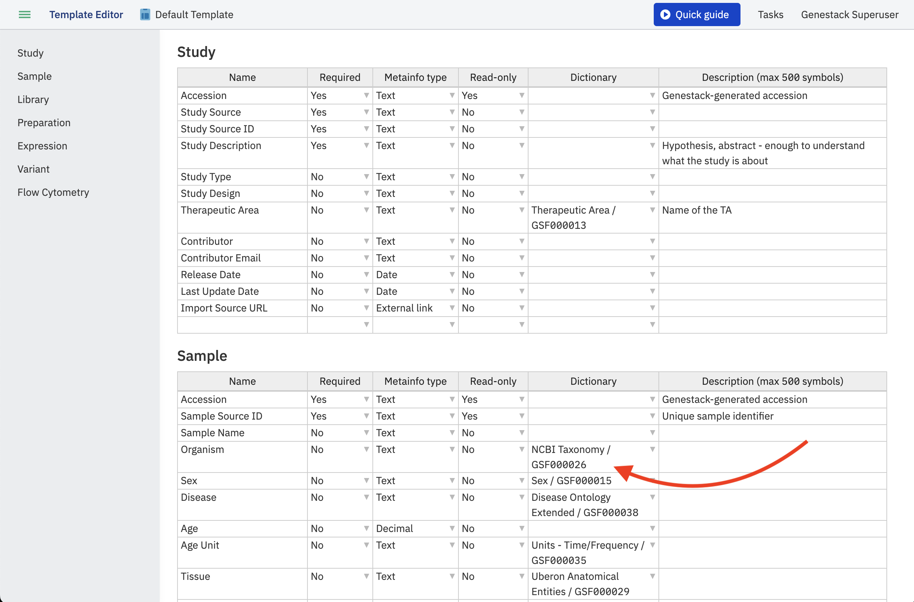
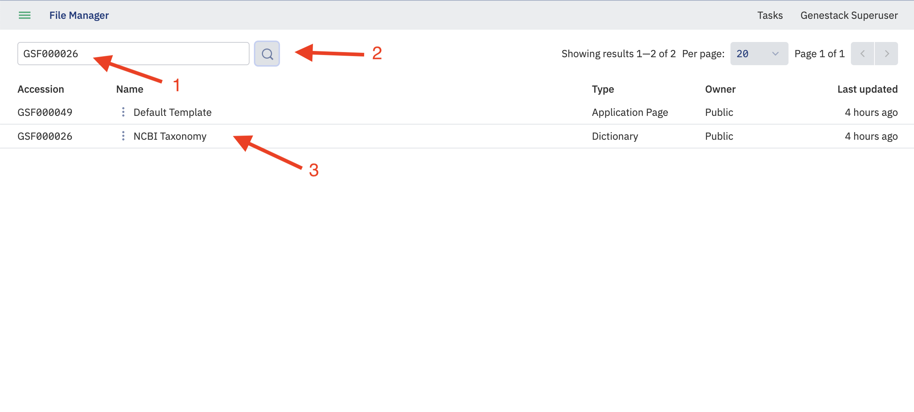
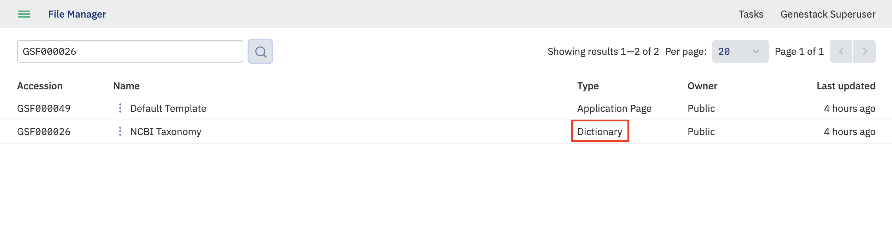
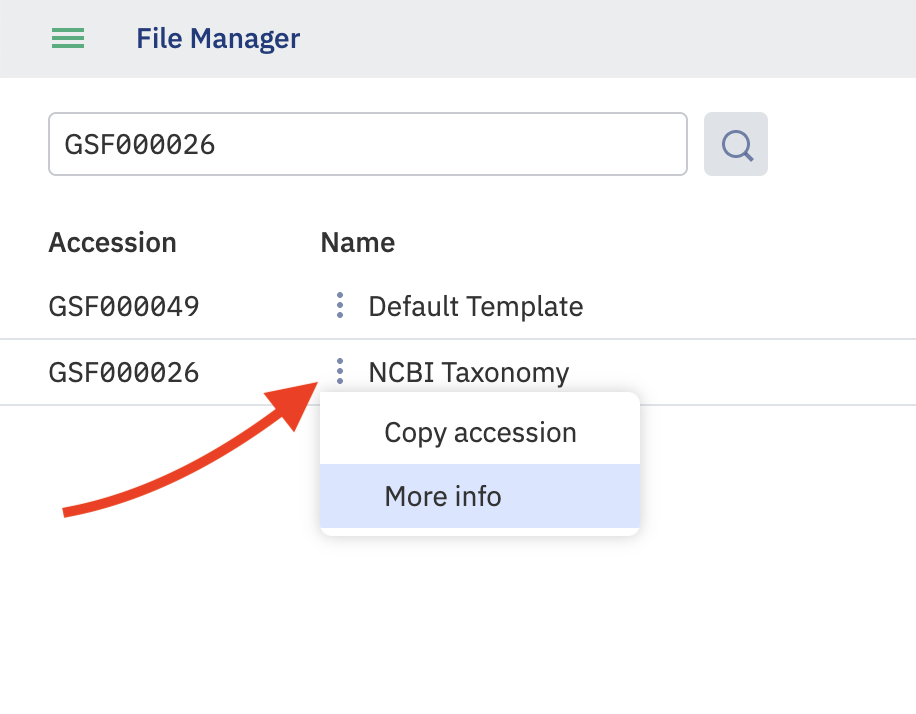
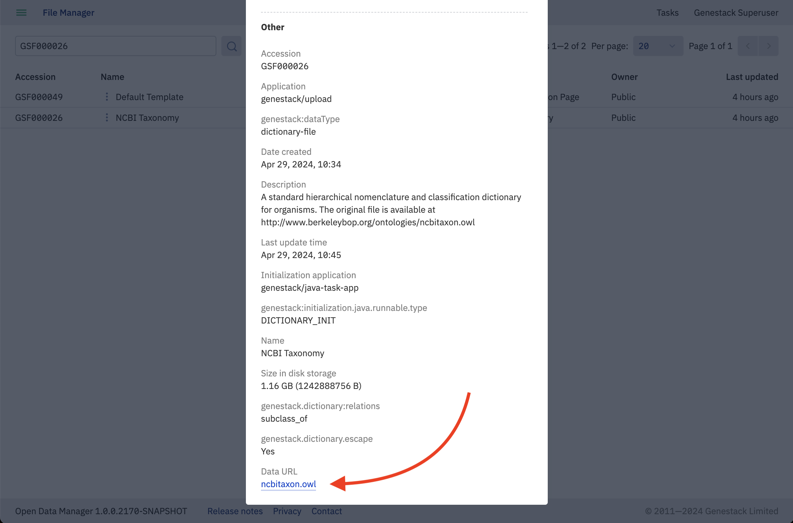
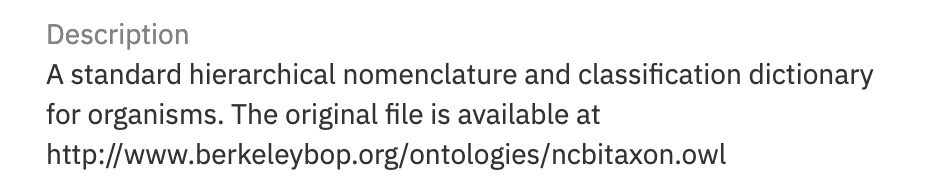

# How to get ontologies from ODM

1. From the Dashboard go to Template Editor
   
1. You will see all the templates
   
1. To review ontologies used in a particular template, open the template by clicking on the title.
   
1. You will see all the attributes, including which are associated with Dictionaries and you can square the list of Dictionaries used.
1. To get source-file of ontology, you will need accession (e.g. `GSF000026`)
1. Then you will need to go to the File Manager by a direct link: 
   `[your_host]/ui/files`
1. Put ontology Accession in the search field and click on the search button. You will see templates which use this dictionary and the dictionary itself.  
   
   There are templates files in the search results as well as dictionary files, to easily find a dictionary, look at the column "Type" and find "Dictionary":
   
1. Click on the more menu, you will see the context menu, click on "More info"
   
1. To download the source file click on the link from the Data URL attribute:
   
   Or you can go to the source in the description:
   
