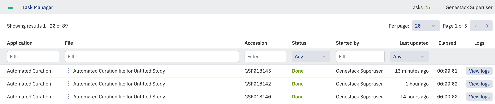
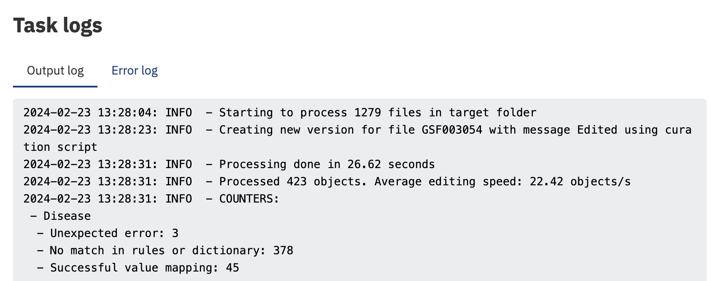

# Curation script

## Introduction

This script allows the curation of metadata by transforming incorrect metadata values
to correct ones based on controlled vocabularies (for example, “NCBI Taxonomy”)
and manually prepared files with rules for matching. Synonyms, if provided, can
assist in the matching process.

## Requirements

- Configured odm-sdk. See [Configured odm-sdk](../../configuration.md)
- The user should be a member of Curator group and have Bearer Token or API token. See [Getting a Genestack API token](https://odm-user-guide.readthedocs.io/en/latest/doc-odm-user-guide/getting-a-genestack-api-token.html#token-label)
- File with curation rules. How to correctly write such file is described [below](#metadata-mapping-rules).

    **Example**: [rules.json](curation-script/rules.json) written for sample metadata [samples.tsv](curation-script/samples.tsv).

## Curation script usage

To explore the full list of supported arguments use the following command:

```bash
odm-curate-study -h
```

Curation can be carried out by running the Python metadata curation script `odm-curate-study`.
This can be used to perform automated curation of metadata associated with experiments and assays on Genestack.
The script takes as input the accessions of Genestack study or studies which should contain the samples to be curated.
You must also supply a rules file, which specifies the rules for mapping.

```bash
odm-curate-study --rules <rules.json> <study accession(s)> -H GENESTACK_ENDPOINT_ADDR
```

Where `GENESTACK_ENDPOINT_ADDR` is the URL of the Genestack platform.

Space is used as a separator in case of multiple studies. Example:

```bash
odm-curate-study --rules rules.json GSF000100 GSF000200 -H GENESTACK_ENDPOINT_ADDR
```

You can test a curation rule before applying it with the --dry-run parameter. This will connect to the server and report
matches in the task output log (see later) but not actually change any data.

```bash
odm-curate-study --rules <rules.json> --dry-run <study accession> -H GENESTACK_ENDPOINT_ADDR
```

By default, if the target key already contains information it will not be overwritten and a warning will be noted in the
logs, however you can force this using the --overwrite flag. This does not affect attributes set as 'read-only' in the
template.

```bash
odm-curate-study --rules <rules.json> --overwrite <study accession> -H GENESTACK_ENDPOINT_ADDR
```

Example usage for acting on study GSF123456:

```bash
odm-curate-study --rules rules.json --overwrite GSF123456 -H GENESTACK_ENDPOINT_ADDR
```

## Metadata mapping rules

The curation application uses a `rules.json` file which defines the mapping rules using the `--rules <rule_file>`
argument. The rules must be provided as a JSON file which contains an array of objects, where each object describes a
metadata mapper.
The mapping script will search for raw uncurated metadata values in a list of input keys (also called "raw keys"), try
to map them to a "curated" value (using a synonym-aware dictionary or custom rules) and store the curated value in a
target key. Values are case-sensitive.
The valid attributes for the metainfo mapper are as follows:

- <b>dictionary</b> (string, optional) - the name of a public Genestack dictionary used as a source of valid terms - if
    specified mappings are not found in a supplied dictionary then a warning is given in the logs;
- <b>genestack_key</b> (string, mandatory) - target metainfo key (e.g. ‘Sex’);
- <b>object_type</b> (string, mandatory) - the specific data object being targeted (e.g. 'study' or 'sample', must be
    lowercase.)
- <b>raw_keys</b> (list of strings, mandatory) - comma separated list of names of the raw (ie from import) metadata
    keys in which raw values will be looked up (e.g. ‘sourceData:ae.sample.Characteristics [Sex]’);
- <b>rules</b> (object of strings, optional) - rules to map raw values to terms from dictionaries/ontologies.
    For example, below is a JSON rules file to define custom mapping rules for the "Sex" metainfo attribute. This will
    copy data from a column (`sourceData:ae.sample.Characteristics [Sex]`) to the correct one (`Sex`)

```json
[
    {
        "genestack_key": "Sex",
        "object_type": "sample",
        "raw_keys": ["sourceData:ae.sample.Characteristics [Sex]"]
    }
]
```

To do the same, but also map data values to specific terms ("m" to "male", "f" to "female", "?" to "unknown"), use the
following:

```json
[
    {
        "genestack_key": "Sex",
        "object_type": "sample",
        "raw_keys": ["sourceData:ae.sample.Characteristics [Sex]"],
        "rules": {
            "m": "male",
            "f": "female",
            "?": "unknown"
        }
    }
]
```

The end result is as per the below tables.

Before:

| _Sex_ |
| ----- |
| m     |
| f     |
| ?     |

After:

| _Sex_   |
| ------- |
| male    |
| female  |
| unknown |

Finally, a dictionary can be supplied in the rules. If the value (first mapped by rules) matches to one of the term's
synonyms it will be replaced with the preferred term.

```json
[
    {
        "genestack_key": "Sex",
        "object_type": "sample",
        "raw_keys": ["sourceData:ae.sample.Characteristics [Sex]"],
        "dictionary": "Sex"
    }
]
```

## _Key_with_unit_ Mapper

If samples have a key with unit values stored in 1 attribute, e.g. `“Time”=”7 days”`, it is possible to curate the
values so that they are displayed in 2 separate attributes in ODM: `“Time/value”=”7”, “Time/unit”=”days”`.

To split the value and its associated unit, the script will attempt to use the whitespace character(s) as a delimiter.
If there is a space, the script puts the part before the first space in the `Value` attribute, everything after the
first space in the `Unit` attribute (even if there are more than 1 space). Genestack keys should be specified for
both, using a comma separated list. If there are no spaces, everything is put in the `Value` attribute, the `Unit`
attribute is left empty. We rely on manual curation in this case.
Example of using the mapper with units:

```json
[
    {
        "object_type": "sample",
        "genestack_key": ["Treatment/dose/value", "Treatment/dose/unit"],
        "raw_keys": ["Value[Dose]"],
        "dictionary": "Units - Dose/Mass/Volume"
    }
]
```

- **Sample A:**

    - _Before_: `"Parameter Value[Dose]"=7 ug/ml`
    - _After_: `"Treatment/dose/value"=7, "Treatment/dose/unit"=microgram per millilitre`

- **Sample B:**

    - _Before_: `"Parameter Value[Dose]"=7 ug per ml`
    - _After_: `"Treatment/dose/value"=7, "Treatment/dose/unit"=ug per ml`

- **Sample C:**
    - _Before_: `"Parameter Value[Dose]"=7ug/ml`
    - _After_: `"Treatment/dose/value"=7ug/ml, "Treatment/dose/unit"=null`

Before:

| Sample Name | Dose        |
| ----------- | :---------- |
| Sample A    | 7 ug/ml     |
| Sample B    | 7 ug per ml |
| Sample C    | 7ug/ml      |

After:

| Sample Name | Dose   | Dose Unit |
| ----------- | :----- | :-------- |
| Sample A    | 7      | ug/ml     |
| Sample B    | 7      | ug per ml |
| Sample C    | 7ug/ml |           |

**Supported case:** We support curation of multiple values with units for a single sample with the `“key_with_unit“`
mapper,
e.g.:
Sample X {Attribute_1=A|B; Attribute_2=X|Y}
A= Paracetamol; X=5 mg
B= Analgin; Y=0.5 g

Before:

<table>
    <thead>
        <tr>
            <th>Sample Name</th>
            <th>Medicine</th>
            <th>Dose</th>
        </tr>
    </thead>
    <tbody>
        <tr>
            <td rowspan="2">Sample</td>
            <td>Paracetamol</td>
            <td> 5mg </td>
        </tr>
        <tr>
            <td>Analgin</td>
            <td> 0.5 g</td>
        </tr>
    </tbody>
</table>

After:

<table>
    <thead>
        <tr>
            <th>Sample Name</th>
            <th>Medicine</th>
            <th>Dose</th>
            <th>Dose Unit</th>
        </tr>
    </thead>
    <tbody>
        <tr>
            <td rowspan="2">Sample</td>
            <td>Paracetamol</td>
            <td> 5 </td>
            <td> mg </td>
        </tr>
        <tr>
            <td>Analgin</td>
            <td> 0.5 </td>
            <td>g </td>
        </tr>
    </tbody>
</table>

**Unsupported case:** Changing a single value to multiple values for this mapper is not supported.
Sample X {Attribute_1=A; Attribute_2=X|Y}
A= Paracetamol; X=2.5 g | Y=2.5 g
Before:

<table>
    <thead>
        <tr>
            <th>Sample Name</th>
            <th>Medicine</th>
            <th>Dose</th>
        </tr>
    </thead>
    <tbody>
        <tr>
            <td>Sample</td>
            <td>Paracetamol</td>
            <td> 5mg </td>
        </tr>
    </tbody>
</table>
After:
<table>
    <thead>
        <tr>
            <th>Sample Name</th>
            <th>Medicine</th>
            <th>Dose</th>
            <th>Dose Unit</th>
        </tr>
    </thead>
    <tbody>
        <tr>
            <td rowspan="2">Sample</td>
            <td rowspan="2">Paracetamol</td>
            <td> 2.5 </td>
            <td> g </td>
        </tr>
        <tr>
            <td> 2.5 </td>
            <td> g </td>
        </tr>
    </tbody>
</table>

## Reassigning attributes

When it comes to matching attribute names, the script works similarly to the “Reassign” feature of the Metadata Editor
application. That means that if a raw_key from the rules file is detected among the attributes, the values are
reassigned to the corresponding genestack_key, and the original attribute raw_key is deleted.

Rule:

```json
[
    {
        "genestack_key": "Disease",
        "object_type": "sample",
        "raw_keys": ["Illness", "DISEASE"]
    }
]
```

### Case 1

`raw_key` is a non-template attribute, `genestack_key` is a template attribute. After curation values are reassigned to
`genestack_key`, and the original attribute `raw_key` is deleted.

Before:

<table>
    <thead>
        <tr>
            <th></th>
            <th>Disease</th>
            <th>Illness</th>
        </tr>
    </thead>
    <tbody>
        <tr>
            <td >Sample 1</td>
            <td ></td>
            <td> A </td>
        </tr>
        <tr>
            <td >Sample 2</td>
            <td ></td>
            <td> B </td>
        </tr>
    </tbody>
</table>

After:

<table>
    <thead>
        <tr>
            <th></th>
            <th>Disease</th>
            <th></th>
        </tr>
    </thead>
    <tbody>
        <tr>
            <td >Sample 1</td>
            <td >A </td>
            <td></td>
        </tr>
        <tr>
            <td>Sample 2</td>
            <td>B</td>
            <td></td>
        </tr>
    </tbody>
</table>
The above is valid in most cases, but the behaviour can differ for some specific cases which are described below.

### Case 2

If multiple raw keys are defined for the same attribute, the values are taken from the first non empty raw key found for
the sample, the rest raw keys are ignored.

Multiple `raw_key`s from the rules are found. All `raw_key`s are non-template attributes. The first `raw_key` attribute
(`Illness`) has a value for the `Sample 1`, but does not have any value for the `Sample 2`. Hence the value from the
second `raw_key` attribute (`DISEASE`) is taken for the `Sample 2`. The `raw_key` attribute which values were
re-assigned for all samples (`Illness`) is deleted. The partially re-assigned attribute (`DISEASE`) still presents in
the table, but only with values which were not reassigned.

Before:

<table>
    <thead>
        <tr>
            <th></th>
            <th>Disease</th>
            <th>Illness</th>
            <th>DISEASE</th>
        </tr>
    </thead>
    <tbody>
        <tr>
            <td>Sample 1</td>
            <td></td>
            <td>A</td>
            <td>A1</td>
        </tr>
        <tr>
            <td >Sample 2</td>
            <td></td>
            <td></td>
            <td>B1</td>
        </tr>
    </tbody>
</table>

After:

<table>
    <thead>
        <tr>
            <th></th>
            <th>Disease</th>
            <th>DISEASE</th>
        </tr>
    </thead>
    <tbody>
        <tr>
            <td>Sample 1</td>
            <td>A</td>
            <td>A1</td>
        </tr>
        <tr>
            <td >Sample 2</td>
            <td>B1</td>
            <td></td>
        </tr>
    </tbody>
</table>

**Note:** The described case is quite rare since usually attributes with the same meaning will have the same name across
all samples in one study. Multiple raw keys are provided mostly for running the script on multiple studies from
different sources where attributes with the same meaning can have different names.

### Case 3

`raw_key` is a template attribute. This case is considerably rare too, since the main purpose of the Curation script is to
match non-template attributes of non-harmonised metadata to the template attributes. “Re-assign” feature cannot be used
for template attributes, since they cannot be deleted. Hence, the values will be copied from raw_key to `genestack_key`
and preserve `raw_key` in the same state as before the curation.

Before:

<table>
    <thead>
        <tr>
            <th></th>
            <th>Disease</th>
            <th>Illness</th>
        </tr>
    </thead>
    <tbody>
        <tr>
            <td>Sample 1</td>
            <td></td>
            <td>A</td>
        </tr>
        <tr>
            <td >Sample 2</td>
            <td></td>
            <td>B</td>
        </tr>
    </tbody>
</table>
After:
<table>
    <thead>
        <tr>
            <th></th>
            <th>Disease</th>
            <th>Illness</th>
        </tr>
    </thead>
    <tbody>
        <tr>
            <td>Sample 1</td>
            <td>A</td>
            <td>A</td>
        </tr>
        <tr>
            <td >Sample 2</td>
            <td>B</td>
            <td>B</td>
        </tr>
    </tbody>
</table>

## Read only attributes

Attributes set as read only in the template associated with the study cannot be curated, and a warning is displayed in
the logs. The `overwrite` flag does not affect this behaviour.

## Multiple rules for a single attribute

If multiple rules for the same attribute are found the warning message is displayed in the logs:

```text
Multiple curation rules were detected for the attribute X.
```

[//]: # "This block is currently not supported, see ODM-9665 for the details"
[//]: # "## Versioning (from 1.42)"
[//]: # "Using the curation script publishes a new version of the metadata changed. The default message `“Edited using curation"
[//]: # "script”` will be used to name new metadata versions."
[//]: # "In order to provide custom version message an optional parameter `--version-message` can be used. Users can specify"
[//]: # '`--version-message “<version-message>”` to set a custom message, e.g. `"Curate treatment attribute”`.'
[//]: # "Alternatively, the user can set `--do-not-publish`, so that curation script will only change staging version without"
[//]: # "publishing new metadata versions. This cannot be used at the same time as `--version-message`.  If the user provides an"
[//]: # "empty `--version-message` - the script will throw an error."

## Progress, Logs

You can track the progress of the curation process in the Genestack Task Manager:


The results of mapping are shown in the output logs:

