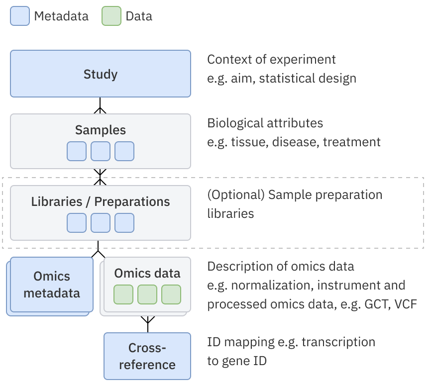

# How to load and share a study, samples and associated data via async loading

This article explains how to load studies via script and share them with the organisation (via GUI).
More information about supported files can be found also in [the user
guide](https://odm-user-guide.readthedocs.io/en/latest/doc-odm-user-guide/supported-formats.html).

## Requirements

- Configured odm-sdk. See [Configured odm-sdk](../../configuration.md)
- Having `pandas` library installed. We recommend using the latest version available.
- All files with object metadata and data are hosted and available via URLs, e.g. `http://data_source/study.csv` or file:
    `///local_data/data_source/study.csv` for the case when you need to load data to ODM from a local machine on which ODM
    is installed.
- [Requirements for Data Loaded to ODM](uploading-study/requirements-for-data-loaded-to-odm.pdf)

## Restrictions

- The script does not allow to load of several studies via one run.
- The script does not provide functionality to load data to ODM from local computer

## Instructions

- Open a terminal and run a command to display help

```shell
odm-import-data -h
```

- Run the script with the below parameters:
    - `-t, --token`: your API token <br/> OR <br/>
    - `-at, --access-token`: Your Access (Bearer Token), provided by third party
    - `-H, --host, -srv, --server`: address of the host, e.g. <https://odm.genestack.com/>
    - `-s,--study`: URL of the study file (or -sa: accession of an existing study)
    - `-sm,--samples`: URL of the samples file or accession of existing samples file to be linked
    - `-lb, --libraries`: URL of the libraries file or accession of existing libraries file to be linked
    - `-pr, --preparations`: URL of hosted preparations file or accession of existing preparations file to be linked
    - `-e,--expression`: URL of any tabular data file (not only expression data) except Gene Variant or Flow Cytometry
    - `-em,--expression-metadata`: URL of any tabular metadata file (not only expression data) except Gene Variant or Flow Cytometry
    - `-v, --variant`: URL of the variants data file
    - `-vm, --variant-metadata`: URL of the variants metadata file
    - `-f, --flow-cytometry`: URL of the flow cytometry data file
    - `-fm, --flow-cytometry-metadata`: URL of the flow cytometry metadata file
    - `-tmpl, --template`: accession of a template to validate against, if not specified "template marked as default" is
        used;

Additional optional parameters:

- to include a gene-transcript mapping file:

    - `-mpf / mapping-file` - link to mapping file
    - `-mpfm / mapping-file-metadata` - link to metadata file for the mapping file
    - `-mpfa / mapping-file-accession` - accession of the existing mapping file

- rules for uploading mapping files are described in the section below “Importing a cross-reference mapping file“
- to allow the loading of a duplicate of the study: the data from the links has already been previously loaded into ODM
    and for testing purposes, you need to load this data again - `--allow-duplicates`
- to link all entities of the study according to the data model used: data model with and without libraries and
    preparations - `-lata, --link-all-to-all`. Additional rules are described in the section below “Link all to all“
- to enable debug mode - `--debug`
- to allow the script to continue even if linking errors occurred between study
    entities - `-ile, --ignore-linking-errors`
- to recognize first `N` columns in expression file as feature attributes: `-nfa [N]`
    or `--number-of-feature-attributes [N]`
- to identify multiple measurement in expression file and use a character `:` to distinguish the
    sample/library/preparation name from the measurement name in column headers: `-ms ':'`
    or `--measurement-separator ':'`
- to specify the uploaded data as a data class `C`: `-dc 'C'` or `--data-class 'C'`
    - The following options are available: `Bulk transcriptomics`, `Single cell transcriptomics`, `Differential abundance (FC, pval, etc.)`, `Pathway analysis`, `Proteomics`, `Single cell proteomics`, `Metabolomics`, `Lipidomics`, `Epigenomics`, `DNA methylation`, `Chemoinformatics`, `Imaging features`, `Gene panel data`, `Biomarker data`, `Physical measures`, `Blood counts`, `Other body fluid counts`, `Nanopore`, `Gene variant (VCF)`, `Flow Cytometry`, `Other`

---

## Data model

The script supports 2 data models:


- Study - Samples - Omics data:
    - the script uses this data model if no parameters are specified for libraries or preparations loading;
- Study - Samples - Libraries/Preparations - Omics data.
    - the script uses this data model if parameters for libraries or preparations loading are specified;
    - omics data can be linked only to libraries or preparations;
    - only expression data (the parameters --expression and --expression-metadata) is supported.

The script works sequentially, linking the object with the previous one according to the data model. Below you can find
examples to demonstrate different combinations:

### _Example 1_

```shell
odm-import-data --token [token] -H [HOST] \
  --study http://data_source/study.csv \
  --samples http://data_source/samples_1.csv \
  --expression http://data_source/expression_1.gct \
  --expression-metadata http://data_source/expression_metadata_1.gct.tsv \
  --expression http://data_source/expression_2.gct \
  --expression-metadata http://data_source/expression_metadata_2.gct.tsv
```

- `samples_1` will be linked to `study`
- `expression_1` will be linked to `samples_1`
- `expression_2` will be linked to `samples_1`

### _Example 2_

```shell
odm-import-data --token [token] -H [HOST] \
  --study http://data_source/study.csv \
  --samples http://data_source/samples_1.csv \
  --libraries http://data_source/libraries_1.csv \
  --expression http://data_source/expression_1.gct \
  --expression-metadata http://data_source/expression_metadata_1.gct.tsv \
  --preparations http://data_source/preparations_1.csv \
  --expression http://data_source/expression_2.gct \
  --expression-metadata http://data_source/expression_metadata_2.gct.tsv
```

- `samples_1` will be linked to `study`
- `libraries_1` will be linked to `samples_1`
- `expression_1` will be linked to `libraries_1`
- `preparations_1` will be linked to `samples_1`
- `expression_2` will be linked to `preparations_1`

### _Example 3_

```shell
odm-import-data --token [token] -H [HOST] \
  --study http://data_source/study.csv \
  --samples http://data_source/samples_1.csv \
  --samples http://data_source/samples_2.csv \
  --libraries http://data_source/libraries_1.csv \
  --preparations http://data_source/preparations_1.csv \
  --expression http://data_source/expression_1.gct \
  --expression-metadata http://data_source/expression_metadata_1.gct.tsv
```

- `samples_1` will be linked to `study`
- `samples_2` will be linked to `study`
- `libraries_1` will be linked to `samples_2`
- `preparations_1` will be linked to `samples_2`
- `expression_1` will be linked to `preparations_1`

## Link all to all

The `-lata` parameter allows to bypass the restriction of sequential linking of objects. The behaviour of the script
with the specified `-lata` parameter depends on the used data model:

1. If there are only samples in the script → the script tries to link all omics data to all samples;
2. If there are libraries or preparations in the script the linking works by steps:
    - the script tries to link all libraries and all preparations to all samples;
    - the script tries to link all omics data to all libraries and preparations.

### _Example 1 without --link-all-to-all_

```shell
odm-import-data --token [token] -H [HOST] \
    --study http://data_source/study.csv \
    --samples http://data_source/samples_1.csv \
    --samples http://data_source/samples_2.csv \
    --expression http://data_source/expression_1.gct \
    --expression-metadata http://data_source/expression_metadata_1.gct.tsv
```

- `samples_1` will be linked to `study`
- `samples_2` will be linked to `study`
- `expression_1` will be linked only to `samples_2`

### _Example 2 with --link-all-to-all_

```shell
odm-import-data --token [token] -H [HOST] \
    --study http://data_source/study.csv \
    --samples http://data_source/samples_1.csv \
    --samples http://data_source/samples_2.csv \
    --expression http://data_source/expression_1.gct \
    --expression-metadata http://data_source/expression_metadata_1.gct.tsv \
    --link-all-to-all
```

- `samples_1` will be linked to `study`
- `samples_2` will be linked to `study`
- `expression_1` will be linked to `samples_1` and `samples_2`

### _Example 3 with libraries_

```shell
odm-import-data --token [token] -H [HOST] \
    --study http://data_source/study.csv \
    --samples http://data_source/samples_1.csv \
    --samples http://data_source/samples_2.csv \
    --libraries http://data_source/libraries_1.csv \
    --preparations http://data_source/preparations_1.csv \
    --expression http://data_source/expression_1.gct \
    --expression-metadata http://data_source/expression_metadata_1.gct.tsv \
    --link-all-to-all
```

- `samples_1` will be linked to `study`
- `samples_2` will be linked to `study`
- `libraries_1` will be linked to `samples_1` and `samples_2`
- `preparations_1` will be linked to `samples_1` and `samples_2`
- `expression_1` will be linked to `preparations_1` and `libraries_1`

## Study name

By default, the Study Title field in the study metadata file will be used to set the name of the study, or if no field
is present, it will be set to 'New Study'. You can rename studies via ODM GUI.

## Importing a cross-reference mapping file

The parameters “mpf” and “mpfm” are used to create a new mapping file with metadata and its linkage with an expression
group. The parameter “mpfa” is used for linkage expression groups with an existing mapping file.

How to specify the parameters:

1. You can only specify both “mpf” and “mpfm” at the same time as loading expression data. Otherwise, an error will be
   given: “mapping file is supported with expression matrices only”
2. You can only specify “mpfa” at the same time as loading expression data. Otherwise, an error will be given: “mapping
   file is supported with expression matrices only”
3. The user can’t specify “mpfm” without “mpf”. Otherwise, an error message is given: “the parameter “mpf” for mapping
   file loading is missing”
4. For the sample group, you can specify either option 1 (one pair of “mpfm” and “mpf”) or option 2 (“mpfa”). Otherwise,
   an error message is given: "only one mapping file is expected. check the value of parameters “mpf” or “mpfa”".
5. The parameters “mpf”, “mpfm” and “mpfa” must be after the parameters for loading expression data, for example:

    ```shell
    odm-import-data --token [token] -H [HOST] \
        --study http://data_source/study.csv \
        --samples http://data_source/samples_1.csv \
        --expression http://data_source/expression_1.gct \
        --expression-metadata http://data_source/expression_metadata_1.gct.tsv \
        --expression http://data_source/expression_2.gct \
        --expression-metadata http://data_source/expression_metadata_2.gct.tsv \
        --mapping-file http://data_source/mapping.txt \
        --mapping-file-metadata http://data_source/mapping_metadata.tsv \
        --template GSF0000000 \
        --allow-duplicates
    ```

6. If `link-all-to-all` is specified the script tries to link mapping file to all expression data that was specified.
7. Only one mapping file can be specified along with `link-all-to-all`.

## Versioning

The script now enables users to update existing omics data files (e.g. GCT, VCF files). This is done by appending the
accession of the existing data file to be updated in square brackets to the data file URL (see below). Previous versions
of the data files are kept and are still available, but the active version will be set to the most recently uploaded.

### _Example_

```shell
odm-import-data --token [token] -H [HOST] \
    --study-accession GSF994039 \
    --samples GSF994040 \
    --expression http://exampl.com/expression.gct[GSF994565]  \
    --expression-metadata http://exampl.com/expression_metadata.tsv  \
    --variant http://exampl.com/variations.vcf[GSF994700] \
    --variant-metadata http://exampl.com/variant_metadata.tsv
```

As a result of the above, the data files linked to study `GSF994039` and samples `GSF994040` will be updated:

- Expression file as the next version of `GSF994565`
- Variant file as the next version of `GSF994700`

Updating data file versions only works for data files linked to existing studies and samples, you cannot create a new
study or new samples file at the same time as updating a data file version.

!!!info Info
    If you get errors importing data but aren’t sure why you can add the `--debug` argument to generate more detailed help information - at the end of this is the message from the server, which might tell you something about your input files.

## Other examples

Here you can find some predefined examples for study importing.

### Study with expressions

You can use [study-samples-omics.zip](uploading-study/examples/study-samples-omics.zip) archive. This archive contains:

- `Test.study.tsv` — study metadata file;
- `Test.samples.tsv` — samples metadata file;
- `Test.expression.gct.tsv` — expression metadata file;
- `Test.expression.gct` — expression data file.

Firstly you need to upload files to data source and get links to these files. And then import a study:

```shell
odm-import-data --token [token] -H [HOST] \
  --study http://data_source/Test.study.tsv \
  --samples http://data_source/Test.samples.tsv \
  --expression-metadata http://data_source/Test.expression.gct.tsv \
  --expression http://data_source/Test.expression.gct
```

### Study with libraries and preparations

You can use [study-samples-libraries-omics.zip](uploading-study/examples/study-samples-libraries-omics.zip) archive. This archive contains:

- `Test.study.tsv` — study metadata file;
- `Test.samples.tsv` — samples metadata file;
- `Test.libraries.tsv` — libraries metadata file;
- `Test.preparations.tsv` — preparations metadata file;
- `Test.expression.gct.tsv` — expression metadata file;
- `Test.expression.gct` — expression data file.

Firstly you need to upload files to data source and get links to these files. And then import a study:

```shell
odm-import-data --token [token] -H [HOST] \
  --study http://data_source/Test.study.tsv \
  --samples http://data_source/Test.samples.tsv \
  --libraries http://data_source/Test.libraries.tsv \
  --preparations http://data_source/Test.preparations.tsv \
  --expression-metadata http://data_source/Test.expression.gct.tsv \
  --expression http://data_source/Test.expression.gct
```

### Study with variants

You can use [study-variants.zip](uploading-study/examples/study-variants.zip) archive. This archive contains:

- `Example.study.tsv` — study metadata file;
- `Example.samples.tsv` — samples metadata file;
- `Example.expression.gct.tsv` — expression metadata file;
- `Example.expression.gct` — expression data file;
- `Example.gx-dummy.tsv` — variants metadata file;
- `Example.gx-dummy.vcf` — variants data file.

Firstly you need to upload files to data source and get links to these files. And then import a study:

```shell
odm-import-data --token [token] -H [HOST] \
  --study http://data_source/Example.study.tsv \
  --samples http://data_source/Example.samples.tsv \
  --expression-metadata http://data_source/Example.expression.gct.tsv \
  --expression http://data_source/Example.expression.gct
  --variant-metadata http://data_source/Example.gx-dummy.tsv
  --variant http://data_source/Example.gx-dummy.vcf
```

### Argi study example

You can use [argi-study-example.zip](uploading-study/examples/argi-study-example.zip) archive. This archive contains:

- `arabidopsis.gct` — expression data file;
- `arabidopsis_sample_metadata_uncurated.tsv` - samples metadata file;
- `arabidopsis_study.tsv` — study metadata file.

Firstly you need to upload files to data source and get links to these files. And then import a study:

```shell
odm-import-data --token [token] -H [HOST] \
  --study http://data_source/arabidopsis_study.tsv \
  --samples http://data_source/arabidopsis_sample_metadata_uncurated.tsv \
  --expression http://data_source/arabidopsis.gct
```
