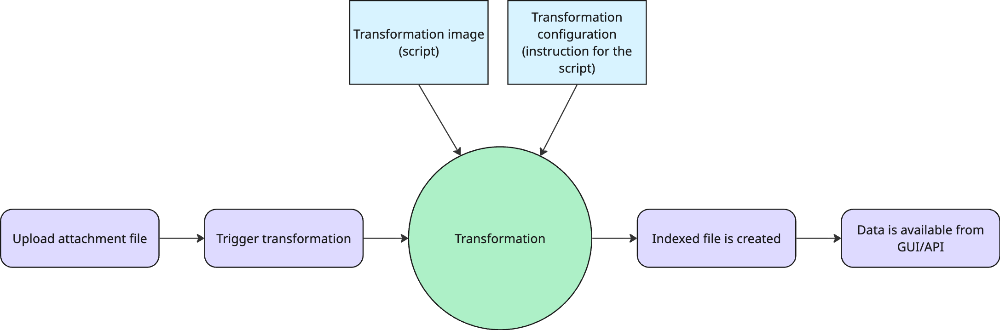
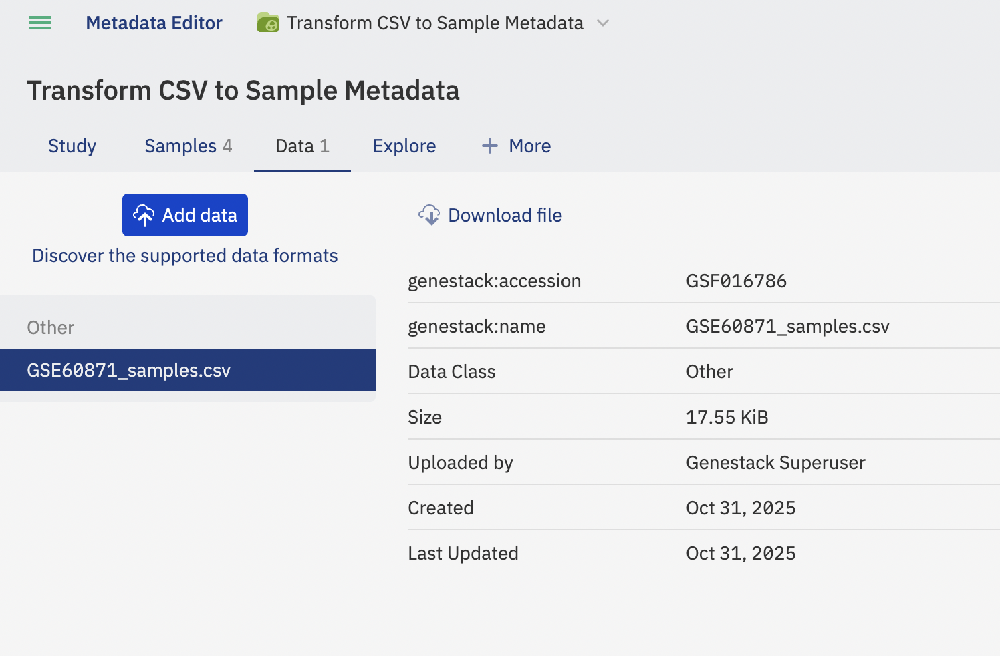
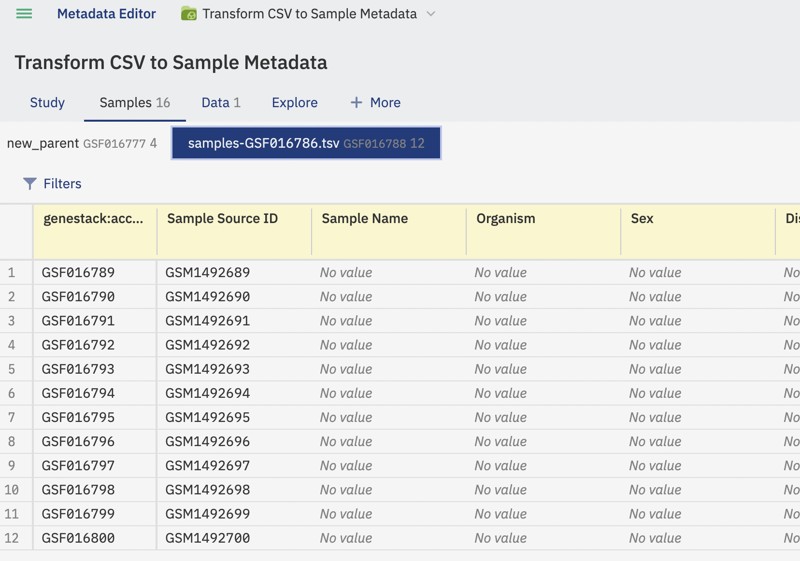

# Attachments transformation

## Transformations in General
Transformation is a process that allows users to convert any attached file format type into a format that ODM can index.
Currently, ODM can't accept csv files as a source of metadata, but ODM can accept tsv files for that purpose. 
This is solved with the help of transformation.

Each transformation consists of transformation script (image) and its configuration. For example, image has ability 
to transform CSV file to TSV, at the same time configuration provides information where this TSV should be places, 
e.g. Samples, Libraries, Preparations, Cell metadata, Expression, Variants, etc.



## Get the list of available images
Currently ODM has default image called `metadata-basic`.
This image allows user to transform `CSV` files into `TSV` to create Sample group.

To get the list of available images via API go to `processorController` Swagger definition of endpoints and use 
GET `transformations/images`. Endpoint response example:

```json
[
  {
    "name": "metadata-basic",
    "version": "0.0.1",
    "description": "Basic converter from attachment to metadata",
    "input_formats": [
      "csv"
    ],
    "output_formats": [
      "samples"
    ]
  },
  {
    "name": "metadata-basic",
    "version": "0.0.2",
    "description": "Basic converter from attachment to metadata",
    "input_formats": [
      "csv"
    ],
    "output_formats": [
      "samples"
    ]
  },
  {
    "name": "metadata-basic",
    "version": "latest",
    "description": "Basic converter from attachment to metadata",
    "input_formats": [
      "csv"
    ],
    "output_formats": [
      "samples"
    ]
  }
]
```
This transformation works only in combination with configuration.

## Create new configuration

To create new configuration for `metadata-basic` image use POST `transformations/configurations` endpoint.

Initial request body:

```json
{
  "data": "string",
  "description": "string",
  "name": "string"
}
```
Let’s create configuration that allows image to place transformed `CSV` file to Samples:

```json
{
  "data": {
    "source": "csv",
    "destination": "samples"
    },
  "description": "Configuration which allows you to transform csv file into Sample group",
  "name": "csv to samples"
}
```
Response body example:

```json
[
  {
    "id": 294862386,
    "name": "csv to samples",
    "data": {
      "destination": "samples",
      "source": "csv"
    },
    "description": "Configuration which allows you to transform csv file into Sample group"
  }
]
```

Now configuration is created and can be found via GET `transformations/configurations` endpoint:

```json
[
  {
    "id": 294862386,
    "name": "csv to samples",
    "data": {
      "destination": "samples",
      "source": "csv"
    },
    "description": "Configuration which allows you to transform csv file into Sample group"
  }
]
```

## Run the transformation

To proceed with transformation let’s use the following `CSV` table with Samples metadata:

[Samples_metadata](https://bio-test-data.s3.us-east-1.amazonaws.com/User_guide_test_data/Attachments+transformation/samples.csv), 
a CSV file with Sample attributes.

Upload the file as attachment to your Study:



Go to `Transformation Jobs` section in `processorControllers` group in API. Use POST `transformations/jobs` 
endpoint to transform `CSV` file into Sample group.

Initial request body:

```json
{
  "attachment_accession": "string",
  "configuration_id": 1,
  "image_reference": {
    "name": "string",
    "version": "string"
  },
  "volume_size": 30
}
```
Fill in information about attachment genestack accession, configuration, image name and version:

```json
{
  "attachment_accession": "GSF016786",
  "configuration_id": 294862386,
  "image_reference": {
    "name": "metadata-basic",
    "version": "0.0.2"
  },
  "volume_size": 30
}
```

Response contains information about your Job id:

```json
{
  "$schema": "https://odm-processors-controller:8080/schemas/TransformationJobId.json",
  "id": 341346019
}
```

To check the status of the Job use GET `transformations/jobs/{id}` endpoint:

```json
{
  "$schema": "https://odm-processors-controller:8080/schemas/TransformationJobFields.json",
  "image_reference": {
    "name": "metadata-basic",
    "version": "0.0.2"
  },
  "attachment_accession": "GSF016786",
  "configuration_id": 294862386,
  "volume_size": 30,
  "create_time": "2025-10-31T12:28:57Z",
  "status": {
    "state": "TERMINATED"
  }
}
```

Transformation converts `CSV` file to `TSV` format and triggers POST `jobs/import/samples/multipart` endpoint 
automatically. It uploads new `TSV` file to Sample metadata group to the Study where initial `CSV` attachment 
is placed.

As the result new Sample metadata group was created in ODM:


