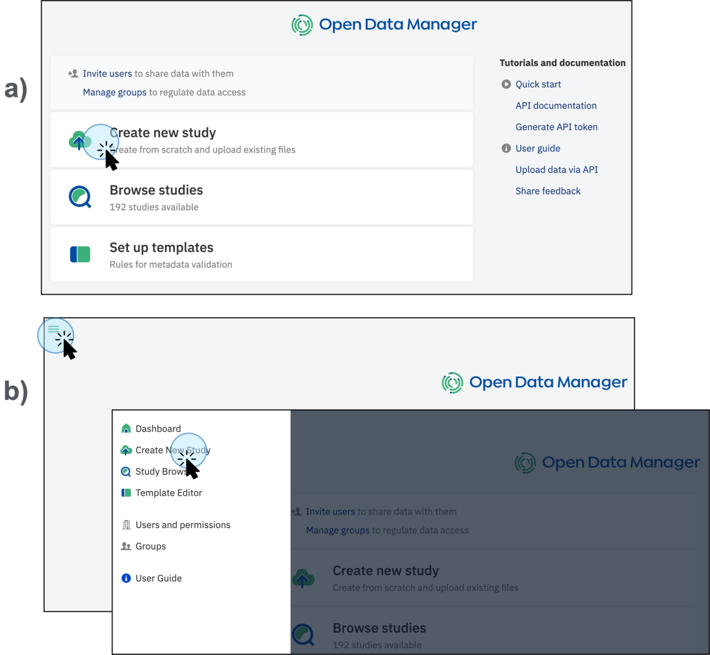
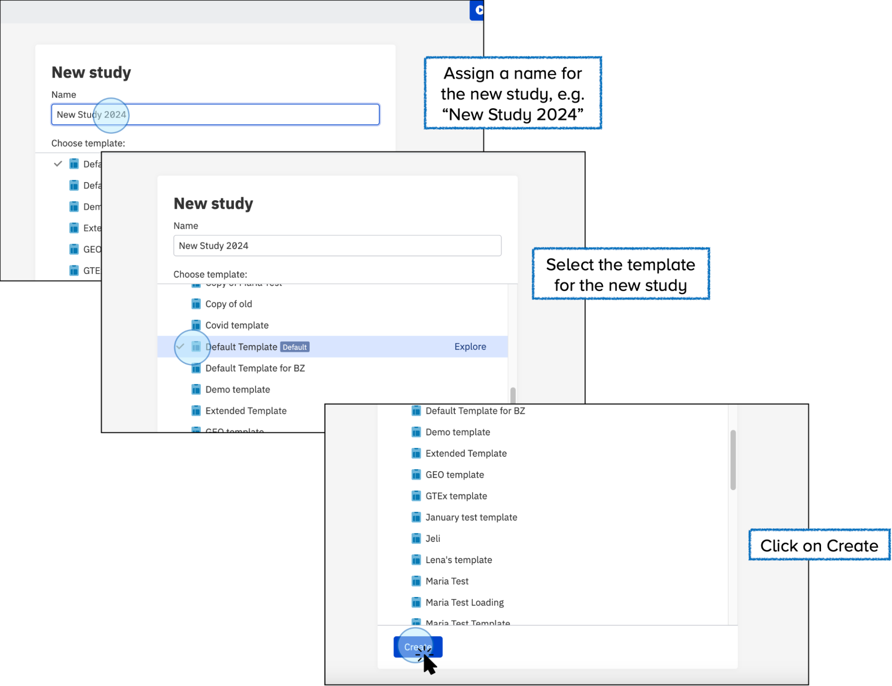
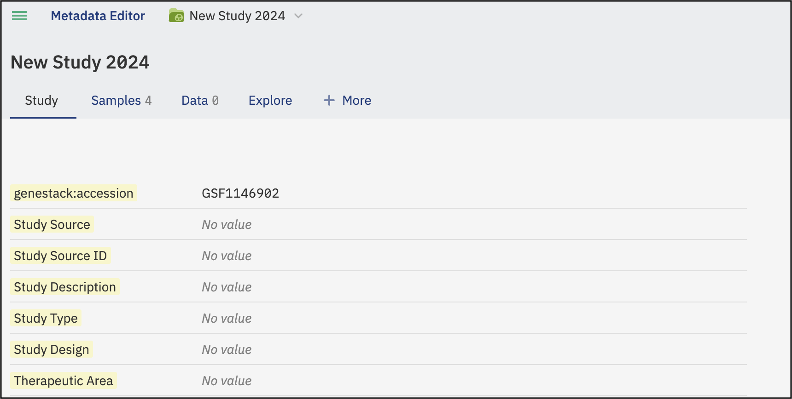
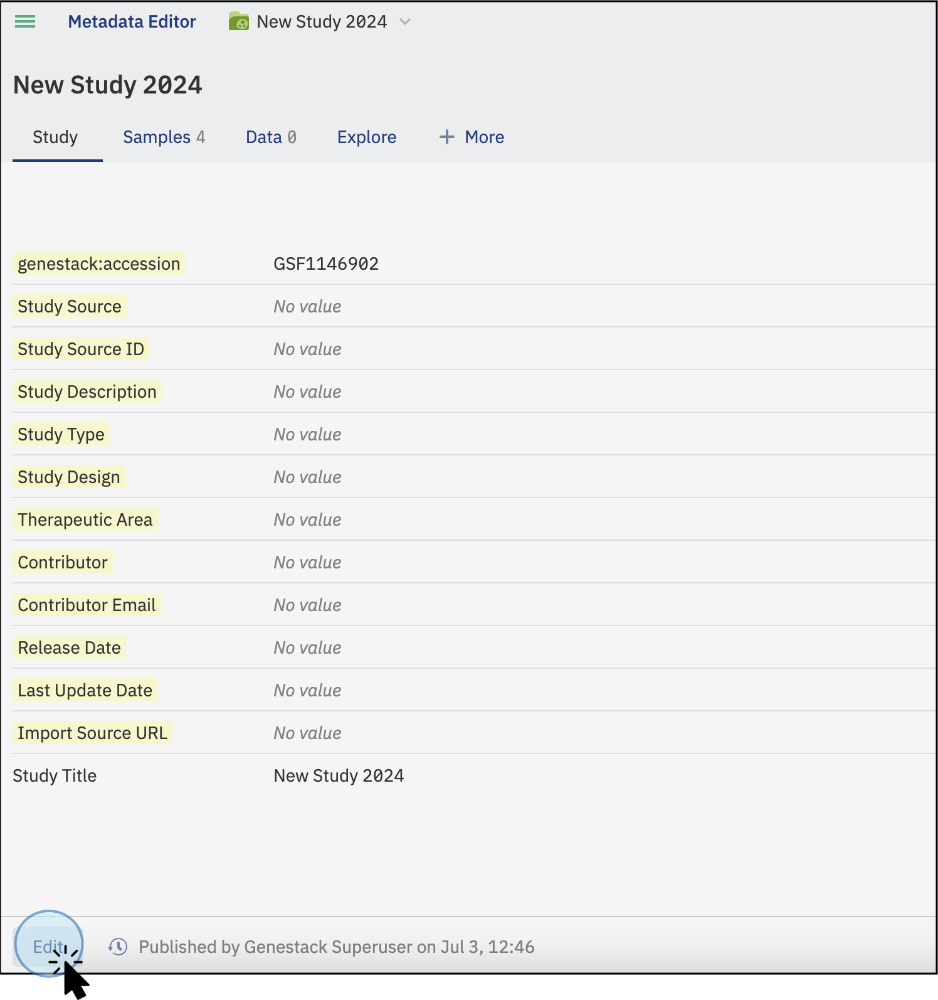
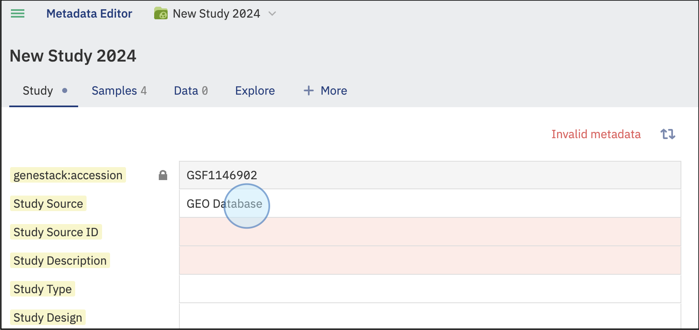
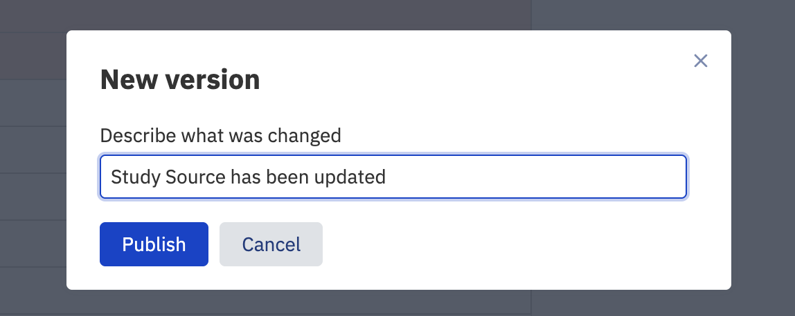

To create a new study in the Open Data Manager, follow these steps:

1. Click on **Create new study**: Start by selecting the option to create a New Study on the main dashboard (a) or from the menu in the top left corner, then click on “Create a New Study” (b).
    
    <figcaption>Available routes to create a new study, a) directly from the main dashboard, b) access the option on the top left panel</figcaption>

2. **Assign a Name**: Give your study a descriptive name to identify it easily, e.g. “**New Study 2024**”.
3. **Select the Template**: Choose the template you want to use for your study. Templates define the metadata structure and validation rules for your study. You can create your own template, and there is no limit on the number of templates you can use.
    1. **Understanding Templates**: For more information about what a template is and how it works, refer to the [Key Concepts section](https://odm.demo.genestack.com/user-docs/user-guide/key-concepts/key-concepts/#group). This section provides definitions and details about templates, including how to create and edit them. Explore the [Templates section](https://odm.demo.genestack.com/user-docs/user-guide/doc-odm-user-guide/template-editor/) if you require more information or need detailed guidance.

<figcaption>Steps to assign a name for a new study, and select a template to create a new study</figcaption>

## Explore and Edit Study Details

Once you click on **Create**, a new study will be automatically created, and you will be redirected to it. Here, you can explore the various tabs and features that are available.

The study will open in a new tab, where the following tabs can be explored:

* **Study**: Study refers to the foundational framework for a research project. It includes essential details such as the study's objective, hypotheses, experimental design, and statistical methods. The Study tab serves as the starting point for data organization, setting the stage for all subsequent data collection and analysis activities.
* **Samples Metadata**: Samples Metadata refers to the detailed information about the biological samples used in the study. This includes critical attributes such as tissue type, disease status, treatment conditions, and other relevant biological descriptors. Accurate documentation of sample metadata is crucial for reproducibility and for understanding the context and variability of the data.
* **+More:** The **+More** tab offers the possibility to upload and link **Libraries/Preparations.** This optional tab in ODM is used to document the methods and protocols for sample preparation, as well as the libraries generated from these samples. This can include details about sequencing libraries, reagent batches, and preparation protocols. Including this information helps in understanding the provenance and quality of the data, which is essential for data interpretation and reproducibility.
* **Data**: The Data section encompasses the actual raw or processed experimental data generated from the study. This includes primary outputs such as sequence reads, imaging data, or any other type of experimental measurement. Proper organization and annotation of this data are critical for subsequent data analysis, sharing, and long-term storage.
* **Explore:** This is a visualization tool. In this section, you can select up to two features from the sample metadata tab to create a graphical representation. 

<figcaption>Appearance of the recently created <strong>New Study 2024</strong></figcaption>

## Accession number

In addition, a unique accession number is automatically generated for each study in the ODM. The accession number allows you to identify the specific study and to further work with the study via API endpoints.

## Edit details

* To edit the details of your study, select a tab and click on **Edit** at the bottom left of the page.

<figcaption>To make changes on the Study tab, click on the Edit button</figcaption>

* Select the feature you want to edit, for example, **Study Source**. Type the new value for the field.

<figcaption>Select and manually edit the Study tab details</figcaption>

* Click **Publish** to save the changes. You can customize the name for the version you are updating by clicking the **Publish** button at the bottom of the screen. A new window will pop up, allowing you to customize the version name. 

<figcaption>Customize the version of the changes made to the tabs</figcaption>