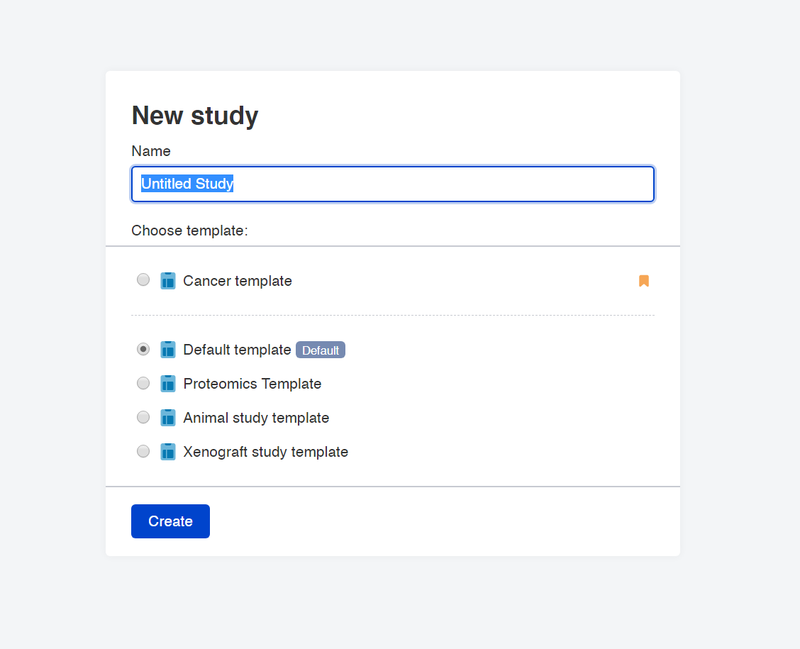
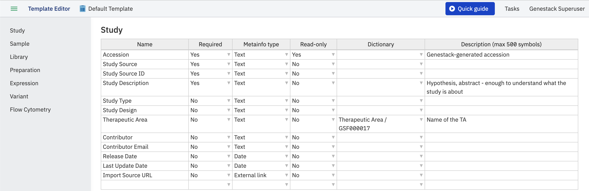
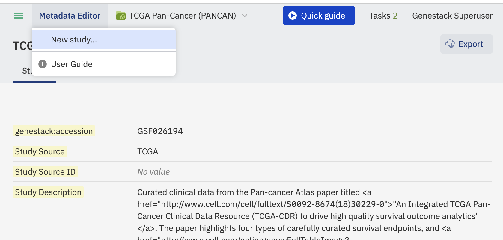

# Create new study

To create a new study go to the Dashboard and click the **Create new study** button.

The new study will be opened in the **Metadata Editor** where you can name the study and
change the template from the Default template if necessary.

You can view any template by hovering over its name and click **Explore** to open it in the Template Editor application.

You can also create a new study from the Metadata Editor page:
click the application name and select **New Study**:

