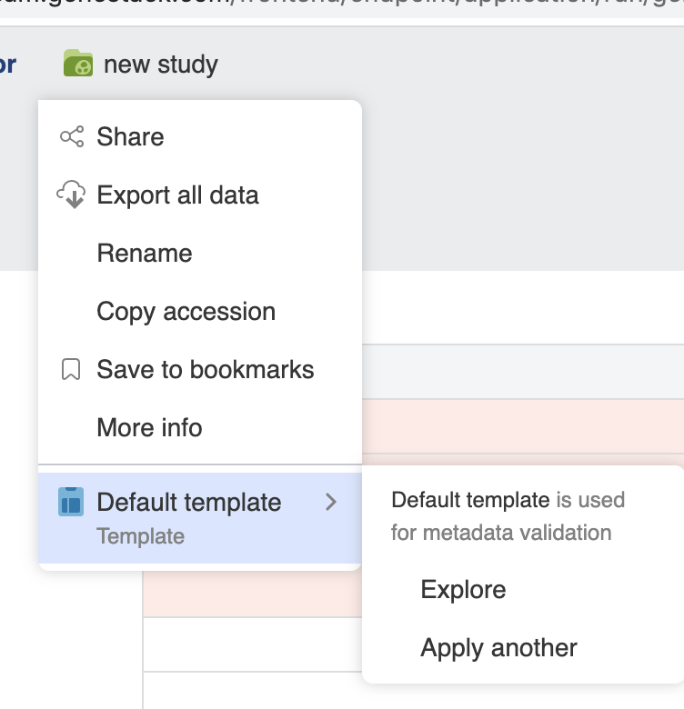

# Curator Guide

This guide is for users who have uploaded data to ODM and now wish to curate it by adding or changing metadata.

## Dashboard

From the Dashboard where you first log in, select “Browse studies” to enter the Study Browser:

## Study Browser

In the Study Browser you can view studies you’ve uploaded easily by checking the “Owned by me” option. By clicking on the study title (“New Study” if there is no value for the Study title field) you can enter the Metadata Editor application which allows you to make changes to the study and associated metadata.

## Metadata Editor

The Metadata Editor application is where you can make changes to the Study, Samples and any processed/experimental, metadata.

To rename the study click on the study title link at the top of the page and select “Rename”. Type in the new name and click the blue “Rename” button.

## Validation

Metadata fields are checked against a specific template, and if required fields are missing
or have incorrect values as determined by the template then an “Invalid metadata” flag is shown, together with a red
background for the field which is invalid. Templates contain specific rules for each of the Study, Samples and
processed/experimental metadata tabs.

The specific template that applies for a dataset can be changed by clicking the **Apply another..** option from the study  title drop-down menu.

Note that the special values “Not applicable” and “Not recorded” will always pass validation.

### Correcting metadata

To correct metadata, click the field you wish to change. If the input is text you can type a new value in directly.
When all the fields in a tab have been corrected the Invalid metadata flag will be removed an instead a green
“Metadata is valid” flag will show.

Fields which have dictionaries specified for them in the template, for example, Organism, allow you to click the
triangle in order to select a term from a list given by the dictionary, or you can begin to type and the window
will suggest auto-completions for you. Terms matching dictionary terms will turn green.

Values in the samples table cells can be propagated by dragging the bottom-right corner of a cell.

To replace multiple values you can use **bulk replace** function. If some metadata fields are filled in incorrectly, for example a specified value has some typos or metadata terms don’t match the template, you will see the **Invalid metadata** link in the upper right corner.

Another option to aid bulk replace is to click the name a metadata filed that include incorrect values
and select “Bulk replace” in the drop down list.

Clicking on the Invalid metadata link or “Bulk replace” option opens the **Validation Summary** pop-up window where the invalid metadata terms will be shown.

Select a value that should be replaced.

The **Replace values** window will open, allowing you to type in the correct value.
If the field is controlled by a dictionary then auto-complete suggestions will also appear
so that you can match the dictionary terms.

Click **Replace in…** button to apply the changes.

> 

The incorrect metadata values will be replaced with the new terms.

If there are any filters applied (for example, “Sex” - “male”), you can choose to replace values only for the samples that match your filter:

As a result, values for only the filtered samples will be changed.

> 

### Special Values

When typing or selecting replacement values it is possible for the curator to use the special values “Not applicable” or “Not recorded”. When these values are used they are ignored by the validation rules (they always pass validation), and will be represented using italics to show this.
