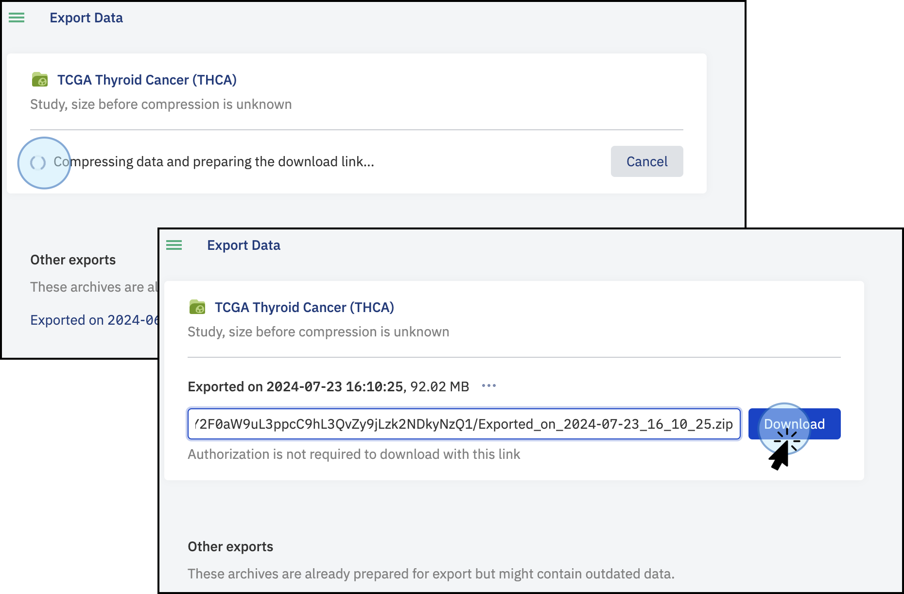

# Exporting Data

## Exporting Study
In addition to browsing, exploring, and visualizing studies, you can also export full datasets.

Export data functionality is presented both in Study Browser and Metadata Editor:

1. Study Browser:
      * In Study Browser window you can access **Export data** button from the three dots menu to the left from your Study name.

      
      <figcaption>Export the data by clicking on the <strong>Export data</strong> option in Study Browser</figcaption>

2. Metadata Editor:
      * In your study window click on the **Export** button. The **Export** button can be accessed from the right side of the 
   window or by clicking on the study title, which will reveal a dropdown menu with the option to export data. 
   The menu can also be accessed by clicking on the three dots next to the option Export on the right side of the screen.

      
      <figcaption>Export the data by clicking on the <strong>Export data</strong> option in Metadata Editor</figcaption>

Clicking the **Export data** button will open a new window where all the files associated with the study will be compressed.

* Once the files are compressed, the download button will be active and the files can be downloaded to your local computer.
* The link is pre-authenticated so anyone with the link will be able to download the Study and associated data.
* Previous export links that have been generated will be listed at the bottom of the screen. These are archive versions 
and will reflect the data at the time the link was generated, not necessarily the latest version.
 

<figcaption>Files will be compressed, and once ready, the folder can be downloaded to the user’s local computer.</figcaption>

## Understanding the Downloaded Contents

* The downloaded folder will contain all the linked and attached files related to the specific study.

* Additionally, a text file named **file_descriptions** (in a plain text format) will be included, summarizing the 
information of the downloaded files.

<figcaption>Downloaded files. The downloaded folder contains all the data and metadata associated with the study. In addition, a plain text file called <strong>file_descriptions</strong> is automatically created and contains detailed information about the data that has been downloaded</figcaption>

## Exporting a Specific Dataset
* You can export a specific dataset of interest, but this functionality is only available from the **Data** tab. To do 
this, navigate to the Data tab containing the desired analysis and click the **Download file** button. Please note that 
it is not currently possible to export only sample metadata or study metadata separately. 
* The dataset, along with its corresponding metadata and description, will be compressed into an archive and made 
available via a download link.

<figcaption>Download specific Datasets by selecting them and click on <strong>Download file</strong></figcaption>
