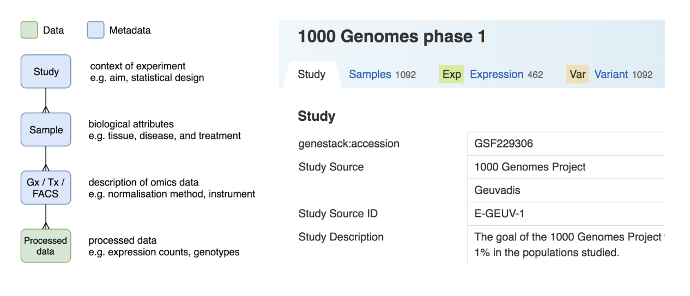
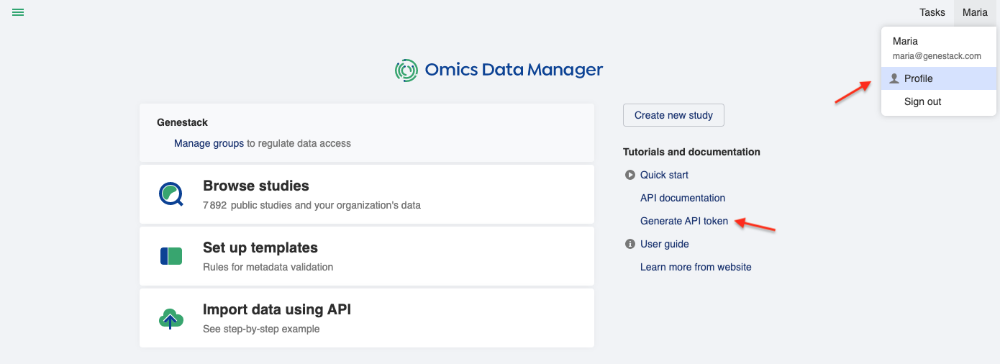
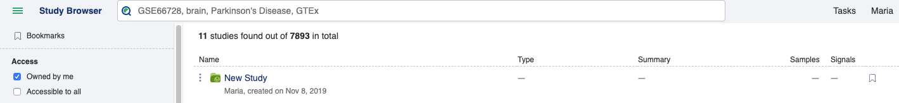
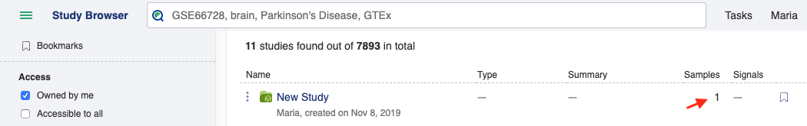
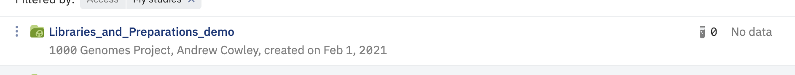
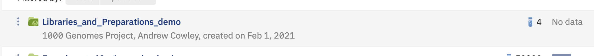
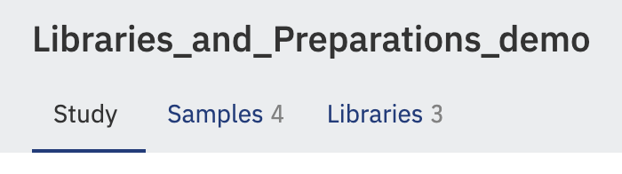

# Import Data Using API

On this page, you will find a brief explanation about data import via APIs, followed by a step-by-step example that
you can try. Please note that you need to be a member of the curator group in ODM to be able to import and edit data.

## What can I import?

You can import studies, samples, and any data in the tabular format:

- *Study*: the context of an experiment, such as the aim and statistical design.
- *Sample*: the biological attributes of a sample, such as tissue, disease, and treatment.
- *Data*: Includes transcriptomics, proteomics, gene variant, flow cytometry data, and more. You can import the metadata (e.g. genome version, normalization
  method, and the locations of raw/processed data in your storage) together with the processed data (e.g. expression counts, genotypes).

Once imported, studies, samples, and data metadata will be queryable and editable from both the User Interface and APIs, whilst the signal data will only queryable via APIs.

You can optionally also import:

- *Cross-reference mapping*: a list of transcript and gene ids and how they map to each other.
- *Libraries metadata*: metadata about sample library preparation for transcriptomics data.
- *Preparations metadata*: metadata about sample preparation for proteomics data.

## Can I capture the relationships between studies, samples, and data?

Importing data has two stages. First, you import studies, samples, and data separately. Then, you link them
together: a study can be linked to multiple samples and a sample can be linked to multi-omics or other types of data. The **Sample Source ID** is used as the default linking key. You can choose another attribute from the template for linking data to samples.. The data model and how it looks in the User Interface is shown below:



## Where can I import the data from?

You should provide HTTPS file links (which can include authentication credentials) to a storage that’s accessible
by ODM. File uploads from a local computer will be supported in a future release.

## Step-by-step example 1

In this example, we will import tiny subset of data from the 1000 Genomes Project, consisting of the following files:

- [Test_1000g.study.tsv](https://s3.amazonaws.com/bio-test-data/odm/Test_1000g/Test_1000g.study.tsv), a tab-delimited file of the study attributes

| Study Source         | Study Description              | Target Disease   |
|----------------------|--------------------------------|------------------|
| 1000 Genomes Project | Subset of 1000 Genomes Project | Healthy          |

- [Test_1000g.samples.tsv](https://s3.amazonaws.com/bio-test-data/odm/Test_1000g/Test_1000g.samples.tsv), a tab-delimited file of sample attributes.

| Sample Source        | Sample Source ID   | Species      | Sex   | Population   |
|----------------------|--------------------|--------------|-------|--------------|
| 1000 Genomes Project | HG00119            | Homo sapiens | M     | British      |
| 1001 Genomes Project | HG00121            | Homo sapiens | F     | British      |
| 1002 Genomes Project | HG00183            | Homo sapiens | M     | Finnish      |
| 1003 Genomes Project | HG00176            | Homo sapiens | F     | Finnish      |

- [Test_1000g.gct](https://s3.amazonaws.com/bio-test-data/odm/Test_1000g/Test_1000g.gct), a [GCT](https://software.broadinstitute.org/cancer/software/gsea/wiki/index.php/Data_formats#GCT:_Gene_Cluster_Text_file_format_.28.2A.gct.29) file of expression data from multiple sequencing runs

| Name            | Description   |   HG00119 |   HG00121 |   HG00183 |   HG00176 |
|-----------------|---------------|-----------|-----------|-----------|-----------|
| ENSG00000077044 |               |      14.7 |      16.8 |      17.2 |      19.5 |
| ENSG00000085982 |               |       4.2 |       7.1 |       5.5 |       6.8 |

- [Test_1000g.gct.tsv](https://s3.amazonaws.com/bio-test-data/odm/Test_1000g/Test_1000g.gct.tsv), a tab-separated file that describes the expression data

| Expression Source    | Normalization Method   | Genome Version   |
|----------------------|------------------------|------------------|
| 1000 Genomes Project | RPKM                   | GRCh38.91        |

- [Test_1000g.vcf](https://s3.amazonaws.com/bio-test-data/odm/Test_1000g/Test_1000g.vcf), a [VCF](https://samtools.github.io/hts-specs/VCFv4.2.pdf) file of variant data from multiple sequencing runs

|   #CHROM |       POS | ID          | REF   | ALT   |   QUAL | FILTER   | INFO    | FORMAT   | HG00119   | HG00121   | HG00183   | HG00176   |
|----------|-----------|-------------|-------|-------|--------|----------|---------|----------|-----------|-----------|-----------|-----------|
|        2 | 233364596 | rs838705    | G     | A     |    100 | PASS     | AF=0.64 | GT       | 0|0       | 0|1       | 1|0       | 1|1       |
|        2 | 233385915 | rs201966773 | T     | TTC   |    987 | PASS     | AF=0.86 | GT       | 0|0       | 0|1       | 1|1       | 1|1       |

- [Test_1000g.vcf.tsv](https://s3.amazonaws.com/bio-test-data/odm/Test_1000g/Test_1000g.vcf.tsv), a tab-separated file that describes the variant data

| Variant Source       | Genome Version   |
|----------------------|------------------|
| 1000 Genomes Project | GRCh38.91        |

We will go through the following steps:

1. Authorization Token
<br/>

1.a Generate an API token
<br/>
1.b Use Access Token
<br/>
2.  Import a study
<br/>
3.  Import samples
<br/>
4.  Link samples to study
<br/>
5.  Import and link expression data to samples
<br/>
6.  Import and link variant data to samples
<br/>
7.  Check that you can query the relationships between objects
<br/>

1. **Authorization Token**

When using the APIs, you need to provide a token for authentication.

> 1.a **Generate an API token**

You can generate a Genestack API token by going to your profile, which can be found by clicking your username at the top right corner
of the User Interface, or from the Dashboard.



The API token is permanent — there is no expiration date. However, you can revoke it at any time and have multiple
tokens.

> 1.b **Use Access Token**

You could also be provided with an Access Token. To use it, in the follow examples replace the authorization header part

```default
curl -H "Genestack-API-Token: <your API token>" ...
```

with

```default
curl -H "Authorization: Bearer <your Access Token>" ...
```

1. **Import a study**

There are specific endpoints to import specific data types, as listed in the **Swagger API documentation**. For studies,
you should go to the *studyCurator* endpoint, use the **POST** method, and supply the file URL:

```default
curl -H "Genestack-API-Token: <your API token>" -H "Content-Type: application/json" -H "Accept: application/json" -X POST -d '{"link":"https://s3.amazonaws.com/bio-test-data/odm/Test_1000g/Test_1000g.study.tsv"}' <HOST>/frontend/rs/genestack/studyCurator/default-released/studies
```

If successful, you should see the accession and metadata of the created study in the response. You should also see some
warnings because some of the required attributes from the default metadata template are missing or incorrect:

```default
{
  "warnings": [
    "The value for required attribute \"Study Source ID\" is not present",
    "The value for required attribute \"Study Type\" is not present"
  ],
  "data": {
    "genestack:accession": "GSF282799",
    "Study Source": "1000 Genomes Project",
    "Study Source ID": null,
    "Study Description": "Subset of 1000 Genomes Project",
    "Study Type": null,
    "Study Design": null,
    "Therapeutic Area": null,
    "Contributor": null,
    "Contributor Email": null,
    "Release Date": null,
    "Last Update Date": null,
    "Raw Data Files": null,
    "Processed Data Files": null,
    "Processed Data Matrix Files": null,
    "Import Source URL": null,
    "Database Source URL": null,
    "Study Title": "New Study",
    "Target Disease": "Healthy"
  }
}
```

You can also confirm this visually, by going to the **Study Browser** and check that a new study has been created,
owned by you:



1. **Import samples**

To import samples, you should use a different endpoint, *sampleCurator*:

```default
curl -H "Genestack-API-Token: <your API token>" -H "Content-Type: application/json" -H "Accept: application/json" -X POST -d '{"link":"https://s3.amazonaws.com/bio-test-data/odm/Test_1000g/Test_1000g.samples.tsv"}' <HOST>/frontend/rs/genestack/sampleCurator/default-released/samples
```

Similar to the previous step, you should see the accession and metadata of the created samples in the response —
a list of four objects this time, rather than just one object:

```default
[
  {
    "warnings": [
      "The value \"M\" for attribute \"Sex\" is a synonym in the controlled vocabulary \"GSF000071\". Did you mean one of [male]?"
    ],
    "data": {
      "genestack:accession": "GSF282801",
      "Sample Source ID": "HG00119",
      "Sample Name": null,
      "Organism": null,
      "Sex": "M",
      "Disease": null,
      "Cell Line": null,
      "Cell Type": null,
      "Tissue": null,
      "Sampling Site": null,
      "Age": null,
      "Compound": null,
      "Compound Dose": null,
      "Compound Dose Unit": null,
      "Raw Data Files": null,
      "Processed Data Files": null,
      "Import Source URL": null,
      "Sample Source": "1000 Genomes Project",
      "Population": "British",
      "Species": "Homo sapiens"
    }
  },
… <three more sample objects here> …
]
```

However, you won’t see the samples in the Study Browser yet, because no samples have been linked to the study.

1. **Link samples to study**

You can link samples to study using the integration endpoint, specifying the accessions of the pair of objects to be
linked. The following call will link one of the samples (sample HG00119 with accession GSF282801) to the study
(with accession GSF282799):

```default
curl -H "Genestack-API-Token: <your API token>" -H "Content-Type: application/json" -H "Accept: application/json" -X POST <HOST>/frontend/rs/genestack/integrationCurator/default-released/integration/link/sample/GSF282801/to/study/GSF282799
```

If successful, in the Study Browser you should see (after refreshing the page) that the number of samples next
to your study has changed from ‘-’ to ‘1’:



You can link the other samples in the same way. In practice, we’d create a script to automate this process, using common sample IDs.

1. **Import and link expression data to samples**

This time, we’re going to import expression data, supplying two files, one for the metadata, and another for the
processed data:

```default
curl -H "Genestack-API-Token: <your API token>" -H "Content-Type: application/json" -H "Accept: application/json" -X POST -d '{"link":"https://s3.amazonaws.com/bio-test-data/odm/Test_1000g/Test_1000g.gct", "metadataLink":"https://s3.amazonaws.com/bio-test-data/odm/Test_1000g/Test_1000g.gct.tsv"}' <HOST>/frontend/rs/genestack/expressionCurator/default-released/expression/gct
```

If successful, you will get four run-level expression objects, corresponding to the four columns in the expression matrix:

```default
{
  "runs": [
    {
      "genestack:accession": "GSF282812",
      "Sample Source ID": "HG00119"
    },
    {
      "genestack:accession": "GSF282813",
      "Sample Source ID": "HG00121"
    },
    {
      "genestack:accession": "GSF282814",
      "Sample Source ID": "HG00183"
    },
    {
      "genestack:accession": "GSF282815",
      "Sample Source ID": "HG00176"
    }
  ],
  "experiment": "GSF282811",
  "warnings": []
}
```

You can then link these run-level expression objects to the corresponding samples. The call below will link
the expression object GSF282812 to the sample HG00119 (that’s been linked to the study in the previous step):

```default
curl -H "Genestack-API-Token: <your API token>" -H "Content-Type: application/json" -H "Accept: application/json" -X POST <HOST>/frontend/rs/genestack/integrationCurator/default-released/integration/link/expression/GSF282812/to/sample/GSF282801
```

1. **Import and link variant data to samples**

Let’s repeat the previous step. This time, for variant data, so that the same sample (HG00119) is linked to both
expression and variant data.

To import the variant data:

```default
curl -H "Genestack-API-Token: <your API token>" -H "Content-Type: application/json" -H "Accept: application/json" -X POST -d '{"link":"https://bio-test-data.s3.amazonaws.com/odm/Test_1000g/Test_1000g.vcf", "metadataLink":"https://bio-test-data.s3.amazonaws.com/odm/Test_1000g/Test_1000g.vcf.tsv"}' <HOST>/frontend/rs/genestack/variantCurator/default-released/variant/vcf
```

Which should give you four run-level variant objects, corresponding to the four sample columns in the VCF file:

```default
{
  "runs": [
    {
      "genestack:accession": "GSF282825",
      "Sample Source ID": "HG00119"
    },
    {
      "genestack:accession": "GSF282826",
      "Sample Source ID": "HG00121"
    },
    {
      "genestack:accession": "GSF282827",
      "Sample Source ID": "HG00183"
    },
    {
      "genestack:accession": "GSF282828",
      "Sample Source ID": "HG00176"
    }
  ],
  "experiment": "GSF282824",
  "warnings": []
}
```

To link the variant object GSF282825 with the sample HG00119:

```default
curl -H "Genestack-API-Token: <your API token>" -H "Content-Type: application/json" -H "Accept: application/json" -X POST <HOST>/frontend/rs/genestack/integrationCurator/default-released/integration/link/variant/GSF282825/to/sample/GSF282801
```

1. **Check that you can query the relationships between objects**

Once you’ve created and linked the study, sample, expression, and variant objects, you can do integration-aware query via both the User Interface and APIs.

## Step-by-step example 2

This example is similar to the previous one, but demonstrates using library/preparation file objects. In this case expression/proteomics data files are linked to library/preparations files rather than samples.

- [Test_RM.study.tsv](https://bio-test-data.s3.amazonaws.com/Research_Model_BR-205/Test_RM.study.tsv), a tab-delimited file of the study attributes

| Study Source         | Study Description              |
|----------------------|--------------------------------|
| 1000 Genomes Project | Subset of 1000 Genomes Project |

- [Test_RM.samples.tsv](https://bio-test-data.s3.amazonaws.com/Research_Model_BR-205/Test_RM.samples.tsv), a tab-delimited file of sample attributes.

| Sample Source        | Sample Source ID   | Sex   | Population   |
|----------------------|--------------------|-------|--------------|
| 1000 Genomes Project | SRR6441195         | M     | British      |
| 1001 Genomes Project | SRR6441188         | F     | British      |
| 1002 Genomes Project | SRR6441196         | M     | Finnish      |
| 1003 Genomes Project | SRR6441197         | F     | Finnish      |

- [Test_RM.libraries.tsv](https://bio-test-data.s3.amazonaws.com/Research_Model_BR-205/Test_RM.libraries.tsv), a tab-delimited file of library metadata.

| Library ID   | Sample Source ID      | Preparation Protocol   | Library Type      |
|--------------|-----------------------|------------------------|-------------------|
| LIB1         | SRR6441195|SRR6441188 | NGS                    | Spatial RNA-Seq-1 |
| LIB2         | SRR6441196            | NGS                    | RNA-Seq-1         |

- [Test_RM_g.gct](https://bio-test-data.s3.amazonaws.com/Research_Model_BR-205/Test_RM_g.gct), a [GCT](https://software.broadinstitute.org/cancer/software/gsea/wiki/index.php/Data_formats#GCT:_Gene_Cluster_Text_file_format_.28.2A.gct.29) file of expression data from multiple sequencing runs. Note in this example the GCT file is using library IDs for linking.

| Name      | Description   |   LIB1 |   LIB2 |
|-----------|---------------|--------|--------|
| ENSG00777 |               |   21.9 |   19.9 |
| ENSG00888 |               |   23.7 |   24.9 |

- [Test_RM_g.gct.tsv](https://bio-test-data.s3.amazonaws.com/Research_Model_BR-205/Test_RM_g.gct.tsv), a tab-separated file that describes the expression data

| Normalization Method   | Genome Version   |
|------------------------|------------------|
| RPKM                   | GRCh38.91        |

We will go through the following steps:

1. Generate an API token
2. Import a study
3. Import samples
4. Link samples to study
5. Import and link library metadata file to samples
6. Import and link expression data to the library file (note linking to library file instead of samples)
7. Check that you can query the relationships between objects

1. **Generate an API token**

When using the APIs, you need to provide an API token for authentication.
You can generate this by going to your **profile**, which can be found by clicking your username at the top right corner
of the User Interface, or from the Dashboard.


The API token is permanent — there is no expiration date. However, you can revoke it at any time and have multiple
tokens.

1. **Import a study**

There are specific endpoints to import specific data types, as listed in the **Swagger API documentation**. For studies,
you should go to the *studyCurator* endpoint, use the **POST** method, and supply the file URL:

```default
curl -H "Genestack-API-Token: <your API token>" -H "Content-Type: application/json" -H "Accept: application/json" -X POST -d '{"link":"https://bio-test-data.s3.amazonaws.com/Research_Model_BR-205/Test_RM.study.tsv"}' <HOST>/frontend/rs/genestack/studyCurator/default-released/studies
```

If successful, you should see the accession and metadata of the created study in the response. You should also see some
warnings because some of the required attributes from the default metadata template are missing or incorrect:

```default
{
  "warnings": [
    "The value for required attribute \"Study Source ID\" is not present",
    "The value for required attribute \"Study Type\" is not present"
  ],
  "data": {
    "genestack:accession": "GSF1243204",
    "Study Source": "1000 Genomes Project",
    "Study Source ID": null,
    "Study Description": "Subset of 1000 Genomes Project",
    "Study Type": null,
    "Study Design": null,
    "Therapeutic Area": null,
    "Contributor": null,
    "Contributor / Email": null,
    "Release date": null,
    "Last Update Date": null,
    "Data Files / Raw": null,
    "Data Files / Processed": null,
    "Data Files / Processed Matrix": null,
    "Import Source URL": null,
    "Database Source URL": null,
    "Study Title": "Libraries_and_Preparations_demo"
  }
}
```

You can also confirm this visually, by going to the **Study Browser** and check that a new study has been created,
owned by you:



1. **Import samples**

To import samples, you should use a different endpoint, *sampleCurator*:

```default
curl -H "Genestack-API-Token: <your API token>" -H "Content-Type: application/json" -H "Accept: application/json" -X POST -d '{"link":"https://bio-test-data.s3.amazonaws.com/Research_Model_BR-205/Test_RM.samples.tsv"}' <HOST>/frontend/rs/genestack/sampleCurator/default-released/samples
```

Similar to the previous step, you should see the accession and metadata of the created samples in the response —
a list of four objects this time, rather than just one object, as well as the samples group accession under the GroupID field:

```default
[
  {
    "data": {
      "genestack:accession": "GSF1243206",
      "Sample Source ID": "SRR6441195",
      "Organism": null,
      "Sex": "M",
      "Disease": null,
      "Cell Line": null,
      "Cell Type": null,
      "Tissue": null,
      "Sampling Site": null,
      "Age": null,
      "Compound treatment / Compound": null,
      "Compound treatment / Dose": null,
      "Compound treatment / Dose Unit": null,
      "Data Files / Raw": null,
      "Data Files / Processed": null,
      "Import Source URL": null,
      "Sample Source": "1000 Genomes Project",
      "Population": "British",
      "groupId": "GSF1243205"
    }
  },
  {
    "warnings": [
      "The value for required attribute \"Organism\" is not present",
      "The value \"F\" for attribute \"Sex\" is a synonym in the controlled vocabulary \"GSF989288\". Did you mean one of [female]?"
    ],
    "data": {
      "genestack:accession": "GSF1243207",
      "Sample Source ID": "SRR6441188",
      "Organism": null,
      "Sex": "F",
      "Disease": null,
      "Cell Line": null,
      "Cell Type": null,
      "Tissue": null,
      "Sampling Site": null,
      "Age": null,
      "Compound treatment / Compound": null,
      "Compound treatment / Dose": null,
      "Compound treatment / Dose Unit": null,
      "Data Files / Raw": null,
      "Data Files / Processed": null,
      "Import Source URL": null,
      "Sample Source": "1000 Genomes Project",
      "Population": "British",
      "groupId": "GSF1243205"
    }
  },
  {
    "warnings": [
      "The value for required attribute \"Organism\" is not present",
      "The value \"M\" for attribute \"Sex\" is a synonym in the controlled vocabulary \"GSF989288\". Did you mean one of [male]?"
    ],
    "data": {
      "genestack:accession": "GSF1243208",
      "Sample Source ID": "SRR6441196",
      "Organism": null,
      "Sex": "M",
      "Disease": null,
      "Cell Line": null,
      "Cell Type": null,
      "Tissue": null,
      "Sampling Site": null,
      "Age": null,
      "Compound treatment / Compound": null,
      "Compound treatment / Dose": null,
      "Compound treatment / Dose Unit": null,
      "Data Files / Raw": null,
      "Data Files / Processed": null,
      "Import Source URL": null,
      "Sample Source": "1000 Genomes Project",
      "Population": "Finnish",
      "groupId": "GSF1243205"
    }
  },
  {
    "warnings": [
      "The value for required attribute \"Organism\" is not present",
      "The value \"F\" for attribute \"Sex\" is a synonym in the controlled vocabulary \"GSF989288\". Did you mean one of [female]?"
    ],
    "data": {
      "genestack:accession": "GSF1243209",
      "Sample Source ID": "SRR6441197",
      "Organism": null,
      "Sex": "F",
      "Disease": null,
      "Cell Line": null,
      "Cell Type": null,
      "Tissue": null,
      "Sampling Site": null,
      "Age": null,
      "Compound treatment / Compound": null,
      "Compound treatment / Dose": null,
      "Compound treatment / Dose Unit": null,
      "Data Files / Raw": null,
      "Data Files / Processed": null,
      "Import Source URL": null,
      "Sample Source": "1000 Genomes Project",
      "Population": "Finnish",
      "groupId": "GSF1243205"
    }
  }
]
```

However, you won’t see the samples in the Study Browser yet, because no samples have been linked to the study.

1. **Link samples to study**

You can link samples to study using the integration endpoint, specifying the samples group accession and the target study accession. The following call will link the samples group GSF1243205 to the study GSF1243204:

```default
curl -H "Genestack-API-Token: <your API token>" -H "Content-Type: application/json" -H "Accept: application/json" -X POST <HOST>/frontend/rs/genestack/integrationCurator/default-released/integration/link/sample/group/GSF282801/to/study/GSF282799
```

If successful, in the Study Browser you should see (after refreshing the page) that the number of samples next
to your study has changed from ‘-’ to ‘4’:



1. **Import and link library metadata file to samples**

The next step is to import a library metadata file and link it to the samples file. First we import the library file using a POST call to the /libaries endpoint:

```default
curl -X POST "<HOST>/frontend/rs/genestack/libraryCurator/default-released/libraries" -H  "accept: application/json" -H  "Genestack-API-Token: <token>" -H  "Content-Type: application/json" -d "{  \"link\":\"https://bio-test-data.s3.amazonaws.com/Research_Model_BR-205/Test_RM.libraries.tsv\"}"
```

This returns similarly to the samples import - take note of the groupID value. You can then link the libraries group file to the samples group using the library integration endpoints and the accession we got back from importing samples:

```default
curl -X POST "<HOST>/frontend/rs/genestack/integrationCurator/default-released/integration/link/library/group/GSF1243211/to/sample/group/GSF1243205" -H  "accept: application/json" -H  "Genestack-API-Token: <token>" -d ""
```

If successful you will see a library tab appear in the Metadata Editor:



1. **Import and link gene expression data to libraries**

Now we’ll import expression data, supplying two files, one for the metadata, and another for the
processed data, and this time link them to the libraries file:

```default
curl -X POST "<HOST>/frontend/rs/genestack/expressionCurator/default-released/expression/gct" -H  "accept: application/json" -H  "Genestack-API-Token: <token>" -H  "Content-Type: application/json" -d "{  \"link\": \"https://bio-test-data.s3.amazonaws.com/Research_Model_BR-205/Test_RM_g.gct\",  \"metadataLink\": \"https://bio-test-data.s3.amazonaws.com/Research_Model_BR-205/Test_RM_g.gct.tsv\"}"
```

If successful, you will get four run-level expression objects, corresponding to the four columns in the expression matrix, and an expression group accession (groupID) that represents the group of expression objects:

```default
{
  "runs": [
    {
      "Experimental Platform": null,
      "Data Processing Method": null,
      "Genome Version": "Gene-level-gct",
      "groupId": "GSF1243217",
      "genestack:accession": "967961",
      "Scale": null,
      "Normalization Method": "RPKM",
      "Pipeline ID": null,
      "Data Files / Processed Matrix": null,
      "Sample Source ID": "LIB1",
      "Import Source URL": null,
      "id": "967961",
      "Data Files / Processed": null,
      "Data Files / Raw": null
    },
    {
      "Experimental Platform": null,
      "Data Processing Method": null,
      "Genome Version": "Gene-level-gct",
      "groupId": "GSF1243217",
      "genestack:accession": "967962",
      "Scale": null,
      "Normalization Method": "RPKM",
      "Pipeline ID": null,
      "Data Files / Processed Matrix": null,
      "Sample Source ID": "LIB2",
      "Import Source URL": null,
      "id": "967962",
      "Data Files / Processed": null,
      "Data Files / Raw": null
    },
    {
      "Experimental Platform": null,
      "Data Processing Method": null,
      "Genome Version": "Gene-level-gct",
      "groupId": "GSF1243217",
      "genestack:accession": "967963",
      "Scale": null,
      "Normalization Method": "RPKM",
      "Pipeline ID": null,
      "Data Files / Processed Matrix": null,
      "Sample Source ID": "LIB3",
      "Import Source URL": null,
      "id": "967963",
      "Data Files / Processed": null,
      "Data Files / Raw": null
    }
  ],
  "experiment": "GSF1243217",
  "warnings": []
}
```

You can then link this expression group object to the library object. :

```default
curl -X POST "<HOST>/frontend/rs/genestack/integrationCurator/default-released/integration/link/expression/group/GSF1243217/to/library/group/GSF1243211" -H  "accept: application/json" -H  "Genestack-API-Token: <token>" -d ""
```

If successful, in the Metadata Editor you should see (after refreshing the page) that the loaded file is displayed on the Data tab.

1. **Check that you can query the relationships between objects**

Once you’ve created and linked the study, sample, library and expression objects you can do integration-aware queries via both the User Interface and APIs.

In the User Interface, you should be able to find your imported study using the study, sample, and signal filters.

To do this via APIs, you can use the integration/omics endpoint to filter across studies, samples, libraries and signals,and retrieve a specific object type. For example, to get metadata about the samples associated with library LIB1:

```default
curl -X GET "<HOST>/frontend/rs/genestack/integrationCurator/default-released/integration/link/samples/by/libraries?filter=%22Library%20ID%22%3D%22LIB1%22" -H  "accept: application/json" -H  "Genestack-API-Token: <token>"
```

Which will return:

```default
{
  "meta": {
    "pagination": {
      "count": 2,
      "total": 2,
      "offset": 0,
      "limit": 2000
    }
  },
  "data": [
    {
      "genestack:accession": "GSF1243207",
      "Sample Source ID": "SRR6441188",
      "Organism": null,
      "Sex": "F",
      "Disease": null,
      "Cell Line": null,
      "Cell Type": null,
      "Tissue": null,
      "Sampling Site": null,
      "Age": null,
      "Compound treatment / Compound": null,
      "Compound treatment / Dose": null,
      "Compound treatment / Dose Unit": null,
      "Data Files / Raw": null,
      "Data Files / Processed": null,
      "Import Source URL": null,
      "Sample Source": "1000 Genomes Project",
      "Population": "British",
      "groupId": "GSF1243205"
    },
    {
      "genestack:accession": "GSF1243206",
      "Sample Source ID": "SRR6441195",
      "Organism": null,
      "Sex": "M",
      "Disease": null,
      "Cell Line": null,
      "Cell Type": null,
      "Tissue": null,
      "Sampling Site": null,
      "Age": null,
      "Compound treatment / Compound": null,
      "Compound treatment / Dose": null,
      "Compound treatment / Dose Unit": null,
      "Data Files / Raw": null,
      "Data Files / Processed": null,
      "Import Source URL": null,
      "Sample Source": "1000 Genomes Project",
      "Population": "British",
      "groupId": "GSF1243205"
    }
  ]
}
```
