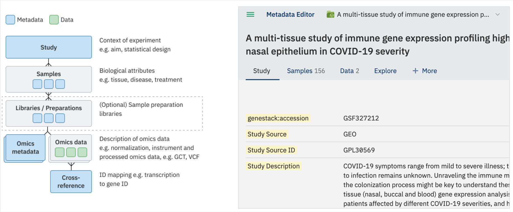
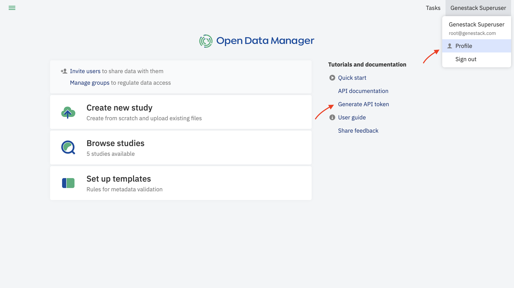
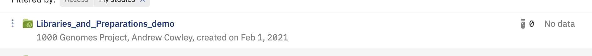
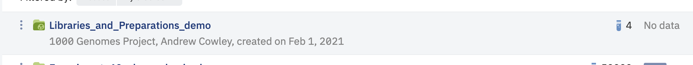

!!! warning "Advanced Content – API Data Import"

    This article provides a detailed and technically in-depth guide to loading data into the platform via API.  
    It is intended for users with experience in working with RESTful APIs and programmatic workflows.

    If you're new to the platform or prefer a more user-friendly approach, we recommend the following alternatives:
    
    - [Importing your data via the GUI](import-data-in-odm.md)
    - [Using a Python script to load your dataset](import-data-using-python-script.md)

# Import Data Using API

On this page, you will find a brief explanation about data import via APIs, followed by a step-by-step example that
you can try. Please note that you need to be a member of the curator group in ODM to be able to import and edit data.

## What can I import?

You can import studies, samples, and any data in the tabular format:

- *Study*: the context of an experiment, such as the aim and statistical design.
- *Sample*: the biological attributes of a sample, such as tissue, disease, and treatment.
- *Data*: Includes transcriptomics, proteomics, gene variant, flow cytometry data, and more. You can import the metadata (e.g. genome version, normalization
  method, and the locations of raw/processed data in your storage) together with the processed data (e.g. expression counts, genotypes).

Once imported, studies, samples, and data metadata will be queryable and editable from both the User Interface and APIs, whilst the signal data will only queryable via APIs.

You can optionally also import:

- *Cross-reference mapping*: a list of transcript and gene ids and how they map to each other.
- *Libraries metadata*: metadata about sample library preparation for transcriptomics data.
- *Preparations metadata*: metadata about sample preparation for proteomics data.
- *Files*: Supplement your study by attaching related research materials like PDF, XLSX, DOCX, PPTX files, images, and more. Please note, contents of these attached files won't be indexed or made searchable.

## Can I capture the relationships between studies, samples, and data?

Importing data has two stages. First, you import studies, samples, and data separately. Then, you link them
together: a study can be linked to multiple samples and a sample can be linked to multi-omics or other types of data. The **Sample Source ID** is used as the default linking key. You can choose another attribute from the template for linking data to samples. The data model and how it looks in the User Interface is shown below:


## Data Loading via APIs
To load the data via APIs each entity is created via a separate endpoint specific for
this data type. Then they are sequentially linked in the Integration layer.

## Where can I import the data from?

API allows loading files hosted at FTP or HTTP web addresses or contained in a mounted ODM NFS storage.
!!! note "Important"
    In order to be able to import data from the local storage, this storage must be mounted to the environment where ODM is deployed. If it is not mounted, you can use GUI to import the data from the local computer. The ability to load data from the local machine using API will be added in the future releases.

## Sample-Based Import Workflow

### Files Used in This Workflow
In this example, we will import tiny subset of data from the 1000 Genomes Project, consisting of the following files:


- [Test_1000g.study.tsv](https://s3.amazonaws.com/bio-test-data/odm/Test_1000g/Test_1000g.study.tsv), a tab-delimited file of the study attributes

| Study Source         | Study Description              | Target Disease   |
|----------------------|--------------------------------|------------------|
| 1000 Genomes Project | Subset of 1000 Genomes Project | Healthy          |

- [Test_1000g.samples.tsv](https://s3.amazonaws.com/bio-test-data/odm/Test_1000g/Test_1000g.samples.tsv), a tab-delimited file of sample attributes.

| Sample Source        | Sample Source ID   | Species      | Sex   | Population   |
|----------------------|--------------------|--------------|-------|--------------|
| 1000 Genomes Project | HG00119            | Homo sapiens | M     | British      |
| 1001 Genomes Project | HG00121            | Homo sapiens | F     | British      |
| 1002 Genomes Project | HG00183            | Homo sapiens | M     | Finnish      |
| 1003 Genomes Project | HG00176            | Homo sapiens | F     | Finnish      |

- [Test_1000g.gct](https://s3.amazonaws.com/bio-test-data/odm/Test_1000g/Test_1000g.gct), a [GCT](https://software.broadinstitute.org/cancer/software/gsea/wiki/index.php/Data_formats#GCT:_Gene_Cluster_Text_file_format_.28.2A.gct.29) file of expression data from multiple sequencing runs

| Name            | Description   |   HG00119 |   HG00121 |   HG00183 |   HG00176 |
|-----------------|---------------|-----------|-----------|-----------|-----------|
| ENSG00000077044 |               |      14.7 |      16.8 |      17.2 |      19.5 |
| ENSG00000085982 |               |       4.2 |       7.1 |       5.5 |       6.8 |

- [Test_1000g.gct.tsv](https://s3.amazonaws.com/bio-test-data/odm/Test_1000g/Test_1000g.gct.tsv), a tab-separated file that describes the expression data

| Expression Source    | Normalization Method   | Genome Version   |
|----------------------|------------------------|------------------|
| 1000 Genomes Project | RPKM                   | GRCh38.91        |

- [Test_1000g.vcf](https://s3.amazonaws.com/bio-test-data/odm/Test_1000g/Test_1000g.vcf), a [VCF](https://samtools.github.io/hts-specs/VCFv4.2.pdf) file of variant data from multiple sequencing runs

|   #CHROM |       POS | ID          | REF   | ALT   |   QUAL | FILTER   | INFO    | FORMAT   | HG00119   | HG00121   | HG00183   | HG00176   |
|----------|-----------|-------------|-------|-------|--------|----------|---------|----------|-----------|-----------|-----------|-----------|
|        2 | 233364596 | rs838705    | G     | A     |    100 | PASS     | AF=0.64 | GT       | 0|0       | 0|1       | 1|0       | 1|1       |
|        2 | 233385915 | rs201966773 | T     | TTC   |    987 | PASS     | AF=0.86 | GT       | 0|0       | 0|1       | 1|1       | 1|1       |

- [Test_1000g.vcf.tsv](https://s3.amazonaws.com/bio-test-data/odm/Test_1000g/Test_1000g.vcf.tsv), a tab-separated file that describes the variant data

| Variant Source       | Genome Version   |
|----------------------|------------------|
| 1000 Genomes Project | GRCh38.91        |

We will go through the following steps:

1. **Authorization Token**
    - a. Generate an API token
    - b. Use Access Token
2. **Import a study**
3. **Import samples** 
4. **Link samples to study**
5. **Import and link expression data to samples**
6. **Import and link variant data to samples**
7. **Check that you can query the relationships between objects**

### Authorization Token

When using the APIs, you need to provide a token for authentication.

> 1.a **Generate an API token**

You can generate a Genestack API token by going to your profile, which can be found by clicking your username at the top right corner
of the User Interface, or from the Dashboard.



The API token is permanent — there is no expiration date. However, you can revoke it at any time and have multiple
tokens.

> 1.b **Use Access Token**

Alternatively authorisation via Access token from Identity provider, e.g. Azure AD can be used. To specify the Access token use the “Authorisation” header, to specify the Genestack
API token use the “Genestack-Api-Token” header.

!!! note "Token Priority" 
    Access token takes precedence, meaning that if both tokens are supplied, the access token will be used for processing the request.

!!! note "Token compatibility" 
    The solution has been tested with the Azure AD access tokens only. For other providers pretesting is recommended.

You could also be provided with an Access Token. To use it, in the follow examples replace the authorization header part

```default
curl -H "Genestack-API-Token: <your API token>" ...
```

with

```default
curl -H "Authorization: Bearer <your Access Token>" ...
```

### Import a study

There are specific endpoints to import specific data types, as listed in the **Swagger API documentation**. 


For studies,
you should go to the *job* endpoint, use the **POST /api/v1/jobs/import/study** method, and supply the file URL:


```default
{
  "metadataLink": "https://s3.amazonaws.com/bio-test-data/odm/Test_1000g/Test_1000g.study.tsv"
}
```

!!! note "templateId"
    By the default "templateId" is included in the call, it specifies  the template that will be assigned to your new study. If you are not sure what is the correct template accession - you can remove this field from the call, the default template will be assigned to your study. To specify the template that you would like to use - you will need to supply the correct template accession, that can be aquired in the Template Editor. You can change the assigned template in the Metadata Editor.

Example of the curl call:
```default
curl -X 'POST' \
  'https://<HOST>/api/v1/jobs/import/study' \
  -H 'accept: application/json' \
  -H 'Genestack-API-Token: <your API token>' \
  -H 'Content-Type: application/json' \
  -d '{
  "metadataLink": "https://s3.amazonaws.com/bio-test-data/odm/Test_1000g/Test_1000g.study.tsv"
}'
```

If successful, you should see the **jobExecId** that can be used to monitor the status of the import task

```default
{
  "jobExecId": 2115,
  "startedBy": "your_namel@genestack.com",
  "jobName": "IMPORT_STUDY_TSV",
  "status": "STARTING",
  "createTime": "2025-04-16 07:42:38"
}
```
!!! note "jobExecId"
    The response returns a jobExecId, which can be used to monitor and fetch the status of the import. Learn more about [working with jobID](#working-with-the-jobexecid).


You can also confirm this visually, by going to the **Study Browser** and check that a new study has been created,
owned by you:


#### Working with the jobExecId
The following endpoints allow you to manage and inspect jobs using the jobExecId, which is returned after initiating an import or other asynchronous task.

**GET /api/v1/jobs/{jobExecId}/info**
Retrieves the current status and metadata of a specific job execution.

- **Use case**: Use this to monitor the progress of an import job using its `jobExecId`.
- **Endpoint**: `/api/v1/jobs/{jobExecId}/info`


!!! note "Status codes"
    The job status can be one of the following:

    - **STARTING** – Import job is starting  
    - **RUNNING** – Import job is in progress  
    - **COMPLETED** – Import job was successful  
    - **FAILED** – Import job failed with an error

---

**GET /api/v1/jobs/{jobExecId}/output**
Retrieves the output of a completed job, including the accession of the generated study.

- **Use case**: Use this after a job has completed to get the final result and study accession.
- **Endpoint**: `/api/v1/jobs/{jobExecId}/output`


```json
{
  "status": "COMPLETED",
  "result": {
    "accession": "GSF1283528"
  }
}
```

---

**PUT /api/v1/jobs/{jobExecId}/restart**
Restarts a job that has failed or was stopped before completion.

- **Use case**: If a job failed due to a temporary issue, you can restart it using its `jobExecId`.
- **Endpoint**: `/api/v1/jobs/{jobExecId}/restart`
---

**PUT /api/v1/jobs/{jobExecId}/stop**
Stops a job that is currently running.

- **Use case**: Use this when you need to cancel a long-running or stuck job.
- **Endpoint**: `/api/v1/jobs/{jobExecId}/stop`


### Import samples

To import samples, you should use a different endpoint, **/api/v1/jobs/import/samples**:


```default
curl -X 'POST' \
  'https://<HOST>>/api/v1/jobs/import/samples?allow_dups=false' \
  -H 'accept: application/json' \
  -H 'Genestack-API-Token: <TOKEN>' \
  -H 'Content-Type: application/json' \
  -d '{
  "metadataLink": "https://s3.amazonaws.com/bio-test-data/odm/Test_1000g/Test_1000g.samples.tsv"
}'
```

Similar to the previous step, you should see the **jobExecId** in the response:

```default
{
  "jobExecId": 2117,
  "startedBy": "job@genestack.com",
  "jobName": "IMPORT_SAMPLES_TSV",
  "status": "STARTING",
  "createTime": "2025-04-16 13:47:17"
}
```
As soon as the import process will be completed, you will be able to get the sample **groupAccession** by querying the **jobExecId** in **/api/v1/jobs/{jobExecId}/output** endpoint:

```default
{
  "status": "COMPLETED",
  "result": {
    "groupAccession": "GSF1283530"
  }
}
```

However, you won’t see the samples in the Study Browser yet, because no samples have been linked to the study.

### Link samples to study

You can link samples to study using the integration endpoint **POST /api/v1/as-curator/integration/link/sample/group/{sourceId}/to/study/{targetId}**, specifying the accessions of the pair of objects to be
linked. The following call will link samples that we imported in the previous step (with accession GSF1283530) to the study
(with accession GSF1283528):

```default
curl -X 'POST' \
  'https://<HOST>/api/v1/as-curator/integration/link/sample/group/GSF1283530/to/study/GSF1283528' \
  -H 'accept: */*' \
  -H 'Genestack-API-Token: <TOKEN>' \
  -d ''
```

If successful, in the Study Browser you should see that the number of samples next
to your study has changed from ‘-’ to ‘4’:


You can link other samples in the same way. This example demonstrates a simple procedure for linking two entities, which can serve as a foundation for building automated import pipelines.  
!!! note "Data Import using Python script"
    If your goal is to perform a one-time import and create a single study, we recommend using our provided [API script](import-data-using-python-script.md) for simplicity and efficiency.

### Import and link expression data to samples

This time, we’re going to import expression data, supplying two files, one for the metadata, and another for the
processed data:

```default
curl -X 'POST' \
  'https://<HOST>/api/v1/jobs/import/expression?allow_dups=false' \
  -H 'accept: application/json' \
  -H 'Genestack-API-Token: <TOKEN>' \
  -H 'Content-Type: application/json' \
  -d '{
  "metadataLink": "https://s3.amazonaws.com/bio-test-data/odm/Test_1000g/Test_1000g.gct.tsv",
  "dataLink": "https://s3.amazonaws.com/bio-test-data/odm/Test_1000g/Test_1000g.gct",
  "numberOfFeatureAttributes": 2,
  "dataClass": "Bulk transcriptomics"
}'
```
The example call in Swagger contain multiple additional fields, that we do not require to be able to import the data. In order to be able to load the data, we will only use *metadataLink*, *dataLink*, *numberOfFeatureAttributes* and *dataClass*.

!!! note "Available Parameters"
    - **metadataLink** - link to a file that contains metadata (.tsv)
    - **dataLink** - link to a file that contains the data. (.gct)
    - **templateId** - (optional) accession of the template
    - **previousVersion** - (optional) accession of the previous version of the file. Used to update the existing version of the file.
    - **numberOfFeatureAttributes** - The number of metadata columns describing each feature (e.g., gene).
    - **dataClass** - Specify a data class that suits the data set you are importing. You can use [Data Class](import-data-in-odm.md) list as a reference.
    - **measurementSeparator**


If successful, you will get the response that contain the **jobExecId** that we will use to get the **groupAccession** using **GET /api/v1/jobs/{jobExecId}/output** endpoint.
```default
{
  "status": "COMPLETED",
  "result": {
    "groupAccession": "GSF1283537"
  }
}
```

We can use the aquired **groupAccession** to get the expression data using **as-curator/omics/expression/data** endpoint:

```default
curl -X 'GET' \
  'https://<HOST>/api/v1/as-curator/omics/expression/data?exFilter=genestack%3Aaccession%20%3D%20GSF1283537' \
  -H 'accept: application/json' \
  -H 'Genestack-API-Token: <TOKEN>'
```
As response you will get all the information, including the metadata, for the expression file we have succesfully imported.

```default
{
  "data": [
    {
      "itemId": "856314-ENSG00000077044",
      "itemOrigin": {
        "runSourceId": "HG00119",
        "runId": "856314",
        "groupId": "GSF1283537"
      },
      "metadata": {
        "Experimental Platform": null,
        "Features (numeric)": null,
        "Data Processing Method": null,
        "Genome Version": "GRCh37.68",
        "Scale": null,
        "Normalization Method": "RPKM",
        "Values (numeric)": null,
        "Data Class": "Bulk transcriptomics",
        "Pipeline ID": null,
        "Data Species": null,
        "Import Source URL": null,
        "Features (string)": null,
        "Data Files / Processed": null,
        "Data Files / Raw": null
      },
      "feature": {
        "feature": "ENSG00000077044"
      },
      "value": {
        "value": 14.7418793729
      },
      "relationships": null
    },

    Shortened for readability — 7 more items are not shown.
}
```

You can then link this expression either by group (link expression group to sample group) or object to object (expression object to specific sample). 

The call bellow will link the **expression group to the sample group** (that's been linked to the study in the previous step) using the **POST /api/v1/as-curator/integration/link/expression/group/{sourceId}/to/sample/group/{targetId}** endpoint:

```default
curl -X 'POST' \
  'https://<HOST>/api/v1/as-curator/integration/link/expression/group/GSF1283537/to/sample/group/GSF1283530' \
  -H 'accept: */*' \
  -H 'Genestack-API-Token: <TOKEN>' \
  -d ''
```

The call below will link the **expression object GSF282812 to the sample HG00119** using the **POST /api/v1/as-curator/integration/link/expression/{sourceId}/to/sample/{targetId}** endpoint:

```default
curl -X 'POST' \
  ' 'https://odm.demo.genestack.com/api/v1/as-curator/integration/link/expression/GSF282812/to/sample/HG00119' \
  -H 'accept: */*' \
  -H 'Genestack-API-Token: <TOKEN>' \
  -d ''

```
Expression data is now succesfuly linked and visible in the GUI.


### Import and link variant data to samples

Let’s repeat the previous step. This time, for variant data, so that the same sample group is linked to both expression and variant data.

To import the variant data we will use **/api/v1/jobs/import/variant** endpoint:

```default
curl -X 'POST' \
  'https://<HOST>/api/v1/jobs/import/variant?allow_dups=true' \
  -H 'accept: application/json' \
  -H 'Genestack-API-Token: <TOKEN>' \
  -H 'Content-Type: application/json' \
  -d '{
  "metadataLink": "https://bio-test-data.s3.amazonaws.com/odm/Test_1000g/Test_1000g.vcf.tsv",
  "dataLink": "https://bio-test-data.s3.amazonaws.com/odm/Test_1000g/Test_1000g.vcf"
}'
```

As with the previous job endpoints, the response will include a *jobExecId*, which can be passed to the *job/output* endpoint to retrieve the variant group accession "GSF1283539".

Which we can use to query the data using the **GET /api/v1/as-curator/omics/variant/data** endpoint:

```default
curl -X 'GET' \
  '<HOST>/api/v1/as-curator/omics/variant/data?vxFilter=genestack%3Aaccession%20%3D%20GSF1283539' \
  -H 'accept: application/json' \
  -H 'Genestack-API-Token: <TOKEN>'
```
Response will contain the variant data that we imported:

```default
{
  "data": [
    {
      "itemId": "2-233364596-G-A-856318",
      "itemOrigin": {
        "runSourceId": "HG00119",
        "runId": "856318",
        "groupId": "GSF1283539"
      },
      "metadata": {
        "Data Class": "Gene variant (VCF)",
        "Experimental Platform": "IonTorrent Proton",
        "Pipeline ID": null,
        "Data Processing Method": null,
        "Genome Version": null,
        "Processed Data Files": null,
        "Import Source URL": null,
        "Scale": null,
        "Raw Data Files": null,
        "Name": null
      }
      ...
  "resultsExhausted": true,
  "log": [
    "There are no restrictions related with library/preparation/sample/study query"
  ],
  "cursor": "2-233385915-T-TC-856321"
}
```

To link the variant group (GSF1283539) with the sample group (GSF1283530) we will use **POST /api/v1/as-curator/integration/link/variant/group/{sourceId}/to/sample/group/{targetId}** endpoint.

```default
curl -X 'POST' \
  'https://<HOST>/api/v1/as-curator/integration/link/variant/group/GSF1283539/to/sample/group/GSF1283530' \
  -H 'accept: */*' \
  -H 'Genestack-API-Token: <TOKEN>' \
  -d ''
```

### Check that you can query the relationships between objects

Once you’ve created and linked the study, sample, expression, and variant objects, you can do integration-aware query via both the User Interface and APIs.

## Library-Based Import Workflow

This example is similar to the previous one, but demonstrates using library/preparation file objects. In this case expression/proteomics data files are linked to library/preparations files rather than samples.

### Files Used in This Workflow

- [Test_RM.study.tsv](https://bio-test-data.s3.amazonaws.com/Research_Model_BR-205/Test_RM.study.tsv), a tab-delimited file of the study attributes

| Study Source         | Study Description              |
|----------------------|--------------------------------|
| 1000 Genomes Project | Subset of 1000 Genomes Project |

- [Test_RM.samples.tsv](https://bio-test-data.s3.amazonaws.com/Research_Model_BR-205/Test_RM.samples.tsv), a tab-delimited file of sample attributes.

| Sample Source        | Sample Source ID   | Sex   | Population   |
|----------------------|--------------------|-------|--------------|
| 1000 Genomes Project | SRR6441195         | M     | British      |
| 1001 Genomes Project | SRR6441188         | F     | British      |
| 1002 Genomes Project | SRR6441196         | M     | Finnish      |
| 1003 Genomes Project | SRR6441197         | F     | Finnish      |

- [Test_RM.libraries.tsv](https://bio-test-data.s3.amazonaws.com/Research_Model_BR-205/Test_RM.libraries.tsv), a tab-delimited file of library metadata.

| Library ID   | Sample Source ID      | Preparation Protocol   | Library Type      |
|--------------|-----------------------|------------------------|-------------------|
| LIB1         | SRR6441195|SRR6441188 | NGS                    | Spatial RNA-Seq-1 |
| LIB2         | SRR6441196            | NGS                    | RNA-Seq-1         |

- [Test_RM_g.gct](https://bio-test-data.s3.amazonaws.com/Research_Model_BR-205/Test_RM_g.gct), a [GCT](https://software.broadinstitute.org/cancer/software/gsea/wiki/index.php/Data_formats#GCT:_Gene_Cluster_Text_file_format_.28.2A.gct.29) file of expression data from multiple sequencing runs. Note in this example the GCT file is using library IDs for linking.

| Name      | Description   |   LIB1 |   LIB2 |
|-----------|---------------|--------|--------|
| ENSG00777 |               |   21.9 |   19.9 |
| ENSG00888 |               |   23.7 |   24.9 |

- [Test_RM_g.gct.tsv](https://bio-test-data.s3.amazonaws.com/Research_Model_BR-205/Test_RM_g.gct.tsv), a tab-separated file that describes the expression data

| Normalization Method   | Genome Version   |
|------------------------|------------------|
| RPKM                   | GRCh38.91        |

We will go through the following steps:

1. **Authorization Token**
    - a. Generate an API token
    - b. Use Access Token
2. **Import a study**
3. **Import samples** 
4. **Link samples to study**
5. **Import and link library metadata file to samples**
6. **Import and link expression data to the library file (note linking to library file instead of samples)**
7. **Check that you can query the relationships between objects**

### Authorization Token

When using the APIs, you need to provide a token for authentication.

> 1.a **Generate an API token**

You can generate a Genestack API token by going to your profile, which can be found by clicking your username at the top right corner
of the User Interface, or from the Dashboard.


The API token is permanent — there is no expiration date. However, you can revoke it at any time and have multiple
tokens.

> 1.b **Use Access Token**

Alternatively authorisation via Access token from Identity provider, e.g. Azure AD can be used. To specify the Access token use the “Authorisation” header, to specify the Genestack
API token use the “Genestack-Api-Token” header.

!!! note "Token Priority" 
    Access token takes precedence, meaning that if both tokens are supplied, the access token will be used for processing the request.

!!! note "Token compatibility" 
    The solution has been tested with the Azure AD access tokens only. For other providers pretesting is recommended.

You could also be provided with an Access Token. To use it, in the follow examples replace the authorization header part

```default
curl -H "Genestack-API-Token: <your API token>" ...
```

with

```default
curl -H "Authorization: Bearer <your Access Token>" ...
```

### Import a study

There are specific endpoints to import specific data types, as listed in the **Swagger API documentation**. 


For studies,
you should go to the *job* endpoint, use the **POST /api/v1/jobs/import/study** method, and supply the file URL:


```default
curl -X 'POST' \
  'https://<HOST>/api/v1/jobs/import/study' \
  -H 'accept: application/json' \
  -H 'Genestack-API-Token: <your API token>' \
  -H 'Content-Type: application/json' \
  -d '{
  "metadataLink": "https://bio-test-data.s3.amazonaws.com/Research_Model_BR-205/Test_RM.study.tsv"
```

If successful, you should see the [**jobExecId**](#working-with-the-jobexecid) that we will use to get the accession of the study, using the **GET /api/v1/jobs/{jobExecId}/output8** endpoint.

!!! note "jobExecId"
    The response returns a jobExecId, which can be used to monitor and fetch the status of the import. Learn more about [working with jobID](#working-with-the-jobexecid).
    
Use the **GET /api/v1/jobs/{jobExecId}/output** endpoint to get the accession of the study we created:

```default
curl -X 'GET' \
  'https://<HOST>/api/v1/jobs/<jobExecId>/output' \
  -H 'accept: application/json' \
  -H 'Genestack-API-Token: <TOKEN>'

```
```default
{
  "status": "COMPLETED",
  "result": {
    "accession": "GSF1283540"
  }
}
```


You can also confirm this visually, by going to the **Study Browser** and check that a new study has been created,
owned by you:



### Import samples

To import samples, you should use a different job endpoint, **/api/v1/jobs/import/samples**:

```default
curl -X 'POST' \
  'https://<HOST>/api/v1/jobs/import/samples?allow_dups=false' \
  -H 'accept: application/json' \
  -H 'Genestack-API-Token: <TOKEN>' \
  -H 'Content-Type: application/json' \
  -d '{
  "metadataLink": "https://bio-test-data.s3.amazonaws.com/Research_Model_BR-205/Test_RM.samples.tsv"
}'
```

Similar to the previous step, you should see the [jobExecId](#working-with-the-jobexecid) that we are going to use in **GET /api/v1/jobs/{jobExecId}/output** in order to get the groupAccession of the samples we just imported.

```default
curl -X 'GET' \
  'https://<HOST>/api/v1/jobs/<jobExecId>/output' \
  -H 'accept: application/json' \
  -H 'Genestack-API-Token: <TOKEN>'
```
```default
{
  "status": "COMPLETED",
  "result": {
    "groupAccession": "GSF1283541"
  }
}
```

However, you won’t see the samples in the Study Browser yet, because no samples have been linked to the study.

### Link samples to study

You can link samples to study using the integration endpoint **POST /api/v1/as-curator/integration/link/sample/group/{sourceId}/to/study/{targetId}**, specifying the accessions of the pair of objects to be
linked. The following call will link the samples group GSF1283541 to the study GSF1283540:

```default
curl -H "Genestcurl -X 'POST' \
  'https://<HOST>/api/v1/as-curator/integration/link/sample/group/GSF1283541/to/study/GSF1283540' \
  -H 'accept: */*' \
  -H 'Genestack-API-Token: <TOKEN>' \
  -d ''
```

If successful, in the Study Browser you should see (after refreshing the page) that the number of samples next
to your study has changed from ‘-’ to ‘4’:



### Import and link library metadata file to samples

The next step is to import a library metadata file and link it to the samples file. First we import the library file using a **POST /api/v1/jobs/import/libraries** endpoint:

```default
curl -X 'POST' \
  'https://<HOST>/api/v1/jobs/import/libraries?allow_dups=false' \
  -H 'accept: application/json' \
  -H 'Genestack-API-Token: <TOKEN>' \
  -H 'Content-Type: application/json' \
  -d '{
  "metadataLink": "https://bio-test-data.s3.amazonaws.com/Research_Model_BR-205/Test_RM.libraries.tsv"
}'
```

This returns similarly to the samples import - [jobExecId](#working-with-the-jobexecid), using the **GET /api/v1/jobs/{jobExecId}/output** endpoint we will get the groupAccession. 
```default
{
  "status": "COMPLETED",
  "result": {
    "groupAccession": "GSF1283547"
  }
}
```
You can then link the libraries group file to the samples group using the **POST /api/v1/as-curator/integration/link/library/group/{sourceId}/to/sample/group/{targetId}** endpoints and the accession we got back from importing samples:


```default
curl -X 'POST' \
  'https://<HOST>/api/v1/as-curator/integration/link/library/group/GSF1283547/to/sample/group/GSF1283541' \
  -H 'accept: */*' \
  -H 'Genestack-API-Token: <TOKEN>' \
  -d ''
```

If successful you will see a library tab appear in the Metadata Editor:


### Import and link gene expression data to libraries

Now we’ll import expression data, supplying two files, one for the metadata, and another for the
processed data, and this time link them to the libraries file:

```default
curl -X 'POST' \
  'https://<HOST>/api/v1/jobs/import/expression?allow_dups=false' \
  -H 'accept: application/json' \
  -H 'Genestack-API-Token: <TOKEN>' \
  -H 'Content-Type: application/json' \
  -d '{
  "metadataLink": "https://bio-test-data.s3.amazonaws.com/Research_Model_BR-205/Test_RM_g.gct.tsv",
  "dataLink": "https://bio-test-data.s3.amazonaws.com/Research_Model_BR-205/Test_RM_g.gct",
  "numberOfFeatureAttributes": 3,
  "dataClass": "Bulk transcriptomics"
}'
```

The example call in Swagger contain multiple additional fields, that we do not require to be able to import the data. In order to be able to load the data, we will only use metadataLink, dataLink, numberOfFeatureAttributes and dataClass.

!!! note "Available Parameters"
    - **metadataLink** - link to a file that contains metadata (.tsv)
    - **dataLink** - link to a file that contains the data. (.gct)
    - **templateId** - (optional) accession of the template
    - **previousVersion** - (optional) accession of the previous version of the file. Used to update the existing version of the file.
    - **numberOfFeatureAttributes** - The number of metadata columns describing each feature (e.g., gene).
    - **dataClass** - Specify a data class that suits the data set you are importing. You can use [Data Class](import-data-in-odm.md) list as a reference.
    - **measurementSeparator**

If successful, you will get the response that contain the jobExecId that we will use to get the groupAccession using GET /api/v1/jobs/{jobExecId}/output endpoint.
```default
{
  "status": "COMPLETED",
  "result": {
    "groupAccession": "GSF1283553"
  }
}
```
We can use the aquired **groupAccession** to get the expression data using **as-curator/omics/expression/data** endpoint. You will get four run-level expression objects, corresponding to the four columns in the expression matrix, and an expression group accession (groupID) that represents the group of expression objects:
```default
curl -X 'GET' \
  'https://<HOST>/api/v1/as-curator/omics/expression/data?exFilter=genestack%3Aaccession%20%3D%20GSF1283553' \
  -H 'accept: application/json' \
  -H 'Genestack-API-Token: <TOKEN>'
```

```default
{
  "data": [
    {
      "itemId": "856322-ENSG00777",
      "itemOrigin": {
        "runSourceId": "LIB1",
        "runId": "856322",
        "groupId": "GSF1283553"
      },
      "metadata": {
        "Experimental Platform": null,
        "Features (numeric)": null,
        "Data Processing Method": null,
        "Genome Version": "Gene-level-gct",
        "Scale": null,
        "Normalization Method": "RPKM",
        "Values (numeric)": null,
        "Data Class": "Bulk transcriptomics",
        "Pipeline ID": null,
        "Data Species": null,
        "Import Source URL": null,
        "Features (string)": null,
        "Data Files / Processed": null,
        "Data Files / Raw": null
      },
      "feature": {
        "feature": "ENSG00777"
      },
      "value": {
        "value": 21.9905991310986
      },
      "relationships": null
    },
    {
      "itemId": "856322-ENSG00888",
      "itemOrigin": {
        "runSourceId": "LIB1",
        "runId": "856322",
        "groupId": "GSF1283553"
      },
      "metadata": {
        "Experimental Platform": null,
        "Features (numeric)": null,
        "Data Processing Method": null,
        "Genome Version": "Gene-level-gct",
        "Scale": null,
        "Normalization Method": "RPKM",
        "Values (numeric)": null,
        "Data Class": "Bulk transcriptomics",
        "Pipeline ID": null,
        "Data Species": null,
        "Import Source URL": null,
        "Features (string)": null,
        "Data Files / Processed": null,
        "Data Files / Raw": null
      },
      "feature": {
        "feature": "ENSG00888"
      },
      "value": {
        "value": 23.7829330428661
      },
      "relationships": null
    },
    {
      "itemId": "856323-ENSG00777",
      "itemOrigin": {
        "runSourceId": "LIB2",
        "runId": "856323",
        "groupId": "GSF1283553"
      },
      "metadata": {
        "Experimental Platform": null,
        "Features (numeric)": null,
        "Data Processing Method": null,
        "Genome Version": "Gene-level-gct",
        "Scale": null,
        "Normalization Method": "RPKM",
        "Values (numeric)": null,
        "Data Class": "Bulk transcriptomics",
        "Pipeline ID": null,
        "Data Species": null,
        "Import Source URL": null,
        "Features (string)": null,
        "Data Files / Processed": null,
        "Data Files / Raw": null
      },
      "feature": {
        "feature": "ENSG00777"
      },
      "value": {
        "value": 19.9906155628591
      },
      "relationships": null
    },
    {
      "itemId": "856323-ENSG00888",
      "itemOrigin": {
        "runSourceId": "LIB2",
        "runId": "856323",
        "groupId": "GSF1283553"
      },
      "metadata": {
        "Experimental Platform": null,
        "Features (numeric)": null,
        "Data Processing Method": null,
        "Genome Version": "Gene-level-gct",
        "Scale": null,
        "Normalization Method": "RPKM",
        "Values (numeric)": null,
        "Data Class": "Bulk transcriptomics",
        "Pipeline ID": null,
        "Data Species": null,
        "Import Source URL": null,
        "Features (string)": null,
        "Data Files / Processed": null,
        "Data Files / Raw": null
      },
      "feature": {
        "feature": "ENSG00888"
      },
      "value": {
        "value": 24.9960622157148
      },
      "relationships": null
    },
    {
      "itemId": "856324-ENSG00777",
      "itemOrigin": {
        "runSourceId": "LIB3",
        "runId": "856324",
        "groupId": "GSF1283553"
      },
      "metadata": {
        "Experimental Platform": null,
        "Features (numeric)": null,
        "Data Processing Method": null,
        "Genome Version": "Gene-level-gct",
        "Scale": null,
        "Normalization Method": "RPKM",
        "Values (numeric)": null,
        "Data Class": "Bulk transcriptomics",
        "Pipeline ID": null,
        "Data Species": null,
        "Import Source URL": null,
        "Features (string)": null,
        "Data Files / Processed": null,
        "Data Files / Raw": null
      },
      "feature": {
        "feature": "ENSG00777"
      },
      "value": {
        "value": 21.3196300774432
      },
      "relationships": null
    },
    {
      "itemId": "856324-ENSG00888",
      "itemOrigin": {
        "runSourceId": "LIB3",
        "runId": "856324",
        "groupId": "GSF1283553"
      },
      "metadata": {
        "Experimental Platform": null,
        "Features (numeric)": null,
        "Data Processing Method": null,
        "Genome Version": "Gene-level-gct",
        "Scale": null,
        "Normalization Method": "RPKM",
        "Values (numeric)": null,
        "Data Class": "Bulk transcriptomics",
        "Pipeline ID": null,
        "Data Species": null,
        "Import Source URL": null,
        "Features (string)": null,
        "Data Files / Processed": null,
        "Data Files / Raw": null
      },
      "feature": {
        "feature": "ENSG00888"
      },
      "value": {
        "value": 24.4322973830799
      },
      "relationships": null
    }
  ],
  "resultsExhausted": true,
  "log": [
    "There are no restrictions related with library/preparation/sample/study query"
  ],
  "cursor": "856324-ENSG00888"
}
```

You can then link this expression group object to the library object. :

```default
curl -X 'POST' \
  'https://<HOST>/api/v1/as-curator/integration/link/expression/group/GSF1283553/to/library/group/GSF1283547' \
  -H 'accept: */*' \
  -H 'Genestack-API-Token: <TOKEN>' \
  -d ''
```

If successful, in the Metadata Editor you should see (after refreshing the page) that the loaded file is displayed on the Data tab.

### Check that you can query the relationships between objects

Once you’ve created and linked the study, sample, library and expression objects you can do integration-aware queries via both the User Interface and APIs.

In the User Interface, you should be able to find your imported study using the study, sample, and signal filters.

To do this via APIs, you can use the integration/omics endpoint to filter across studies, samples, libraries and signals,and retrieve a specific object type. For example, to get metadata about the samples associated with library LIB1:

```default
curl -X 'GET' \
  'https://<HOST>/api/v1/as-curator/integration/link/samples/by/libraries?filter=%22Library%20ID%22%3D%20LIB1' \
  -H 'accept: application/json' \
  -H 'Genestack-API-Token: <TOKEN>'
```

Which will return:

```default
{
  "meta": {
    "pagination": {
      "count": 2,
      "total": 2,
      "offset": 0,
      "limit": 2000
    }
  },
  "data": [
    {
      "genestack:accession": "GSF1283543",
      "Sample Source ID": "SRR6441188",
      "Sample Name": null,
      "Ancestry": null,
      "Age": null,
      "Tissue Type": null,
      "Condition": null,
      "Sex": "F",
      "Genotyping Method": null,
      "Collection Date": null,
      "Sample Type": null,
      "Age Unit": null,
      "Genomic DNA Yield": null,
      "Smoking Status": null,
      "Sample Source": "1000 Genomes Project",
      "Population": "British",
      "groupId": "GSF1283541"
    },
    {
      "genestack:accession": "GSF1283542",
      "Sample Source ID": "SRR6441195",
      "Sample Name": null,
      "Ancestry": null,
      "Age": null,
      "Tissue Type": null,
      "Condition": null,
      "Sex": "M",
      "Genotyping Method": null,
      "Collection Date": null,
      "Sample Type": null,
      "Age Unit": null,
      "Genomic DNA Yield": null,
      "Smoking Status": null,
      "Sample Source": "1000 Genomes Project",
      "Population": "British",
      "groupId": "GSF1283541"
    }
  ]
}
```
