!!! abstract "About this guide"

    This article provides a detailed and technically in-depth guide to loading data into the platform via API.  
    It is intended for users with experience in working with RESTful APIs and programmatic workflows.

    If you're new to the platform or prefer a more user-friendly approach, we recommend the following alternatives:
    
    - [Importing your data via the GUI](import-data-in-odm.md)
    - [Using a Python script to load your dataset](import-data-using-python-script.md)

# Import Data Using API

On this page, you will find a brief explanation about data import via APIs, followed by a step-by-step example that
you can try. Please note that you need to be a member of the curator group in ODM to be able to import and edit data.

## What can I import?

You can import studies, samples, and any data in the tabular format:

- **Study**: the context of an experiment, such as the aim and statistical design.
- **Sample**: the biological attributes of a sample, such as tissue, disease, and treatment.
- **Libraries metadata**: TSV file describing sequencing libraries or other indexable data types. It includes information on library preparation, type (e.g., single-end or paired-end), protocol, barcodes, and platform.
- **Preparations metadata**: metadata describing how samples were prepared prior to data generation, applicable to proteomics, transcriptomics, and other data types.
- **Cell metadata**: all the information stored per cell (per barcode) that describes that cell and its context, separate from the actual molecular measurements (like the gene expression counts matrix which should be uploaded as expression within the ODM)
- **Data**: Includes transcriptomics, proteomics, gene variant, flow cytometry data, cell expression, and more. You can import the metadata (e.g. genome version, normalization
  method, and the locations of raw/processed data in your storage) together with the processed data (e.g. expression counts, genotypes).
- **Cross-reference mapping**: a list of transcript and gene ids and how they map to each other.
- **Attached Files**: Supplement your study by attaching related research materials like PDF, XLSX, DOCX, PPTX files, images, and more. Please note, contents of these attached files won't be indexed or made searchable.

Once imported, studies, samples, and data metadata will be queryable and editable from both the User Interface and APIs, whilst the signal data will only be queryable via APIs.


## Can I capture the relationships between studies, samples, and data?

Importing data has two stages. First, you import studies, samples, and data separately. Then, you link them together: samples are linked to a study, libraries and preparations are linked to samples, and omics data (e.g., transcriptomics, proteomics) are linked to samples or to libraries/preparations depending on the data type. Attached files are linked directly to a study. 

The **Sample Source ID** is used as the default linking key. You can choose another attribute from the template for linking data to samples. The data model and how it looks in the User Interface is shown below.

In addition to core data types, **Libraries**, **Preparations**, **Cell metadata** require special handling. These files must include the **Sample Source ID**, which is used to link them to the appropriate samples. 

The correct order of linking follows the system logic and available endpoints:

- **Samples** are linked to a **Study**
- **Libraries** and **Preparations** are linked to **Samples**
- **Cell metadata** is linked to **Samples** or **Libraries** or **Preparations**
- **Omics data** (e.g. transcriptomics, proteomics, cell expression) are linked to **Samples**, or to **Libraries/Preparations**, or to **Cell metadata** depending on the data type
- **Attached files** are linked directly to a **Study**


## Data Loading via APIs
To load the data via APIs each entity is created via a separate endpoint specific for
this data type. Then they are sequentially linked in the Integration layer.

## Where can I import the data from?

API allows loading files hosted at HTTP/HTTPS URLs, S3 URIs, and NFS paths for files stored in mounted ODM storage.

!!! danger "Limitation"
    1. S3 bucket is mandatory to upload and work with Attached files functionality in the ODM
    2. **Export**: if attachment's metadata was updated and got a new version, attached file cannot be exported itself from the ODM.
    **Workaround**: export is available from exporting whole Study. We are working on improvements for this functionality in the 1.61 release.

## Prerequisites
### Authorization Token

To authenticate when using the APIs, you need to provide a valid authorization token.

For instructions on how to generate a token, refer to the [Quick Start guide](../../quick-start/consumer-api/#generate-a-token).


## Core Data Import Workflow

### Files Used in This Workflow
In this example, we will import tiny subset of data from the 1000 Genomes Project, consisting of the following files:


- [Test_1000g.study.tsv](https://s3.amazonaws.com/bio-test-data/odm/Test_1000g/Test_1000g.study.tsv), a tab-delimited file of the study attributes

| Study Source         | Study Description              | Target Disease   |
|----------------------|--------------------------------|------------------|
| 1000 Genomes Project | Subset of 1000 Genomes Project | Healthy          |


- [Test_samples.tsv](https://bio-test-data.s3.us-east-1.amazonaws.com/odm/user-guide/Test_samples.tsv), a tab-delimited file of sample attributes.

| Sample Source        | Sample Source ID   | Sex   | Population   |
|----------------------|--------------------|-------|--------------|
| 1000 Genomes Project | HG00119            | M     | British      |
| 1001 Genomes Project | HG00121            | F     | British      |
| 1002 Genomes Project | HG00183            | M     | Finnish      |
| 1003 Genomes Project | HG00176            | F     | Finnish      |


- [Test_libraries.tsv](https://bio-test-data.s3.us-east-1.amazonaws.com/odm/user-guide/Test_libraries.tsv), a tab-delimited file of library metadata.

| Library ID   | Sample Source ID      | Preparation Protocol   | Library Type      |
|--------------|-----------------------|------------------------|-------------------|
| LIB1         | HG00119`|`HG00121       | NGS                    | Spatial RNA-Seq-1 |
| LIB2         | HG00183               | NGS                    | RNA-Seq-1         |
| LIB3         | HG00176               | NGS                    | RNA-Seq-1         |


- [Test_preparations.tsv](https://bio-test-data.s3.us-east-1.amazonaws.com/odm/user-guide/Test_preparations.tsv), a tab-delimited file of preparation metadata.

 Sample Source ID      | Digestion              | Preparation ID    |
-----------------------|------------------------|-------------------|
 HG00119`|`HG00121       | Trypsin                | PREP1             |
 HG00183               | Trypsin                | PREP2             |
 HG00176               | Trypsin                | PREP3             |


### Import Study

There are specific endpoints to import specific data types, as listed in the [**Swagger API documentation**](/swagger/?urls.primaryName=job). 

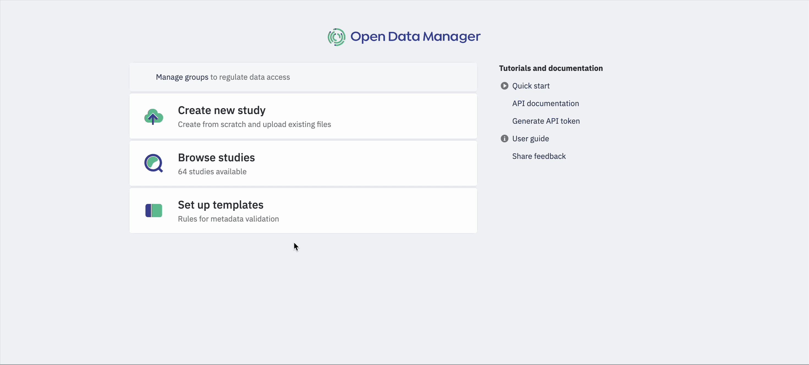

For data import, you should go to the job section and choose the endpoint relevant for the specific data type. For studies, use the `POST /api/v1/jobs/import/study` method, and supply the file URL:

```default
{
  "metadataLink": "https://s3.amazonaws.com/bio-test-data/odm/Test_1000g/Test_1000g.study.tsv"
}
```


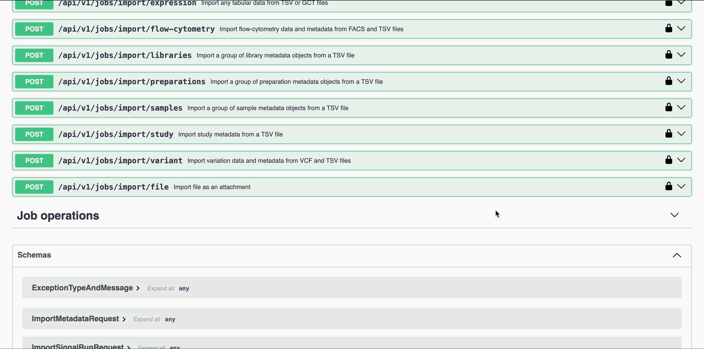


!!! note "templateId"
    You can include an optional parameter **"templateId"** to specify which template should be associated with the loaded data. You will need to provide the accession of the desired template, which can be obtained from Template Editor. If the "templateId" parameter is not specified, the default template set for the instance will be used.

Example of the curl call:
```default
curl -X 'POST' \
  'https://<HOST>/api/v1/jobs/import/study' \
  -H 'accept: application/json' \
  -H 'Genestack-API-Token: <TOKEN>' \
  -H 'Content-Type: application/json' \
  -d '{
  "metadataLink": "https://s3.amazonaws.com/bio-test-data/odm/Test_1000g/Test_1000g.study.tsv"
}'
```

If successful, you should see the **jobExecId** that can be used to monitor the status of the import task

```json
{
  "jobExecId": 2115,
  "startedBy": "your_namel@genestack.com",
  "jobName": "IMPORT_STUDY_TSV",
  "status": "STARTING",
  "createTime": "2025-04-16 07:42:38"
}
```
!!! note "jobExecId"
    The response returns a jobExecId, which can be used to monitor and fetch the status of the import. Learn more about [working with jobID](#working-with-the-jobexecid).


You can also confirm this visually, by going to the **Study Browser** and check that a new study has been created,
owned by you:

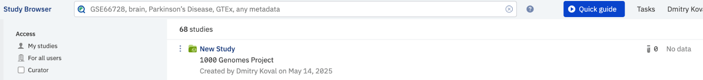


### Import Samples

To import samples, you should use a different endpoint, `POST /api/v1/jobs/import/samples`:
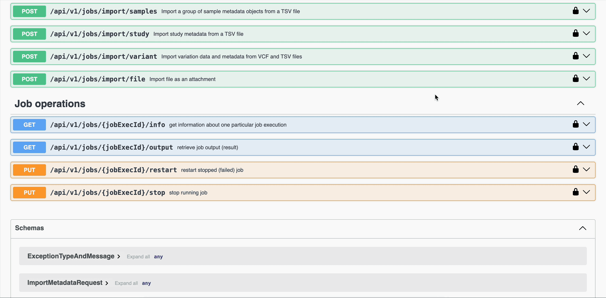

```default
curl -X 'POST' \
  'https://<HOST>/api/v1/jobs/import/samples?allow_dups=false' \
  -H 'accept: application/json' \
  -H 'Genestack-API-Token: <TOKEN>' \
  -H 'Content-Type: application/json' \
  -d '{
  "metadataLink": "https://bio-test-data.s3.us-east-1.amazonaws.com/odm/user-guide/Test_samples.tsv"
}'
```

Similar to the previous step, you should see the **jobExecId** in the response:

```json
{
  "jobExecId": 2117,
  "startedBy": "job@genestack.com",
  "jobName": "IMPORT_SAMPLES_TSV",
  "status": "STARTING",
  "createTime": "2025-04-16 13:47:17"
}
```
As soon as the import process will be completed, you will be able to get the sample **groupAccession** by querying the **jobExecId** in `GET /api/v1/jobs/{jobExecId}/output` endpoint:

```json
{
  "status": "COMPLETED",
  "result": {
    "groupAccession": "GSF1283530"
  }
}
```

However, you won't see the samples in the Study Browser yet, because no samples have been linked to the study.

### Import Libraries

The next step is to import a library metadata file . First we import the library file using a `POST /api/v1/jobs/import/libraries` endpoint:

!!! note "Mandatory attribute for libraries: Sample Source ID"
    In **libraries** files, the `Sample Source ID` column is mandatory. It must contain the identifiers used to link each library to its corresponding sample.


```default
curl -X 'POST' \
  'https://<HOST>/api/v1/jobs/import/libraries?allow_dups=false' \
  -H 'accept: application/json' \
  -H 'Genestack-API-Token: <TOKEN>' \
  -H 'Content-Type: application/json' \
  -d '{
  "metadataLink": "https://bio-test-data.s3.us-east-1.amazonaws.com/odm/user-guide/Test_libraries.tsv"
}'
```

This returns similarly to the samples import - [jobExecId](#working-with-the-jobexecid), using the `GET /api/v1/jobs/{jobExecId}/output` endpoint we will get the groupAccession. 

```json
{
  "status": "COMPLETED",
  "result": {
    "groupAccession": "GSF1283547"
  }
}
```
### Import Preparations

To import preparations, you will need to use `POST /api/v1/jobs/import/preparations` endpoint:

!!! note "Mandatory attribute for preparations: Sample Source ID"
    In **preparations** files, the `Sample Source ID` column is mandatory. It must contain the identifiers used to link each preparation to its corresponding sample.


```default
curl -X 'POST' \
  'https://<HOST>/api/v1/jobs/import/preparations?allow_dups=false' \
  -H 'accept: application/json' \
  -H 'Genestack-API-Token: <TOKEN>' \
  -H 'Content-Type: application/json' \
  -d '{
  "metadataLink": "https://bio-test-data.s3.us-east-1.amazonaws.com/odm/user-guide/Test_preparations.tsv"
}'
```

Similar to the previous step, you should see the **jobExecId** in the response:

```json
{
  "jobExecId": 2238,
  "startedBy": "job@genestack.com",
  "jobName": "IMPORT_PREPARATIONS_TSV",
  "status": "STARTING",
  "createTime": "2025-05-14 09:52:26"
}
```
As soon as the import process will be completed, you will be able to get the preparations **groupAccession** by querying the **jobExecId** in `GET /api/v1/jobs/{jobExecId}/output` endpoint:

```json
{
  "status": "COMPLETED",
  "result": {
    "groupAccession": "GSF1284256"
  }
}
```

### Import Cell metadata

For working with Cell metadata and Cell expression use the following example files:

- [Study_metadata](https://bio-test-data.s3.us-east-1.amazonaws.com/User_guide_test_data/Single_cell_data/study_metadata.tsv), a tab-delimited file of the study attributes
- [Samples_metadata](https://bio-test-data.s3.us-east-1.amazonaws.com/User_guide_test_data/Single_cell_data/samples.tsv), a tab-delimited file of sample attributes
- [Cell_metadata](https://bio-test-data.s3.us-east-1.amazonaws.com/User_guide_test_data/Single_cell_data/cells_2_samples_full_match.tsv), a tab-delimited file of cell attributes
- [Cell_expression](https://bio-test-data.s3.us-east-1.amazonaws.com/User_guide_test_data/Single_cell_data/expression_2_cells_linked_to_samples.tsv), a tab-delimited file of cell expression data

To import Cell metadata, you will need to use `POST /api/v1/jobs/import/cells` endpoint:

```default
curl -X 'POST' \
  'https://<HOST>/api/v1/jobs/import/cells?allow_dups=false' \
  -H 'accept: application/json' \
  -H 'Genestack-API-Token: <TOKEN>' \
  -H 'Content-Type: application/json' \
  -d '{
  "dataLink": "https://bio-test-data.s3.us-east-1.amazonaws.com/User_guide_test_data/Single_cell_data/cells_2_samples_full_match.tsv"
```

Similar to the previous step, you should see the **jobExecId** in the response:

```json
{
  "jobExecId": 24,
  "startedBy": "job@genestack.com",
  "jobName": "IMPORT_CELLS",
  "status": "COMPLETED",
  "createTime": "2026-02-05 11:35:36",
  "endTime": "2026-02-05 11:35:38"
}
```
As soon as the import process will be completed, you will be able to get the Cell metadata **groupAccession** by querying the **jobExecId** in `GET /api/v1/jobs/{jobExecId}/output` endpoint:

```json
{
  "status": "COMPLETED",
  "result": {
    "groupAccession": "GSF016786"
  }
}
```

### Multipart form-data upload endpoints
The Jobs import API includes `multipart/form-data` endpoints for common ODM import workflows. 
These endpoints allow uploading import files directly as part of the request, without providing 
a `dataLink` to an external file location.

This simplifies import workflows where the source file is already available locally. 
Instead of uploading a file to external storage first and then passing its URL to the API, you can 
submit the file directly to the corresponding import endpoint.

#### Supported endpoints

The following multipart endpoints are available:

* `POST /api/v1/jobs/import/samples/multipart`
  Uploads **Sample metadata** in **TSV** format.

* `POST /api/v1/jobs/import/libraries/multipart`
  Uploads **Library metadata** in **TSV** format.

* `POST /api/v1/jobs/import/preparations/multipart`
  Uploads **Preparation metadata** in **TSV** format.

* `POST /api/v1/jobs/import/cells/multipart`
  Uploads **Cell metadata** in **TSV** format.

* `POST /api/v1/jobs/import/expression/multipart`
  Uploads **tabular expression data** in **TSV** or **GCT** format.

* `POST /api/v1/jobs/import/variant/multipart`
  Uploads **variation data or metadata** in **VCF** or **TSV** format.

* `POST /api/v1/jobs/import/flow-cytometry/multipart`
  Uploads **flow cytometry data or metadata** in **FACS** or **TSV** format.

* `POST /api/v1/jobs/import/file/multipart`
  Uploads a **file attachment** through the Jobs import workflow.

#### How these endpoints work

Each endpoint is designed for a specific import type and accepts the uploaded file as multipart form data. 
The API then creates and processes the corresponding import job in the same way as the existing Jobs import flow.

The main difference from the non-multipart import endpoints is how the source file is provided:

* **Multipart endpoints** accept the file directly in the HTTP request body.
* **Non-multipart endpoints** require a `dataLink` that points to the source file in external storage.

!!! tip "Data management"
    The files uploaded via multipart endpoints are copied into ODM internal S3 bucket. 
    The files are maintained by ODM and can be deleted from the original storage. 
    Additionally such files are marked with `File copy stored` technical metadata field.

#### When to use multipart endpoints

Use multipart upload endpoints when:

* you already has the file available locally
* you want to avoid the extra step of uploading the file to external storage
* you want a simpler, single-request import flow for supported import types

These endpoints are especially useful for interactive tools, automation scripts, 
and integrations that generate or collect import files immediately before submission.


### Linking entities

#### Samples to Study

You can link samples to study using the integration endpoint `POST /api/v1/as-curator/integration/link/sample/group/{sourceId}/to/study/{targetId}`, specifying the accessions of the study and the accession of the sample group. This will link all samples from the imported file to the study. The following call will link samples that we imported in the previous step (with accession GSF1283530) to the study
(with accession GSF1283528):

```default
curl -X 'POST' \
  'https://<HOST>/api/v1/as-curator/integration/link/sample/group/GSF1283530/to/study/GSF1283528' \
  -H 'accept: */*' \
  -H 'Genestack-API-Token: <TOKEN>' \
  -d ''
```

If successful, in the Study Browser you should see that the number of samples next
to your study has changed from '-' to '4':

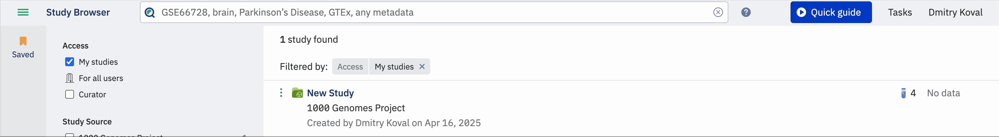

Samples from other files can be loaded in the same way. They will be displayed in the Metadata Editor on a separate subtab.

!!! note "Data Import using Python script"
    If your goal is to perform a one-time import and create a single study, we recommend using our provided [API script](import-data-using-python-script.md) for simplicity and efficiency.

#### Libraries to Samples

You can link the **library group** to the **samples group** using the endpoint `POST /api/v1/as-curator/integration/link/library/group/{sourceId}/to/sample/group/{targetId}`, along with the **accession** returned when importing the samples.

```default
curl -X 'POST' \
  'https://<HOST>/api/v1/as-curator/integration/link/library/group/GSF1283547/to/sample/group/GSF1283541' \
  -H 'accept: */*' \
  -H 'Genestack-API-Token: <TOKEN>' \
  -d ''
```


If successful you will see a library tab appear in the Metadata Editor:

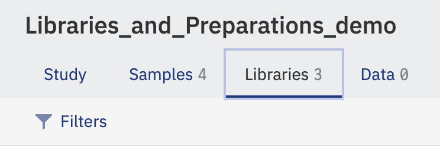

#### Preparations to Samples

You can link the **preparation group** to the **samples group** using the endpoint `POST /api/v1/as-curator/integration/link/preparation/group/{sourceId}/to/sample/group/{targetId}`, along with the **accession** returned when importing the samples.

```default
curl -X 'POST' \
  'https://<HOST>/api/v1/as-curator/integration/link/preparation/group/GSF1284256/to/sample/group/GSF1284456' \
  -H 'accept: */*' \
  -H 'Genestack-API-Token: <TOKEN>' \
  -d ''
```
If successful you will see a preparation tab appear in the Metadata Editor:

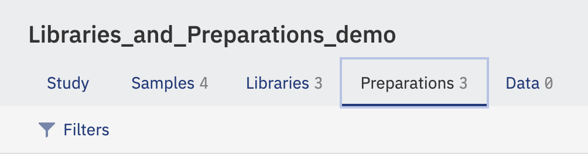

#### Cell metadata to Samples/Libraries/Preparations

You can link the **Cell metadata group** to the **samples/libraries/preparation groups** using the endpoints:

* Link to Samples

    **Path:** POST `/api/v1/as-curator/integration/link/cell/group/{sourceId}/to/sample/group/{targetId}`

* Link to Libraries

    **Path:** POST `/api/v1/as-curator/integration/link/cells/group/{sourceId}/to/library/group/{targetId}`

* Link to Preparations

    **Path:** POST `/api/v1/as-curator/integration/link/cells/group/{sourceId}/to/preparation/group/{targetId}`

For `sourceId` field provide accession of your Cell metadata group.

For `targetId` field provide accession of selected Sample, Library, or Preparation group where Cell metadata should be linked.

Cell metadata will be linked if there are matches between `batch` values in Cell metadata and `Sample Source ID` for Samples,
`Library ID` for Libraries, and `Preparation ID` for Preparations.

If successful you will find the Cells via `GET /api/v1/as-curator/omics/cells` API endpoint when Study accession is provided for `studyQuery` parameter.

### Working with the jobExecId
The following endpoints allow you to manage and inspect jobs using the jobExecId, which is returned after initiating an asynchronous import task.

#### Monitoring job status

**GET /api/v1/jobs/{jobExecId}/info**

Retrieves the current status and metadata of a specific job execution.

- **Use case**: Use this to monitor the progress of an import job using its `jobExecId`.
- **Endpoint**: `GET /api/v1/jobs/{jobExecId}/info`

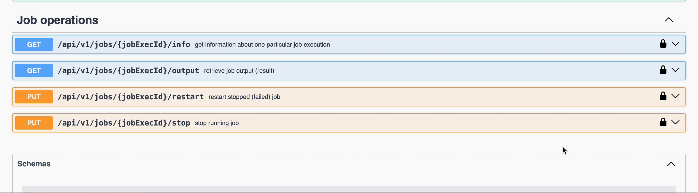

!!! note "Status codes"
    The job status can be one of the following:

    - **STARTING** – Import job is starting  
    - **RUNNING** – Import job is in progress  
    - **COMPLETED** – Import job was successful  
    - **FAILED** – Import job failed with an error

---

**GET /api/v1/jobs/{jobExecId}/output**

Retrieves the output of a completed job, including the accession of the generated study.

- **Use case**: Use this after a job has completed to get the final result and study accession.
- **Endpoint**: `GET /api/v1/jobs/{jobExecId}/output`

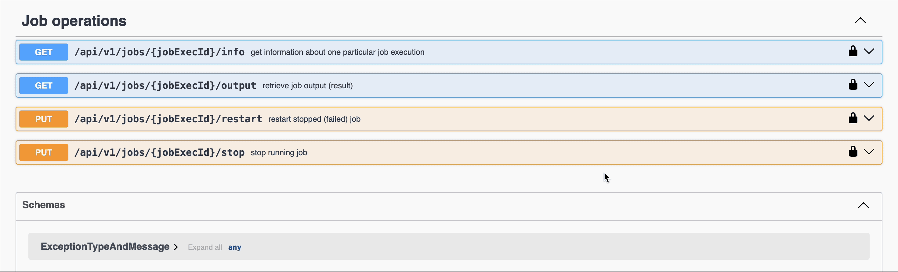

```json
{
  "status": "COMPLETED",
  "result": {
    "accession": "GSF1283528"
  }
}
```

---

**PUT /api/v1/jobs/{jobExecId}/restart**

Restarts a job that has failed or was stopped before completion.

- **Use case**: If a job failed due to a temporary issue, you can restart it using its `jobExecId`.
- **Endpoint**: `PUT /api/v1/jobs/{jobExecId}/restart`

---

**PUT /api/v1/jobs/{jobExecId}/stop**

Stops a job that is currently running.

- **Use case**: Use this when you need to cancel a long-running or stuck job.
- **Endpoint**: `PUT /api/v1/jobs/{jobExecId}/stop`

---

!!! note "Behavior by file type"
    The behavior of stop and restart actions depends on the type of file being processed:

    - **Metadata files** (studies, libraries, preparations, samples): Stop and restart are supported. The job resumes from where it left off.
    - **Signal files** (expression, flow cytometry, variant): These are processed very quickly, so stopping and restarting has limited practical use.
    - **Attachment files** (e.g., documents, images): These are handled as a single unit, so stop and restart are not applicable.

## Signal Data Import

### Expression data

- [Test_expression.gct](https://bio-test-data.s3.us-east-1.amazonaws.com/odm/user-guide/Test_expression.gct), a [GCT](https://software.broadinstitute.org/cancer/software/gsea/wiki/index.php/Data_formats#GCT:_Gene_Cluster_Text_file_format_.28.2A.gct.29) file of expression data from multiple sequencing runs. Note in this example the GCT file is using library IDs for linking.

| Name            | Description   |   LIB1 |   LIB2 |
|-----------------|---------------|--------|--------|
| ENSG00000077044 |               |   21.9 |   19.9 |
| ENSG00000085982 |               |   23.7 |   24.9 |

- [Test_generic_expression.tsv](https://bio-test-data.s3.us-east-1.amazonaws.com/odm/user-guide/Test_generic_expression.tsv),  a tabular dataset in TSV (tab-separated values) format. 

| Text Feature One | Text Feature Two | Numeric Feature One | Numeric Feature Two | HG00119.m1 | HG00121.m1 | HG00183.m1 | HG00176.m1 |
|------------------|------------------|----------------------|----------------------|-------------|-------------|-------------|-------------|
| f1_1             | f2_1             | 1.069                | 2.218                | 0.804       | 0.350       | 0.591       | 7.260       |
| f1_2             | f2_2             | 4.845                | 0.391                | 0.729       | 5.657       |11.730       |11.007       |
| f1_3             | f2_3             | 1.427                | 0.147                | 1.588       | 8.145       | 1.480       | 2.718       |
| f1_4             | f2_4             | 4.854                | 3.723                | 0.645       | 4.493       | 0.862       | 1.370       |
| f1_5             | f2_5             |10.563                | 4.217                | 1.102       | 1.627       | 3.157       | 4.393       |


- [Test_generic_expression_lib.tsv](https://bio-test-data.s3.us-east-1.amazonaws.com/odm/user-guide/Test_generic_expression_lib.tsv), a tabular dataset in TSV (tab-separated values) format. This file is structured to be **linked to Libraries**.

| Text Feature One | Text Feature Two | Numeric Feature One | Numeric Feature Two | LIB1.m1 | LIB2.m1 | LIB3.m1 |
|------------------|------------------|----------------------|----------------------|---------|---------|---------|
| f1_2             | f2_2             | 4.845                | 0.391                | 0.729   | 5.657   |11.730   |
| f1_3             | f2_3             | 1.427                | 0.147                | 1.588   | 8.145   | 1.480   |
| f1_4             | f2_4             | 4.854                | 3.723                | 0.645   | 4.493   | 0.862   |
| f1_5             | f2_5             |10.563                | 4.217                | 1.102   | 1.627   | 3.157   |


- [Test_expression.gct.tsv](https://bio-test-data.s3.us-east-1.amazonaws.com/odm/user-guide/Test_expression.gct.tsv), a tab-separated file that describes the expression data.

| Normalization Method   | Genome Version   |
|------------------------|------------------|
| RPKM                   | GRCh38.91        |

#### Import process

This time, we're going to import expression data, supplying two files, one for the metadata, and another for the
processed data:

```default
curl -X 'POST' \
  'https://<HOST>/api/v1/jobs/import/expression?allow_dups=false' \
  -H 'accept: application/json' \
  -H 'Genestack-API-Token: <TOKEN>' \
  -H 'Content-Type: application/json' \
  -d '{
  "metadataLink": "https://bio-test-data.s3.us-east-1.amazonaws.com/odm/user-guide/Test_expression.gct.tsv",
  "dataLink": "https://bio-test-data.s3.us-east-1.amazonaws.com/odm/user-guide/Test_expression.gct",
  "dataClass": "Bulk transcriptomics"
}'
```
The example call in Swagger contain multiple additional fields, that we do not require to be able to import the data. In order to be able to load the data, we will only use *metadataLink*, *dataLink* and *dataClass*.

Alternatively, we can import the generic data file, which has features and dot separated measurements.
Please note, that in this example `numberOfFeatureAttributes` and `measurementSeparator` are mandatory. To learn more about this data type and mandatory fields please see [this page](../supported-formats/#tabular-data).

```default
curl -X 'POST' \
  'https://<TOKEN>/api/v1/jobs/import/expression?allow_dups=false' \
  -H 'accept: application/json' \
  -H 'Genestack-API-Token: <TOKEN>' \
  -H 'Content-Type: application/json' \
  -d '{
  "dataLink": "https://bio-test-data.s3.us-east-1.amazonaws.com/odm/user-guide/Test_generic_expression.tsv",
  "numberOfFeatureAttributes": 4,
  "dataClass": "Proteomics",
  "measurementSeparator": "."
}'
```

!!! note "Data Class Rules for GCT vs TSV Files"
    - **GCT files** must always be imported with a `"dataClass": "Bulk transcriptomics"`.
    
    - **TSV files** are more flexible. You are not restricted to a single data class and can use any available one (e.g., *Proteomics*, *Metabolomics*, etc.) depending on the content. TSV imports support additional parameters such as `numberOfFeatureAttributes` and `measurementSeparator`, allowing you to define how features and measurements are organized within the file.

!!! note "Available Parameters"
    - **dataLink** - link to a file that contains the data.
    - **dataClass** - Specify a data class that suits the data set you are importing. You can use [Data Class](../import-data-in-odm/#data-type-data-class) list as a reference.
    - **metadataLink** - (optional) link to a file that contains metadata (.tsv)
    - **templateId** - (optional) accession of the template
    - **previousVersion** - (optional) accession of the previous version of the file. Used to update the existing version of the file.
    - **numberOfFeatureAttributes** - This field indicates how many columns in your file are related to the measured features (for example, Gene Names, Protein Names, Description, Metabolite Names, M/Z ratio, Retention Time, etc.). Please provide the correct number. Automatic recognition of this field will be added in future updates.
    - **measurementSeparator** - This parameter distinguishes the sample, library, or preparation name from various measurement types in your file's column headers (if applicable). For each sample, you might have different measurements like gene expression level, quality flag, sequencing depth, or p-value. This separator is crucial when your file contains columns for multiple such measurements. Supported separators include ., ,, :, ;, _, -, /, \, |, and multi-character separators are also allowed. Leave it blank if not applicable.


If successful, you will get the response that contain the **jobExecId** that we will use to get the **groupAccession** using `GET /api/v1/jobs/{jobExecId}/output` endpoint.

```json
{
  "status": "COMPLETED",
  "result": {
    "groupAccession": "GSF1283537"
  }
}
```

We can use the aquired **groupAccession** to get the expression data using `GET as-curator/omics/expression/data` endpoint:

```default
curl -X 'GET' \
  'https://<HOST>/api/v1/as-curator/omics/expression/data?exFilter=genestack%3Aaccession%20%3D%20GSF1283537' \
  -H 'accept: application/json' \
  -H 'Genestack-API-Token: <TOKEN>'
```
As response you will get all the information, including the metadata, for the expression file we have succesfully imported.

```json
{
  "data": [
    {
      "itemId": "856314-ENSG00000077044",
      "itemOrigin": {
        "runSourceId": "HG00119",
        "runId": "856314",
        "groupId": "GSF1283537"
      },
      "metadata": {
        "Experimental Platform": null,
        "Features (numeric)": null,
        "Data Processing Method": null,
        "Genome Version": "GRCh37.68",
        "Scale": null,
        "Normalization Method": "RPKM",
        "Values (numeric)": null,
        "Data Class": "Bulk transcriptomics",
        "Pipeline ID": null,
        "Data Species": null,
        "Import Source URL": null,
        "Features (string)": null,
        "Data Files / Processed": null,
        "Data Files / Raw": null
      },
      "feature": {
        "feature": "ENSG00000077044"
      },
      "value": {
        "value": 14.7418793729
      },
      "relationships": null
    },

    Shortened for readability — 7 more items are not shown.
}
```
#### Linking to Samples/Libraries/Preparations

In this example, we link an expression group to a sample group using `POST /api/v1/as-curator/integration/link/{sourceType}/group/{sourceId}/to/{targetType}/group/{targetId}`and we will link another expression group to a library group using `POST /api/v1/as-curator/integration/link/expression/group/{sourceId}/to/library/group/{targetId}`.

Alternatively, you can link to a preparations group using this endpoint:
- `POST /api/v1/as-curator/integration/link/expression/group/{sourceId}/to/preparation/group/{targetId}`

!!! note "Linking library\preparation"
    When signal data is linked to **Libraries** or **Preparations**, the system uses a default attribute automatically:

    - For **Libraries**, the default linking attribute is `Library ID`
    - For **Preparations**, the default linking attribute is `Preparation ID`

There are two supported approaches for linking entities in the system:

##### Group-to-group linking

Use this approach when you want to link one group of objects (e.g., samples, libraries, or data entities) to another group. 

The call below links an expresison group to a sample group using the following endpoint:
`POST /api/v1/as-curator/integration/link/expression/group/{sourceId}/to/sample/group/{targetId}`

```default
curl -X 'POST' \
  'https://<HOST>/api/v1/as-curator/integration/link/expression/group/GSF1283537/to/sample/group/GSF1283530' \
  -H 'accept: */*' \
  -H 'Genestack-API-Token: <TOKEN>' \
  -d ''
```

The call below links an expression group to a library group using the following endpoint:
`POST /api/v1/as-curator/integration/link/expression/group/{sourceId}/to/library/group/{targetId}`

```default
curl -X 'POST' \
  'https://<HOST>/api/v1/as-curator/integration/link/expression/group/GSF1284946/to/library/group/GSF1284497' \
  -H 'accept: */*' \
  -H 'Genestack-API-Token: <TOKEN>' \
  -d ''
```


##### Object-to-object linking

Use this approach to link individual objects directly — for example, linking a specific data object to a specific sample.

The call below links a single source object to a single target object using the following endpoint:
`POST /api/v1/as-curator/integration/link/{sourceType}/{sourceId}/to/{targetType}/{targetId}`

```default
curl -X 'POST' \
  ' 'https://odm.demo.genestack.com/api/v1/as-curator/integration/link/expression/GSF282812/to/sample/HG00119' \
  -H 'accept: */*' \
  -H 'Genestack-API-Token: <TOKEN>' \
  -d ''

```
Expression data is now succesfuly linked and visible in the GUI.
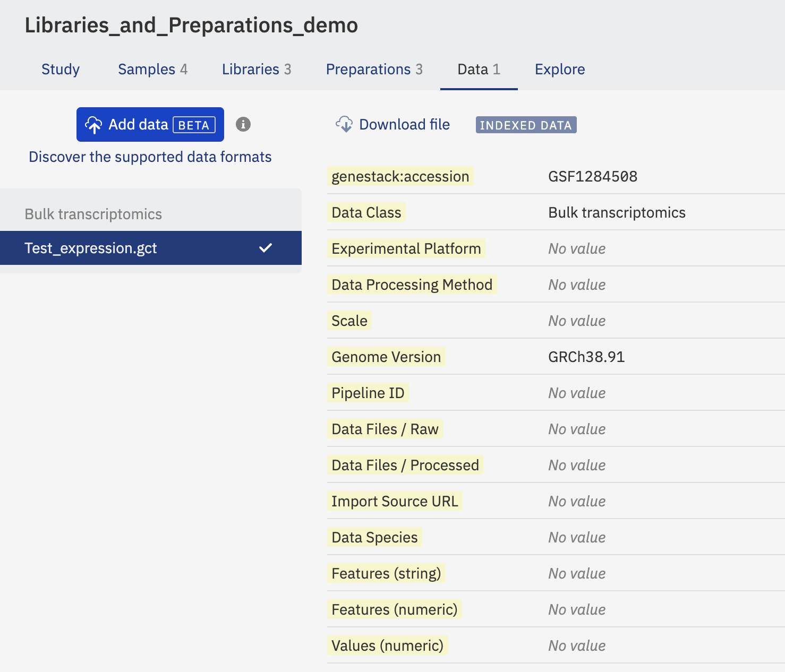

### Variant data 

- [Test_variant.vcf](https://bio-test-data.s3.us-east-1.amazonaws.com/odm/user-guide/Test_variant.vcf), a [VCF](https://samtools.github.io/hts-specs/VCFv4.2.pdf) file of variant data from multiple sequencing runs

|   #CHROM |       POS | ID          | REF   | ALT   |   QUAL | FILTER   | INFO    | FORMAT   | HG00119   | HG00121   | HG00183   | HG00176   |
|----------|-----------|-------------|-------|-------|--------|----------|---------|----------|-----------|-----------|-----------|-----------|
|        2 | 233364596 | rs838705    | G     | A     |    100 | PASS     | AF=0.64 | GT       | 0|0       | 0|1       | 1|0       | 1|1       |
|        2 | 233385915 | rs201966773 | T     | TTC   |    987 | PASS     | AF=0.86 | GT       | 0|0       | 0|1       | 1|1       | 1|1       |

- [Test_variant.vcf.tsv](https://bio-test-data.s3.us-east-1.amazonaws.com/odm/user-guide/Test_variant.vcf.tsv), a tab-separated file that describes the variant data

| Experimental Platform  |
|------------------------|
| IonTorrent Proton      |

#### Import process

Let's repeat the previous step, this time for variant data, ensuring that both expression and variant data are linked to the samples, reinforcing the data model hierarchy where samples are linked to a study, and data types (expression and variant) are linked to samples.

To import the variant data we will use `POST /api/v1/jobs/import/variant` endpoint:

```default
curl -X 'POST' \
  'https://<HOST>/api/v1/jobs/import/variant?allow_dups=true' \
  -H 'accept: application/json' \
  -H 'Genestack-API-Token: <TOKEN>' \
  -H 'Content-Type: application/json' \
  -d '{
  "metadataLink": "https://bio-test-data.s3.us-east-1.amazonaws.com/odm/user-guide/Test_variant.vcf.tsv",
  "dataLink": "https://bio-test-data.s3.us-east-1.amazonaws.com/odm/user-guide/Test_variant.vcf"
}'
```

As with the previous job endpoints, the response will include a *jobExecId*, which can be passed to the *job/output* endpoint to retrieve the variant group accession "GSF1283539".

Which we can use to query the data using the `GET /api/v1/as-curator/omics/variant/data` endpoint:

```default
curl -X 'GET' \
  'https://<HOST>/api/v1/as-curator/omics/variant/data?vxFilter=genestack%3Aaccession%20%3D%20GSF1283539' \
  -H 'accept: application/json' \
  -H 'Genestack-API-Token: <TOKEN>'
```
Response will contain the variant data that we imported:

```json
{
  "data": [
    {
      "itemId": "2-233364596-G-A-856318",
      "itemOrigin": {
        "runSourceId": "HG00119",
        "runId": "856318",
        "groupId": "GSF1283539"
      },
      "metadata": {
        "Data Class": "Gene variant (VCF)",
        "Experimental Platform": "IonTorrent Proton",
        "Pipeline ID": null,
        "Data Processing Method": null,
        "Genome Version": null,
        "Processed Data Files": null,
        "Import Source URL": null,
        "Scale": null,
        "Raw Data Files": null,
        "Name": null
      }
      ...
  "resultsExhausted": true,
  "log": [
    "There are no restrictions related with library/preparation/sample/study query"
  ],
  "cursor": "2-233385915-T-TC-856321"
}
```
#### Linking to Samples

To link the variant group (GSF1283539) with the sample group (GSF1283530) we will use `POST /api/v1/as-curator/integration/link/variant/group/{sourceId}/to/sample/group/{targetId}` endpoint.

```default
curl -X 'POST' \
  'https://<HOST>/api/v1/as-curator/integration/link/variant/group/GSF1283539/to/sample/group/GSF1283530' \
  -H 'accept: */*' \
  -H 'Genestack-API-Token: <TOKEN>' \
  -d ''
```

Variant data is now succesfuly linked and visible in the GUI.
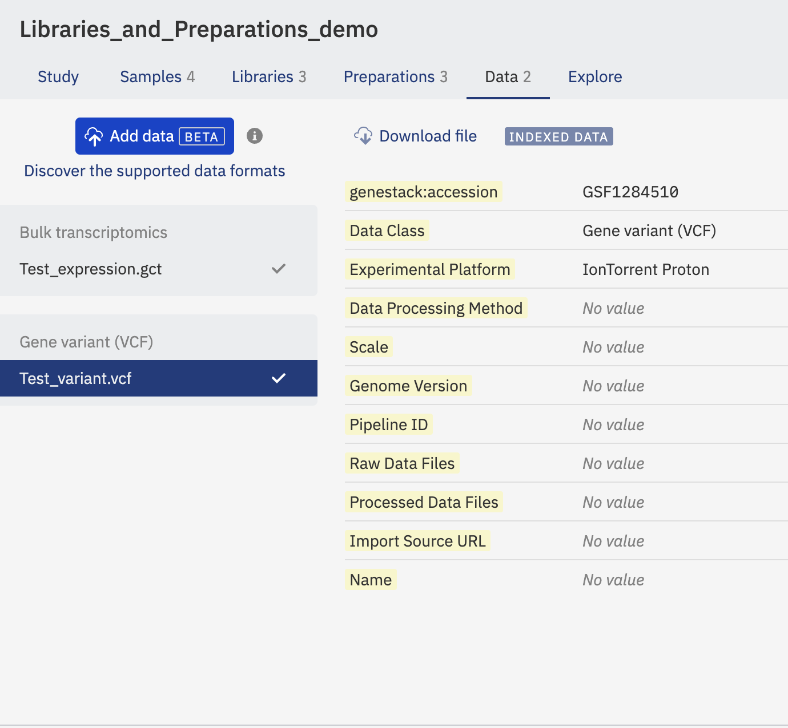

### Flow Cytometry Data

- [Test_FACS_Signals.facs](https://bio-test-data.s3.us-east-1.amazonaws.com/odm/user-guide/Test_FACS_Signals.facs), a tab-separated file that contains signal readouts from FACS experiments per cell population and sample.

| Sample   | CellPopulation                               | ReadoutType | Color/Marker | Value   |
|----------|----------------------------------------------|-------------|--------------|---------|
| HG00119  | Total events                                 | Counts      |              | 189031  |
| HG00119  | Total events/Lymphocytes                     | Counts      |              | 182557  |
| HG00119  | Total events/Lymphocytes                     | Percentage  |              | 96.6    |
| HG00119  | Total events/Lymphocytes/Single Cells        | Counts      |              | 177879  |
| HG00119  | Total events/Lymphocytes/Single Cells        | Percentage  |              | 97.4    |

- [Test_FACS_Signals.facs.csv](https://bio-test-data.s3.us-east-1.amazonaws.com/odm/user-guide/Test_FACS_Signals.facs.csv), a tab-separated file that describes the FACS data.

| Experimental Platform  |
|------------------------|
| FACS                   |


#### Import Process

To import the Flow Cytometry data we will use `POST /api/v1/jobs/import/flow-cytometry` endpoint.

```default
curl -X 'POST' \
  'https://<HOST>/api/v1/jobs/import/flow-cytometry?allow_dups=false' \
  -H 'accept: application/json' \
  -H 'Genestack-API-Token: <TOKEN>' \
  -H 'Content-Type: application/json' \
  -d '{
  "dataLink": "https://bio-test-data.s3.us-east-1.amazonaws.com/odm/user-guide/Test_FACS_Signals.facs"
}'
```

The response will include a *jobExecId*, which can be passed to the *job/output* endpoint to retrieve the Flow Cytometry group accession "GSF1284512".

Which we can use to query the data using the `GET /api/v1/as-user/flow-cytometries` endpoint:

```default
curl -X 'GET' \
  'https://<HOST>/api/v1/as-user/flow-cytometries?query=genestack%3Aaccession%20%3D%20GSF1284512' \
  -H 'accept: application/json' \
  -H 'Genestack-API-Token: <TOKEN>'
```

Response will contain the Flow Cytometry data we have imported:
```json
{
  "data": [
    {
      "itemId": "856561-1",
      "itemOrigin": {
        "runSourceId": "HG00119",
        "runId": "856561",
        "groupId": "GSF1284512"
      },
      "metadata": {
        "Data Class": "Flow Cytometry (FACS)",
        "Experimental Platform": null,
        "Pipeline ID": null,
        "Data Processing Method": null,
        "Processed Data Files": null,
        "Import Source URL": null,
        "Scale": null,
        "Raw Data Files": null,
        "Name": null
      },
      "feature": {
        "readoutType": "Counts",
        "cellPopulation": "Total events",
        "marker": ""
      },
      "value": {
        "value": 189031
      }
    },
```

#### Linking to Samples

To link the Flow Cytometry group (GSF1284512) with the sample group (GSF1283530) we will use `POST /api/v1/as-curator/integration/link/variant/group/{sourceId}/to/sample/group/{targetId}` endpoint.

```default
curl -X 'POST' \
  'https://<HOST>/api/v1/as-curator/integration/link/flow-cytometry/group/GSF1284512/to/sample/group/GSF1284464' \
  -H 'accept: */*' \
  -H 'Genestack-API-Token: <TOKEN>' \
  -d ''
```

Flow Cytometry data is now succesfuly linked and visible in the GUI.
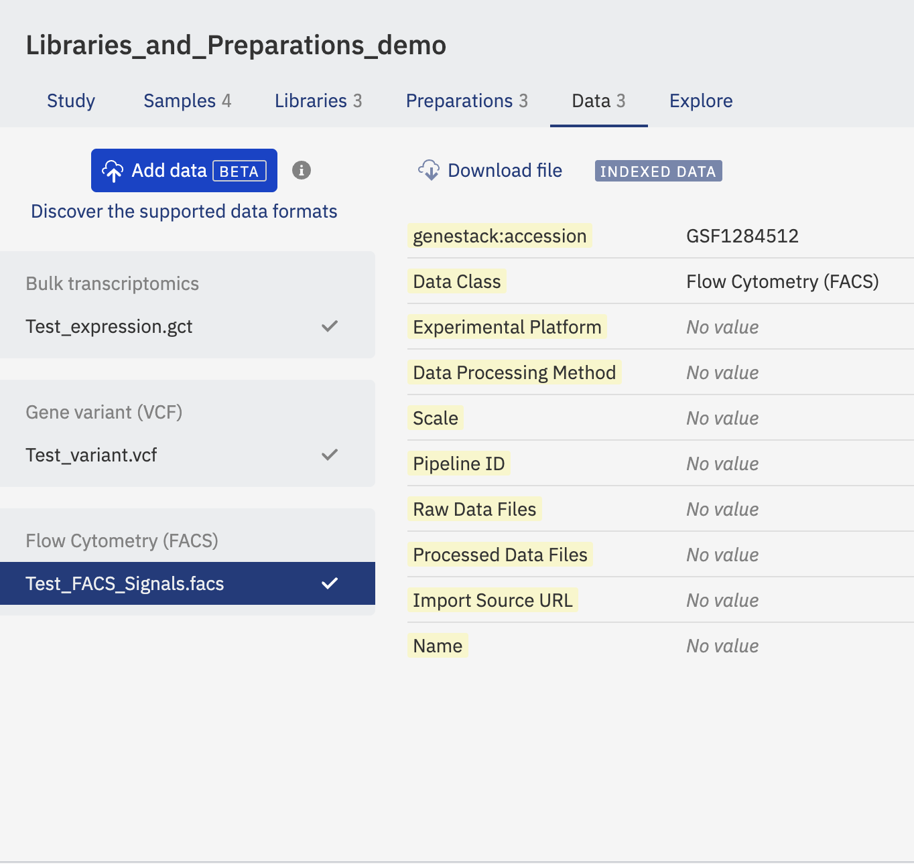

### Attached Files

- [test_file_metadata.pdf](https://bio-test-data.s3.us-east-1.amazonaws.com/odm/user-guide/test_file_metadata.pdf), a PDF file containing a test table.

| File Name         | Sample ID | File Type | Checksum  | Description                            |
|-------------------|-----------|-----------|-----------|----------------------------------------|
| file_001.bam      | SMPL001   | BAM       | abc12345  | BAM file for whole genome sequencing   |
| file_002.vcf      | SMPL002   | VCF       | def67890  | VCF file with called variants          |
| file_003.fastq.gz | SMPL003   | FASTQ     | ghe98765  | Raw sequencing reads                   |

#### Import process

To import and link attached file to a study we will use `POST /api/v1/jobs/import/file` endpoint.

The example call contains a link to a file, the accession of the study the file will be linked to, and a Data Class for the imported file. You can use any available Data Class for the Attached file.

!!! note "Mandatory fields"
    Please note that `dataLink`, `studyAccession` and `dataClass` are mandatory fields and cannot be skipped.
     


```default
curl -X 'POST' \
  'https://<HOST>/api/v1/jobs/import/file' \
  -H 'accept: application/json' \
  -H 'Genestack-API-Token: <TOKEN>' \
  -H 'Content-Type: application/json' \
  -d '{
  "dataLink": "https://bio-test-data.s3.us-east-1.amazonaws.com/odm/user-guide/test_file_metadata.pdf",
  "studyAccession": "GSF1284490",
  "dataClass": "Document"
}'
```

Attached file is now succesfuly linked and visible in the GUI.
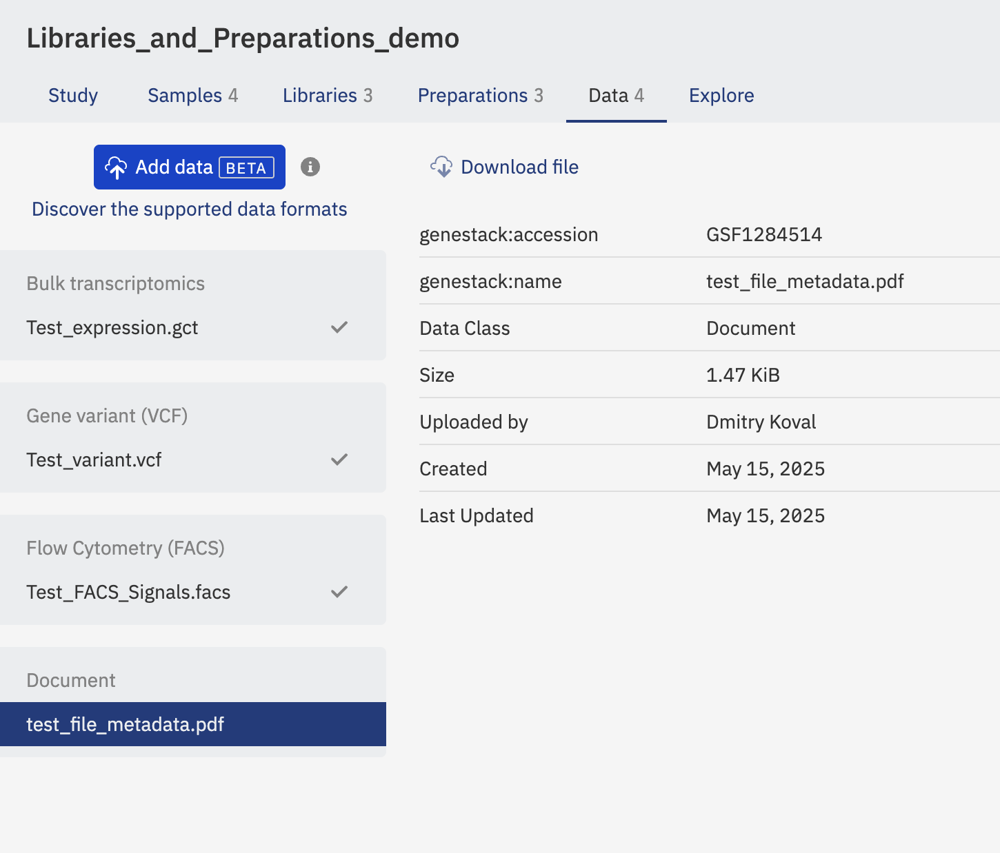

### Check that you can query the relationships between objects

Once you've created and linked the study, sample, library, preparations and expression objects you can do integration-aware queries via both the User Interface and APIs.

In the User Interface, you should be able to find your imported study using the study, sample, library, preparations and signal filters.

To do this via APIs, you can use the integration/omics endpoint to filter across studies, samples, libraries, preparations and signals, and retrieve a specific object type. For example, to get metadata about the samples associated with library LIB1:

```default
curl -X 'GET' \
  'https://<HOST>/api/v1/as-curator/integration/link/samples/by/libraries?filter=%22Library%20ID%22%3D%20LIB1' \
  -H 'accept: application/json' \
  -H 'Genestack-API-Token: <TOKEN>'
```

Which will return:

```json
{
  "meta": {
    "pagination": {
      "count": 2,
      "total": 2,
      "offset": 0,
      "limit": 2000
    }
  },
  "data": [
    {
      "genestack:accession": "GSF1283543",
      "Sample Source ID": "SRR6441188",
      "Sample Name": null,
      "Ancestry": null,
      "Age": null,
      "Tissue Type": null,
      "Condition": null,
      "Sex": "F",
      "Genotyping Method": null,
      "Collection Date": null,
      "Sample Type": null,
      "Age Unit": null,
      "Genomic DNA Yield": null,
      "Smoking Status": null,
      "Sample Source": "1000 Genomes Project",
      "Population": "British",
      "groupId": "GSF1283541"
    },
    {
      "genestack:accession": "GSF1283542",
      "Sample Source ID": "SRR6441195",
      "Sample Name": null,
      "Ancestry": null,
      "Age": null,
      "Tissue Type": null,
      "Condition": null,
      "Sex": "M",
      "Genotyping Method": null,
      "Collection Date": null,
      "Sample Type": null,
      "Age Unit": null,
      "Genomic DNA Yield": null,
      "Smoking Status": null,
      "Sample Source": "1000 Genomes Project",
      "Population": "British",
      "groupId": "GSF1283541"
    }
  ]
}
```

To get the preparation metadata objects which are linked to sample metadata we can use `GET /api/v1/as-curator/integration/link/preparations/by/samples` endpoint.


```default
curl -X 'GET' \
  'https://<HOST>/api/v1/as-curator/integration/link/preparations/by/samples?filter=%22Sample%20Source%20ID%22%20%3D%20HG00119' \
  -H 'accept: application/json' \
  -H 'Genestack-API-Token: <TOKEN>'
```

Example response:

```json
{
  "meta": {
    "pagination": {
      "count": 1,
      "total": 1,
      "offset": 0,
      "limit": 2000
    }
  },
  "data": [
    {
      "genestack:accession": "GSF1284503",
      "Preparation ID": "PREP1",
      "Sample Source ID": [
        "HG00119",
        "HG00121"
      ],
      "Kit Reagent": null,
      "Incubation Time": null,
      "Date Performed": null,
      "Method Protocol": null,
      "Preparation Step": null,
      "Volume Concentration": null,
      "Volume Unit": null,
      "groupId": "GSF1284502"
    }
  ]
}
```
