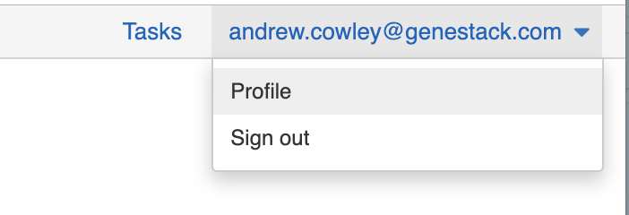
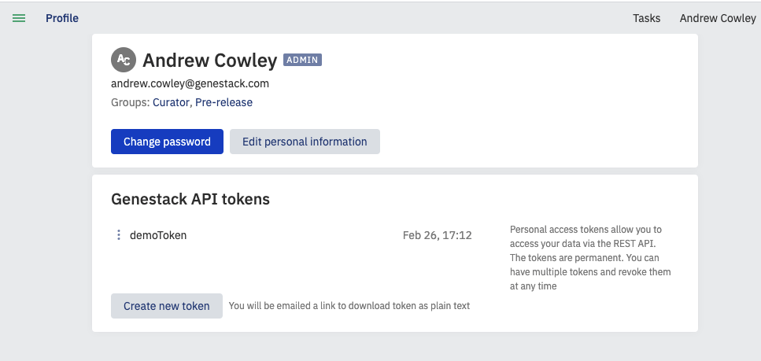

# Import Data Using Python Script

This page demonstrates how to use the *import_ODM_data.py* script to input data
into ODM. Please note that you need to be a member of the curator group in ODM
to be able to import and edit data in ODM.

## Requirements

Read the full list of requirements [here](https://github.com/genestack/public-odm-docs/blob/develop/04.%20Working%20with%20study/Uploading%20a%20study/README.md)

## Optional experimental (signal) data files

You can optionally also provide:

- The accession of a template to validate against rather than the default. Use
  `--template <ACCESSION>` to specify.
- The server address if you want to apply the script to a different ODM server.
  Use `--host <HOST>` to specify.
- Any data in the Tabular format (Data Frame) as a TSV, hosted at an HTTPS web address
- Gene expression data in [GCT](https://software.broadinstitute.org/cancer/software/gsea/wiki/index.php/Data_formats#GCT:_Gene_Cluster_Text_file_format_.28.2A.gct.29) format, hosted at an HTTPS web address
- Gene expression metadata in TSV format, hosted at an HTTPS web address
- Gene variant data in [VCF](https://samtools.github.io/hts-specs/VCFv4.2.pdf) format, hosted at an HTTPS web address
- Gene variant metadata in TSV format, hosted at an HTTPS web address
- Flow cytometry data in .facs format, hosted at an HTTPS web address
- Flow cytometry metadata in TSV format, hosted at an HTTPS web address
- A cross-reference mapping file, in TSV format, hosted at an HTTPS web
  address. You can also use `--mapping_file_accession` instead to specify a
  previously uploaded mapping file.
- A libraries file in TSV format, hosted at an HTTPS web address, or the
  accession of an existing library file
- A preparations file in TSV format, hosted at an HTTPS web address, or the
  accession of an existing preparations file.

Once imported, studies, samples, and signal metadata will be queryable and
editable from both the User Interface and APIs, whilst the signal data will
only queryable via APIs.

## Linking using sample source ID

By default linking is done via the **Sample Source ID** key, so this needs to
be consistent in the above files for linking to occur.

## Getting a Genestack API token

Before you begin you will need a genestack API token.

To obtain a token, sign in to ODM via a web browser, click on your email
address in the top right and select “Profile”



Then click the “Create new token” button under API tokens:



You will then be emailed a link to download your token as plain text. Use this token as required below.

## Script usage

If you are using Genestack API Token, run the script by typing:

```default
odm-import-data --token [token] --host [HOST] --study [URL to study file] --samples [URL to samples file]
```

Or if you are using Access Token, run the script specifying the token and template accession:

```default
odm-import-data --access-token [access-token] --host [HOST] --study [URL to study file] --samples [URL to samples file] --template [template accession]
```

**Important Note**: you should always specify the template accession whenever you are uploading the
study with a file URL and an Access Token.

Optionally include data files by appending any or all of the following to the above command:

```default
--expression [URL] --expression_metadata [URL]
```

```default
--variant [URL] --variant_metadata [URL]
```

```default
--flow_cytometry [URL] --flow_cytometry_metadata [URL]
```

```default
--mapping_file [URL] --mapping_file_metadata [URL]
```

```default
--libraries [URL]
```

```default
--preparations [URL]
```

## Updating data files

To update a data file (e.g. TSV, GCT, VCF file) rather than adding another
data file, append the accession of the data file to be updated in square
brackets to the URL of the data file import. Existing study and sample
accessions must be supplied. See the example below:

```default
--study_accession GSF994039 \
--samples GSF994040 \
--expression http://exampl.com/expression.gct[GSF994565]  \
--expression_metadata http://exampl.com/expression_metadata.tsv  \
--variant http://exampl.com/variations.vcf[GSF994700] \
--variant_metadata http://exampl.com/variant_metadata.tsv
```

## Example files

The following are some example files to illustrate file formats:

- [Test_1000g.study.tsv](https://s3.amazonaws.com/bio-test-data/odm/Test_1000g/Test_1000g.study.tsv), a tab-delimited file of the study attributes
- [Test_1000g.samples.tsv](https://s3.amazonaws.com/bio-test-data/odm/Test_1000g/Test_1000g.samples.tsv), a tab-delimited file of sample attributes.
- [Test_1000g.gct](https://s3.amazonaws.com/bio-test-data/odm/Test_1000g/Test_1000g.gct), a [GCT](https://software.broadinstitute.org/cancer/software/gsea/wiki/index.php/Data_formats#GCT:_Gene_Cluster_Text_file_format_.28.2A.gct.29) file of expression data from multiple sequencing runs
- [Test_1000g.gct.tsv](https://s3.amazonaws.com/bio-test-data/odm/Test_1000g/Test_1000g.gct.tsv), a tab-separated file that describes the expression data
- [Test_1000g.vcf](https://s3.amazonaws.com/bio-test-data/odm/Test_1000g/Test_1000g.vcf), a [VCF](https://samtools.github.io/hts-specs/VCFv4.2.pdf) file of variant data from multiple sequencing runs
- [Test_1000g.vcf.tsv](https://s3.amazonaws.com/bio-test-data/odm/Test_1000g/Test_1000g.vcf.tsv), a tab-separated file that describes the variant data

Run the script with the above by typing the following (inserting your token
instead of [token], note you may need to escape or quote strings depending on
your specific command line interface):

```default
odm-import-data --token [token] --host [HOST] --study https://s3.amazonaws.com/bio-test-data/odm/Test_1000g/Test_1000g.study.tsv --samples https://s3.amazonaws.com/bio-test-data/odm/Test_1000g/Test_1000g.samples.tsv --expression https://s3.amazonaws.com/bio-test-data/odm/Test_1000g/Test_1000g.gct --expression_metadata https://s3.amazonaws.com/bio-test-data/odm/Test_1000g/Test_1000g.gct.tsv --variant https://s3.amazonaws.com/bio-test-data/odm/Test_1000g/Test_1000g.vcf --variant_metadata https://s3.amazonaws.com/bio-test-data/odm/Test_1000g/Test_1000g.vcf.tsv
```
