# Import Data in ODM

This guide provides a detailed overview of how to import data into the Open Data Manager (ODM).

!!! info
    Data import and editing permissions are restricted to users who are part of the **Curator** group within ODM.

## What Can Be Imported?

ODM supports the import of the following entities, either as structured data or as attached files relevant to your study:

- **Study**: The foundational unit where you define the context, objectives, and statistical design of your experiment.
- **Sample** (Metadata): Detailed documentation of the biological attributes of your samples, such as tissue type, disease status, and treatment conditions.
- **Experimental Data Metadata**: Information about data processing, including normalization methods, instrumentation, and data formats (e.g., GCT, VCF).
- **Experimental Data**: The actual data generated from your study, typically provided in tabular formats.
- **Files**: You can attach any files related to your study, including reports, presentations, documents, images, or scientific publications.
- **Libraries** and **Preparations**: Information regarding the sample preparation methods and libraries used in your experiment, if applicable.

If you have created a new study that does not yet contain sample metadata or linked data, you can upload a spreadsheet of sample metadata via the user interface. This feature is accessible in the **Metadata Editor** under the **Samples** tab.

Data upload takes place within the Metadata Editor after you open or create a Study.

## Importing Sample Information (Metadata)

To import sample information, ensure the following:

* The study should not have any previously uploaded sample information linked to data.
* You will need a TSV format file (with a “.tsv” file extension) containing the sample information. The first row should list the metadata attribute names, ensuring that there are no duplicates. See the example below:

[Test_1000g.samples.tsv](https://s3.amazonaws.com/bio-test-data/odm/Test_1000g/Test_1000g.samples.tsv), a tab-delimited file of sample attributes.

| Sample Source        | Sample Source ID   | Species      | Sex   | Population   |
|----------------------|--------------------|--------------|-------|--------------|
| 1000 Genomes Project | HG00119            | Homo sapiens | M     | British      |
| 1001 Genomes Project | HG00121            | Homo sapiens | F     | British      |
| 1002 Genomes Project | HG00183            | Homo sapiens | M     | Finnish      |
| 1003 Genomes Project | HG00176            | Homo sapiens | F     | Finnish      |

**Import Samples Metadata**:

* To upload sample metadata, click on the **Samples** tab on the main screen of the study.

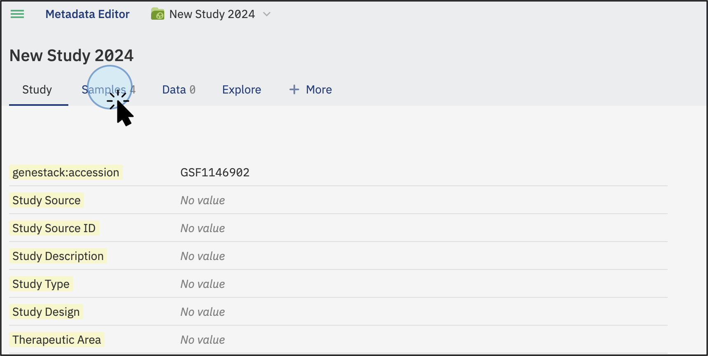
<figcaption>Click on the Samples tab to access details about the samples' metadata</figcaption>

* Click on **Edit** at the bottom left of your sample table.
* Select the tabular files (TSV) by clicking on the cloud symbol in the top right of your sample table.

You can upload sample metadata from any experiment (e.g., flow cytometry, gene variant, transcriptomics) as long as the file is in a tabular format (TSV).

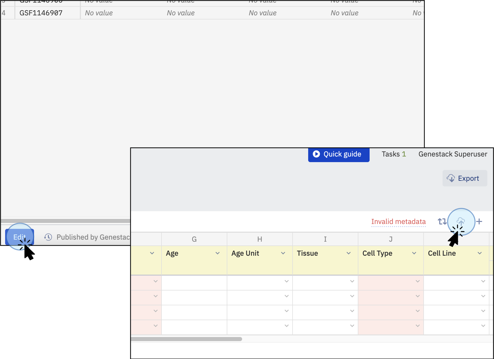
<figcaption>To import metadata sample files, click the <strong>Edit</strong> button at the bottom, then select the cloud icon to upload tabular files from your local computer</figcaption>

* A new window will pop up. Click **Select tsv file...** and choose your file.
* Once your file is recognized, click **Import**. Refer to the section [Supported files](https://docs.google.com/document/d/1uF3g11QO3PfyhsSY7u0CPozn0LPRsoblnI2djZydvIs/edit?usp=sharing) to explore details on metadata requirements (e.g., **Sample Source ID** is a mandatory column)

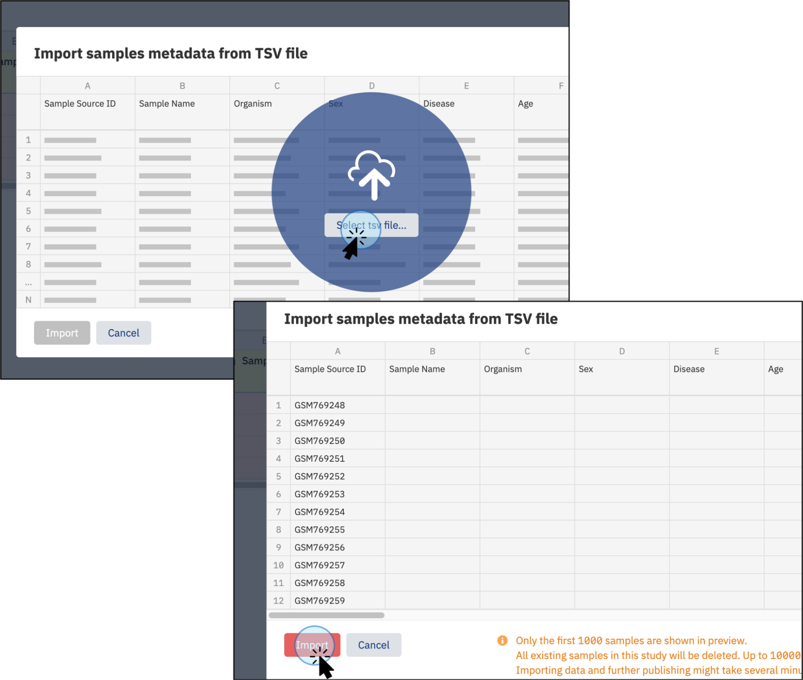
<figcaption>Click <strong>Select tsv file...</strong> to select the desired file from your local computer. Once the file is recognized, click "Import" to upload it</figcaption>

* Ensure the changes are saved by clicking **Publish**.
* In the resulting pop-up box, enter the preferred name, label, or description for the activity you just performed to add it to the version log, e.g., **Sample Metadata has been added**. Refer to the section [Metadata Versioning](versioning.md) to learn more about versioning. 

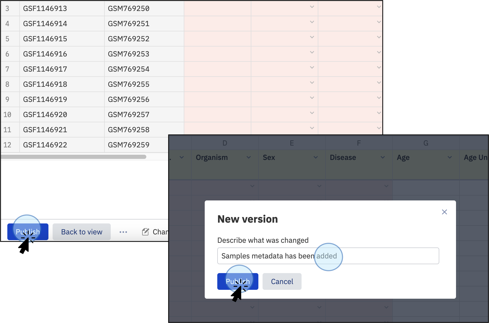
<figcaption>Once the sample metadata file has been imported, click <strong>Publish</strong> to save the changes. Save the changes by adding a name to this new version, e.g., <strong>Samples metadata has been added</strong>. The version names can be customized with names, dates, descriptions, etc.</figcaption>

## Import Libraries and preparations

**Add Libraries and Preparations**:

In addition to sample metadata, you can also add Libraries and Preparations metadata. To do so, click on the tab **\+More** to display both options:

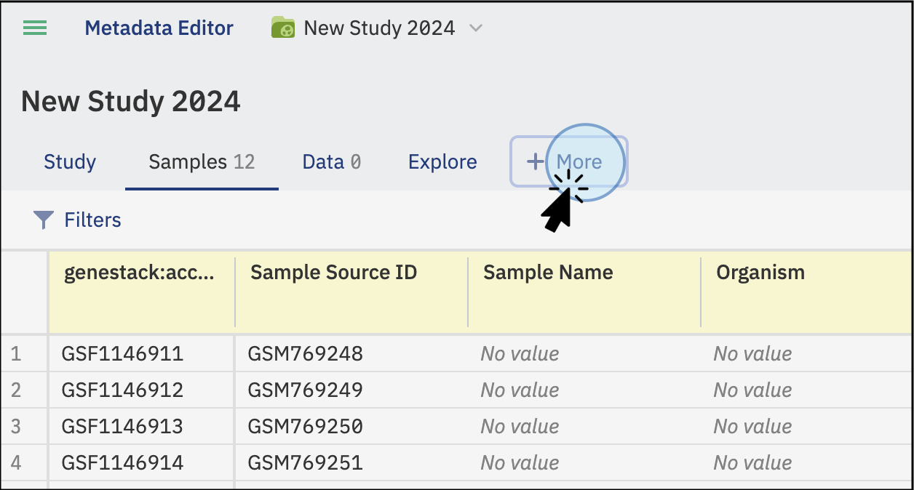
<figcaption>Click on the option <strong>+More</strong> to add Libraries and/or preparation metadata</figcaption>

* To add libraries, click on **Libraries** and select the tabular file to import from your local computer.
* To add preparations, click on **Preparations** and select the tabular file to import from your local computer.

Both types of files are linked to the samples metadata file (from the Samples tab) via the **SampleSource ID** column. Ensure this column is included in all files to maintain the link between sample metadata, libraries, and preparations.

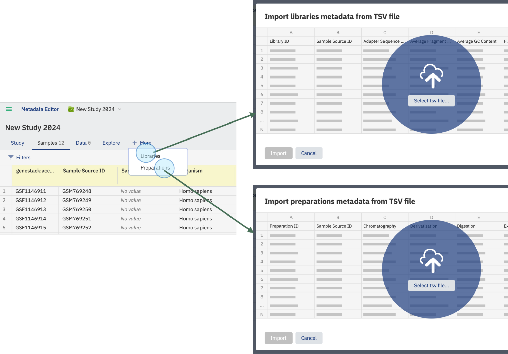
<figcaption>Click on <strong>+More</strong> to add additional metadata to your study, such as Libraries and Preparations metadata. This step is optional</figcaption>

**Link Metadata Files:**

* Ensure that the **Sample Source ID** column is included in all files to maintain the link between sample metadata, libraries, and preparations.
* Additionally, include the **Library ID** column for libraries and the **Preparation ID** column for preparations to ensure proper recognition and linking of the data.
* Once the data is recognized and linked via these columns, the new metadata tabs will display the recently added data

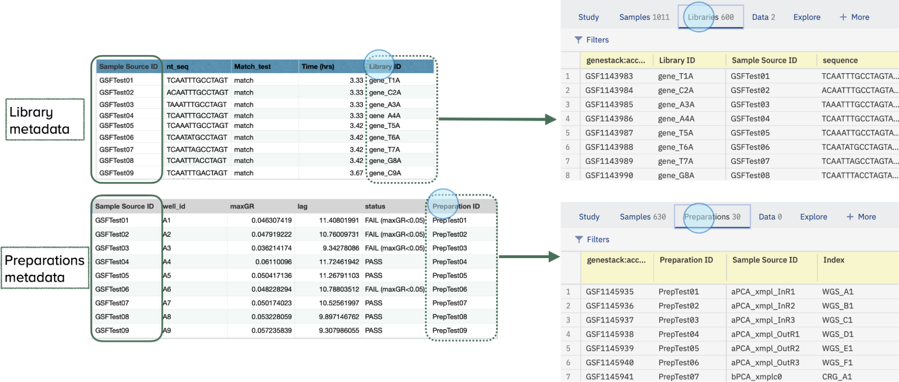
<figcaption>Additional experimental metadata, such as libraries and preparations, can be added and linked. Ensure the appropriate columns, besides <strong>Sample Source ID</strong>, are included to link the data. For libraries, add the <strong>Library ID</strong> column, and for preparations, add the <strong>Preparation ID</strong> column. The data will be shown on the study's main page</figcaption>

Learn more about data types in the [supported formats section](supported-formats.md).

## Import experimental Data and attach files

In addition to the samples, libraries, and preparations metadata described above, you can upload experimental data that is linked to your study via sample metadata and libraries/preparations. You can also supplement your study by attaching related research materials like PDFs, XLSX, DOCX, PPTX files, images, and more. Please note, the contents of these attached files won't be indexed or made searchable.

**Data Type (Data Class)**: Identify the data type you want to upload. Multiple types are supported:

- Bulk transcriptomics - Supports data provided in TSV or GCT 1.2 format.
- Single cell transcriptomics - Supports data provided in TSV format.
- Differential abundance (FC, pval, etc.) - TSV format.
- Pathway analysis - TSV format.
- Proteomics - TSV format.
- Single cell proteomics - Supports data provided in TSV format. 
- Metabolomics - TSV format.
- Lipidomics - TSV format.
- Epigenomics - TSV format.
- DNA methylation - TSV format.
- Chemoinformatics - TSV format.
- Imaging features - TSV format.
- Gene panel data - TSV format.
- Biomarker data - TSV format.
- Physical measures - TSV format.
- Blood counts - TSV format.
- Other body fluid counts - TSV format.
- Nanopore - TSV format.
- Gene variant (VCF) - VCF format.
- Flow Cytometry - FACS format.
- Other - TSV format.

To upload experimental data or attach files, navigate to the **Data Tab**

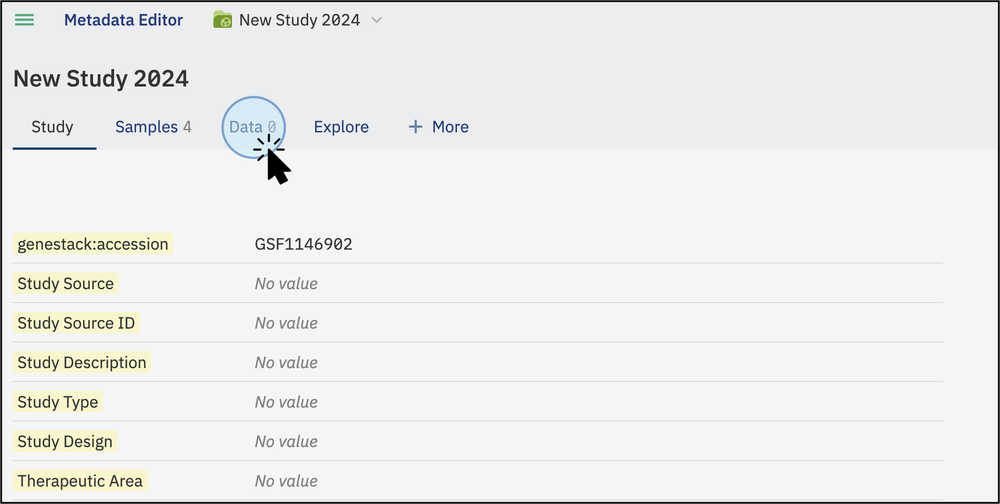
<figcaption>Click on the Data tab to access options for uploading experimental data and attaching additional files</figcaption>

* On the Data tab, click on the **Add data** button. This will open a new window where you can select the action to perform: import data or attach a file.

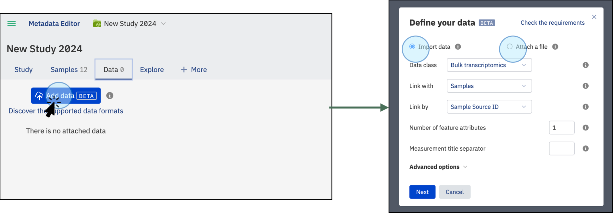
<figcaption>Click on the <strong>Add data</strong> button to choose between importing experimental data or attaching additional files to your study</figcaption>

### Import Experimental Data

You can upload your experimental data, such as bulk transcriptomics, proteomics, chemoinformatics, and more, in a supported tabular format like TSV, GCT, VCF, or FACS. The contents of the uploaded file will be indexed and searchable.

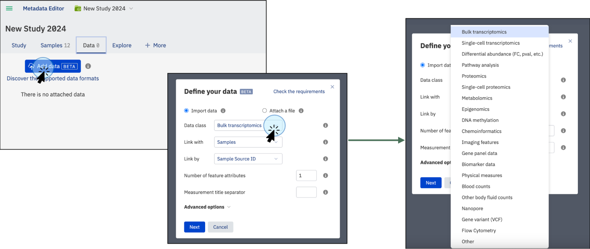
<figcaption>Import experimental data linked to your study by clicking on the <strong>Add data</strong> button, then selecting <strong>Data class</strong> to choose the type of data to import. If the type of data is not listed, select the <strong>Other</strong> option</figcaption>

* Click "Next." This will open a window where you can select a file containing experimental data from your local computer or a cloud-based storage system (such as AWS).

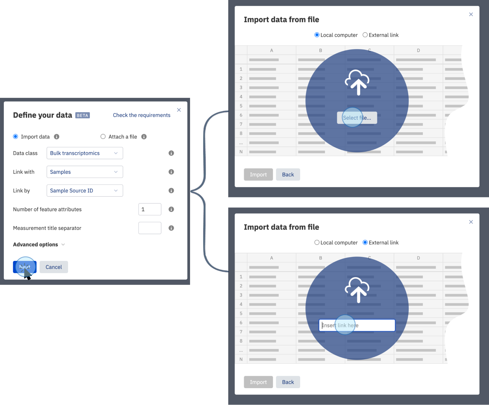
<figcaption>Select the source for the experimental data. Experimental data can be imported from your local computer or a cloud-based storage system (such as AWS)</figcaption>

### **Linking Data**

* **Default Linking**: By default, the data is linked with the Samples file using the **Sample Source ID** column. To ensure proper linking, make sure your file includes a column called **Sample Source ID** with the same IDs used in the Sample Metadata table uploaded previously (see section "Import Samples Metadata").
* **Custom Linking**: Alternatively you can select a different column to link the **experimental** data, such as **Sample Name**, **Date**, etc. This provides flexibility in how data is associated, but it is recommended to include the **SampleSourceID** column for consistent referencing and linking samples metadata files with additional data types like libraries and preparations. Read the [Supported format files](https://docs.google.com/document/d/1uF3g11QO3PfyhsSY7u0CPozn0LPRsoblnI2djZydvIs/edit?usp=sharing) section for more information.

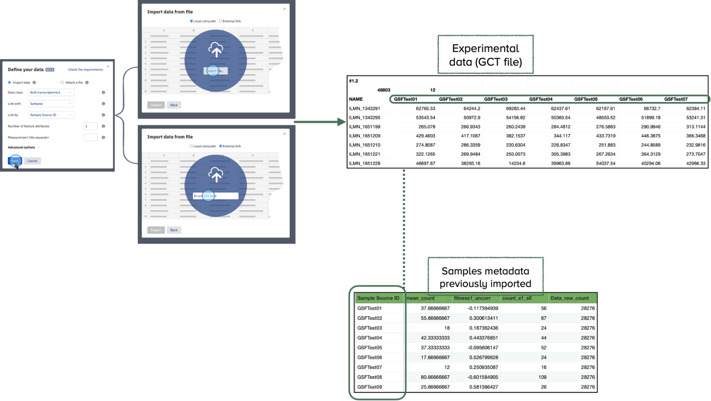
<figcaption>Select an experimental data file. The data must include a column to be linked to the sample metadata file (typically the <strong>Sample Source ID</strong>)</figcaption>

The selected files will be scanned to find an appropriate link (typically the **Sample Source ID** column) and the uploading will automatically begin.

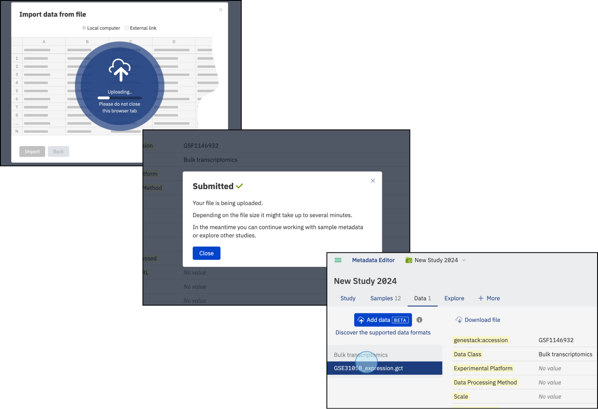
<figcaption>The selected files will be scanned, and if the format is accepted and the columns contain the reference names to be linked, the files will be indexed and the experimental data will be searchable</figcaption>

After uploading, you can populate the corresponding file metadata, including the necessary details. Please note that each uploaded data file has five mandatory read-only fields that do not belong to your template:

- Genestack:accession
- Data Class
- Features (string)
- Features (numeric)
- Value (numeric)

These fields are implemented to make the content of these files visible and searchable for data science users. We advise against editing these fields in the template editor as it could render these files inaccessible.

### Attach a file

In addition, supplement your study by attaching related research materials like PDFs, XLSX, DOCX, PPTX files, images, and more.

Attachment of additional files is different from linked files, allowing you to add files that are part of your research but not directly linked to the samples metadata or experimental data. These files may contain budget reports, manuscripts, presentations, logos, etc. This tool helps you keep all your data in one place.

!!! note
    The contents of the attached files will not be indexed or made searchable

To attach a file:

* Click on **Add data** and then select **Attach a file**.
* You can attach any format files such as PDF, PNG, etc.
* Click **Select file...**. Select the file from your local computer

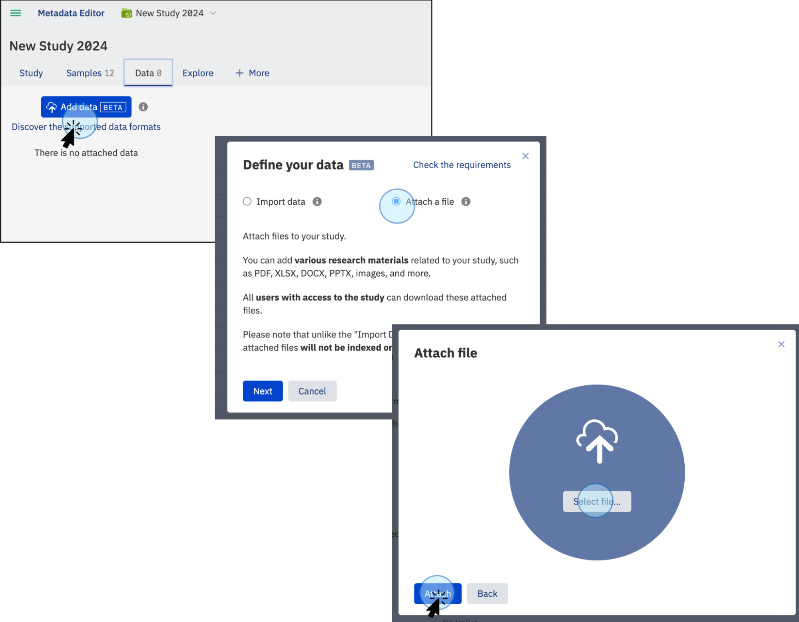
<figcaption>The files will be uploaded (upload time will depend on the size of the files). Your files will be displayed in the Data tab under <strong>Attached Files</strong>.</figcaption>

Once the files are selected, the upload will begin and the files will be attached. Available data will be displayed in the Data tab by type: **Experimental** (e.g., bulk transcriptomics) and **Attached files** (e.g., manuscripts, reports).

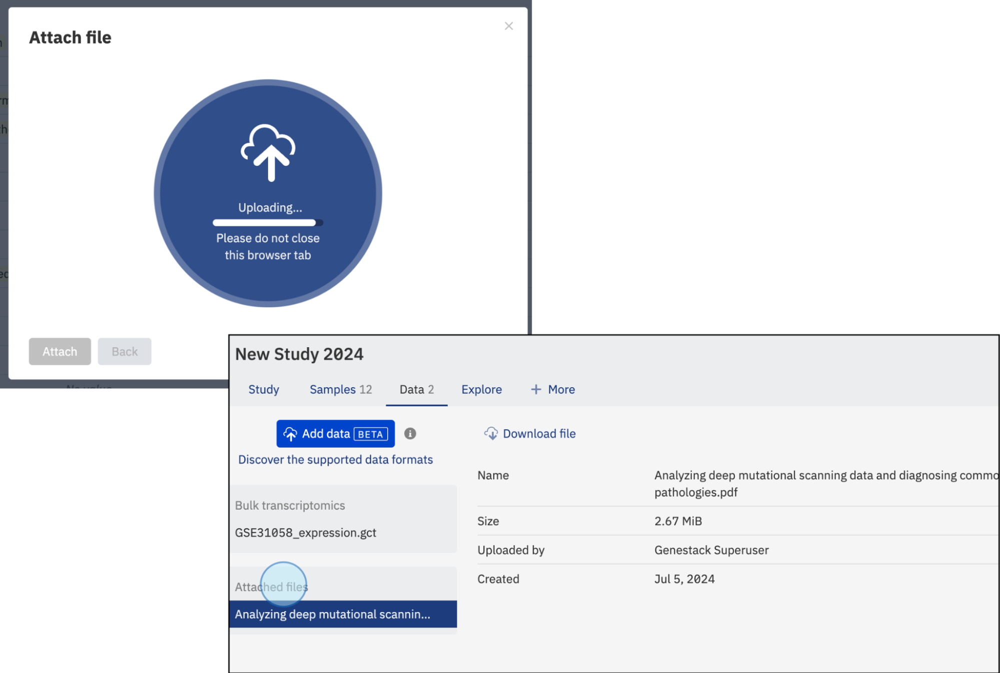
<figcaption>Once attached or linked, files will be shown on the Data tab under their specific category, e.g., <strong>bulk transcriptomics</strong> for experimental data and a manuscript (PDF format) for attached files</figcaption>

## Important Considerations for Data Import

* **Choose the Correct Data Class**: Ensure you select the appropriate data class for your dataset. The ability to add custom data classes and modify the selected data class after upload will be available in future releases.

* Select the entity to which your data will be linked. For example, when uploading a transcriptomics file with gene expression measurements for each sample, link the data to the relevant samples. Specify the ID column from the Samples (or Library, Preparation) tab that will be used to match the samples (or libraries, preparations) in the uploaded file.

!!! note
    You need to have sample information (metadata) uploaded in the **Samples** tab to enable data import. If no libraries or preparations are associated with the study, **Sample** will be the only available option.

* **Libraries and Preparations**: Libraries and preparations are connected to the samples via the **SampleSource ID** column. Ensure this column is included in all relevant files to maintain the linkage between sample metadata, libraries, and preparations.

* **Number of Feature Attributes**: If your file includes more than one column describing features, specify the number of such columns. You can find more details on this in the format description page. Defining the correct number of feature attributes is essential to avoid upload issues.

* **Advanced Options** – **Allow Re-importing the Same File**: This option allows you to re-upload the same file from external storage platforms (e.g., AWS S3) using the same link. If uploading the file from a local computer, enabling this option is unnecessary.

* **Multiple Measurements per Sample**: If your file contains multiple measurements per sample (or library, preparation), such as fold change and p-value, the system will automatically recognize this based on the following criteria:

	•	**Measurement Separator Symbol in Column Name**: Each column name must contain a symbol (or symbol combination) that separates the sample (or library, preparation) name from the measurement type. For example, a dot in ‘Sample1.p-value’. If there are multiple separators (e.g., ‘Sample1.p.value’), the first one will be used for separation.

	•	**Measurement Separator Symbol on Upload Request**: This separator must be explicitly specified during the upload request, either via API or GUI.

	•	**Presence of the Separator Symbol**: All column names must include the measurement separator.

	•	**Consistency of Measurement Types**: Ensure all samples (or libraries, preparations) have consistent measurement types. For instance, if you have three samples and each has measurements for intensity and quality pass, your file should contain columns such as: ‘Sample1.Intensity’, ‘Sample1.QualityPass’, ‘Sample2.Intensity’, ‘Sample2.QualityPass’, etc.

* **File Upload Errors**: If the file contains issues preventing ODM from processing it correctly, an error message will provide details about the problem. These errors are often related to file format inconsistencies. For more assistance, refer to the [Supported File Formats](supported-formats.md) section or contact Genestack’s customer care team. 
* Failed file uploads will remain visible for seven days before automatic deletion.

Following these guidelines will help ensure a smooth and error-free data import process. Pay careful attention to the data class, linking strategy, and file format requirements to avoid common issues.

If you encounter any problems or need additional support, don’t hesitate to consult the relevant sections of the User Guide or reach out to Genestack team for assistance.  
