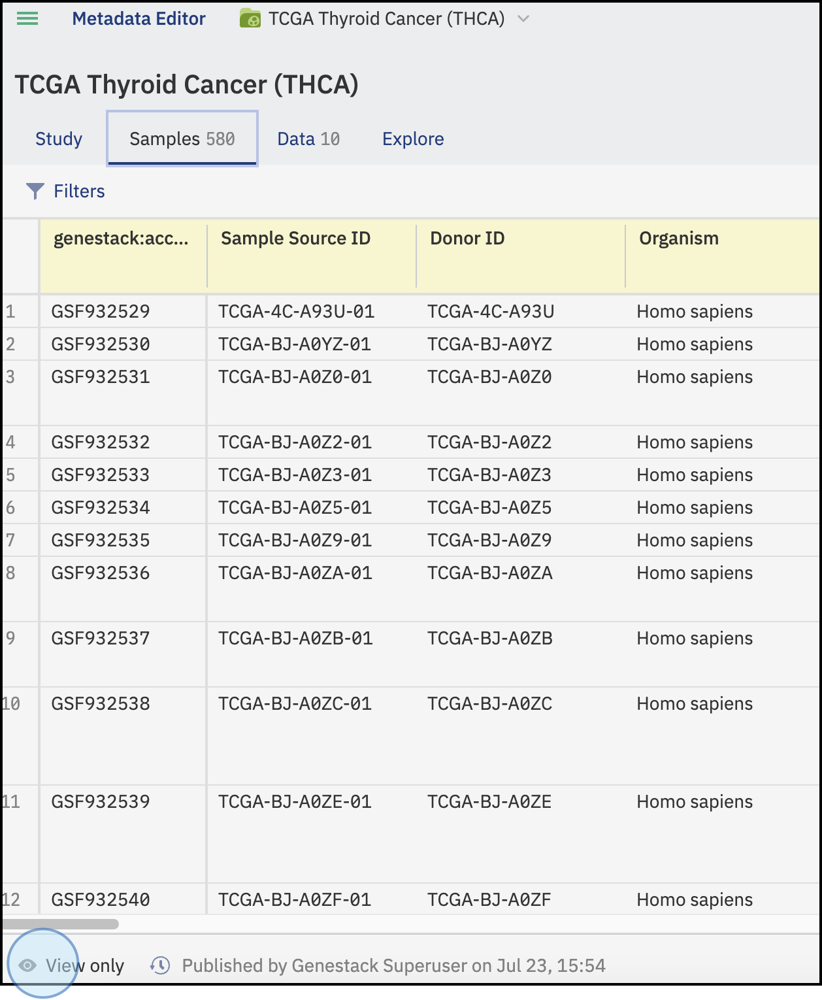

# Metadata Editor

The Metadata Editor allows you to explore study, sample, data information, and associated metadata.

## Accessing the Metadata Editor

To open the Metadata Editor, click on **Browse Studies** and select the study of interest. You can apply filters or use keywords to search for specific studies.

<figcaption>Access the available studies in ODM (based on your permissions) by clicking Browse studies on the main dashboard (A), or by clicking on the top left menu and selecting Study Browser</figcaption>

## Exploring the Metadata Editor

Once you have selected the study, click on its title to open and explore the metadata.

!!! info
    For more information on study browsing, filters, and bookmarked studies, refer to the [Study Browser](studybrowser.md) section.

<figcaption>Explore studies. Apply filters and click on the selected study to explore it further</figcaption>

## **Study**

This tab shows the study metadata, including:

* **Genestack:accession** number (automatically assigned)
* Metadata regarding the study type, design, and contributor details (name, email, country, etc.).

!!! note
    The yellow highlighted fields indicate metadata currently checked against your currently applied data template and non-highlighted fields are not checked against the template. For more information click on the [Template Editor](template-editor.md) section

<figcaption>Overview of the Study Tab. The tab includes the study metadata details. Data in yellow represents metadata currently checked against the applied template</figcaption>

## Samples

This tab contains all the sample metadata that are associated with this study. The information regarding the samples is displayed with columns representing features and rows representing samples. Key columns include:

* **Genestack:accession number**: Automatically assigned to each row.
* **Sample Source ID**: A unique identifier linked to the experimental data.

<figcaption>Overview of the Samples tab. This section shows the sample metadata. The attributes (columns) highlighted in yellow represent the metadata currently checked against the template</figcaption>

## Data

This tab details the files linked or attached to the study. It includes:

* Details of the indexed data files linked (e.g., transcriptomics, pathways, proteomics, any TSV file)
* Information on data attached in any format
* Metadata of the study, including platform, path, version, etc
* Details of non-indexed file attachments (e.g., PDF, PPT)

<figcaption>Overview of the Data tab. The Data tab contains the linked experimental data and attached files</figcaption>

## Limitations to the Metadata Editor

All users, can explore data, visualize data, and export data. However, if you are not part of the **Curator group**, you cannot make edits or curate data. These functionalities are reserved for Curators. 

Learn more about users and permissions in the [User Setup](setup.md) section.

<figcaption>All users can access studies and explore the tabs. However, only members of the curator group can view, make edits and curate data</figcaption>