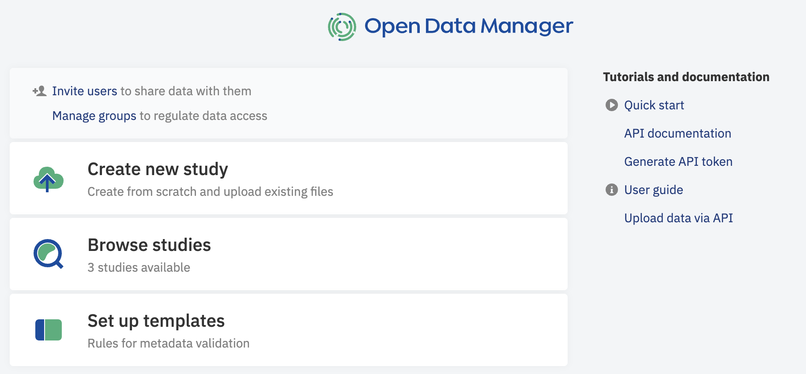
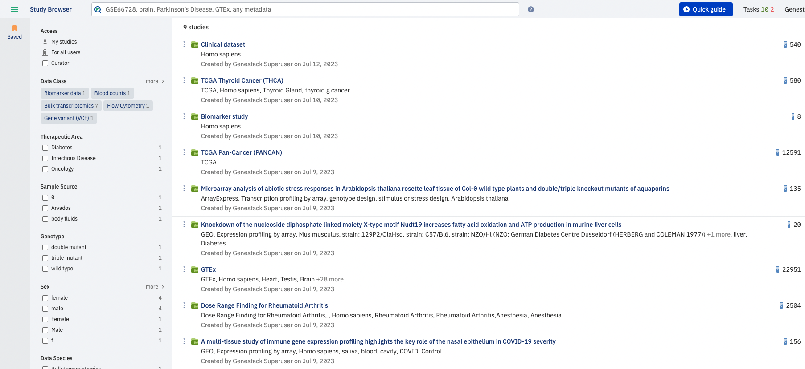

# Start

The first thing you see when logging in to Open Data Manager is the Dashboard:

## Dashboard

As a regular user the main tasks of interest are searching and browsing studies. Clicking on the **Browse studies**
link from the dashboard takes you to the Study Browser to help you do this.

## Study Browser

!!! info "Limitation"
    Only Studies you have permission to observe (Studies created by you or Studies shared with your group of users 
    by another user) are displayed as default. 

There is search and filtering options to help you find studies of interest.
Facets in the left hand panel of the Study Browser and Search bar allow you to search by study name, accession or
by any value presented in any metadata field.

!!! tip
    Harmonising your Study and its child entities (Samples, Libraries, Preparations, Data) Metadata values by using 
    configurable validation rules helps you to find all relevant values by preventing missed results due to 
    non-standard terms usage.

The search is also controlled vocabulary/ontology aware and will expand results to include synonyms, with optional extension to include child terms. You can use asterisks (\*) to allow any positive number of wildcard characters: “*ale” will find “male” and “female” for example. Click on the question mark next to the search bar to open \*\*Help\** with more details about advanced search functionality.

The facets beneath the search bar allow you to filter down the results of a search based on the samaple data (metadata) fields that
are present in your results.

To access more details about a study and to explore it further click the name of the study which will launch
the Metadata Editor in a new tab.

## Metadata Editor

The Metadata Editor allows you to see all the information about a study, the samples contained in the study and any
signal data types associated with the study, for example, expression or variant data.
