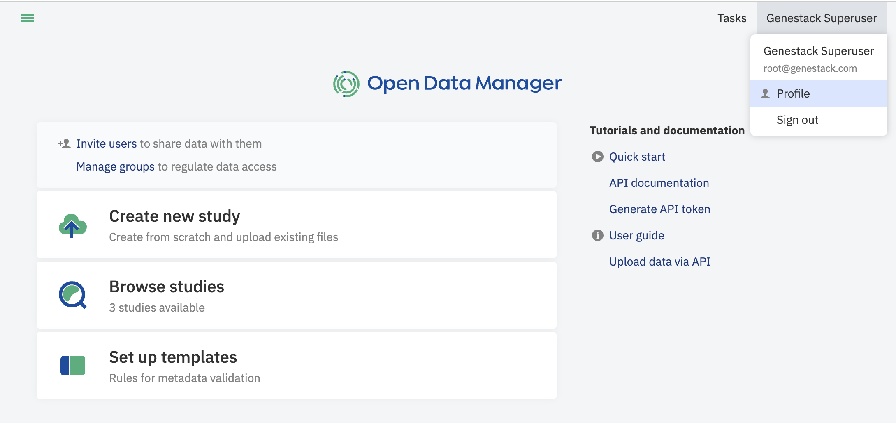
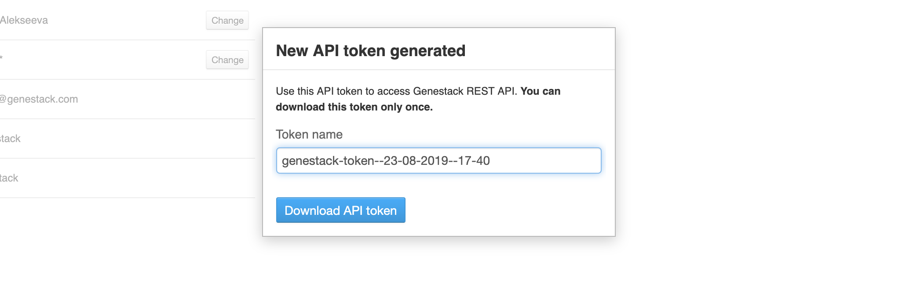
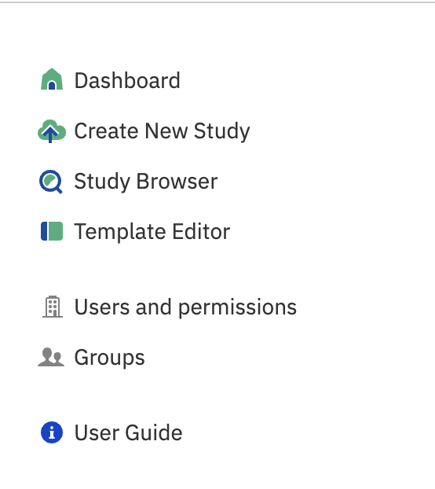
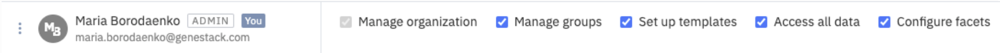
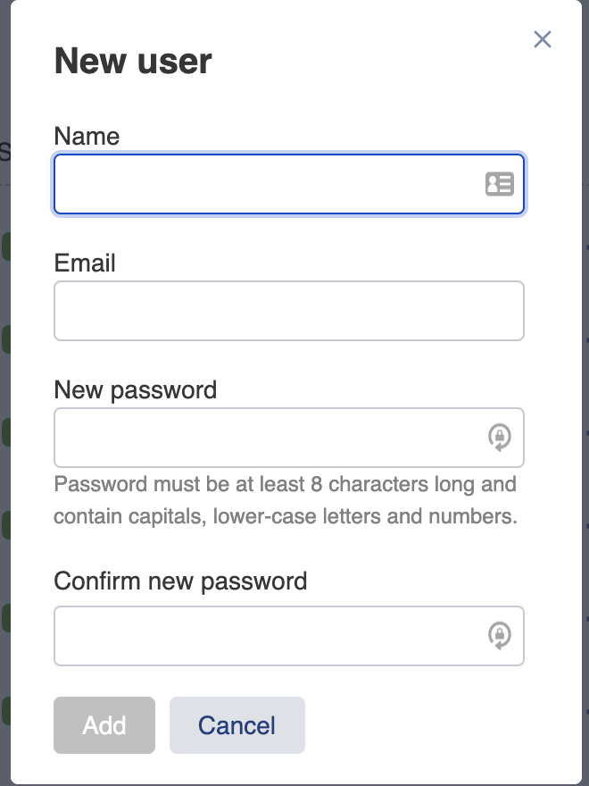
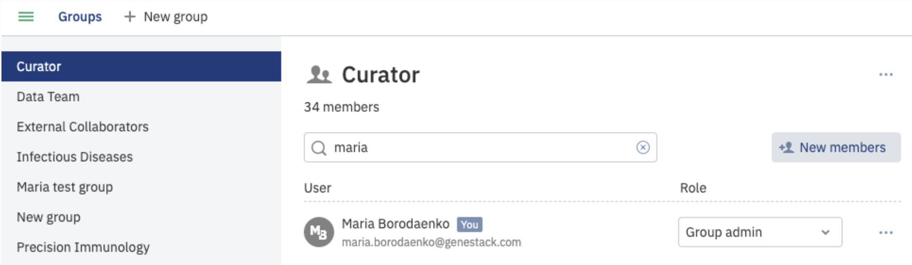
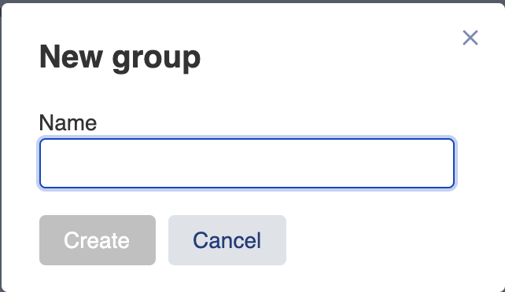
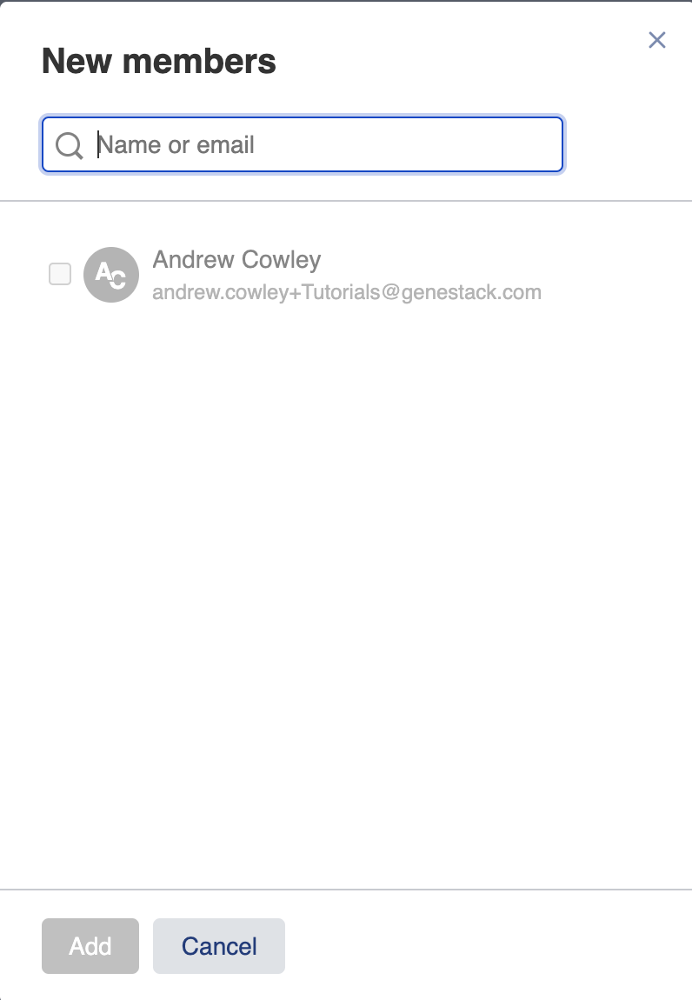

# User setup

## Profile

To explore and customize your account, click on your username (your email address)
in the top-right corner of the page and, then, select the menu item **Profile**.

On the opening page you’ll find the following sections:

- The first section contains your personal information, whether you are an admin and/or a curator user and which groups you belong to. You can click the group name to taken directly to the group in the Manage Users application.
- The  **API tokens** section is where you can download an access-token which allows the use of scripts/APIs. Learn more about how to generate Genestack REST API tokens in the section [Getting a Genestack API token](getting-a-genestack-api-token.md#token-label).

After you click **Generate new token** an email is sent to your email address. To generate the API token,
follow the link specified in the email. You can rename or delete previously generated tokens in your profile.

## Users and permissions

The **Users and permissions** page allows you to get an overview of the existing users in your organisation,
to create new users and assign permissions to manage the organization, templates and facet configuration. This page is accessible only if you have permission to manage the organization.

In order to open the application, you can use the shortcut menu and select **Users and permissions**.

On the page you can change passwords of the users by clicking the three dots icon, control if the account is active, has permission to manage the organization (add/deactivate users, manage their permissions), whether they can edit and manage templates, including setting the default template, and whether they can configure the facets that appear in the study browser.  “Manage groups” permission allows users to access and manage all existing groups, even if you are neither an admin nor a member of the group. It is recommended for integration purposes. “Access all data” provides access to all studies in the system including the private ones which have not been shared. The permission is recommended for integration purposes.

To create a new user, click on the **+ New user** button. In the pop-up window specify their name, email and starting password.

After the user is created they can log in using the specified credentials.

## Groups

**Groups** are used to share studies with other users, so that they are accessible for all members
of that group. Any user can create one or several groups and invite their collaborators.

Depending on the role a users has, they can have different privileges in sharing process and managing the group, namely:

- *Group member* — have an access to the shared files but also can share data (only if the user is the study owner);
- *Group admin* — in addition to the sharing user rights, can invite or remove users and change their privileges.

By default, you’ll be a group administrator of any group that is created by your user.

For more information on using groups and sharing files, see the section [Sharing Studies](sharing.md#sharing-label).

The **Groups** page lets you to view the list of groups you are a member of as well as their other members,
and manage them according to your privileges.

Click **Groups** in the short-cut menu to navigate to the Groups page.

If you are an administrator of your organisation, you’ll see a group “Curator” automatically created for you.
“Curator” group is a special group granting edit permissions to its members. Members of the Curator group can import new studies and edit any study shared with them.

If a user is not a member of the “Curator” group they are considered as researchers and are able to browse available studies and retrieve data, but not contribute to it.

Regardless of your role in your organisation, if you have no groups yet, you can create one by clicking **+ New group**.
In the pop-up window that appears you’ll be asked to give the group a name.

After the new group is created you can invite other users to join by clicking on **New members**.
You can also delete the created group by clicking on **Remove group**. If a group contains members you need to remove the members from the group before you can delete it.

In the dialog that appears, you’ll be prompted for the new member email.

By default new users are added to the group as group members. You will be able to change their role to group admin.
