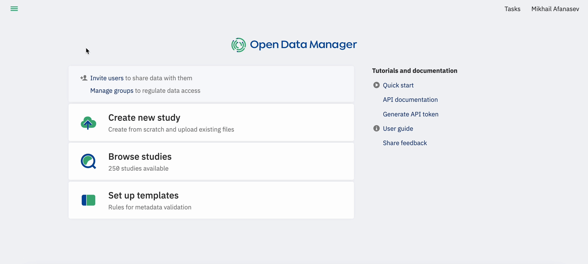
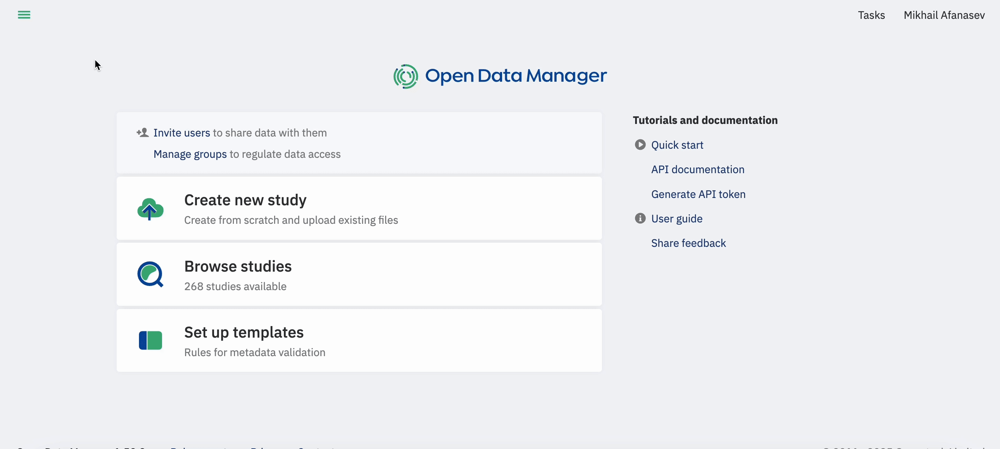
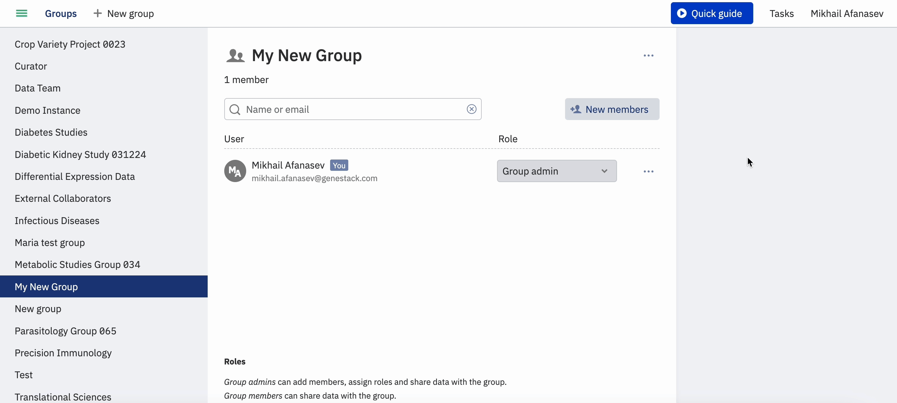

# Users and Groups

## Accessing Your Profile and Permissions

Explore and customize your account by accessing the profile section.

1. Log into the ODM:
    - Navigate to the ODM homepage.
    - Click on your profile (top right of the main page)
2. Explore Permissions:
    - Click on Profile to access information regarding your user permissions.
3. A new window will display indicating if you are an admin and the groups you are part of. 
This window also allows you to change your password and edit details.
4. View Existing Tokens and **Create a New Token**. In the new window, you will see any previously created tokens that 
you can rename or delete if needed. Click on **Create a New Token** to create a new one. Refer to the 
section [Getting a Genestack API token](../doc-odm-user-guide/getting-a-genestack-api-token.md) for more information.


## Create/Deactivate users

TBD

## Users and permissions

Understanding the roles, capabilities, and permissions within ODM is crucial for effective data management and 
collaboration. Each permission defines specific actions users can perform, such as creating, editing, or deleting 
groups, and managing templates. Users must have the appropriate permissions to carry out these actions, ensuring a 
secure and well-organized data environment.

### Available Permissions

There are five permissions available in the system. Descriptions of the permissions are displayed when you 
hover over the mouse.

1. **Manage organization**: Create and deactivate users, change their passwords, and grant permissions.
2. **Manage groups**: Access and manage all existing groups, even if you are neither an admin nor a member of the group. 
This permission is particularly recommended for integration purposes, where centralized management of group 
permissions across systems is required
3. **Set up templates**: Create and modify templates.
4. **Access all data**: Access all studies in the system. This permission is recommended for integration purposes, 
enabling comprehensive data access for system-wide operations and integrations.
5. **Configure facets**: Set the desired list and order of filtering facets in the Study Browser for all users 
on the instance.

### **Setting and Managing User Permissions**

To set or change user permissions, you need to have the **Manage organization** permission:

1. **Accessing the Permissions Menu:**
    * On the main dashboard, click on the three-line menu button at the top left. 

    !!! warning "Permissions required"
        If you have the **Manage organization**
        permission, this menu will display the option **Users and Permissions**. If you do not have this permission,
        the option will not be available.

2. **Managing Permissions:**
    * If you have access, click on **Users and Permissions**. This option will open a new window where you can see all 
the users within your organization. You can grant or revoke permissions by ticking the corresponding boxes for 
options such as **Manage groups**, **Set up templates**, **Access all data**, and **Configure facets**.
    * Use the search bar to find users you want to grant or revoke permissions to. 
    * Hover over the permissions to view a brief description of the permissions capabilities.


     
## Groups

User Groups in ODM facilitate collaboration and data sharing, representing departments, project teams, or any other
preferred structure.

To view the list of available Groups in your instance, click on the three-line menu at the top left of the dashboard. 
A menu will appear; select <strong>Groups</strong> This option is available to all users, regardless of their permissions.

The new window will display a list of available groups in your instance. Click on each group to view its members. This
window also shows the primary roles within each group: the **Group Administrator**, who can add members, assign roles, 
and share data with the group, and **Group Members**, who can share data with the group.

You can also add new members to groups or create new groups. See the instructions below for more details.

### Permission limitations
!!! warning "Permissions required"
    To manage groups (create, edit, or delete), you must have the **Manage Groups** permission.

The Groups page in ODM provides a list of all groups to which a user belongs. However, user capabilities are restricted 
based on their assigned permissions. Below are the key limitations depending on user permissions:

1. **Access to Groups:**
    * With Manage Groups permission: Users can access all groups within the system, irrespective of their membership status.
    * Without permission: Users can only access groups of which they are members.
2. **Creating a New Group:** Any user can create a new group through the user interface or via API endpoints.
3. **Adding or Removing Members from a Group:**
    * With Manage Groups permission: Users can add or remove members from any group.
    * Without permission: Users can add or remove members and edit roles only within groups they belong to.
4. **Deleting a Group:**
    * With Manage Groups permission: Any user can delete any group through the interface.
    * Without permission: Users can only delete groups they are a part of.

### Creating a Group

A new group can be created in ODM in two main ways:
1. **Manually via the interface**
2. **Using API endpoints**

#### Creating a Group Manually via the Interface

To create a new group manually, follow these steps:

1. **Access the Groups Section**
    * Click on the three-line menu button at the top left of the dashboard to access the `Groups` section.

2. **Create a New Group:**
    * In the Groups window, click on the **\+New Group** button at the top of the window.
    * Enter a name for the new group in the new window that appears.
    * Click "Create" to finalize the creation of the group.
    * A new window will be displayed showing the new group has been created. By default, the user who creates the new 
group is assigned as the **Group Admin**. It is important to notice that each group requires at least one group admin.



#### Creating Groups Using SCIM API (Automated Access Management)

In ODM, you can create, update, and delete groups using API endpoints. While you typically need the **Manage Groups** 
permission to manage groups you’re not a member of, you can still create or manage your own groups without this 
permission. For example, a Public user can create, update, and delete groups using endpoints from the scimGroup 
section. Permissions and access follow the same rules as those in the GUI.

Follow these steps to create a group via API endpoints.

1. Familiarize yourself with the API endpoints and ensure you have an active token. 
Refer to the section [Getting an Genestack Token](../doc-odm-user-guide/getting-a-genestack-api-token.md) 
to learn more about API tokens and authorization.
2. Select the **scimGroups** definition to manage groups.
3. To create a new group, choose the endpoint "**Add a new user group**" `POST /api/v1/scim/Groups`.
4. Prepare the JSON request according to SCIM 2.0 Specification. Specify the name of the new group. Provide Groups Name in `"displayName"` parameter. 
Use the following schema to execute the endpoint:

      ```json title="Request POST /api/v1/scim/Groups"
      {
        "displayName": "displayName", //(1)
        "schemas": [
          "urn:ietf:params:scim:schemas:core:2.0:Group",
        ]
      }
      ```
   
      1. Provide desired name of your Group here

5. From terminal you can use the following curl:

      ```json title="Curl"
      curl -X 'POST' \
         'https://instance-name.genestack.com/api/v1/scim/Groups' \ //(1)
         -H 'accept: application/scim+json' \
         -H 'Genestack-API-Token: "your-genestack-token"' \ //(3)
         -H 'Content-Type: application/json' \
         -d '{
         "displayName": "displayName", //(2)
         "schemas": [
           "urn:ietf:params:scim:schemas:core:2.0:Group",
           "urn:ietf:params:scim:schemas:core:2.0:Group"
           ]
      }'
      ```
      
      1. Your instance name here before `.genestack.com/api/v1/scim/Groups`
      2. Provide desired name of your Group here
      3. Your Genestack API Token here

6. The response will confirm that the group has been successfully created, including details such as the group's ID
   and creation date:

      ```json title="Responce from POST /api/v1/scim/Groups"
      {
       "schemas": [
        "urn:ietf:params:scim:schemas:core:2.0:Group"
       ],
       "id": "autogenerated-genestack:accession", //(5)
       "meta": {
         "resourceType": "Group",
         "created": 1741631396000, //(1)
         "lastModified": 1741631396000 //(2)
        },
        "displayName": "groupName", //(3)
        "members": [
          {
            "value": "1",
            "display": "your-userName", //(4)
            "$ref": "/Users/1"
          }
        ]
      } 
      ```

      1. Date and time of Group creation
      2. Date and time of Group last modification
      3. The name of the Group that you have placed to the request 
      4. Your ODM profile name
      5. Autogerated Group Accession (genestack:accession)

7. Verify that the group is active in ODM by searching for it in the Groups section. 
8. By default, the user who created the group is the only member and admin. Additional members can be added as needed.

## Managing Groups

Once you have created groups, you can edit details such as members, role members (group admin or group members), 
and delete groups.

To manage groups in the interface, navigate to the section Groups (instructions described above) and select the group 
you want to manage.

### Add New Members via Interface

* Click on the **\+New members** button to add members to the group.
* In the new window, you can select members from the list or use the search bar to find specific users.

**Confirm New Members:**

* After selecting the members, click **Add member** to confirm. The group will now display the recently added members.
  
### Edit Group Details

* You can edit the roles of group members by clicking on their role descriptions. You can change members to 
administrators or vice versa. Note that each group must have at least one administrator.
* To remove a member, click on the three dots next to their username.



### Update Group via SCIM API

1. Familiarize yourself with the API endpoints and ensure you have an active token.
   Refer to the section [Getting an Genestack Token](../doc-odm-user-guide/getting-a-genestack-api-token.md)
   to learn more about API tokens and authorization.
2. Select the **scimGroups** definition to manage groups.
3. To update a group, choose the endpoint "**Add a new user group**" `PATCH /api/v1/scim/Groups`.
4. Prepare the JSON request according to SCIM 2.0 Specification. You can use `add`, `replace`, `remove` operations.
For `id` param provide Group Accession number. Use the following schema to execute the endpoint:

      ```json title="Request PATCH /api/v1/scim/Groups"
      {
        "schemas": [
          "urn:ietf:params:scim:api:messages:2.0:PatchOp"
        ],
        "Operations": [
          {
            "op": "add", //(1)
            "path": "members",
            "value": [
              {
                "value": "10" //(2)
              }
            ]
          },
          {
            "op": "remove", //(3)
            "path": "members",
            "value": [
              {
                "value": "26" //(4)
              }
            ]
          }
        ]
      }
      ```
   
      1. Add a user to your Group
      2. User ID can be found by using SCIM API endpoint definition **scimUsers** with `GET /api/v1/scim/Users`
      3. Remove a user from your Group
      4. User ID can be found by using SCIM API endpoint definition **scimUsers** with `GET /api/v1/scim/Users`

5. From terminal you can use the following curl:

      ```json title="Curl"
      curl -X 'PATCH' \
        'https://instance-name.genestack.com/api/v1/scim/Groups/GSG000060'  //(1)
        -H 'accept: /' \
        -H 'Genestack-API-Token: your-genestack-token' \ //(2)
        -H 'Content-Type: application/json' \
        -d '{
        "schemas": [
          "urn:ietf:params:scim:api:messages:2.0:PatchOp"
        ],
        "Operations": [
          {
            "op": "add", //(3)
            "path": "members",
            "value": [
              {
                "value": "10" //(4)
              }
            ]
          },
          {
            "op": "remove", //(5)
            "path": "members",
            "value": [
              {
                "value": "26" //(6)
              } 
            ]
          }
        ]
      }'
      ```

      1. Your instance name here before `.genestack.com/api/v1/scim/Groups` + Group Accession (genestack:accession) starts grom `GSG`
      2. Your Genestack API Token here
      3. Add a user to your Group
      4. User ID can be found by using SCIM API endpoint definition **scimUsers** with `GET /api/v1/scim/Users`
      5. Remove a user from your Group
      6. User ID can be found by using SCIM API endpoint definition **scimUsers** with `GET /api/v1/scim/Users`

## Curator Group

The Curator group is a special group granting edit permissions to its members. Curators can import new studies and 
edit any study shared with them.

Only Administrators can add or remove members to the Curator Group. To Add new members, simply follow the instructions 
described in previous sections and select the User to add.

1. Briefly, navigate to the Groups section. Select the group **Curator**.
2. Click on **+New member** and select the member to add.
3. Confirm the changes.
4. Once the user is added, the title will be displayed on its profile.

Curators can explore, edit, and curate data. However, some limitations are set based on their permissions:

* **Curators with Manage Groups permissions**: Members of the Curator group with full edit permissions. 
Users can add or remove members of the Curator Group.

!!! danger "It is not advisable to delete the **Curator Group**, since Users need to be aware of potential changes"
