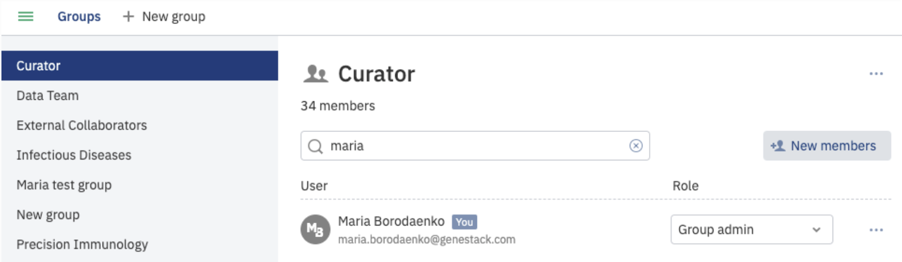
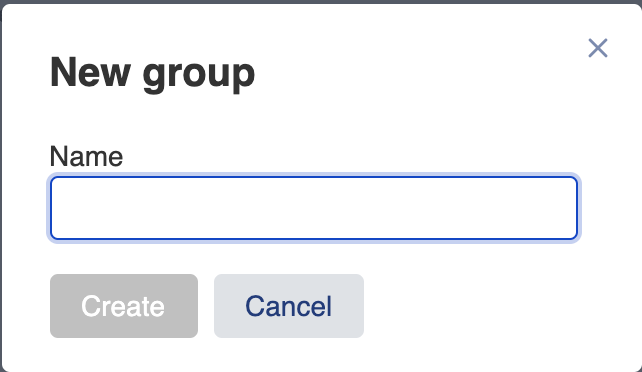
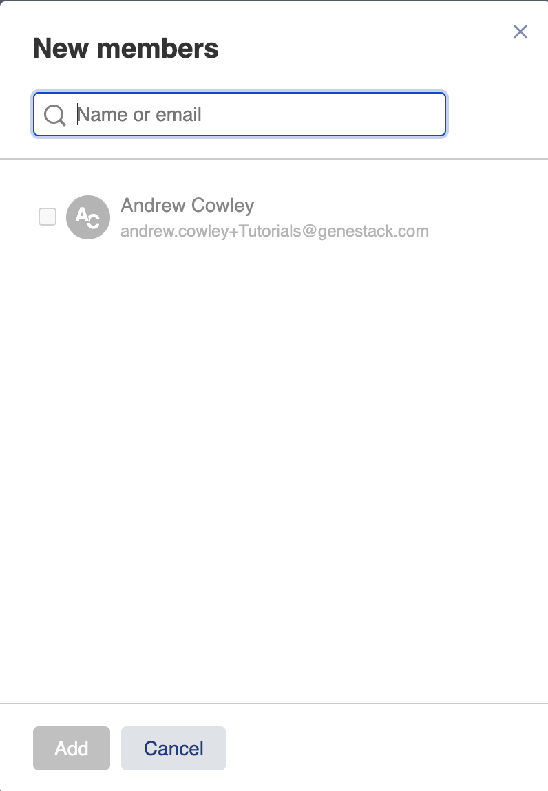

# Users and Groups

## Accessing Your Profile and Permissions

Explore and customize your account by accessing the profile section.

1. Log into the ODM:
    - Navigate to the ODM homepage.
    - Click on your profile (top right of the main page)
2. Explore Permissions:
    - Click on Profile to access information regarding your user permissions.
3. A new window will display indicating if you are an admin and the groups you are part of. 
This window also allows you to change your password and edit details.
4. View Existing Tokens and **Create a New Token**. In the new window, you will see any previously created tokens that 
you can rename or delete if needed. Click on **Create a New Token** to create a new one. Refer to the 
section [Getting a Genestack API token](../doc-odm-user-guide/getting-a-genestack-api-token.md) for more information.

## Create/Deactivate users

TBD

## Users and permissions

Understanding the roles, capabilities, and permissions within ODM is crucial for effective data management and 
collaboration. Each permission defines specific actions users can perform, such as creating, editing, or deleting 
groups, and managing templates. Users must have the appropriate permissions to carry out these actions, ensuring a 
secure and well-organized data environment.

### Available Permissions

There are five permissions available in the system. Descriptions of the permissions are displayed when you 
hover over the mouse.

1. **Manage organization**: Create and deactivate users, change their passwords, and grant permissions.
2. **Manage groups**: Access and manage all existing groups, even if you are neither an admin nor a member of the group. 
This permission is particularly recommended for integration purposes, where centralized management of group 
permissions across systems is required
3. **Set up templates**: Create and modify templates.
4. **Access all data**: Access all studies in the system. This permission is recommended for integration purposes, 
enabling comprehensive data access for system-wide operations and integrations.
5. **Configure facets**: Set the desired list and order of filtering facets in the Study Browser for all users 
on the instance.

### **Setting and Managing User Permissions**

To set or change user permissions, you need to have the **Manage organization** permission:
1. **Accessing the Permissions Menu:**
   * On the main dashboard, click on the three-line menu button at the top left. If you have the **Manage organization** 
   permission, this menu will display the option **Users and Permissions**. If you do not have this permission, 
   the option will not be available.
2. **Managing Permissions:**
   * If you have access, click on **Users and Permissions**. This option will open a new window where you can see all 
   the users within your organization. You can grant or revoke permissions by ticking the corresponding boxes for 
   options such as **Manage groups**, **Set up templates**, **Access all data**, and **Configure facets**.
   * Use the search bar to find users you want to grant or revoke permissions to.
3. Hover over the permissions to view a brief description of the permissions capabilities.
     
## Groups

**Groups** are used to share studies with other users, so that they are accessible for all members
of that group. Any user can create one or several groups and invite their collaborators.

Depending on the role a users has, they can have different privileges in sharing process and managing the group, namely:

- *Group member* — have an access to the shared files but also can share data (only if the user is the study owner);
- *Group admin* — in addition to the sharing user rights, can invite or remove users and change their privileges.

By default, you’ll be a group administrator of any group that is created by your user.

For more information on using groups and sharing files, see the section [Sharing Studies](sharing.md#sharing-label).

The **Groups** page lets you to view the list of groups you are a member of as well as their other members,
and manage them according to your privileges.

Click **Groups** in the short-cut menu to navigate to the Groups page.

If you are an administrator of your organisation, you’ll see a group “Curator” automatically created for you.
“Curator” group is a special group granting edit permissions to its members. Members of the Curator group can import 
new studies and edit any study shared with them.

If a user is not a member of the “Curator” group they are considered as researchers and are able to browse available 
studies and retrieve data, but not contribute to it.

Regardless of your role in your organisation, if you have no groups yet, you can create one by clicking **+ New group**.
In the pop-up window that appears you’ll be asked to give the group a name.

After the new group is created you can invite other users to join by clicking on **New members**.
You can also delete the created group by clicking on **Remove group**. If a group contains members you need to remove 
the members from the group before you can delete it.

In the dialog that appears, you’ll be prompted for the new member email.

By default new users are added to the group as group members. You will be able to change their role to group admin.
