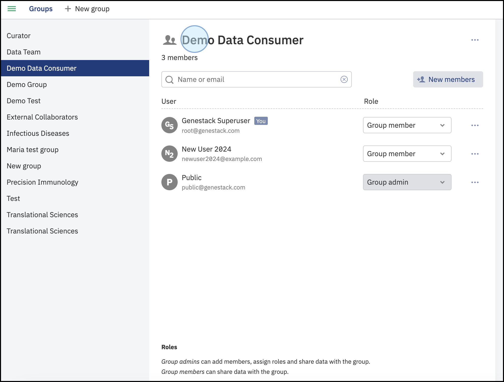
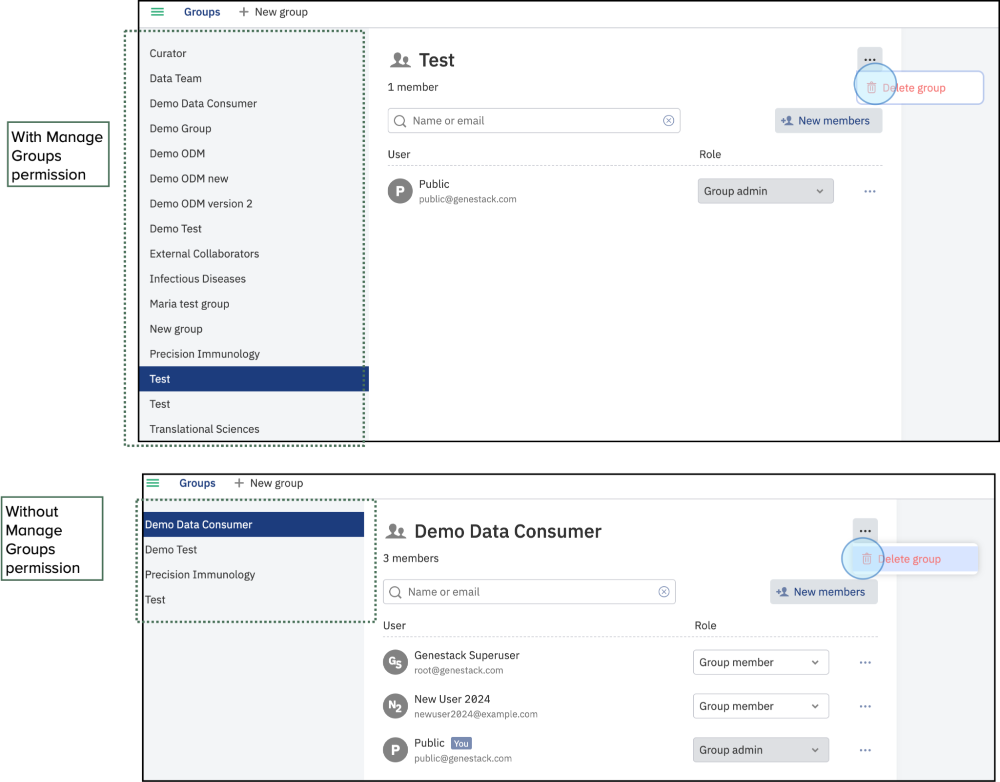

# User setup

## Accessing Your Profile and Permissions
Explore and customize your account by accessing the profile section.

1. Log into the ODM:
    * Navigate to the ODM homepage.
    * Click on your profile (top right of the main page)
2. Explore Permissions:
    * Click on **Profile** to access information regarding your user permissions.
   
   <figcaption>Main dashboard of the ODM. Click on your profile to access detailed information about your user capabilities
   </figcaption>

3. A new window will display indicating if you are an admin and the groups you are part of. This window also allows you to change your password and edit details.
   
   <figcaption>View of the users' profile. This window contains detailed information about the groups you are part of, the capabilities (admin and curator), and the active API tokens</figcaption>

4. View Existing Tokens and **Create a New Token**. In the new window, you will see any previously created tokens that you can rename or delete if needed. Click on **Create a New Token** to create a new one. Refer to the section [Getting a Genestack API token](https://odm.demo.genestack.com/user-docs/user-guide/doc-odm-user-guide/getting-a-genestack-api-token/) for more information
   
   <figcaption>The profile window shows the available tokens. You can rename or delete any existing tokens. To create a new token, click on the <strong>Create a new token button</strong></figcaption>

## Users and Permissions
Understanding the roles, capabilities, and permissions within ODM is crucial for effective data management and collaboration. Each permission defines specific actions users can perform, such as creating, editing, or deleting groups, and managing templates. Users must have the appropriate permissions to carry out these actions, ensuring a secure and well-organized data environment.

### Available Permissions

There are five permissions available in the system. Descriptions of the permissions are displayed when you hover over the mouse.

1. **Manage organization**: Create and deactivate users, change their passwords, and grant permissions.
2. **Manage groups**: Access and manage all existing groups, even if you are neither an admin nor a member of the group. This permission is particularly recommended for integration purposes, where centralized management of group permissions across systems is required
3. **Set up templates**: Create and modify templates.
4. **Access all data**: Access all studies in the system. This permission is recommended for integration purposes, enabling comprehensive data access for system-wide operations and integrations.
5. **Configure facets**: Set the desired list and order of filtering facets in the Study Browser for all users on the instance.

### **Setting and Managing User Permissions**

To set or change user permissions, you need to have the **Manage organization** permission:

1. **Accessing the Permissions Menu:**
    * On the main dashboard, click on the three-line menu button at the top left. If you have the **Manage organization** permission, this menu will display the option **Users and Permissions**. If you do not have this permission, the option will not be available.
   
   <figcaption>Access the Users and Permissions section by clicking on the three-line menu at the top left of the dashboard. (A) Only users with the Manage organization permission have access to the Users and Permissions section. (B) For users without this permission, the option will not be visible</figcaption>

2. **Managing Permissions:**
    * If you have access, click on **Users and Permissions**. This option will open a new window where you can see all the users within your organization. You can grant or revoke permissions by ticking the corresponding boxes for options such as **Manage groups**, **Set up templates**, **Access all data**, and **Configure facets**.
    * Use the search bar to find users you want to grant or revoke permissions to.
   
   <figcaption>View of the Users and Permissions panel. Tick the boxes to grant or revoke permissions: Manage organization, manage groups, set up templates, access all data, and configure facets. To manage individual permissions, find the user with the search bar</figcaption>

3. Hover over the permissions to view a brief description of the permissions capabilities

<figcaption>Hover over the permissions to view the description of it. For example, hovering over <strong>Manage groups</strong> shows that the permission allows the user:  <strong>Access and manage of all groups</strong></figcaption>

## User Groups

User Groups in ODM facilitate collaboration and data sharing, representing departments, project teams, or any other preferred structure.

### Description

To view the list of available Groups in your instance, click on the three-line menu at the top left of the dashboard. A menu will appear; select <strong>Groups</strong> This option is available to all users, regardless of their permissions.

<figcaption>To access Groups, click on the three-line menu at the top left of the dashboard. This will display a menu where you can access Groups. The Groups option is available for all users, regardless of their permissions (Manage organization, set up templates, etc.)</figcaption>

The new window will display a list of available groups in your instance. Click on each group to view its members. This window also shows the primary roles within each group: the **Group Administrator**, who can add members, assign roles, and share data with the group, and **Group Members**, who can share data with the group.

<figcaption>Click on Groups to see a list of available groups in your instance. This window also shows the roles of users within the group. For example, the <strong>Demo Data Consumer</strong> Group contains three members: one Group Admin and two Group Members</figcaption>

You can also add new members to groups or create new groups. See the instructions below for more details.

### Creating a Group

A new group can be created in ODM in two main ways:

1. **Manually via the interface**
2. **Using API endpoints**

#### **Creating a Group Manually via the Interface**

To create a new group manually, follow these steps:

1. **Access the Groups Section**
    * Click on the three-line menu button at the top left of the dashboard to access the <strong>Groups</strong> section.

      
      <figcaption>To access Groups, click on the three-line menu at the top left of the dashboard. This will display a menu where you can access **Groups**. The Groups option is available for all users, regardless of their permissions (Manage organization, set up templates, etc.)</figcaption>

2. **Create a New Group:**
    * In the Groups window, click on the **\+New Group** button at the top of the window.
    * Enter a name for the new group in the new window that appears.
    * Click "Create" to finalize the creation of the group.
    * A new window will be displayed showing the new group has been created. By default, the user who creates the new group is assigned as the **Group Admin**. It is important to notice that each group requires at least one group admin.

<figcaption>Create a new group. Access the Groups section. A list of the available groups will be displayed. Click on <strong>+New Group</strong> to create a new group. Select a name for the new group, for example, <strong>Demo ODM</strong>. Click on Create. This action will create a new group named <strong>Demo ODM</strong>. The user who creates the group is automatically assigned as the Group Administrator</figcaption>

Following these instructions will allow you to create a group using the GUI. There is no limit to the number of groups you can create, although it is not advisable to create multiple groups with the same name for clarity and management purposes. Additionally, groups can also be created using API endpoints for automated access management. To learn more about creating groups via API endpoints, including using the Swagger interface, please refer to the next section below.

#### **Creating Groups Using SCIM API** (Automated Access Management)

In ODM, you can create, update, and delete groups via API endpoints. To manage groups through the API, you must have the **Manage Groups** permission.

Follow these steps to create a group via API endpoints.

1. **Access the SCIM Groups Endpoint:**
    * Familiarize yourself with the API endpoints and ensure you have an active token. Refer to the section [Getting an Genestack Token](https://odm.demo.genestack.com/user-docs/user-guide/doc-odm-user-guide/getting-a-genestack-api-token/) to learn more about API tokens and authorization. 
    * Select the **scimGroups** definition to manage groups.
    * To create a new group, choose the endpoint "**Add a new user group**" (/api/v1/scim/Groups).
   
   <figcaption>To create a new group, navigate to the endpoint <strong>Add a new user group</strong> (/api/v1/scim/Groups)</figcaption>

2. **Activate and execute the Endpoint:**
    * Add your token to authenticate the request and click on **Try it out**.
    * Prepare the request by specifying the name of the new group.
   
   <figcaption>Select the endpoint to <strong>Add a new user group</strong>. Prepare the request body indicating the name of the group, e.g., <strong>Demo ODM Version 2</strong>, and click on Execute</figcaption>
   
3. **Confirm Group Creation:**   
    * The response will confirm that the group has been successfully created, including details such as the group's ID and creation date.  
    * Verify that the group is active in ODM by searching for it in the Groups section.  
    * By default, the user who created the group is the only member and admin. Additional members can be added as needed.

<figcaption>The response will show the group has been successfully created. Corroborate the recently created group, <strong>Demo ODM version 2</strong>, that is now active in ODM by searching for it in the Groups section. By default, the user who created the group is the only active member, but new members can be added</figcaption>

## Managing Groups

Once you have created groups, you can edit details such as members, role members (group admin or group members), and delete groups.

To manage groups in the interface, navigate to the section Groups (instructions described above) and select the group you want to manage.

### Add New Members:

* Click on the **\+New members** button to add members to the group.
* In the new window, you can select members from the list or use the search bar to find specific users.

<figcaption>Add new members to the group by clicking on <strong>+New members</strong>. A new window will appear where you can select users from the list or you can use the search bar to find specific users, e.g., <strong>New User 2024</strong></figcaption>

**Confirm New Members:**

* After selecting the members, click **Add member** to confirm. The group will now display the recently added members.

<figcaption>Confirm the new members to add by clicking <strong>Add member</strong>. The recently created group, <strong>Demo ODM</strong> for this example, will now show the recently added member, <strong>New User 2024</strong></figcaption>

### Edit Group Details:

* You can edit the roles of group members by clicking on their role descriptions. You can change members to administrators or vice versa. Note that each group must have at least one administrator.
* To remove a member, click on the three dots next to their username.

<figcaption>Edit group members. You can change the roles for the members to either <strong>group member</strong> or <strong>group administrator</strong>. Keep in mind that each group requires at least one admin. You can also remove a member by clicking on the three dots next to the username</figcaption>

## Important Limitations on Group Management

To manage groups (create, edit, or delete), you must have the **Manage Groups** permission. Refer to the Available Permissions section for more information about permissions.

The Groups page in ODM provides a list of all groups to which a user belongs. However, user capabilities are restricted based on their assigned permissions. Below are the key limitations depending on user permissions:

1. **Access to Groups:**
    * **With Manage Groups Permission:** Users can access all groups within the system, irrespective of their membership status.
    * **Without Manage Groups Permission:** Users can only access groups of which they are members.
   
   <figcaption>View of the Groups page with (A) and without manage permission (B). Without the Manage Groups permission, users can only view and access groups of which they are members</figcaption>

2. **Creating a New Group:** Any user can create a new group through the user interface or via API endpoints.
   
   <figcaption>Any user can create a new group via Interface (GUI) or via API endpoints, regardless of their permissions</figcaption>

3. **Adding or Removing Members from a Group:**
    * **With Manage Groups Permission:** Users can add or remove members from any group.
    * **Without Manage Groups Permission:** Users can add or remove members and edit roles only within groups they belong to.
   
   <figcaption>User can add or remove users from groups. Users without Manage groups permission can only remove and add members of groups which they belong to</figcaption>

4. **Deleting a Group:**
    * **With Manage Groups Permission:** Any user can delete any group through the interface.  
    * **Without Manage Groups Permission:** Users can only delete groups they are a part of.

<figcaption>Users can delete groups. Users without Manage Groups permission can only delete groups to which they belong.</figcaption>

## Curator Group

The Curator group is a special group granting edit permissions to its members. Curators can import new studies and edit any study shared with them.

Only Administrators can add or remove members to the Curator Group. To Add new members, simply follow the instructions described in previous sections and select the User to add.

1. Briefly, navigate to the Groups section. Select the group Curator
2. Click on **+New member** and select the member to add
3. Confirm the changes
4. Once the user is added, the title will be displayed on its profile. 

<figcaption>To add a new member to the Curator group, navigate to the Groups page, select the Curator group and click on <strong>+New member</strong>. Select the user to add and save the changes. The new user e.g. <strong>Public</strong>, will be now added to the Curator group and the information will be displayed on the user profile</figcaption>

Curators can explore, edit, and curate data. However, some limitations are set based on their permissions:

* **Curators with Manage Groups permissions**: Members of the Curator group with full edit permissions. Users can add or remove members of the Curator Group

<figcaption>Curators with Manage Group permissions can edit the Curator groups. Users can add and remove users, edit permissions and even delete groups</figcaption>

* **Curators without Manage Groups permissions**: Curators without the permission to manage groups, can still explore and edit data. However, adding or removing users within groups (including the Curator Group) is unavailable

<figcaption>Member of the curator groups but without Manage Groups permissions can still have access to data and curation options, however, users cannot add or remove members</figcaption>

!!! danger
    It is not advisable to delete the **Curator Group**, since Users need to be aware of potential changes

## Sharing Data

To share a study, you must be the study owner (the user who imported it to ODM). The share option is available in the Study menu. 

{width=600}
<figcaption>To share a study, open the study of interest and click on the top bar menu. Select Share. A window will open with the available groups to share the study with</figcaption>

**Only owners can share the study**. If a user is a member of the curator group, the user can still access the study and curate data, however, the study cannot be shared with other groups.

<figcaption>Owners can share studies only with groups they are members of</figcaption>

!!! info
    If you are not an owner, you can browse the owner and the groups it is shared within **More info** and request the owner to share it. If the owner is unavailable, a new owner can be assigned using a script by an administrator.

In ODM, user permissions are a fundamental part of managing access and actions within the system. By carefully assigning these permissions, organizations can control who has access to different functionalities and data. The correct configuration of these permissions not only facilitates smooth workflow but also enhances data security. Understanding the roles, capabilities, and permissions is essential for effective data management and collaboration.
